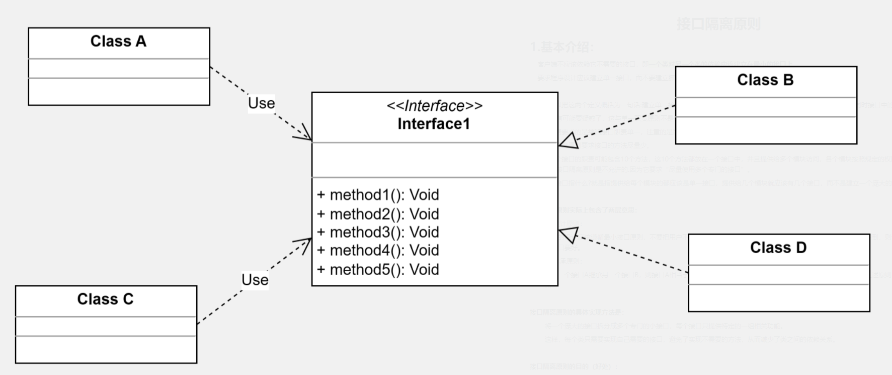
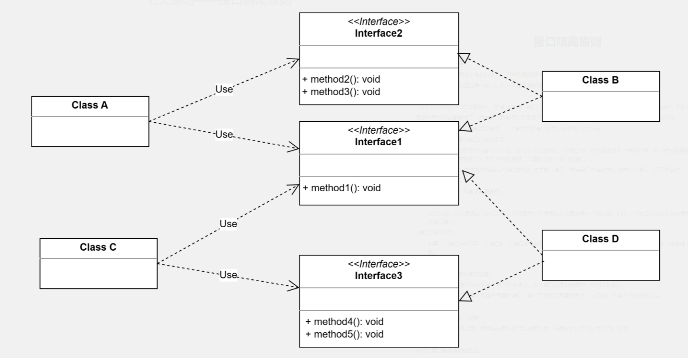

### 1.基本介绍：

​    客户端不应该依赖它不需要的接口，即**一个类对另一个类的依赖应该建立在最小的接口上**。

​    要求程序设计应该建立单一接口，而不要建立臃肿的大接口。

​	可以把这两个定义概括为一句话:建立单一接口，不要建立臃肿庞大的接口。

​	再通俗一点讲: 接口尽量细化，同时接口中的方法尽量少。

#### 1.1 与单一职责原则区别

​	根据上面描述，其与单一职责有些类似。二者区别：

1. 单一职责要求的是类和接口职责单一，注重的是职责，这是业务逻辑上的划分。

2. 接口隔离原则要求接口的方法尽量少。

例如：

​	一个接口的职责可能包含10个方法，这10个方法都放在一个接口中，并且提供给多个模块访问，各个模块按照规定的权限来访问，在系统外通过文档约束“不使用的方法不要访问”，按照单一职责原则是允许的，按照接口隔离原则是不允许的，因为它要求“尽量使用多个专门的接口”。

   专门的接口指提供给每个模块的都应该是单一接口，提供给几个模块就应该有几个接口，而不是建立一个庞大的臃肿的接口，容纳所有的客户端访问。

#### 1.2 接口隔离原则实际上包含了两层意思

接口的设计原则：

​	接口的设计应该遵循最小接口原则，不要把用户不使用的方法塞进同一个接口里。如果一个接口的方法没有被使用到，则说明该接口过胖，应该将其分割成几个功能专一的接口，使用多个专门的接口比使用单一的总接口要好。

接口的继承原则：

​	如果一个接口A继承另一个接口B，则接口A相当于继承了接口B的方法，那么继承了接口B后的接口A也应该遵循上述原则：不应该包含用户不使用的方法。反之，则说明接口A被B给污染了，应该重新设计它们的关系。

#### 1.3 接口隔离原则的具体实现方法是

​	将一个庞大的接口拆分成多个专门的小接口，每个接口只提供特定的一组相关功能。

​	这样，每个类只需要实现自己需要的接口，避免了实现不需要的方法，从而减少了类之间的依赖关系。

#### 1.4 接口隔离原则的目的（好处）

​	降低类之间的耦合度，使类具有高内聚性和低耦合性，提高软件的可维护性和可扩展性。

#### 1.5 不符合接口隔离原则的危害

​	如果用户被迫依赖他们不使用的接口，当接口发生改变时，他们也不得不跟着改变。

​	换而言之，一个用户依赖了未使用但被其他用户使用的接口，当其他用户修改该接口时，依赖该接口的所有用户都将受到影响。这显然违反了开闭原则，也不是我们所期望的。

### 2.应用实例：

​	类A需要使用方法1、2、3

​	类B需要使用方法1、4、5

#### 方案一：不符合接口隔离

​	接口1有五个方法，类B和类D分别实现了接口1；

​	类A通过接口1依赖类B，但是只使用方法1、2、3（即类A作为消费类，只需要使用到方法1、2、3.其通过创建接口1的实现类-类B去使用到这些方法。）

​	类C通过接口1依赖类D，但是只使用方法1、4、5（即类C作为消费类，只需要使用到方法1、4、5.其通过创建接口1的实现类-类D去使用到这些方法。）

**问题：**

​	类A只需要使用方法1、2、3，对应的实现类B却需要实现不需要实现的方法4、5

​	类B只需要使用方法1、4、5，对应的实现类D却需要实现不需要实现的方法2、3

​	所以，Interface1对于类A和B来说都不是最小接口，导致实现类B和D实现了多余的方法。

**代码：**

接口1：

~~~ java
interface Interface1 {
    void method1();

    void method2();

    void method3();

    void method4();

    void method5();
}
~~~

消费类A和C：

~~~ java
//A类通过接口Interface1依赖B类，但是只会使用method11、method2、method3
class A {
    public void depend1(Interface1 i){
        i.method1();
    }
    public void depend2(Interface1 i){
        i.method2();
    }
    public void depend3(Interface1 i){
        i.method3();
    }
}

//C类通过接口Interface1依赖D类，但是只会使用method1、method4、method5
class C {
    public void depend1(Interface1 i){
        i.method1();
    }
    public void depend4(Interface1 i){
        i.method4();
    }
    public void depend5(Interface1 i){
        i.method5();
    }
}
~~~

接口1实现类B和D：

~~~java
class B implements Interface1 {
    @Override
    public void method1() {
        System.out.println("B实现了方法1");
    }
    @Override
    public void method2() {
        System.out.println("B实现了方法2");
    }
    @Override
    public void method3() {
        System.out.println("B实现了方法3");
    }
    @Override
    public void method4() {
        System.out.println("B实现了方法4");
    }
    @Override
    public void method5() {
        System.out.println("B实现了方法5");
    }
}

class D implements Interface1 {
    @Override
    public void method1() {
        System.out.println("D实现了方法1");
    }
    @Override
    public void method2() {
        System.out.println("D实现了方法2");
    }
    @Override
    public void method3() {
        System.out.println("D实现了方法3");
    }
    @Override
    public void method4() {
        System.out.println("D实现了方法4");
    }
    @Override
    public void method5() {
        System.out.println("D实现了方法5");
    }
}
~~~

#### 方案二：符合接口隔离

**方案一问题：** 

​      分析方案一，可以知道类A通过接口Interface1依赖类B，类C通过接口Interface1依赖类D，如果接口Interface1对类A和类C来说不是最小接口，那么类B和类D就必须实现他们不需要的方法。

**改进方案：**

​	将Interface1拆分为几个独立的接口，类A和类C分别与他们需要的接口建立依赖关系，**也就是接口隔离原则。**

**实现：**

将方案一中的Interface1接口拆分为三个：

1. Interface1：包含方法1
2. Interface2：包含方法2、3
3. Interface3：包含方法4、5

这样，类A只需要依赖接口1、2；类C只需要依赖接口1、3

同时，类B只需要实现接口1、2；类D只需要实现接口1、3

**代码：**

拆分后接口：

~~~ java
interface Interface1 {
    void method1();
}

interface Interface2 {
    void method2();

    void method3();
}

interface Interface3 {
    void method4();

    void method5();
}
~~~

消费类A和C：

~~~ java
class A {
    public void depend1(Interface1 i) {
        i.method1();
    }

    public void depend2(Interface2 i) {
        i.method2();
    }

    public void depend3(Interface2 i) {
        i.method3();
    }
}

class C {
    public void depend1(Interface1 i) {
        i.method1();
    }

    public void depend4(Interface3 i) {
        i.method4();
    }

    public void depend5(Interface3 i) {
        i.method5();
    }
}
~~~

接口实现类：

~~~ java
class B implements Interface1,Interface2 {
    @Override
    public void method1() {
        System.out.println("B实现了方法1");
    }
    @Override
    public void method2() {
        System.out.println("B实现了方法2");
    }
    @Override
    public void method3() {
        System.out.println("B实现了方法3");
    }
}

class D implements Interface1,Interface3 {
    @Override
    public void method1() {
        System.out.println("D实现了方法1");
    }
    @Override
    public void method4() {
        System.out.println("D实现了方法4");
    }
    @Override
    public void method5() {
        System.out.println("D实现了方法5");
    }
}
~~~

