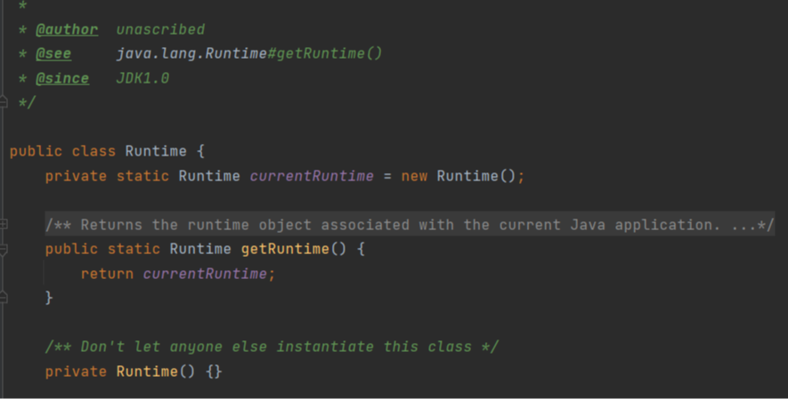

## 基本介绍： 

​	单例模式，就是采取一定的方法保证在整个软件体系中，对**某个类只能存在一个对象实例**，并且该类只提供一个取得其对象实例的方法。

**优点：**

1. 提供了对唯一实例的受控访问。因为单例类封装了它的唯一实例,所以它可以严格控制客户怎样以及何时访问它,并为设计及开发团队提供了共享的概念。
2. 由于在系统内存中只存在一个对象,因此可以节约系统资源,对于一些需要频繁创建和销毁的对象,单例模式无疑可以提高系统的性能。
3. 允许可变数目的实例。基于单例模式我们可以进行扩展，使用与单例控制相似的方法来获得指定个数的对象实例。

**缺点：**

1. 由于单例模式中没有抽象层,因此单例类的扩展有很大的困难。
2. 单例类的职责过重，在一定程度上违背了“单一职责原则”。因为单例类既充当了工厂角色,提供了工厂方法，同时又充当了产品角色,包含一些业务方法,将产品的创建和产品本身的功能融合到一起。
3. 滥用单例将带来一些负面问题,如为了节省资源将数据库连接池对象设计为单例类,可能会导致共享连接池对象的程序过多而出现连接池溢出;现在很多面向对象语言(如ava,C#)的运行环境都提供了自动垃圾回收的技术,因此,如果实例化的对象长时间不被利用,系统会认为它是垃圾,会自动销毁并回收资源,下次利用时又将重新实例化,这将导致对象状态的丢失。

## 注意事项：

1. 单例模式保证系统中只存在一个对象，节省了系统资源，对于一些需要频繁创建和销毁的对象，可以使用单例模式。

2. 想要获取单例类的对象，需要调用对应方法，而不是new。

3. 使用场景：

4. - 需要频繁创建和销毁的对象
   - 创建对象时耗时过多或消耗资源过多（即重量级对象），但又经常用到的对象
   - 工具类对象
   - 频繁访问的数据库或文件对象（比如数据源、session工厂等）

## 应用：

### JDK源码Runtime类：

## 实现方式及分析：

**单例模式的八种方式：**

- 饿汉式（静态常量）
- 饿汉式（静态代码块）
- 懒汉式（线程不安全）
- 懒汉式（线程安全，同步方法）
- 懒汉式（线程不安全，同步代码块）
- 双重检查
- 静态内部类
- 枚举

### 一、饿汉式（静态常量）

#### 步骤:

1. 构造器私有化（防止new）
2. 类内部创建对象
3. 对外暴露静态公共方法（getInstance）

#### 分析：

**优点：**

1. 写法简单
2. 在类加载时完成实例化，避免线程同步问题。

**缺点：**

1. 在类加载时就完成实例化，没有完成懒加载的效果。
2. 如果从未使用该实例，就会造成内存浪费。

**结论：**

​    这种方式基于classloder机制，避免了多线程的同步问题。

​    不过，实例对象在类装载时就实例化，在单例模式中大多时候都是调用getInstance方法时类加载，但是也可能会有其他方式（例如其他静态方法）导致类加载，实现不了懒加载。

​    因此，这种单例模式可用，**可能**造成内存泄漏。

#### 源码：

~~~ java
class Singleton{
    //构造器私有
    private Singleton(){}
    //类内部创建一个静态常量的实例
    private final static  Singleton singleton = new Singleton();
    //一个public方法暴露该实例
    public static Singleton getInstance(){
        return singleton;
    }
}
~~~

### 二、饿汉式—静态代码块

#### 步骤：

1. 构造器私有
2. 创建一个静态常量实例
3. 实例初始化放在静态代码块
4. 一个public方法暴露实例

#### 分析：

​    分析结论与静态常量一致。

#### 源码：

~~~ java
class Singleton{
    //构造器私有
    private Singleton(){}
    //类内部创建一个静态常量的实例
    private final static  Singleton singleton;
    //静态代码块中创建实例
    static{ singleton = new Singleton(); }
    //一个public方法暴露该实例
    public static Singleton getInstance(){
        return singleton;
    }
}
~~~

### 三、懒汉式—线程不安全

#### 步骤：

1. 构造器私有化。
2. 创建一个静态实例（非常量），但是不赋值。
3. 向外暴露一个public方法(getInstace)向外暴露实例。
4. 在getInstace方法中初始化实例。

#### 分析：

**优点：**

​    起到了懒加载的效果，内存不浪费(单线程)。

**缺点：**

​    在多线程中，两个线程同时获取实例对象，一个在进入if语句判断时，还未执行里面的创建实例，另一个线程也进入了if判断语句，此时就会创建多个实例。

**结论：**

​    不能使用该写法，因为这种写法可能会破坏单例的设计初衷。

#### 源码：

~~~ java
class Singleton {
    //类内部创建一个静态常量的实例
    private static Singleton singleton;
    //构造器私有
    private Singleton() {
    }
    //一个public方法暴露该实例
    public static Singleton getInstance() {
        if (singleton == null) {
            singleton = new Singleton();
        }
        return singleton;
    }
}
~~~

### 四、懒汉式—线程安全

#### 步骤：

1. 构造器私有化。
2. 创建一个静态实例（非常量），但是不赋值。
3. 向外暴露一个public方法(getInstace)向外暴露实例。
4. 给getInstace方法添加synchronized锁，同时在其中初始化实例。

#### 分析：

**优点：**

​    起到了懒加载的效果，内存不浪费(单线程)，并解决了线程不安全的问题。

**缺点：**

​    效率太低了，每个线程获取实例的时候，都需要同步一下，然后只需要在创建实例时加锁一次即可，创建实例后就不需要加锁，直接返回即可。对方法进行加锁同步效率太低。

**结论：**

​    实际开发中不推荐。

#### 源码：

~~~ java
class Singleton {
    //类内部创建一个静态常量的实例
    private static Singleton singleton;
    //构造器私有
    private Singleton() {
    }
    //一个public方法暴露该实例
    public static synchronized Singleton getInstance() {
        if (singleton == null) {
            singleton = new Singleton();
        }
        return singleton;
    }
}
~~~

### 五、懒汉式—同步代码块

#### 步骤：

​    该方法相较于第四种，是将同步代码放在了if语句里，给创建实例加锁，这种没有任何意义，甚至实现不了单例。

#### 分析：

**优点：**

​    起到了懒加载的效果，内存不浪费(单线程)，并解决了线程不安全的问题。

**缺点：**

​    效率太低了，每个线程获取实例的时候，都需要同步一下，然后只需要在创建实例时加锁一次即可，创建实例后就不需要加锁，直接返回即可。对方法进行加锁同步效率太低。

**结论：**

​    实际开发中不推荐。

### 六、双重检查⭐

#### 步骤：

1. 构造器私有

2. 创建一个该类的静态变量，不赋值（注意，要用volatile修饰该变量，保证可见性）

3. 向外暴露一个public方法(getInstace)向外暴露实例。

4. 在getInstace种给变量赋值，通过双重检查解决效率低的问题

5. 1. 第一次检查是否为null，即使多个线程同时进来也无所谓
   2. 然后进入类级别锁的代码块，同时只能有一个线程进入
   3. 再次判断是否为Null
   4. 第一个进入的肯定为null，则创建
   5. 等第一个线程创建完后，其他线程进入，由于添加了volatile，他们会直接获取到第一个线程创建的实例，判断不为null，则直接跳出

#### 分析：

**优点：**

​    起到了懒加载的效果，内存不浪费(单线程)

​    并解决了线程不安全的问题

​    同时解决了效率低的问题

**缺点：**

​    无

**结论：**

​    实际开发中推荐使用。

#### 源码：

~~~ java
class Singleton {
    //类内部创建一个静态常量的实例
    private volatile static Singleton singleton;
    //构造器私有
    private Singleton() {
    }
    //一个public方法暴露该实例
    public static Singleton getInstance() {
        if (singleton == null) {
            //使用类级别的锁来实现多线程环境下只有一个线程可以进入代码块内部的效果。
            synchronized(Singleton.class){
                if(singleton == null){
                    singleton = new Singleton();
                }
            }
        }
        return singleton;
    }
}
~~~

### 七、静态内部类⭐

#### 步骤：

1. 构造器私有
2. 创建一个该类的静态变量，不赋值
3. 创建一个静态内部类，其中有一个该类的实例对象（静态常量）。
4. 向外暴露一个public方法(getInstace)向外暴露实例。

#### 分析：

​    当一个类被装载时，其内部的静态内部类不会立即被装载。

​    静态内部类的加载是在需要使用时才会进行，而不是在外部类加载时就会随之加载。

​    静态内部类是在首次访问它时才会被加载。当我们第一次使用静态内部类的静态成员（如静态字段、静态方法等）或创建静态内部类的实例时，才会触发静态内部类的加载。这是一种延迟加载的机制，它可以节省资源并提高性能。

   需要注意的是，静态内部类的加载是线程安全的。在类加载过程中，Java虚拟机会保证只有一个线程能够完成静态内部类的加载，避免了并发的加载问题。

​    总结起来，当一个类被装载时，其内部的静态内部类不会立即被加载，而是在需要使用时才会进行加载。这种延迟加载的机制可以提高性能，并且加载过程是线程安全的。   

​    因此，当我们访问该类的某些属性或方法时，不会导致静态内部类被创建，也就不会导致实例对象被创建，实现懒加载并解决了线程和效率问题。

**优点：**

​    起到了懒加载的效果，内存不浪费(单线程)

​    并解决了线程不安全的问题

​    同时解决了效率低的问题

**缺点：**

​    无

**结论：**

​    实际开发中推荐使用。

#### 源码：

~~~ java
class Singleton {
    //类内部创建一个静态常量的实例
    private volatile static Singleton singleton;
    //构造器私有
    private Singleton() {
    }
    //写一个静态内部类，其有一个属性为Singleton
    private static class SingletonInstance{
        private static final Singleton INSTANCE = new Singleton();
    }
    //一个public方法暴露该实例
    public static Singleton getInstance() {
        return SingletonInstance.INSTANCE;
    }
}
~~~

### 八、枚举⭐

#### 步骤：

1. 将需要在做成单例的类做成枚举类
2. 创建一个枚举值，即唯一的单例。

#### 分析：

**优点：** 

1. 线程安全：枚举类型的实例在Java中是线程安全的，不需要额外的同步措施。多个线程可以同时访问枚举实例，而不会出现并发问题。
2. 防止反序列化创建新实例：枚举类默认实现了Serializable接口，在进行反序列化时，会保证只有一个实例被创建。这可以防止通过反序列化创建新的实例。

**缺点：**

​    在Java中，枚举类型的实例在类加载时被创建。这意味着，当JVM首次加载枚举类时，会立即创建所有的枚举实例。

​    当使用到枚举类型的方法或属性时，会触发对应的枚举实例的创建，确保该单例的唯一性。无论是访问枚举实例本身，还是调用枚举实例的方法或访问其属性，都会直接使用预先创建好的实例。

**结论：**

​    实际开发中推荐使用。

#### 源码：

~~~ java
enum Singleton {
    INSTANCE; // 唯一的枚举实例
    private int attribute;
    Singleton(){
        attribute = 1;
    }
    // 其他成员变量和方法
    public void doSomething() {
        // 单例的操作
    }
}
~~~

