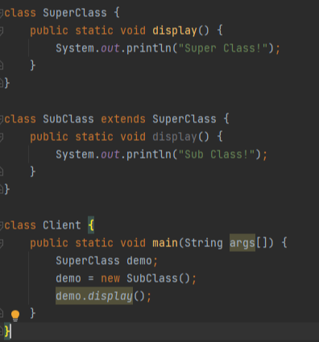

### 引入

​    现在有一个订购披萨的案例，要有一个披萨店，可以售卖多种类型的披萨，并展示披萨的准备材料、烘焙、切块、打包的过程。

### 一、传统方式

​	首先因为披萨种类很多，因此设计一个披萨抽象基类，其他类型的披萨基类。

​	对于披萨的售卖设计一个售卖类。

​	最后main方法充当披萨店（客户端）。

#### 1.类图

​	Pizza为披萨基类，GreekPizza喝CheesePizza继承Pizza，是不同类型披萨。

​	OrderPizza负责披萨的订购，依赖三个披萨类

​	PizzaStore则是客户端

#### 2.分析

**优点：**

​	容易理解，好操作。

**缺点：**

​	违反了设计模式的ocp原则（开闭原则），即违反了对扩展开放，对修改关闭的原则。

例如：

​	当我们新增一个披萨种类的时候，肯定要有一个新的披萨类（PepperPizza）。但是，为了适应这个新的披萨类，OrderPizza类（负责订购披萨）也需要重新修改。

​	如果只有一个订购披萨的地方还好，如果有多个OrderPizza类，那么每个类都需要修改。

如下图所示：

#### 3.源码

##### 3.1Pizza相关

抽象Pizza，披萨的基类：

~~~ java
public abstract class Pizza {
    protected String type;
    //准备材料方法，不同披萨这一步肯定不一样，因此做成抽象方法
    public abstract void prepare();
    //烘焙方法
    public void brake(){
        System.out.println(type+"正在烘焙");
    }
    //切块方法
    public void cut(){
        System.out.println(type+"正在切块");
    }
    //打包方法
    public void box(){
        System.out.println(type+"正在打包");
    }
}
~~~

各种披萨实现：

~~~ java
public class GreekPizza extends Pizza{
    public GreekPizza(){
        type = "希腊披萨";
    }
    @Override
    public void prepare() {
        System.out.println("正在准备希腊披萨的原材料");
    }
}

public class CheesePizza extends Pizza{
    public CheesePizza(){
        type = "奶酪披萨";
    }
    @Override
    public void prepare() {
        System.out.println("正在准奶酪等材料");
    }
}
~~~

##### 3.2订购披萨类OrderPizza

~~~ java
public class OrderPizza {
    public OrderPizza(){
        Pizza pizza = null;
        String type;
        do{
            type = getType();
            if(type.equals("希腊披萨")){
                pizza = new GreekPizza();
            }else if(type.equals("奶酪披萨")){
                pizza = new CheesePizza();
            }else{
                System.out.println("没有此披萨");
                break;
            }
            pizza.prepare();
            pizza.brake();
            pizza.cut();
            pizza.box();
        }while (true);
    }
    private String getType(){
        String str = "";
        try{
            BufferedReader bufferedReader = new BufferedReader(new InputStreamReader(System.in));
            System.out.println("输入订购的披萨类型：");
            str = bufferedReader.readLine();
        } catch (IOException e) {
            e.printStackTrace();
        }finally {
            return str;
        }
    }
}
~~~

##### 3.3客户端

~~~ java
//相当于是客户端
public class PizzaStore {
    public static void main(String[] args) {
        //开启一个披萨店，进行接收用户点餐
        new OrderPizza();
    }
}
~~~

### 二、简单工厂模式

#### 1.分析

​      传统方式中，修改代码可以接收。但是，如果有多个创建披萨的类，那么这些类都需要修改。而往往这些创建披萨的类有很多处。

**改进思路：简单工厂**

​      把创建对象的相关方法全部封装到一个工厂类（生产对象的工厂）里，所有需要创建披萨的类，都直接用该工厂去获取披萨对象。这样新加入披萨的话，也只需要修改该工厂类，其他创建披萨对象的地方就不用修改了。—>**即简单工厂模式。**

#### 2.类图

#### 4.源码

​	Pizza相关的类没有变化

​	OrderPizza类中获取披萨通过Factory获取（也可以将PizzaSimpleFactory中方法改为静态，这样在OrderPizza中可以直接通过类名获取，不需要给PizzaSimpleFactory赋值了）

##### 4.1工厂类PizzaSimpleFactory

~~~ java
public class PizzaSimpleFactory {
    public Pizza createPizza(String pizzaType) {
        if (pizzaType == null || pizzaType.isEmpty()) {
            return null;
        }
        if (pizzaType.equals("奶酪披萨")) {
            return new CheesePizza();
        } else if (pizzaType.equals("希腊披萨")) {
            return new GreekPizza();
        } else {
            return null;
        }
    }
}
~~~

##### 4.2订购披萨类（美团、饿了么、线下）

~~~ java
public class OrderPizzaByMeiTuan {
    PizzaSimpleFactory pizzaSimpleFactory;

    public OrderPizzaByMeiTuan() {
        pizzaSimpleFactory = new PizzaSimpleFactory();
        Pizza pizza = null;
        String type;
        do {
            System.out.println("通过美团订购");
            type = GetPizzaType.getType();
            pizza = pizzaSimpleFactory.createPizza(type);
            if(pizza == null){
                System.out.println("美团渠道关闭");
                break;
            }
            pizza.prepare();
            pizza.brake();
            pizza.cut();
            pizza.box();
        } while (true);
    }
}

public class OrderPizzaByELeMe {
    PizzaSimpleFactory pizzaSimpleFactory;

    public OrderPizzaByELeMe() {
        pizzaSimpleFactory = new PizzaSimpleFactory();
        Pizza pizza = null;
        String type;
        do {
            System.out.println("通过饿了么订购");
            type = GetPizzaType.getType();
            pizza = pizzaSimpleFactory.createPizza(type);
            if(pizza == null){
                System.out.println("饿了么渠道关闭");
                break;
            }
            pizza.prepare();
            pizza.brake();
            pizza.cut();
            pizza.box();
        } while (true);
    }
}

public class OrderPizzaByOffline {
    PizzaSimpleFactory pizzaSimpleFactory;

    public OrderPizzaByOffline() {
        pizzaSimpleFactory = new PizzaSimpleFactory();
        Pizza pizza = null;
        String type;
        do {
            System.out.println("线下订购");
            type = GetPizzaType.getType();
            pizza = pizzaSimpleFactory.createPizza(type);
            if(type == null){
                System.out.println("线下渠道关闭");
                break;
            }
            pizza.prepare();
            pizza.brake();
            pizza.cut();
            pizza.box();
        } while (true);
    }
}
~~~

##### 4.3客户端

~~~ java
public class PizzaStore {
    public static void main(String[] args) {
        Thread meituan = new Thread(() -> new OrderPizzaByMeiTuan());
        Thread eleme = new Thread(() -> new OrderPizzaByELeMe());
        Thread xianxia = new Thread(() -> new OrderPizzaByOffline());
        meituan.start();
        eleme.start();
        xianxia.start();
        System.out.println("全部渠道已开启");
    }
}
~~~

### 三、简单工厂模式介绍与分析

#### 1.基本介绍

（1）简单工厂模式是属于创建型模式，是工厂模式的一种。

​         简单工厂模式是**由一个工厂对象决定创建出哪一种产品类的实例**。

​         简单工厂模式是工厂模式家族中最简单实用的模式

（2）简单工厂模式:

​           **定义了一个创建对象的类，由这个类来封装实例化对象的行为(代码).**

（3）在软件开发中，当我们会用到大量的创建某种、某类或者某批对象时，就会使用到工厂模式

**优点：**

​	(1)工厂类含有必要的判断逻辑，可以决定在什么时候创建哪一个产品类的实例，客户端可以免除直接创建产品对象的责任而仅仅“消费”产品；简单工厂模式通过这种做法实现了对责任的分割，它提供了专门的工厂类用于创建对象。

​	(2)客户端无须知道所创建的具体产品类的类名，只需要知道具体产品类所对应的参数即可.对于一些复杂的类名.通过简单工工厂模式可以减少使用者的记忆量。

​	(3)通过引入配置文件，可以在不修改任何客户端代码的情况下更换和增加新的具体产品类，在一定程度上提高了系统的灵活性。

#### 2.分析

**缺点：**

​	(1)由于工厂类集中了所有产品创建逻辑，一旦不能正常工作.整个系统都要受到影响。

​	(2)使用简单工厂模式将会增加系统中类的个数，在一定程度上增加了系统的复杂度和理解难度。

​	(3)系统扩展困难，一旦添加新产品就不得不修改工厂逻辑，在产品类型较多时，有可能造成工厂逻辑过于复杂,不利于系统的扩展和维护。

​	(4)简单工厂模式由于使用了静态工厂方法，造成工厂角色无法形成基于继承的等级结构，代码如下：  

​	如下图，由于简单工厂获取实例的方式是通过静态方法获取，而静态方法是类的属性，不是对象（实例）的属性，所以子类无法通过重写覆盖掉父类的方法。

​	这将导致包含静态工厂方法的工厂类无法像产品类一样提供抽象层与抽象定义，也无法通过具体类来进行扩展。

​	下述代码输出：Super Class!

### 四、适用环境

在以下情况下可以使用简单工厂模式：

​	(1)工厂类负责创建的对象比较少：

​		由于创建的对象较少，不会造成工厂方法中的业务逻辑太过复杂。

​	(2)客户端只知道传入工厂类的参数，对于如何创建对象不关心：

​		客户端既不需要关心创建细节，甚至连类名都不需要记住 ，只需要知道类型所对应的参数即可。

### 五、应用

1.在JDK类库中广泛使用了简单工厂模式 ，如工具类java.text.DateFormat,它用于格式化一个本地日期或者时间，这个工具类在处理英语或非英语的日期及时间格式上很有用。 在DateFormat类中提供了一个getDateInstance()方法， 该方法是一个静态的工厂方法，为某种本地日期提供格式化，它由三个重载的方法组成 ，其定义如下：

2.在Java加密技术中，使用最为广泛的是对称加密技术 和非对称加密技术，两种加密技术都需要设置密钥，而密钥的生成需要使用到一个很重要的类一密钥生成器， 不同的加密算法所对应的密钥不一样，因此其密钥生成器也不一样。在Java密码技术中，提供了javax.crypto.KeyGenerator和java.security。KeyPairGenerator类来生成对称密钥和非对称密钥，这两个类都有一个名为getlnstance()的静态工厂方法，根据所传入的参数得到不同的密钥生成器。 如下代码片段用于获取DESede(三重DES算法)密钥生成器：

同样 ，在实施加密和解密时需要使用到密码器，创建密码器时也使用了简单工厂模式,通过向静态工厂方法中所传入的参数来决定密码器的类型，代码如下：

