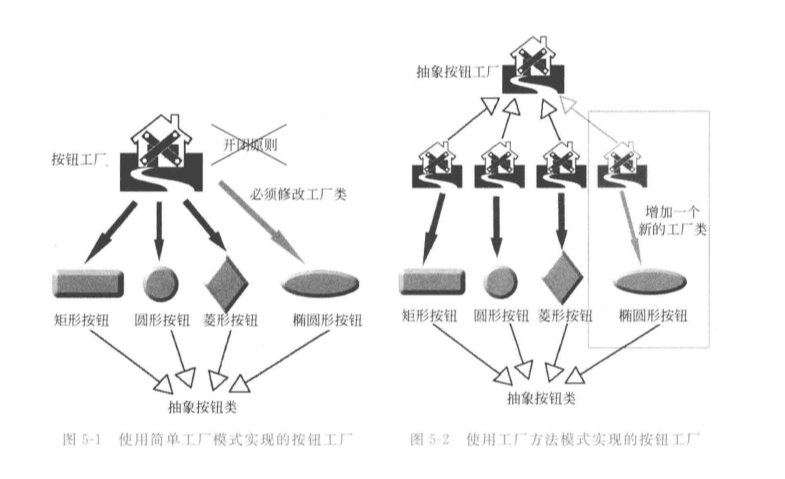
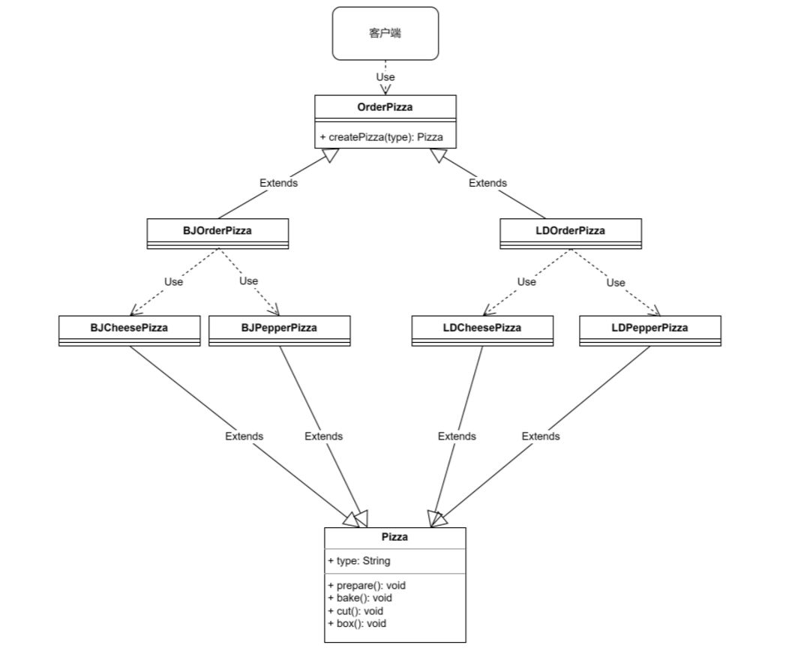
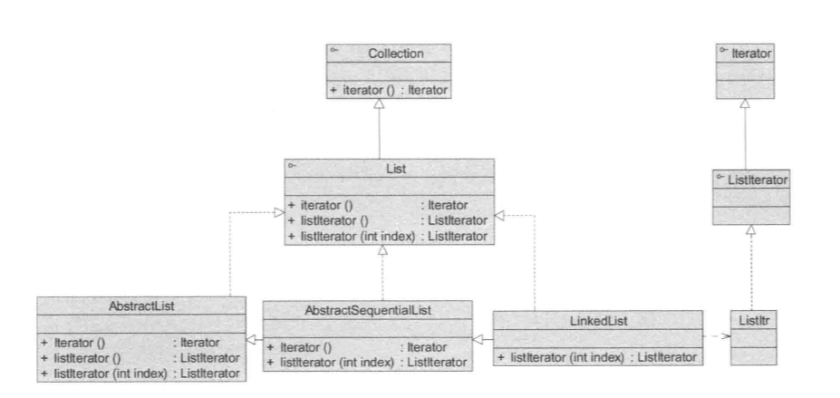
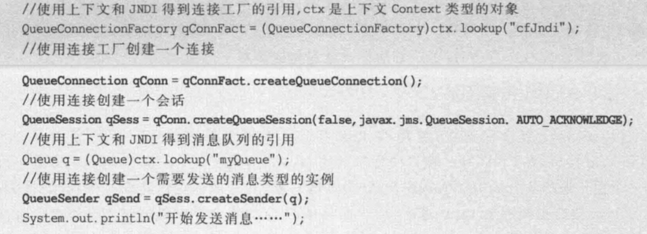
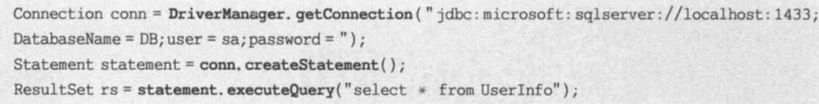

### 引入

在简单工厂模式中的披萨需求基础上，有了新的需求:

   客户在点披萨时，可以点不同口味的披萨，比如北京的奶酪pizza、北京的胡椒pizza或者是伦敦的奶酪pizza、伦敦的胡椒pizza。

### 一、简单工厂模式

​	因为除了披萨种类不同以外，还要区分地点的不同，可以考虑做不同地方的工厂类

​	使用简单工厂模式，创建不同的简单工厂类，比如BJPizzaSimpleFactory、LDPizzaSimpleFactory 等等。

分析：

​	从当前这个案例来说，也是可以的。但是考虑到项目的规模，以及软件的可维护性、可扩展性并不是特别好。

​	很明显可以感受出它的问题，就像新的需求一样，再通过地点去区分披萨种类（相当于新加了披萨，不过可以根据某种规则分类，在本例中就是地区）。

   1.任何子类都可以被生产，负担太重。当所要生产产品种类非常多时，工厂方法的代码量可能会很庞大。

   2.虽然简单工厂模式相较于不适用该模式时，在面对新增披萨时只需要修改工厂类，新的披萨只用新建类。但是也违背了开闭原则（在新增披萨时，修改了工厂类）

如下图：

​	需要有一个按钮工厂，新增按钮

### 二、工厂方法模式

#### 1.分析

**工厂方法模式设计方案: （针对于本例）**

​	将披萨项目的实例化功能抽象成抽象方法，在不同的口味点餐子类中具体实现。

**工厂方法模式:**

​	定义了一个创建对象的抽象方法，由子类决定要实例化的类。**工厂方法模式将对象的实例化推迟到子类**。

​	如下图所示，当新增加一个披萨的时候（此时默认为不同地区的披萨类型，这个需要在设计的时候考虑好，新加的类型不属于已经存在的分类），比如说香港的披萨，那么只需要在创建一个XGOrderPizza类去继承OrderPizza即可。

​	这样就做到了完全的开闭原则，对扩展开发，对修改关闭。新增功能时不去修改原有的代码。（客户端的修改可以写在配置文件里，或者说认为客户端，即使用者的修改不算，因为这是使用，不属于产品自身的范围了）

#### 2.类图

#### 3.源码：

##### 3.1抽象工程类OrderPizza

~~~ java
public abstract class OrderPizza {
    public OrderPizza() {
        Pizza pizza = null;
        String type;
        do {
            type = getType();
            pizza = createPizza(type);
            pizza.prepare();
            pizza.brake();
            pizza.cut();
            pizza.box();
        } while (true);
    }

    /**
     * 这个方法是具体实现创建披萨的方法，由具体的工厂子类实现
     *
     * @param orderType
     * @return
     */
    abstract Pizza createPizza(String orderType);

    private String getType() {
        String str = "";
        try {
            BufferedReader bufferedReader = new BufferedReader(new InputStreamReader(System.in));
            System.out.println("输入订购的披萨类型：");
            str = bufferedReader.readLine();
        } catch (IOException e) {
            e.printStackTrace();
        } finally {
            return str;
        }
    }
}
~~~

##### 2.2抽象工厂实现类（订购北京披萨和订购伦敦披萨）

~~~ java
public class BJOrderPizza extends OrderPizza {
    @Override
    Pizza createPizza(String orderType) {
        if (orderType.equals("北京奶酪披萨")) {
            return new BJCheesePizza();
        } else if (orderType.equals("北京胡椒披萨")) {
            return new BJPepperPizza();
        }
        return null;
    }
}

public class LDOrderPizza extends OrderPizza {
    @Override
    Pizza createPizza(String orderType) {
        if (orderType.equals("伦敦奶酪披萨")) {
            return new LDCheesePizza();
        } else if (orderType.equals("伦敦胡椒披萨")) {
            return new LDPepperPizza();
        }
        return null;
    }
}
~~~

##### 2.3客户端

~~~ java
public class PizzaStore {
    public static void main(String[] args) {
        String storeType = "北京";
        try {
            BufferedReader bufferedReader = new BufferedReader(new InputStreamReader(System.in));
            System.out.println("输入披萨地区：");
            storeType = bufferedReader.readLine();
        } catch (IOException e) {
            e.printStackTrace();
        }
        OrderPizza store;
        if (storeType.equals("北京")) {
            store = new BJOrderPizza();
        } else if (storeType.equals("伦敦")) {
            store = new LDOrderPizza();
        }
    }
}
~~~

### 三、工厂方法模式介绍与分析

#### 1.基本介绍

   1、工厂方法模式是简单工厂模式的进一步抽象和推广。由于使用了面向对象的多态性,工厂方法模式保持了简单工厂模式的优点，而且克服了它的缺点。

   2、在工厂方法模式中，**核心的工厂类不再负责所有产品的创建，而是将具体创建工作交给子类去做**。

   3、这个核心类仅仅负责给出具体工厂必须实现的接口，而不负责哪一个产品类被实例化这种细节，这使得工厂方法模式可以允许系统在不修改工厂角色的情况下引进新产品。

   4、在工厂方法模式中，工厂类与产品类往往具有平行的等级结构，它们之间一一对应。 例如在现实生活中的手机工厂,不同品牌的手机应该由不同的公司制造 ,苹果公司生产苹果手机，三星公司生产三星手机.那么抽象层的手机公司生产抽象的手机 ，而具体的手机公司就生产具体品牌的手机 ,其中就蕴涵了工 厂方法模式的应用。

#### 2.分析

**优点：**

（1）在工厂方法模式中，工厂方法用来创建客户所需要的产品，同时还向客户隐藏了哪种具体产品类将被实例化这一细节 ，用户只需要关心所需产品对应的工厂，无须关心创建细节，甚至无须知道具体产品类的类名。

（2）基于工厂角色和产品角色的多态性设计是工厂方法模式的关键。它能够使工厂可以自主确定创建何种产品对象，而如何创建这个对象的细节则完全封装在具体工厂内部。工厂方法模式之所以又被称为多态工厂模式，是因为所有的具体工厂类都具有同一抽象父类。

（3）使用工厂方法模式的另一个优点是在系统中加入新产品时，无须修改抽象工厂和抽象产品提供的接口，无须修改客户端 ，也无须修改其他的具体工厂和具体产品，而只要添加一个具体工厂和具体产品就可以了。 这样，系统的可扩展性也就变得非常好，完全符合“开闭原则”。

**缺点：**

（1）在添加新产品时，需要编写新的具体产品类，而且还要提供与之对应的具体工厂类，**系统中类的个数将成对增加**，在一定程度上增加了系统的复杂度，有更多的类需要编译和运行，会给系统带来一些额外的开销

（2）由于考虑到系统的可扩展性，需要引入抽象层，在客户端代码中均使用抽象层进行定义,增加了系统的抽象性和理解难度，且在实现时可能需要用到DOM、反射等技术，增加了系统的实现难度。

#### 3.与简单工厂对比

工厂方法模式和简单工厂模式是两种常见的创建型设计模式，它们在对象的创建上有一些区别。

1. 简单工厂模式： 简单工厂模式是通过一个工厂类来封装对象的创建逻辑。客户端只需要知道具体产品的类型，而无需关心具体产品的创建过程。简单工厂模式违背了开闭原则，因为当新增产品时，需要修改工厂类的代码。
2. 工厂方法模式： 工厂方法模式将对象的创建延迟到子类中。每个具体的产品类都有一个对应的工厂类，通过继承和多态实现对象的创建。客户端需要直接使用具体的工厂类来创建相应的产品对象。工厂方法模式符合开闭原则，因为新增产品时只需要添加对应的具体产品类和具体工厂类即可，无需修改已有的代码。

主要区别：

1. 结构上的差异：

	 - 简单工厂模式只有一个工厂类，负责所有产品的创建。
   - 工厂方法模式有多个工厂类，每个工厂类负责创建一种具体产品。

3. 可扩展性：

	- 简单工厂模式在新增产品时需要修改工厂类的代码，违背了开闭原则，不够灵活。
   - 工厂方法模式新增产品时只需要添加对应的具体产品类和具体工厂类，不需要修改已有代码，符合开闭原则。

5. 灵活性：

	- 简单工厂模式将对象的创建逻辑集中在一个工厂类中，比较简单易用。
   - 工厂方法模式将对象的创建分散到各个具体工厂类中，更加灵活和可扩展。

### 四、适用环境

在以下情况下可以使用工厂方法模式：

（1）一个类不知道它所需要的对象的类：在工厂方法模式中，客户端**不需要知道具体产品类的类名**，只需要知道所对应的工厂即可，具体的产品对象由具体工厂类创建；客户端**需要知道创建具体产品的工厂类**。

（2）一个类通过其子类来指定创建哪个对象：在工厂方法模式中，对于抽象厂类只需要提供一个创建产品的接口，而由其子类来确定具体要创建的对象，利用面向对象的多态性和里氏代换原则，在程序运行时，子类对象将覆盖父类对象，从而使得系统更容易扩展。

（3）将创建对象的任务委托给多个工厂子类中的某一个，客户端在使用时可以无须关心是哪一个工厂子类创建产品子类，需要时再动态指定，可将具体工厂类的类名存储在配置文件或数据库中。

### 五、应用

**1、iterator对象**

​	在Java集合框架中，常用的List和Set等集合都继承(或实现)了java.util.Collection接口，在Collection接口中为所有的Java集合类定义了一个iterator()方法，可返回一个用于遍历集合的Iterator(迭代器)类型的对象(在后面的迭代器模式中，我们将深入学习Java集合框架和Iterator迭代器)。

​	而具体的Java集合类可以通过实现该iterator()方法返回一个具体的Iterator对象，该iterator()方法就是工厂方法 ,如图所示。

​	在JDK源代码中，由于考虑到更多的因素 ,因此上述过程的实现相对比较复杂。图中进行了简化，在该图中，List接口除了继承Collection接口的iterato()方法外，还增加了新的工厂方法listIterator(),专门用于创建Listiterator类型的迭代器，在List的子类LinkedList中实现了该方法，可用于创建具体的Listiterator子 类Listltr的对象，代码如下：

​	listhertaor()方法用于返回具体的Iterator迭代器对象，是一个具体的工厂方法。

**2、Java消息服务JMS**

​	Java消息服务JMS(JavaMessagingService)定义了一套标准的API,让Java语言程序能够通过支持JMS标准的MOM来创建和交换消息。

​	在JMS的实现过程中就需要广泛使用到工厂方法模式，工厂方法模式应用于创建Connection连接对象，创建Session会话对象 ,创建Sender消息发送者对象等，代码片段如下：

**3、JDBC**

​	在 JDBC 中也大量使用了工厂方法模式，在创建连接对象Connection、语句对象Statement 和结果集对象 ResultSet 时都使用了工厂方法，代码片段如下：

