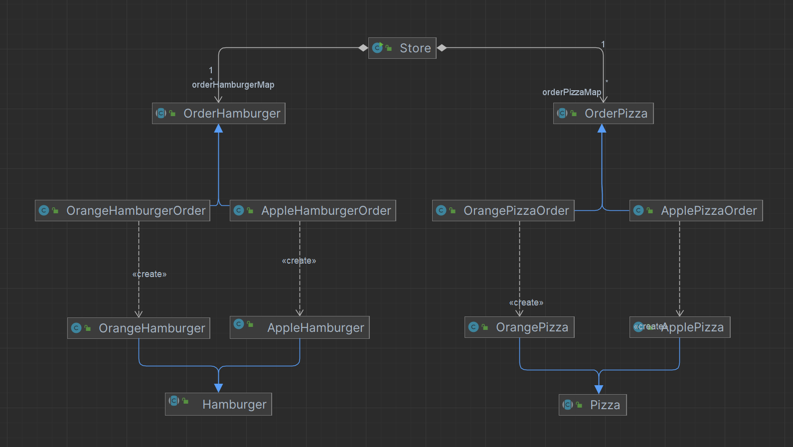
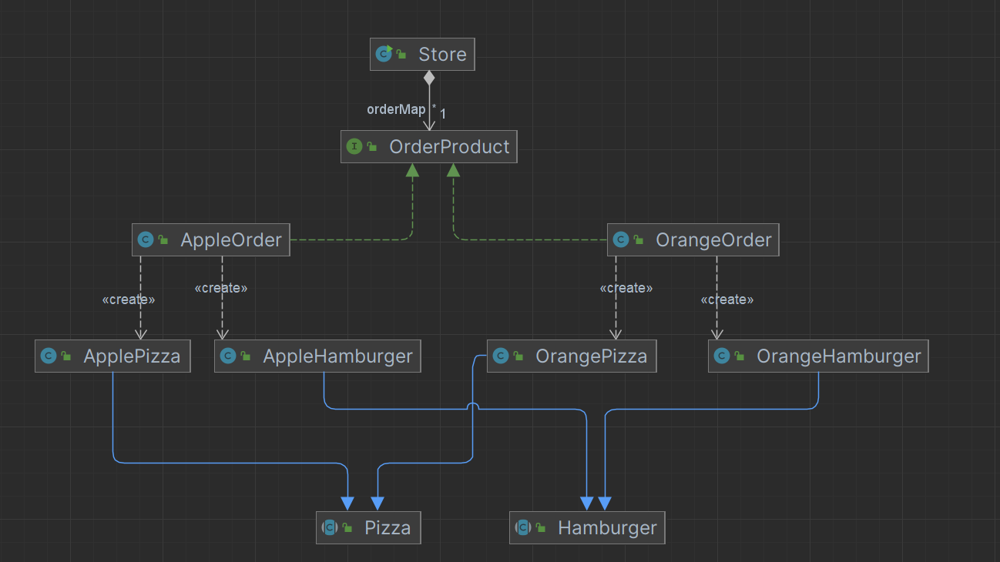

### 引入

在工厂方法模式的基础上，有了新的需求:

  店里打算不仅买披萨，还要卖汉堡，也可能组成套餐同时卖披萨和汉堡，同时，由于应季水果，每次都会同时上线相同水果的披萨和汉堡，也就是两种食材是同一食材（组合）。

### 一、使用工厂方法

​	因为有两种产品，而工厂方法只能生产一种产品，因此需要有两个抽象工厂，分别生产披萨和汉堡。

如下类图：

分析：

​	每当换季，需要生产一批新的水果产品时，需要对每一类Order都添加一个实现类，目前只有两类产品（披萨和汉堡），当产品种类增加，那么新增水果，维护量将非常大，且容易遗漏。

### 二、使用抽象工厂

#### 1、分析

​	分析工厂方法模式的实现，可以发现主要问题在于每次水果换季，若产品过多，那么代码改造量是比较大的，且容易出现遗漏。

​	**假设产品种类固定，比如明确仅生产汉堡、披萨两类食物**，那么就可以在工厂方法的基础上进行改造，一个工厂生产一批产品。

​	这样，每次新增一个水果（产品族）时，可以发现只需要新增一个抽象工厂实现类即可。一组产品放在一个地方维护，清晰且不会遗漏。

#### 2、类图

#### 3、源码：

##### 3.1 抽象工厂类

~~~ java
public interface OrderProduct {
    String getType();
    Hamburger createHamburger();
    Pizza createPizza();
}
~~~

##### 3.2 工厂实现类（苹果产品族和桔子产品族）

~~~ java
public class AppleOrder implements OrderProduct{
    @Override
    public String getType() {
        return "苹果";
    }
    @Override
    public Hamburger createHamburger() {
        return new AppleHamburger();
    }
    @Override
    public Pizza createPizza() {
        return new ApplePizza();
    }
}

public class OrangeOrder implements OrderProduct{
    @Override
    public String getType() {
        return "桔子";
    }
    @Override
    public Hamburger createHamburger() {
        return new OrangeHamburger();
    }
    @Override
    public Pizza createPizza() {
        return new OrangePizza();
    }
}
~~~

##### 3.3 客户端

~~~ java
public class Store {
    static Map<String, OrderProduct> orderMap = new HashMap<>();
    static {
        AppleOrder appleOrder = new AppleOrder();
        OrangeOrder orangeOrder = new OrangeOrder();
        orderMap.put(appleOrder.getType(), appleOrder);
        orderMap.put(orangeOrder.getType(), orangeOrder);
    }

    public static void main(String[] args) {
        String type = "苹果";
        OrderProduct order = orderMap.get("type");

        if (orderMap.containsKey(type)) {
            Hamburger hamburger = order.createHamburger();
            hamburger.prepare();
            System.out.println(hamburger);
            Pizza pizza = order.createPizza();
            pizza.prepare();
        } else {
            System.out.println("暂不支持该类型");
        }
    }
}
~~~

### 三、抽象工厂模式介绍与分析

#### 1、基本介绍

1、抽象工厂模式：定义了一个**interface**用于创建相关或有依赖关系的**对象簇**，而无需指明具体的类 

2、抽象工厂模式可以将简单工厂模式和工厂方法模式进行整合。 

3、从设计层面看，抽象工厂模式就是对简单工厂模式的改进(或者称为进一步的抽象)。 

4、将工厂抽象成两层，AbsFactory(抽象工厂)和具体实现的工厂子类。程序员可以根据创建对象类型使用对应的工厂子类。这样将单个的简单工厂类变成了工厂簇，更利于代码的维护和扩展。

#### 2、分析

**优点：**
（1）抽象工厂模式隔离了具体类的生成，使得客户并不需要知道什么被创建。由于这种隔离，更换一个具体工厂就变得相对容易。所有的具体工厂都实现了抽象工厂中定义的那些公共接口，因此只需改变具体工厂的实例，就可以在某种程度上改变整个软件系统的行为。另外，应用抽象工厂模式可以实现高内聚低耦合的设计目的，因此抽象工厂模式得到了广泛的应用。
（2）当一个产品族中的多个对象被设计成一起工作时，它能够保证客户端始终只使用同一个产品族中的对象。这对一些需要根据当前环境来决定其行为的软件系统来说，是一种非常实用的设计模式。
（3）增加新的具体工厂和产品族很方便，无须修改已有系统，符合“开闭原则”。

**缺点：**

​	在添加新的产品对象时，难以扩展抽象工厂来生产新种类的产品，这是因为在抽象工厂角色中规定了所有可能被创建的产品集合，要支持新种类的产品就意味着要对该接口进行扩展，而这将涉及对抽象工厂角色及其所有子类的修改，显然会带来较大的不便。

#### 3、与工厂方法对比

| 对比维度         | 工厂方法模式（Factory Method）           | 抽象工厂模式（Abstract Factory）                       |
| ---------------- | ---------------------------------------- | ------------------------------------------------------ |
| **核心目的**     | 创建一个产品等级结构中的对象（一个产品） | 创建一个产品族中的多个相关产品（多个产品）             |
| **产品个数**     | 一个工厂生产一个产品                     | 一个工厂生产一组产品（多个产品之间有一定关联）         |
| **工厂接口**     | 一个方法：如 `createProduct()`           | 多个方法：如 `createProductA()`、`createProductB()`    |
| **新增产品种类** | 新增一个产品 → 新增一个工厂类            | 需修改所有抽象工厂接口及其实现类（不符合开闭）         |
| **新增产品族**   | 不支持产品族概念                         | 支持新增产品族（新增一组相关产品）                     |
| **客户端选择**   | 客户端决定使用哪个工厂类（对应某个产品） | 客户端决定使用哪个抽象工厂（对应一整组产品）           |
| **设计复杂度**   | 简单                                     | 复杂（方法多，类多）                                   |
| **适用场景**     | 产品变化频繁，产品之间无关联             | 一组产品必须组合使用、风格统一（如 UI 组件、套餐商品） |

### 四、适用场景

（1）一个系统不应当依赖于产品类实例如何被创建、组合和表达的细节，这对于所有类型的工厂模式都是重要的。用户无须关心对象的创建过程，将对象的创建和使用解耦。

（2）系统中有多于一个的产品族，而每次只使用其中某一产品族。可以通过配置文件等方式来使得用户可以动态改变产品族，也可以很方便地增加新的产品族。

（3）属于同一个产品族的产品将在一起使用，这一约束必须在系统的设计中体现出来。同一个产品族中的产品可以是没有任何关系的对象，但是它们都具有一些共同的约束，如同一操作系统下的按钮和文本框，按钮与文本框之间没有直接关系，但它们都是属于某一操作系统的，此时具有一个共同的约束条件：操作系统的类型。

（4）系统提供一个产品类的库，所有的产品以同样的接口出现，从而使客户端不依赖于具体实现。对于这些产品，用户只需要知道它们提供了哪些具体的业务方法，而不需要知道这些对象的创建过程，在客户端代码中针对抽象编程，而将具体类写人配置文件中。

