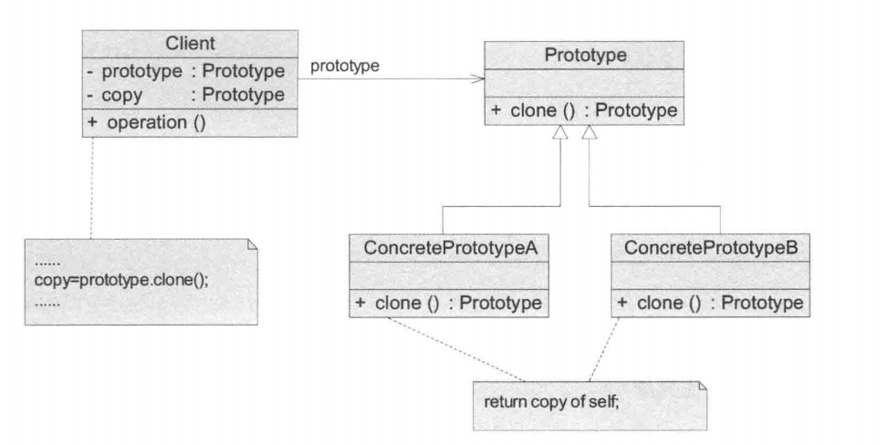
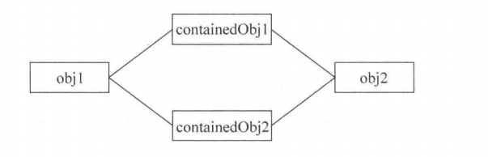
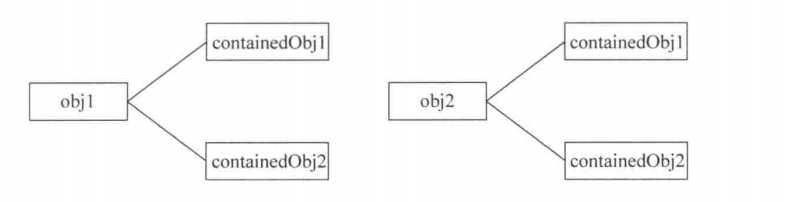
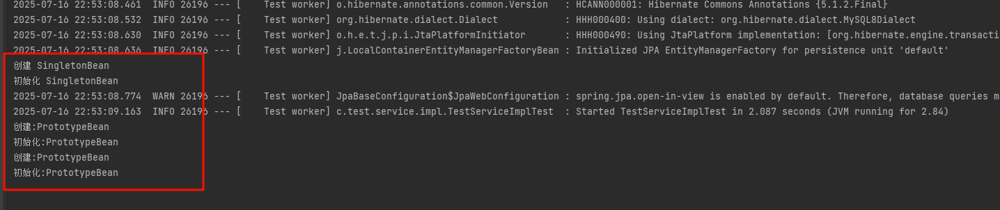
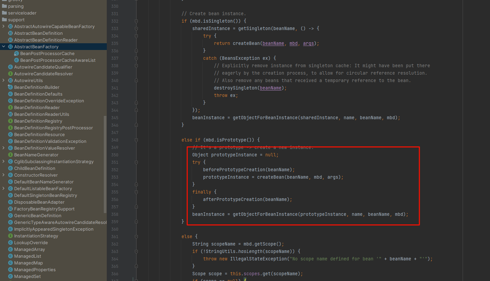

## 引入

​	由于邮件对象包含的内容较多（如发送者、接收者、标题、内容、日期、附件等），某系统中现需要提供一个邮复制功能，对于已经创建好的邮件对象，可以通过复制的方式创建一个新的邮件对象，如果需要改变某部分内容，无须修改原始的邮件对象，只需要修改复制后得到的邮件对象即可。

## 传统方法

​	传统方法，想要创建多个内容差不多的邮件，我们需要多次使用new关键字来创建，并分别填充对应的属性，就是内容差不多。

代码：

~~~ java
// 邮件
public class Mail {
    private String title;

    private String content;

    private Attachment attachment;

    private Date date;
}

// 附件
public class Attachment {
    private String name;

    private String content;
}
~~~

~~~ java
// 客户端
public class Client {
    public static void main(String[] args) {
        Date date = new Date();
        Attachment attachment = new Attachment();
        attachment.setName("附件");
        attachment.setContent("附件内容");

        Mail mail1 = new Mail();
        mail1.setTitle("邮件1");
        mail1.setContent("邮件内容");
        mail1.setDate(date);
        mail1.setAttachment(attachment);

        Mail mail2 = new Mail();
        mail2.setTitle("邮件2");
        mail2.setContent("邮件内容");
        mail2.setDate(date);
        mail2.setAttachment(attachment);
        
        System.out.println("邮件1：" + mail1);
        System.out.println("邮件2：" + mail2);
    }
}
~~~

## 原型模式

### 1、分析

原型模式结构较为简单，在其结构中提供了一个抽象原型类。下面将介绍并分析其模式结构。

原型模式包含如下角色：

1. Prototype（抽象原型类）
   抽象原型类是定义具有克隆自已的方法的接口，是所有具体原型类的公共父类，可以是抽象类，也可以是口。

2. ConcretePrototype（具体原型类）
   具体原型类实现具体的克隆方法，在克隆方法中返回自己的一个克隆对象。
3. Client（客户类）
   客户类让一个原型克隆自身，从而创建一个新的对象。在客户类中只需要直接实例化或通过工厂方法等方式创建一个对象，再通过调用该对象的克隆方法复制得到多个相同的对象。



​	在java中，任何类都是Object的子类，Object中则默认存在一个方法clone()。但是为了更符合原型模式定义，以及明确告知使用方那些类可以直接进行克隆，一般对于可以克隆的类，都要实现一个接口：Cloneable，表示当前类可以进行克隆。


### 2、源码

​	现在，将Mail类实现Cloneable接口，并调用父类的clone()方法：

~~~ java
// 邮件
public class Mail implements Cloneable{
    private String title;

    private String content;

    private Attachment attachment;

    private Date date;

    @Override
    protected Mail clone() throws CloneNotSupportedException {
        return (Mail) super.clone();
    }
}
// 附件
public class Attachment implements Cloneable{
    private String name;

    private String content;

    @Override
    public Attachment clone() {
        try {
            Attachment clone = (Attachment) super.clone();
            return clone;
        } catch (CloneNotSupportedException e) {
            throw new AssertionError();
        }
    }
}
~~~

​	然后客户端通过创建的Mail1作为原型，克隆出邮件2

~~~ java
public class Client {

    public static void main(String[] args) {
        Date date = new Date();
        Attachment attachment = new Attachment();
        attachment.setName("附件");
        attachment.setContent("附件内容");

        Mail mail1 = new Mail();
        mail1.setTitle("邮件1");
        mail1.setContent("邮件内容");
        mail1.setDate(date);
        mail1.setAttachment(attachment);

        Mail mail2 = null;
        try {
            mail2 = mail1.clone();
        } catch (CloneNotSupportedException e) {
            throw new RuntimeException(e);
        }

        System.out.println(mail1 == mail2);
        System.out.println(mail1.getAttachment() == mail2.getAttachment());
        System.out.println(mail1.getTitle() == mail2.getTitle());
        System.out.println("邮件1：" + mail1);
        System.out.println("邮件2：" + mail2);
    }
}

// 输出结果
false
true
true
邮件1：Mail{title='邮件1', content='邮件内容', attachment=Attachment{name='附件', content='附件内容'}, date=Sun Jul 20 21:52:36 CST 2025}
邮件2：Mail{title='邮件1', content='邮件内容', attachment=Attachment{name='附件', content='附件内容'}, date=Sun Jul 20 21:52:36 CST 2025}
~~~

分析：

​	可见，使用父类(Object)的clone方法，返回值除了原始对象(Mail1和Mail2)地址不同外，其内部的引用类型属性值实际上都指向同一个对象，即下面说的浅拷贝。

### 3、深克隆与浅克隆

​	通常情况下，一个类包含一些成员对象。在使用原型模式克隆对象时，根据其成员对象是否也克隆，原型模式可以分为两种形式：深克隆和浅克隆。

**（1）浅克隆**

​	在浅克隆中，被复制对象的所有普通成员变量都具有与原来的对象相同的值，而所有的对其他对象的引用仍然指向原来的对象。

​	换言之，浅克隆仅仅复制所考虑的对象，而不复制它所引用的成员对象，也就是其中的成员对象并不复制。在浅克隆中，当对象被复制时它所包含的成员对象却没有被复制.

​	因为实际上两个对象的该成员变量都指向同一个实例。在这种情况下，在一个对象中修改该成员变量会影响到另一个对象的该成员变量值。

​	如图所示，obj1为原型对象，obj2为复制后的对象，containedObj1和containedObj2为成员对象。


	
**（2）深克隆**

​	在深克隆中，被复制对象的所有普通成员变量也都含有与原来的对象相同的值，除去那些引用其他对象的变量。那些引用其他对象的变量将指向被复制过的新对象，而不再是原有的那些被引用的对象。

​	换言之，深克隆把要复制的对象所引用的对象都复制了一遍。在深克隆中，除了对象本身被复制外，对象包含的引用也被复制，也就是其中的成员对象也将复制，如图所示。




### 4、深拷贝的实现方式

​	上面2中源码实现则是浅拷贝，要实现深拷贝有两种方法：

- 重写clone方法，不再使用Object的clone，对每一个成员对象都单独创建赋值。
- 通过**对象序列化**实现深拷贝(推荐)

#### 4.1 重写clone

​	邮件和附件类，重写clone类，对每个成员对象都进行重写New创建。

~~~ java
public class Attachment implements Cloneable{
    private String name;

    private String content;

    @Override
    public Attachment clone() {
        Attachment clone = new Attachment();
        clone.setName(new String(name));
        clone.setContent(new String(content));
        return clone;
    }
}

public class Mail implements Cloneable{
    private String title;

    private String content;

    private Attachment attachment;

    private Date date;

    @Override
    protected Mail clone() {
        Mail mail = new Mail();
        mail.setTitle(new String(title));
        mail.setContent(new String(content));
        mail.setAttachment(attachment.clone());
        mail.setDate(new Date(date.getTime()));
        return mail;
    }
}
~~~

客户端

~~~ java
public class Client {
    public static void main(String[] args) {
        Date date = new Date();
        Attachment attachment = new Attachment();
        attachment.setName("附件");
        attachment.setContent("附件内容");

        Mail mail1 = new Mail();
        mail1.setTitle("邮件1");
        mail1.setContent("邮件内容");
        mail1.setDate(date);
        mail1.setAttachment(attachment);

        Mail mail2 =  mail1.clone();

        System.out.println(mail1 == mail2);
        System.out.println(mail1.getAttachment() == mail2.getAttachment());
        System.out.println(mail1.getTitle() == mail2.getTitle());
        System.out.println("邮件1：" + mail1);
        System.out.println("邮件2：" + mail2);
    }
}


// 输出：
false
false
false
邮件1：Mail{title='邮件1', content='邮件内容', attachment=Attachment{name='附件', content='附件内容'}, date=Sun Jul 20 22:17:44 CST 2025}
邮件2：Mail{title='邮件1', content='邮件内容', attachment=Attachment{name='附件', content='附件内容'}, date=Sun Jul 20 22:17:44 CST 2025}
~~~

​	可见，深拷贝克隆后，输出值都相同，但每个成员对象都不再指向同一个地址了。

#### 4.2 序列化

​	在Java语言中，序列化（Serialization）就是将对象写到流的过程，写到流中的对象是原有对象的一个拷贝，而原对象仍然存在于内存中。

​	通过序列化实现的拷贝不仅可以复制对象本身，而且可以复制其引用的成员对象，因此通过序列化将对象写到一个流中，再从流里将其读出来，从而实现深克隆。

​	需要注意的是，**能够实现序列化的对象其类必须实现Serializable接口，否则无法实现序列化操作**。

​	Java语言提供的Cloneable接口和Serializable接口其代码都非常简单，它们是空接口。

​	**这种空接口也称为标识接口，标识接口中没有任何方法的定义，其作用是告诉JRE这些接口的实现类是否具有某个功能，如是否支持克隆、是否支持序列化等**。

**源码：**

​	对Mail方法实现deepClone，这里不改clone方法是因为原始的clone方法已经被重写进行深拷贝了，这里演示另一种方式。

​	同时，Attachment也需要实现Serializable方法。

~~~ java
public class Mail implements Cloneable, Serializable {
    private String title;
    private String content;
    private Attachment attachment;
    private Date date;
    /**
     * 通过序列化深拷贝
     */
    public Mail deepClone() {
        ByteArrayOutputStream bos = null;
        ObjectOutputStream oos = null;
        ByteArrayInputStream bis = null;
        ObjectInputStream ois = null;
        try {
            // 将对象写入流
            bos = new ByteArrayOutputStream();
            oos = new ObjectOutputStream(bos);
            oos.writeObject(this);
            // 将对象从流中取出
            bis = new ByteArrayInputStream(bos.toByteArray());
            ois = new ObjectInputStream(bis);
            return (Mail) ois.readObject();
        } catch (IOException | ClassNotFoundException e) {
            throw new RuntimeException(e);
        } finally {
            try {
                if (bos != null) {
                    bos.close();
                }
                if (oos != null) {
                    oos.close();
                }
                if (bis != null) {
                    bis.close();
                }
                if (ois != null) {
                    ois.close();
                }
            } catch (IOException e) {
                e.printStackTrace();
            }
        }
    }
}

public class Attachment implements Cloneable, Serializable {
    //...
}
~~~

客户端：

~~~ java
public class Client {

    public static void main(String[] args) {
        Date date = new Date();
        Attachment attachment = new Attachment();
        attachment.setName("附件");
        attachment.setContent("附件内容");

        Mail mail3 = mail1.deepClone();
        System.out.println(mail1 == mail3);
        System.out.println(mail1.getAttachment() == mail3.getAttachment());
        System.out.println(mail1.getTitle() == mail3.getTitle());
    }
}

// 输出：
false
false
false
~~~


## 优点与缺点

**优点**

（1）当创建新的对象实例较为复杂时，使用原型模式可以简化对象的创建过程，通过一个已有实例可以提高新实例的创建效率。

（2）可以动态增加或减少产品类。由于创建产品类实例的方法是产品类（具体原型类）内部具有的，因此增加新产品对整个结构没有影响。在原型模式中提供了抽象原型类，在客户端可以针对抽象原型类进行编程，而将具体原型类写在配置文件中，增加或减少产品类对原有系统都没有任何影响。

（3）原型模式提供了简化的创建结构。工厂方法模式常常需要有一个与产品类等级结构相同的等级结构，而原型模式就不需要这样，原型模式中产品的复制是通过封装在原型类中的clone()方法实现的，无须专门的工厂类来创建产品。

（4）可以使用深克隆的方式保存对象的状态。使用原型模式将对象复制一份并将其状态保存起来，以便在需要的时候使用（如恢复到某一历史状态）。

**缺点**

（1）需要为每一个类配备一个克隆方法，而且这个克隆方法需要对类的功能进行通盘考虑，这对全新的类来说不是很难，但对已有的类进行改造时，不一定是件容易的事，必须修改其源代码，违背了“开闭原则”。

（2）在实现深克隆时需要编写较为复杂的代码。


## 适用场景

（1）创建新对象成本较大（如初始化需要占用较长的时间，占用太多的CPU资源或网络资源），新的对象可以通过原型模式对已有对象进行复制来获得，如果是相似对象，则可以对其属性稍作修改。

（2）如果系统要保存对象的状态，而对象的状态变化很小，或者对象本身占内存不大的时候，也可以使用原型模式配合备忘录模式（第22章将介绍备忘录模式）来应用。相反，如果对象的状态变化很大，或者对象占用的内存很大，那么采用状态模式会比原型模式更好。

（3）需要避免使用分层次的工厂类来创建分层次的对象，并且类的实例对象只有一个或很少的几个组合状态，通过复制原型对象得到新实例可能比使用构造函数创建一个新实例更加方便。

## 应用

### 1、spring源码中创建bean

#### 🔧1. 编写示例 Bean，观察实例化行为

分别定义两个 Bean，作用域为 `"singleton"` 和 `"prototype"`，并在构造方法和 `@PostConstruct` 方法中加入打印语句，以便观察 Bean 的创建和初始化次数：

```java
// 单例 Bean：默认作用域，整个容器中仅创建一次实例
@Component
@Scope(ConfigurableBeanFactory.SCOPE_SINGLETON)
public class SingletonBean {
    public SingletonBean() {
        System.out.println("创建 SingletonBean");
    }

    @PostConstruct
    public void init() {
        System.out.println("初始化 SingletonBean");
    }
}

// 原型 Bean：每次注入或 getBean() 调用都会创建新实例
@Component
@Scope(ConfigurableBeanFactory.SCOPE_PROTOTYPE)
public class PrototypeBean {
    public PrototypeBean() {
        System.out.println("创建 PrototypeBean");
    }

    @PostConstruct
    public void init() {
        System.out.println("初始化 PrototypeBean");
    }
}
```

------

####  🚀 2. 多次获取 Bean 实例，验证原型行为

从 Spring 容器中多次获取这两个 Bean，并观察输出日志：

```java
@Autowired
private ApplicationContext applicationContext;

@Override
public void beanTest() {
    SingletonBean singletonBean1 = applicationContext.getBean(SingletonBean.class);
    SingletonBean singletonBean2 = applicationContext.getBean(SingletonBean.class);

    PrototypeBean prototypeBean1 = applicationContext.getBean(PrototypeBean.class);
    PrototypeBean prototypeBean2 = applicationContext.getBean(PrototypeBean.class);
}
```

##### ✅ 观察结果

- `SingletonBean` 只创建和初始化一次；
- `PrototypeBean` 每次调用 `getBean()` 都重新实例化，`@PostConstruct` 方法也被调用多次。

<small>示意图：</small>



------

#### 🔍 3. Spring 源码分析：原型模式的体现

Spring 的 `getBean()` 调用链如下：

```text
DefaultListableBeanFactory.getBean(name)
  → AbstractBeanFactory.getBean(name)
    → doGetBean(name, ...)
      → createBean(name, mbd, args)  
        → doCreateBean(name, mbd, args)
```

------

##### 📌 核心逻辑位于 `AbstractBeanFactory#doGetBean`：

```java
// Create bean instance.
if (mbd.isSingleton()) {
    sharedInstance = getSingleton(beanName, () -> {
        try {
            return createBean(beanName, mbd, args);
        }
        catch (BeansException ex) {
            // Explicitly remove instance from singleton cache: It might have been put there
            // eagerly by the creation process, to allow for circular reference resolution.
            // Also remove any beans that received a temporary reference to the bean.
            destroySingleton(beanName);
            throw ex;
        }
    });
    beanInstance = getObjectForBeanInstance(sharedInstance, name, beanName, mbd);
}

else if (mbd.isPrototype()) {
    // It's a prototype -> create a new instance.
    Object prototypeInstance = null;
    try {
        beforePrototypeCreation(beanName);
        prototypeInstance = createBean(beanName, mbd, args);
    }
    finally {
        afterPrototypeCreation(beanName);
    }
    beanInstance = getObjectForBeanInstance(prototypeInstance, name, beanName, mbd);
}

else {
    // .....
}
```



##### 🧠 分析要点：

| 特性                 | 行为                                                       |
| -------------------- | ---------------------------------------------------------- |
| ✅ 每次创建新实例     | 每次 `getBean()` 都执行 `createBean()`，不会从缓存中获取   |
| ✅ 支持完整初始化流程 | 仍然调用构造方法、`@PostConstruct`、`BeanPostProcessor` 等 |
| ❌ 不缓存实例         | 不加入单例池，不托管销毁                                   |
| ❌ 不支持循环依赖     | 不支持提前暴露早期引用，因此无法解决原型 Bean 的循环依赖   |

#### ✅ 总结

Spring 中原型模式的实现，不依赖某个特定的类或设计，而是通过 **每次都创建新实例** 的控制流程体现出来。在源码中主要体现在：

- `doGetBean()` 中对 `isPrototype()` 的判断，每次直接调用 `createBean()`；
- 与单例模式不同，不使用缓存、不注册销毁回调、不解决循环依赖；
- 但创建流程本身（`createBean → doCreateBean`）仍然完整执行实例化、依赖注入、初始化逻辑。


### 2、复制粘贴

​	原型模式应用于很多软件中，如果每次创建一个对象要花大量时间，原型模式是最好的解决方案。很多软件提供的复制（Ctrl十C键）和粘贴（Ctrl十V键）操作就是原型模式的应用，复制得到的对象与原型对象是两个类型相同但内存地址不同的对象，通过原型模式可以大大提高对象的创建效率。

