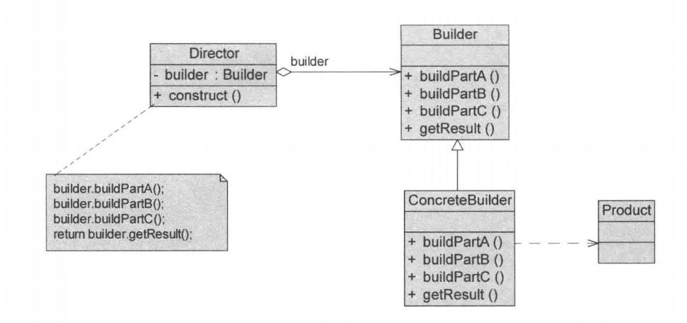
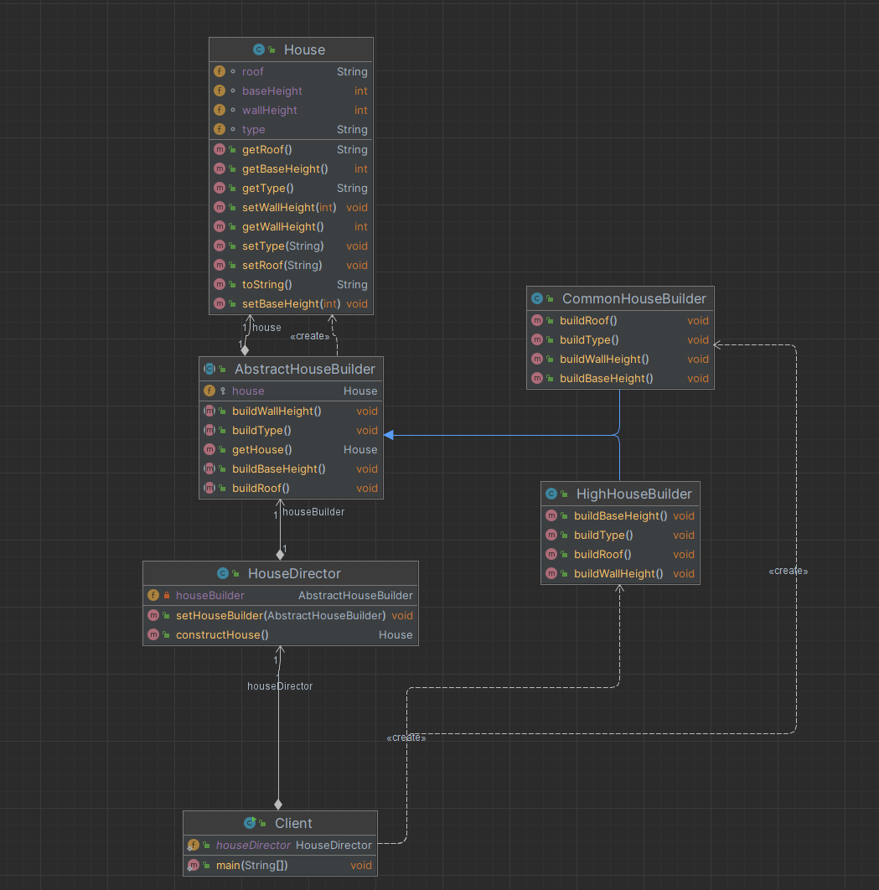
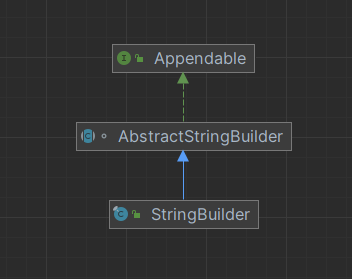

## 引入

​	需要建房子，而建房子有建造地基、砌墙、封顶等多个流程（这里只用这三个意思一下）

​	房子有各种各样的，比如普通房，高楼，别墅，各种房子的过程虽然一样，但每个步骤具体操作实际是不同的，比如普通房子和高楼对打地基的深度，勘探等要求就不一样。

## 传统方法实现

​	传统方式实现的话，对于每个类型的房屋，在客户端使用时都需要重复创建。

房屋类：

~~~ java
public class House {
    /**
     * 房屋类型
     */
    String type;
    /**
     * 房顶
     */
    String roof;
    /**
     * 墙高度
     */
    int wallHeight;
    /**
     * 地基深度
     */
    int baseHeight;
}
~~~

客户端：

~~~ java
public class Client {
    public static void main(String[] args) {
        // 建造普通房
        House commonHouse = new House();
        commonHouse.setType("普通房屋");
        commonHouse.setRoof("普通屋顶");
        commonHouse.setWallHeight(2);
        commonHouse.setBaseHeight(1);

        // 建造高楼
        House highHouse = new House();
        highHouse.setType("高楼");
        highHouse.setRoof("高楼屋顶");
        highHouse.setWallHeight(10);
        highHouse.setBaseHeight(5);

        System.out.println(commonHouse);
        System.out.println(highHouse);
    }
}
~~~

## 创建者模式实现：

### 1、分析

分析传统模式可知，存在一些问题：

| 序号 | 问题描述                       | 具体表现                                                     | 影响                                     |
| ---- | ------------------------------ | ------------------------------------------------------------ | ---------------------------------------- |
| 1️⃣    | **产品与创建过程强耦合**       | 客户端需要知道房子有哪些属性、如何一步步创建，产品类与创建逻辑混在一起 | 任意属性或建造顺序变化都会导致大范围修改 |
| 2️⃣    | **构建过程重复、臃肿**         | 每种房子（普通、高楼、别墅）都要重复写相似的属性设置代码     | 冗余、易错、不便维护                     |
| 3️⃣    | **产品结构变化引发连锁修改**   | 新增或修改房子属性时，需要修改所有建造逻辑                   | 违反开闭原则，修改成本高                 |
| 4️⃣    | **无法控制或复用建造流程**     | 每次建造都要手动设置属性，流程分散、不可统一管理             | 构建步骤混乱，无法保障一致性             |
| 5️⃣    | **难以扩展不同类型的构建逻辑** | 新增房子类型时只能复制粘贴修改属性                           | 代码膨胀、扩展性差                       |
| 6️⃣    | **客户端参与过多、职责不清**   | 客户端既要负责建造流程，又要设置属性                         | 可读性差，逻辑混乱                       |

针对上述问题，可以使用创建者模式进行优化：

1、对于问题“产品与创建过程强耦合”、“构建过程重复、臃肿”、“产品结构变化引发连锁修改”、“无法控制或复用建造流程”：

​	将产品类与构建流程解耦，客户端只关心“建什么”，不关心“怎么建”。

​	因此可以抽象出一个Director（指挥者）的角色，由其负责怎么建，构建的产品的流程。

2、对于问题“难以扩展不同类型的构建逻辑”：

​	可以将创建产品的方法抽象，新增一个具体产品则新增一个具体创建者实现相关接口即可。

3、“客户端参与过多、职责不清”

​	可以抽象一个一个对象builder（抽象建造者），一个Director（指挥者），由指挥者负责创建流程，客户只需要指定对应的具体创建者告诉指挥者即可。

### 2、分析结果：

​	从上面的分析可以看出，建造者模式的核心思想是：

- **将复杂对象的创建过程和部件解耦**；
- **通过指挥者统一管理构建顺序**；
- **通过不同的具体建造者实现差异化产品构建**。

​	这样一来，客户端只需要“告诉指挥者建什么”，而不需要“关心怎么建”，既达到了可扩展性，又保证了流程一致性。

可以将产品的创建抽象成一个builder（抽象建造者），其内部声明构建出产品各个部位属性的方法，再声明一个获取构建后的完整复杂对象的方法。

​	将产品各个部位的构建顺序，如何构建抽象成一个Director（指挥者），其接受一个具体的builder（抽象建造者），并按次序构建产品，最终返回产品。

**类图：**

1.Builder（抽象建造者）
	抽象建造者为创建一个产品Product对象的各个部件指定抽象接口，在该接口中一般声明两类方法：

- 一类方法是buildPartX（），它们用于创建复杂对象的各个部件；
 - 另一类方法是getResult（），它们用于返回复杂对象。它既可以是抽象类，也可以是接口。

2.ConcreteBuilder（具体建造者）
   具体建造者实现了Builder接口，实现各个部件的构造和装配方法，定义并明确它所创建的复杂对象，也可以提供一个方法返回创建好的复杂产品对象。

3.Product（产品角色）
   产品角色是被构建的复杂对象，包含多个组成部件，具体建造者创建该产品的内部表示并定义它的装配过程。

4.Director（指挥者）
   指挥者又称为导演类，它负责安排复杂对象的建造次序，指挥者与抽象建造者之间存在关联关系，可以在其construct() 建造方法中调用建造者对象的部件构造与装配方法，完成复杂对象的建造。

​	客户端一般只需要与指挥者进行交互，在客户端确定具体建造者的类型，并实例化具体建造者对象（也可以通过配置文件和反射机制），然后通过指挥者类的构造函数或者Setter方法将该对象传人指挥者类中。

### 3、源码：

类图如下：

房屋产品类：

~~~ java
public class House {
    /**
     * 房屋类型
     */
    String type;
    /**
     * 房顶
     */
    String roof;
    /**
     * 墙高度
     */
    int wallHeight;
    /**
     * 地基深度
     */
    int baseHeight;
}
~~~

房屋抽象创建者和具体创建者

~~~ java
// 抽象创建者
public abstract class AbstractHouseBuilder {
    protected House house = new House();

    public abstract void buildType();

    public abstract void buildRoof();

    public abstract void buildWallHeight();

    public abstract void buildBaseHeight();

    public House getHouse() {
        return house;
    }
}
// 高楼具体创建者
public class HighHouseBuilder extends AbstractHouseBuilder {
    @Override
    public void buildType() { this.house.setType("高楼");}
    @Override
    public void buildRoof() { this.house.setRoof("高楼屋顶");}
    @Override
    public void buildWallHeight() { this.house.setWallHeight(10);}
    @Override
    public void buildBaseHeight() {this.house.setBaseHeight(5);}
}
// 普通房屋具体创建者
public class CommonHouseBuilder extends AbstractHouseBuilder {
    @Override
    public void buildType() { house.setType("普通房屋");}
    @Override
    public  void buildRoof() {house.setRoof("普通屋顶");}
    @Override
    public  void buildWallHeight() { house.setWallHeight(2);}
    @Override
    public  void buildBaseHeight() {house.setBaseHeight(1);}
}
~~~

指挥者：

~~~ java
public class HouseDirector {
    private AbstractHouseBuilder houseBuilder;
    public void setHouseBuilder(AbstractHouseBuilder houseBuilder) {
        this.houseBuilder = houseBuilder;
    }
    /**
     * 构造流程交给指挥者
     */
    public House constructHouse() {
        houseBuilder.buildType();
        houseBuilder.buildRoof();
        houseBuilder.buildWallHeight();
        houseBuilder.buildBaseHeight();
        return houseBuilder.getHouse();
    }
}
~~~

客户端：

~~~ java
public class Client {
    public static HouseDirector houseDirector = new HouseDirector();

    public static void main(String[] args) {
        // 建造普通房
        houseDirector.setHouseBuilder(new CommonHouseBuilder());
        House commonHouse = houseDirector.constructHouse();
        // 建造高楼
        houseDirector.setHouseBuilder(new HighHouseBuilder());
        House highHouse = houseDirector.constructHouse();
        System.out.println(commonHouse);
        System.out.println(highHouse);
    }
}
~~~

## 优点与缺点

**1.建造者模式的优点**
（1）在建造者模式中，客户端不必知道产品内部组成的细节，将产品本身与产品的创建过程解耦，使得相同的创建过程可以创建不同的产品对象。

（2）每一个具体建造者都相对独立，与其他的具体建造者无关，因此可以很方便地替换具体建造者或增加新的具体建造者，用户使用不同的具体建造者即可得到不同的产品对象。

（3）可以更加精细地控制产品的创建过程。将复杂产品的创建步骤分解在不同的方法中，使得创建过程更加清晰，也更方便使用程序来控制创建过程。

（4）增加新的具体建造者无须修改原有类库的代码，指挥者类针对抽象建造者类编程，系统扩展方便，符合“开闭原则”。

**2.建造者模式的缺点**
（1）建造者模式所创建的产品一般具有较多的共同点，其组成部分相似。如果产品之间的差异性很大，则不适合使用建造者模式，因此其使用范围受到一定的限制。

（2）如果产品的内部变化复杂，可能会导致需要定义很多具体建造者类来实现这种变化，导致系统变得很庞大。

（3）若产品构建过程变化频繁，维护建造者类的成本较高。

**3.与抽象工厂模式的对比：**

- 建造者模式注重**构建过程**，抽象工厂注重**产品族的创建**。
- 建造者模式强调**一步步地创建一个复杂对象**，而抽象工厂是**直接返回多个相关的对象实例**。
- 建造者模式中通常有一个**指挥者（Director）**统一控制构建步骤，而抽象工厂模式没有这一层控制逻辑。
- 抽象工厂适合**创建一组相互依赖的对象（产品族）**，而建造者适合**逐步构造一个复杂对象（如一辆车、一个报表）**。
- 从结果来看：抽象工厂关注“生产什么”，建造者关注“如何生产”。

## 适用场景

（1）需要生成的产品对象有复杂的内部结构，这些产品对象通常包含多个成员属性。

（2）需要生成的产品对象的属性相互依赖，需要指定其生成顺序。

（3）对象的创建过程独立于创建该对象的类。在建造者模式中引人了指挥者类，将创建过程封装在指挥者类中，而不在建造者类中。

（4）隔离复杂对象的创建和使用，并使得相同的创建过程可以创建不同的产品。

## 应用

1、在 JDK 中，StringBuilder 体现了建造者模式的思想，但并非严格意义上的建造者模式实现

​	根据类图可以看到，StringBuilder继承自AbstractStringBuilder，而AbstractStringBuilder实现了Appendable接口。

​	Appendable 接口定义了多个 append 方法(抽象方法), 即 Appendable 为抽象建造者, 定义了抽象方法 

​	AbstractStringBuilder 实现了 Appendable 接口方法，这里的 AbstractStringBuilder 已经是建造者，只是不能 实例化 

​	StringBuilder 即充当了指挥者角色，同时充当了具体的建造者，建造方法的实现是由 AbstractStringBuilder 完 成, 而 StringBuilder 继承了 AbstractStringBuilder

2、在很多游戏软件中，地图包括天空、地面、背景等组成部分，人物角色包括人体、服装、装备等组成部分，可以使用建造者模式对其进行设计，通过不同的具体建造者创建不同类型的地图或人物。