## 引入

​	家里的插座都是220v的，然而手机充电需要电压为5v，显然手机无法直接连接插座进行充电。因此需要一个适配器，也就是充电头来转换电压，将220v适配一下。

​	在软件开发中采用类似于电源适配器的设计和编码技巧被称为适配器模式。通常情况下，客户端可以通过目标类的接口访问它所提供的服务。

​	有时，现有的类可以满足客户类的功能需要，但是它所提供的接口不一定是客户类所期望的，这可能是因为现有类中方法名与目标类中定义的方法名不一致、参数不同等原因所导致。

​	如何在不修改客户端和原有目标类基础上，让客户端能够使用目标类中的方法，就是适配器模式所要解决的问题。

## 定义

适配器模式分为三种：

​	类适配器模式、对象适配器模式、接口适配器模式（缺省适配器模式）

### 工作原理：

1) 适配器模式：将一个类的接口转换成另一种接口，让原本接口不兼容的类可以兼容。

2) 从用户的角度看不到被适配者，是解耦的。

3) 用户调用适配器转化出来的目标接口方法，适配器再调用被适配者的相关接口方法。

4) 用户收到反馈结果，感觉只是和目标接口交互。

#### 对比：

| 类型                                | 目的                                 | 实现方式                                                     | 核心思想                                                     | 说明                                                         |
| ----------------------------------- | ------------------------------------ | ------------------------------------------------------------ | ------------------------------------------------------------ | ------------------------------------------------------------ |
| **类适配器（Class Adapter）**       | 让“不兼容的类”能被当作目标接口使用   | 通过继承                                                     | 适配器**继承**被适配者（Adaptee），同时实现目标接口（Target）。 | 由于 Java 不支持多继承，使用受限。                           |
| **对象适配器（Object Adapter）**    | 让“不兼容的对象”能被当作目标接口使用 | 通过**组合 / 聚合**                                          | 适配器**持有**一个被适配者对象实例（Adaptee），实现目标接口（Target）。 | 最常用、最灵活，解耦性好。                                   |
| **接口适配器（Interface Adapter）** | 让“接口方法太多”的使用者更方便       | 通过**抽象类的默认实现**，然后再通过对象适配器的方式实现适配（因为Java不能多继承） | 针对**接口中存在大量方法**的情况，提供一个抽象适配器类，实现所有方法的空实现。 | 子类可以只重写自己需要的方法，常见于监听器场景（如 Java 的 MouseAdapter）。 |

#### 注意：

接口适配器（又称默认适配器模式）：

​	接口适配器模式是从*类的继承结构*角度出发的，适用于接口方法过多的场景，而不是针对不兼容接口进行‘转换’的结构型适配。

​	是在“接口方法过多”或“接口颗粒度不合理”的情况下，通过抽象类提供默认空实现，让使用者可以只重写自己关心的方法。

​	它更多是为了解决接口臃肿导致的开发不便问题，并不是严格意义上“结构型适配器”的成员，而是一种接口层面的实用技巧。

原接口设计本身违反了 ISP（接口隔离原则），接口适配器其实是“补救措施”：

- 它不是违反接口隔离原则，而是**在接口已经违反 ISP 的前提下，提供一个折中解决方案**。
- 通过适配器类，让客户端可以**间接实现部分接口方法**，从而**降低违背 ISP 带来的代价**。

接口适配器完全符合 LSP（里氏替换原则）：

- 抽象适配器类实现了接口，因此本身是接口的子类型；
- 子类继承适配器后，依旧可以被当作该接口类型使用；
- 即使子类只重写部分方法，也不会破坏行为契约（空实现依旧是合法的）。

### 类适配器模式

#### 角色介绍：

**1.Target（目标抽象类\接口）**
	目标抽象类定义客户要用的特定领域的接口，可以是个抽象类或接口，也可以是具体类；

​	在类适配器中，由于Java语句不支持多重继承，它只能是接口。
**2.Adapter（适配器类）**
​	适配器类可以调用另一个接口，作为一个转换器，对Adaptee和Target进行适配。

​	适配器Adapter是适配器模式的核心，在类适配器中，它通过实现Target接口并继承Adaptee类来使二者产生联系；
**3.Adaptee(适配者类）**
​	适配者即被适配的角色，它定义了一个已经存在的接口，这个接口需要适配。适配者类一般是一个具体类，包含了客户希望使用的业务方法，在某些情况下甚至没有适配者类的源代码。
**4.Client（客户类）**
​	在客户类中针对目标抽象类进行编程，调用在目标抽象类中定义的业务方法。

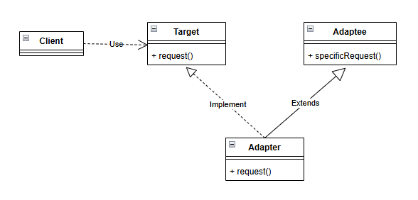

### 对象适配器模式

#### 角色介绍：

**1.Target（目标抽象类\接口）**
	目标抽象类定义客户要用的特定领域的接口，可以是个抽象类或接口，也可以是具体类；

​	在类适配器中，由于Java语句不支持多重继承，它只能是接口。
**2.Adapter（适配器类）**
​	适配器类可以调用另一个接口，作为一个转换器，对Adaptee和Target进行适配。

​	适配器Adapter是适配器模式的核心，在对象适配器中，它通过继承（或实现）Target并关联一个Adaptee对象使二者产生联系。
**3.Adaptee(适配者类）**
​	适配者即被适配的角色，它定义了一个已经存在的接口，这个接口需要适配。适配者类一般是一个具体类，包含了客户希望使用的业务方法，在某些情况下甚至没有适配者类的源代码。
**4.Client（客户类）**
​	在客户类中针对目标抽象类进行编程，调用在目标抽象类中定义的业务方法。

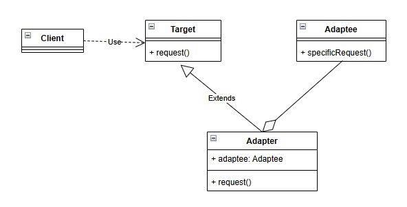

### 缺省适配器模式

​	其他角色与对象适配器一致，但是多了一个AbstractAdapter角色

**1.AbstractAdapter（抽象适配器）**
	目标接口方法数量过多，而当前适配器只关注部分方式时，通过抽象适配器实现相关接口，并提供默认实现（空实现或其他），然后具体适配器继承抽象适配器，重写对应关注的方法即可。

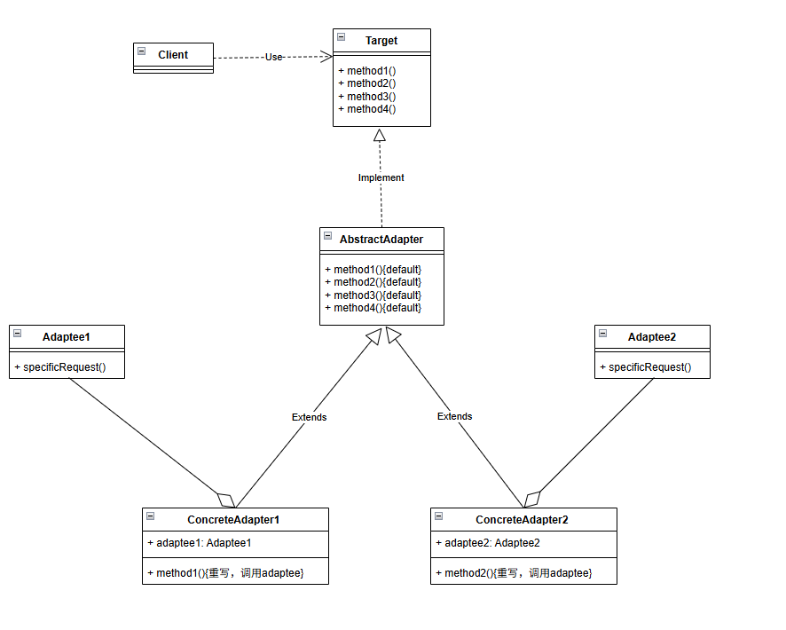

## 源码

### 类适配器

类图：

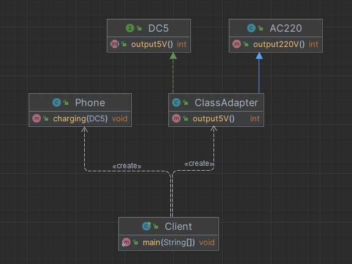

源码：

~~~ java
// 被适配者：家用电源，输出220V
public class AC220 {
    public int output220V() {
        System.out.println("输出交流电 220V");
        return 220;
    }
}
// 目标接口：手机期望电压
public interface DC5 {
    /**
     * 手机需要电压为5v
     */
    int output5V();
}
// 类适配器：通过继承AC220并实现DC5接口
public class ClassAdapter extends AC220 implements DC5 {
    @Override
    public int output5V() {
        // 调用父类方法
        int src = output220V();
        // 模拟降压转换
        int dst = src / 44;
        System.out.println("使用类适配器转换电压: " + src + "V -> " + dst + "V");
        return dst;
    }
}
// 手机：适用适配器
public class Phone {
    public void charging(DC5 dc5) {
        int output = dc5.output5V();
        if (output == 5) {
            System.out.println("电压适中，开始充电~");
        } else {
            System.out.println("电压不符，无法充电！");
        }
    }
}
// 客户端
public class Client {
    public static void main(String[] args) {
        Phone phone = new Phone();
        DC5 adapter = new ClassAdapter();
        phone.charging(adapter);
    }
}
~~~

### 对象适配器

类图：

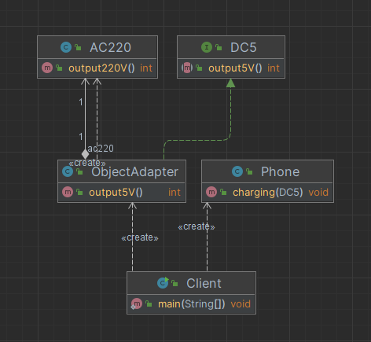

源码：

~~~ java
// 被适配者：家用电源，输出220V
public class AC220 {
    public int output220V() {
        System.out.println("输出交流电 220V");
        return 220;
    }
}
// 目标接口：手机期望电压
public interface DC5 {
    /**
     * 手机需要电压为5v
     */
    int output5V();
}
// 类适配器：通过注入或创建AC220实现DC5接口
public class ObjectAdapter implements DC5 {
    private final AC220 ac220 = new AC220();
    @Override
    public int output5V() {
        // 调用父类方法
        int src = ac220.output220V();
        // 模拟降压转换
        int dst = src / 44;
        System.out.println("使用类适配器转换电压: " + src + "V -> " + dst + "V");
        return dst;
    }
}
// 手机：适用适配器
public class Phone {
    public void charging(DC5 dc5) {
        int output = dc5.output5V();
        if (output == 5) {
            System.out.println("电压适中，开始充电~");
        } else {
            System.out.println("电压不符，无法充电！");
        }
    }
}
// 客户端
public class Client {
    public static void main(String[] args) {
        Phone phone = new Phone();
        DC5 adapter = new ClassAdapter();
        phone.charging(adapter);
    }
}
~~~

### 接口适配器

类图：

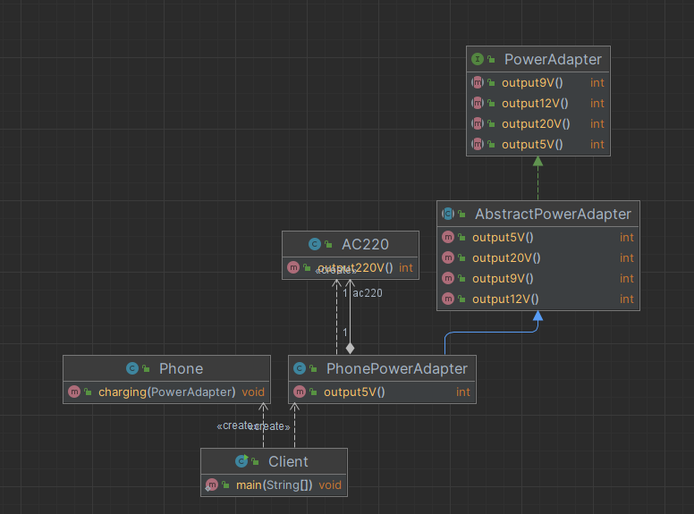、

源码：

~~~ java
// 被适配者：家用电源，输出220V
public class AC220 {
    public int output220V() {
        System.out.println("输出交流电 220V");
        return 220;
    }
}
// 目标接口：USB 充电口（DC5V）车载电源（DC12V）快充接口（DC9V / DC20V）
public interface PowerAdapter {
    int output5V();
    int output9V();
    int output12V();
    int output20V();
}
// 抽象适配器：提供空实现
public abstract class AbstractPowerAdapter implements PowerAdapter {
    @Override
    public int output5V() {return 0;}
    @Override
    public int output9V() {return 0;}
    @Override
    public int output12V() {return 0;}
    @Override
    public int output20V() {return 0;}
}
// 具体适配器，只关注部分方法
public class PhonePowerAdapter extends AbstractPowerAdapter {
    private final AC220 ac220 = new AC220();

    @Override
    public int output5V() {
        // 调用父类方法
        int src = ac220.output220V();
        // 模拟降压转换
        int dst = src / 44;
        System.out.println("只关注部分方法（5v）适配器转换电压: " + src + "V -> " + dst + "V");
        return dst;
    }
}
// 手机：适用适配器
public class Phone {
    public void charging(PowerAdapter adapter) {
        int v = adapter.output5V();
        if (v == 5) {
            System.out.println("电压适中，开始充电~");
        } else {
            System.out.println("电压不符，无法充电！");
        }
    }
}
// 客户端
public class Client {
    public static void main(String[] args) {
        Phone phone = new Phone();
        PowerAdapter adapter = new PhonePowerAdapter();
        phone.charging(adapter);
    }
}
~~~

## 优缺点

### 优点：

#### **1.解耦目标类与适配者类**
 通过引入适配器类，原有的目标类与适配者类之间不再直接耦合。可以在不修改原有代码的前提下，实现不同接口间的兼容与复用。

#### **2.提高类的透明性与复用性**
 适配者类的实现细节被适配器封装，对客户端透明；同时原有类的代码无需修改即可复用，提高了系统的可维护性与可扩展性。

#### **3.符合开闭原则**
 当系统需要支持新的适配方式时，只需新增一个适配器类即可，无需修改现有类结构。通过配置文件或依赖注入机制，还能方便地动态切换不同的适配器实现。

#### **4.兼容性与灵活性强**
 适配器可以在多个模块、系统或第三方库之间提供接口桥梁，使原本不兼容的类能够协同工作。尤其在系统迁移、版本升级或第三方系统集成中非常实用。

### 缺点：

#### **1. 类适配器模式的缺点**

- 由于 Java、C# 等语言**不支持多重继承**，一个适配器类**一次只能适配一个适配者类**。
- 目标抽象类型只能为接口，不能是类，否则无法同时继承目标和适配者。
- 不能同时适配一个类及其子类，适用范围受限。
- 在运行期无法动态替换适配者实现，灵活性较低。

#### **2. 对象适配器模式的缺点**

- 相比类适配器，**更换或覆写适配者方法的难度较大**。
   若要替换适配者的某些方法，只能通过创建适配者的子类，然后再由适配器持有该子类实例，过程相对复杂。
- **间接调用增加层次**：多了一层对象聚合，可能带来轻微性能开销。
- 如果客户端未面向目标接口编程，而直接依赖适配器具体实现，会削弱其解耦效果。

#### **3. 接口适配器模式的缺点**

- 实现类**必须继承抽象适配器类**，因而也受制于**单继承限制**。
- 虽然可以只重写需要的方法，但容易导致接口过大、职责不清，**违背接口隔离原则与单一职责原则**。
- 主要用于**简化接口实现**，而非“真正的接口转换”，适用范围相对有限。

## 适用场景

### 1.系统需要复用现有类，但其接口与当前系统不兼容

当系统需要调用一个已有类（或第三方库）的功能，但该类的接口定义与当前系统接口不一致时，可以通过**适配器**来实现接口转换，而无需修改原有类代码。

> ✅ 典型示例：
>
> - 系统需要使用旧版日志库（如 Log4j）而项目采用 SLF4J 规范时，可编写适配器统一调用方式。
> - 手机充电例：手机（目标）需要 5V，而插座（被适配者）输出 220V，需使用电源适配器。

------

### 2.希望创建一个可复用的类，与多个不兼容接口协同工作

适配器可作为一个**通用转换层**，使原本不兼容的多个类协同工作，增强系统的复用性和扩展性。

> ✅ 典型示例：
>
> - 数据导入导出模块中，需要兼容 Excel、CSV、JSON 等多种格式，通过适配器对外提供统一的导入导出接口。
> - 支付系统中，支付宝、微信、PayPal 等接口各不相同，可通过适配器统一为同一支付标准接口。

------

### 3.希望系统能够灵活替换或扩展适配逻辑

通过配置或依赖注入方式，可以灵活替换不同适配器实现，增强系统可扩展性，符合“开闭原则”。

> ✅ 示例：
>
> - 日志框架可通过配置文件切换不同日志适配器（如 Logback、Log4j2）。
> - 云存储 SDK 可通过适配器支持多种厂商（阿里云 OSS、华为 OBS、亚马逊 S3）。

------

### 4.接口方法过多，但只需使用其中一部分功能

在接口定义过于庞大、但子类仅需部分功能时，可使用**接口适配器模式**（通过抽象类提供空实现），让子类根据需要重写相应方法。

> ✅ 示例：
>
> - GUI 事件监听接口如 `MouseListener`，通常只需关心部分事件（如 `mouseClicked()`），此时使用抽象适配器类 `MouseAdapter` 简化实现。

------

### 5.在系统迁移、集成或第三方系统对接中提供兼容层

当系统中存在多个历史版本、旧系统接口或外部系统标准不一致时，适配器可以作为兼容层桥接不同接口规范，避免系统大规模修改。

> ✅ 示例：
>
> - 旧接口系统迁移到新框架时，通过适配器让新系统仍可调用旧模块；
> - 接入外部 API 时，通过适配器将外部数据格式转换为内部标准模型。

## 应用

### 1、JDK / Spring 框架中的应用 —— `HandlerAdapter`

#### 原理：

​	Spring MVC 中 Controller 的实现方式非常多样，包括传统的 `Controller`、`HttpRequestHandler`、注解方式的 `@RequestMapping`、甚至第三方扩展的 Handler。这些类并没有实现共同接口，因此 DispatcherServlet 无法直接调用它们。

​	为了解耦 DispatcherServlet 与各种 Controller 的实现方式，Spring MVC 引入了适配器机制。每种 Handler 都由其对应的 `HandlerAdapter` 负责适配，DispatcherServlet 只依赖 `HandlerAdapter` 接口，从而能够以统一方式调用不同类型的 Controller。

​	适配器模式在 Spring MVC 中解决了“**接口不统一但又必须协作**”的问题，提高了框架的扩展性和灵活性。

在 Spring MVC 中，**适配器模式**的典型应用是 `HandlerAdapter`。
 Spring MVC 支持多种类型的 Controller（如 `Controller`、`HttpRequestHandler`、`@RequestMapping` 标注的方法等），而 DispatcherServlet 并不知道具体调用哪种类型的 Controller 的方法，于是引入了 **适配器机制**。

####  类图关系（简化示意）：

```
DispatcherServlet → HandlerAdapter → 各种 Controller
```

#### 说明：

- `DispatcherServlet` 作为**调用者（客户端）**，它只认识 `HandlerAdapter` 接口。
- 不同类型的 Controller 有各自的适配器实现：
  - `SimpleControllerHandlerAdapter` 适配传统 Controller
  - `HttpRequestHandlerAdapter` 适配 HttpRequestHandler
  - `RequestMappingHandlerAdapter` 适配注解方式 Controller
- `DispatcherServlet` 并不关心具体控制器的类型，只要有合适的 HandlerAdapter 即可完成调用。

#### 优点：

- 通过适配器机制，Spring MVC 轻松支持多种类型的控制器；
- 当新增一种 Controller 类型时，只需新增一个 HandlerAdapter；
- 完全符合开闭原则，极大提高框架扩展性。

> ✅ **总结**：
>  Spring MVC 的核心设计思想中，`HandlerAdapter` 是**对象适配器模式**的典型实现：
>
> - 它将 `Controller` 的不同类型方法统一为 `handle()` 调用接口；
> - 通过聚合（持有 Controller 对象）实现灵活适配。

------

#### 源码debug分析：

测试Controller:

​	注意，该controller具有注解`@RequestMapping`

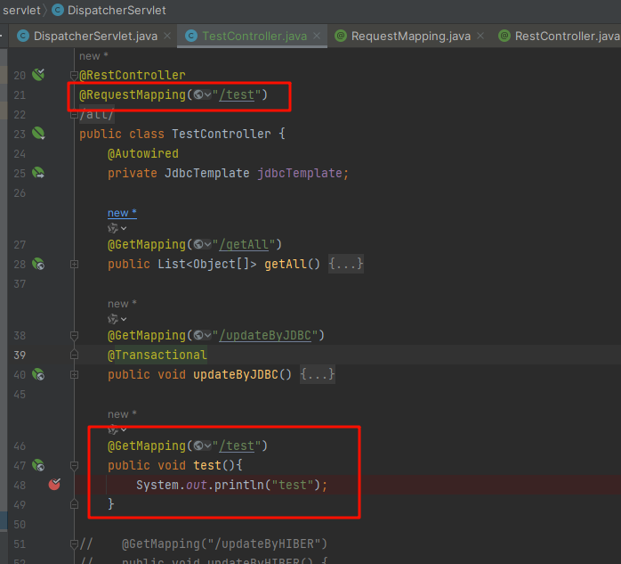

然后请求会发送给`DispatcherServlet`

​	由方法`org.springframework.web.servlet.DispatcherServlet#doDispatch`进行处理请求，大概流程：

##### 1、根据请求`request`获取对应的handler(也就是目前理解上的controller)

​	这里使用了策略模式进行获取handler。

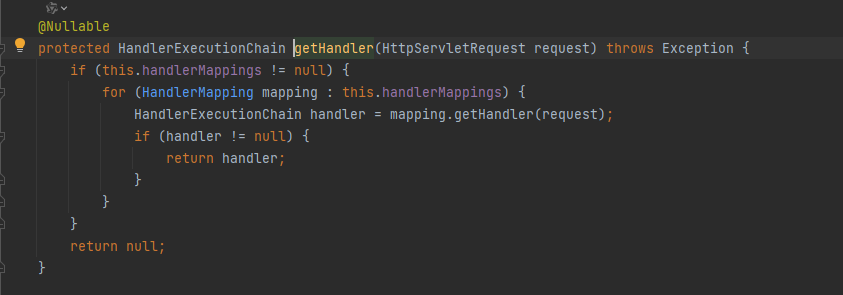

​	在本次调用test接口中，获取到的handler如下：

​	可以看到，其就是我们前面介绍的类：`TestController`，然后其具有注解`@RequestMapping`

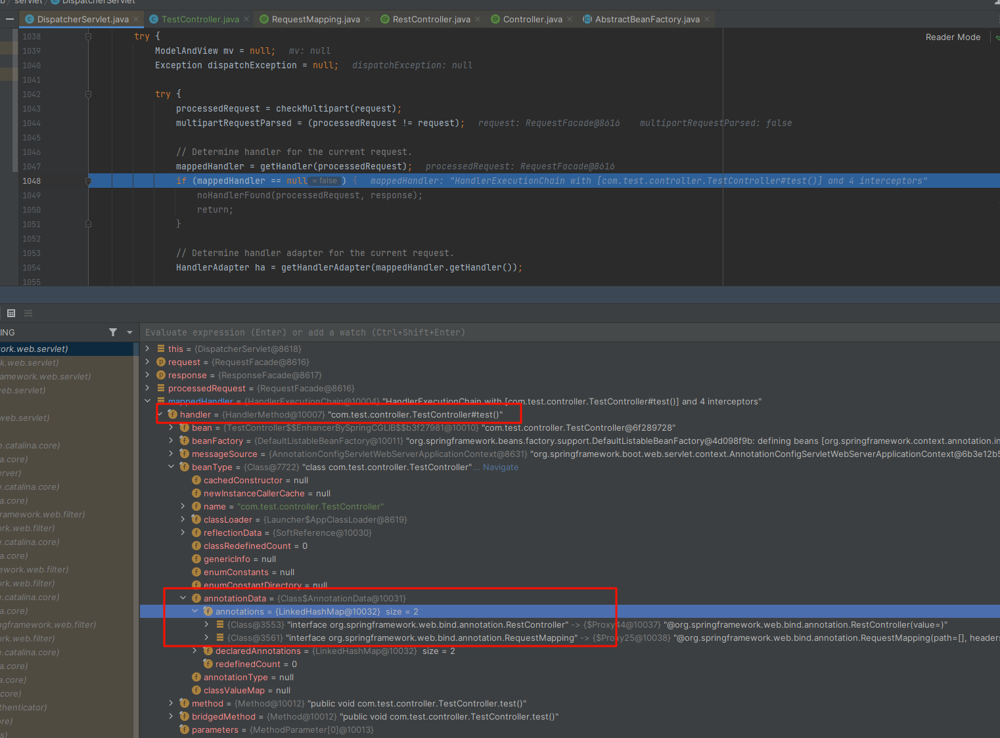

##### 2、根据handler获取对应的`HandlerAdapter`:

​	由于handler种类较多，且没有规范，没有统一实现指定接口等，因此`DispatcherServlet`无法直接处理，需要使用适配器去处理.

​	这里则使用了经典的适配器模式。

​	可以看到，spring默认有四类handler的adapter，其中，对于注解`@RequestMapping`类型的handler，则是由`RequestMappingHandlerAdapter`进行处理。

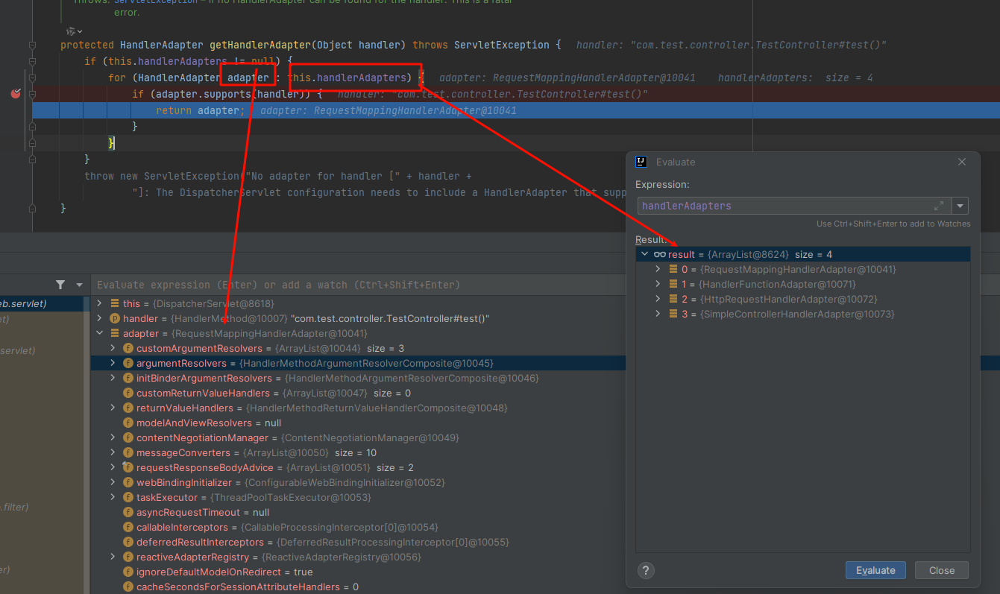

##### 3、通过`HandlerAdapter`执行对应的方法，完成处理。

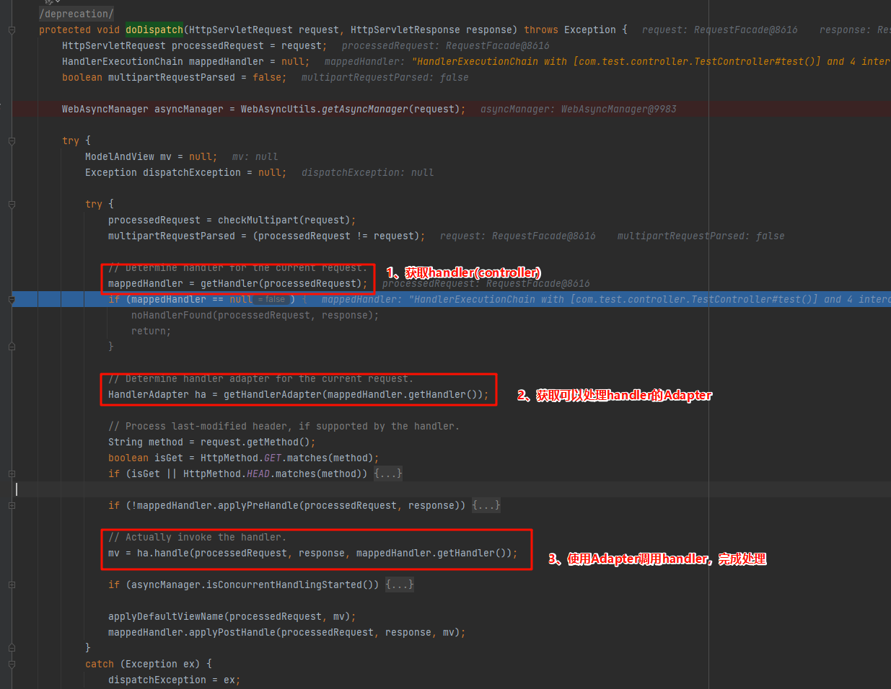

### 2、业务场景中的应用 —— 文件导出与文件服务器适配

#### 背景：

企业系统中常有**导出文件**或**附件迁移**功能，不同客户环境下文件处理方式不同：

- A 系统：直接导出本地压缩包；
- B 系统：将附件上传到指定 FTP；
- C 系统：上传到对方的文件服务器 API。

如果直接在导出逻辑中编写这些分支，会造成**高耦合、难扩展**的问题。

#### 解决方案：引入适配器模式

##### （1）定义目标接口：

```java
public interface FileExportTarget {
    void exportFile(String path);
}
```

##### （2）定义不同的适配器实现：

```java
// 适配本地文件导出
public class LocalFileAdapter implements FileExportTarget {
    public void exportFile(String path) {
        // 导出到本地压缩包
    }
}

// 适配 FTP 导出
public class FtpFileAdapter implements FileExportTarget {
    public void exportFile(String path) {
        // 上传至 FTP 服务器
    }
}

// 适配远程文件服务器导出
public class RemoteFileAdapter implements FileExportTarget {
    public void exportFile(String path) {
        // 调用 REST API 上传文件
    }
}
```

##### （3）导出服务中使用：

```java
public class FileExportService {
    private FileExportTarget fileAdapter;

    public FileExportService(FileExportTarget adapter) {
        this.fileAdapter = adapter;
    }

    public void export(String path) {
        fileAdapter.exportFile(path);
    }
}
```

##### （4）动态选择适配器：

```java
FileExportService service;
if (config.equals("LOCAL")) {
    service = new FileExportService(new LocalFileAdapter());
} else if (config.equals("FTP")) {
    service = new FileExportService(new FtpFileAdapter());
} else {
    service = new FileExportService(new RemoteFileAdapter());
}
service.export("/data/export");
```

#### 🌟 效果：

- 新增导出类型无需修改核心逻辑，只需新增一个适配器类；
- 代码结构清晰、可扩展性强；
- 客户端只依赖抽象接口 `FileExportTarget`，完全符合开闭原则。