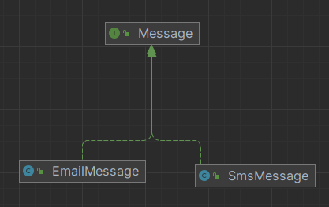
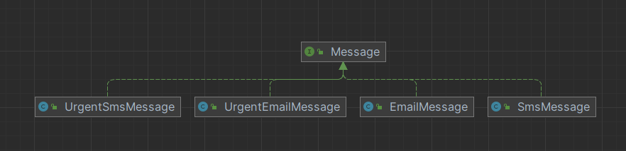
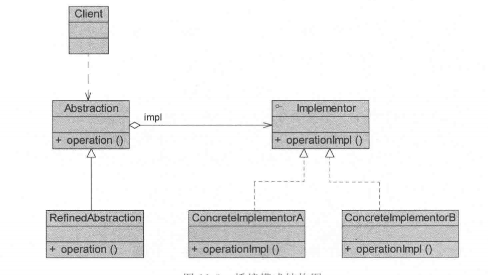
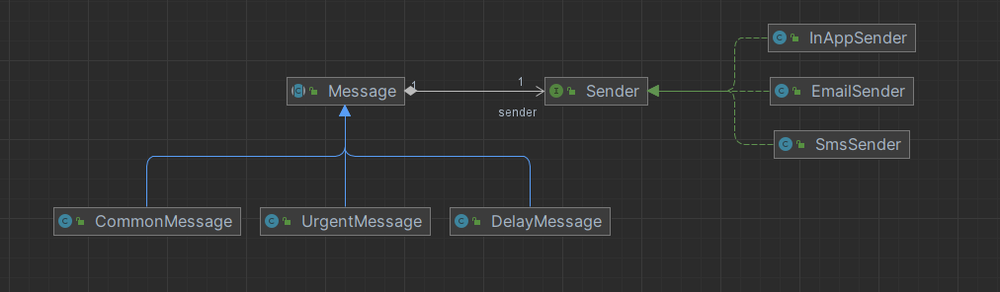
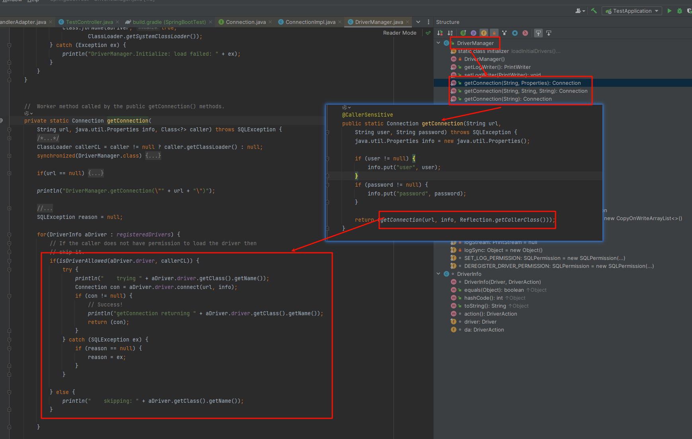

## 引入

初始需求：

​	我们有一个“消息发送”系统，系统只需要支持 **普通消息 + 邮件 / 短信**。

后续需求变更：

- 消息类型（变化维度 1）
  - 普通消息
  - 紧急消息

- 发送渠道（变化维度 2）
  - 邮件
  - 短信

需求再变更：

- 再加一个渠道：**站内信**

- 再加一个消息等级：**延迟消息**

## 传统方法实现

### 1、原始需求：

​	需求简单，我们可以直接创建两种实现的类即可。

此时：

	- 层次清晰
	- 代码简单
	- 没有过度设计

类图如下：



代码：

~~~ java
public interface Message {
    void sendMessage();
}

public class EmailMessage implements Message {
    @Override
    public void sendMessage() {
        System.out.println("邮箱消息");
    }
}

public class SmsMessage implements  Message{
    @Override
    public void sendMessage() {
        System.out.println("短信消息");
    }
}
~~~

### 2、第一次变更

​	需要扩展一个消息类型："紧急消息"，此时每个维度变化较少，传统方式还扛得住。

类图如下：



代码：

~~~ java
public interface Message {
    void sendMessage();
}

public class EmailMessage implements Message {
    @Override
    public void sendMessage() {
        System.out.println("邮箱消息");
    }
}

public class SmsMessage implements  Message{
    @Override
    public void sendMessage() {
        System.out.println("短信消息");
    }
}

public class UrgentEmailMessage implements Message{
    @Override
    public void sendMessage() {
        System.out.println("紧急邮箱消息");
    }
}

public class UrgentSmsMessage implements Message {
    @Override
    public void sendMessage() {
        System.out.println("紧急短信消息");
    }
}

~~~

### 3、第二次变更

​	再加一个渠道：**站内信**、再加一个消息等级：**延迟消息**

​	此时总共有3种渠道，3种消息类型，如果按照原来的实现，将会有3*3=9个类，且按照目前的需求变更来看，后续很有可能还会再加新的渠道和消息类型。

​	那么类的个数将会非常多。

这里不写代码了，直接示意一下：

~~~ 
Message
 ├── EmailMessage
 ├── SmsMessage
 ├── InAppMessage
 ├── UrgentEmailMessage
 ├── UrgentSmsMessage
 ├── UrgentInAppMessage
 ├── DelayEmailMessage
 ├── DelaySmsMessage
 └── DelayInAppMessage
~~~

## 桥接模式实现

### 传统方法分析

#### 问题：

1、修改风险巨大

​	可以发现，当存在了3种渠道和3种消息后，若是需要修改某种渠道或者某种消息时，需要将该类型的类全部修改，一次得修改至少3个类。

2、违反设计原则

- ❌ 开闭原则（总是在改旧类）
- ❌ 合成复用原则（全靠继承）
- ❌ 单一职责（一个类里既是“消息类型”又是“发送渠道”）

#### 优化：

​	可以发现，两个变化的维度放在一起，会导致无论扩展还是修改都非常费力。

​	而且两个维度之间是独立的，那么是不是可以尝试将这两个变化维度拆分开。

步骤：

1、我们尝试把“更像能力”的一个维度给拆分开，在这里就是发送渠道，比如支持将消息发送至邮箱、发送至短信，一种能力。之后，对于消息而言，我们不再考虑怎么发送，那么我们将得到：

~~~ 
Sender
 ├── EmailSender
 ├── SmsSender
 └── InAppSender
~~~

2、两种维度进行组合,桥接模式出现

此时：

- Message 只负责“消息语义”
- Sender 只负责“发送实现”

~~~ 
Message
  └── Sender sender
  
抽象层（Message）
   |
   |—— has-a ——> 实现层（Sender）
~~~

3、若之后再次扩展，将不会出现类的数量爆炸增长：

- 扩展发送渠道，新增一个Sender的实现类即可
- 扩展消息类型，新增一个Message子类

4、若之后修改某种实现：

- 修改某种发送渠道，只需要修改这一个类即可，不需要修改消息类型数量个的类了
- 修改某种消息类型，只需要修改这一个类即可，不需要修改发送渠道数量个的类了

#### 总结

刚才的经历就是：

- 让消息类型变化时，不影响发送方式；
- 让发送方式变化时，不影响消息类型。

即：将抽象与实现解耦，使它们可以独立变化。

当发现“**为了表达一个新变化，不得不在继承树的多个分支重复修改代码**”，就应该开始考虑桥接模式了。

### 定义

类图：



桥接模式包含如下角色：

1、Abstraction（抽象类）

​	用于定义抽象类的接口，它一般是抽象类而不是接口，其中定义了一个Implementor（实现抽象类）类型的对象并可以维护该对象，它与Implementor之间具有关联关系，它可以包含抽象的业务方法，还可以包含具体的业务方法。

​	放在上述例子中，就是Message。

2、RefinedAbstraction（扩充抽象类）
	扩充由Abstraction定义的接口，通常情况下它不再是抽象类而是具体类，它实现了在Abstraction中定义的抽象业务方法，在RefinedAbstraction中可以调用在Implementor中定义的业务方法。

​	放在上述例子中，就是CommonMessage、UrgentMessage、DelayMessage

3、Implementor（实现类接口）

​	定义实现类的接口，这个接口不一定要与Abstraction的接口完全一致，事实上这两个接口可以完全不同，一般地讲，Implementor接口仅提供基本操作，而Abstraction定义的接口可能会做更多更复杂的操作。

​	Implementor接口对这些基本操作进行了定义，而具体实现交给其子类。通过关联关系，在Abstraction中不仅拥有自已的方法，还可以调用Implementor中定义的方法，使用关联关系来替代继承关系。

​	放在上述例子中，就是Sender。

4、Concretelmplementor（具体实现类）

​	实现Implementor接口并且具体实现它，在不同的ConcreteImplementor中提供基本操作的不同实现，在程序运行时，ConcreteImplementor对象将替换其父类对象，提供给客户端具体的业务操作方法。

放在上述例子中，就是EmailSender、SmsSender、InAppSender。

### 源码

​	接下来，对上述例子使用桥接模式进行实现。

类图如下:



代码：

Abstraction（抽象类）及RefinedAbstraction（扩充抽象类）：

~~~ java
// 抽象消息类
public abstract class Message {
    protected Sender sender;

    public Message(Sender sender) {
        this.sender = sender;
    }

    public abstract void send();

    public Sender getSender() {
        return sender;
    }

    public void setSender(Sender sender) {
        this.sender = sender;
    }
}
// --- 三个RefinedAbstraction（扩充抽象类）
// 普通消息
public class CommonMessage extends Message {

    public CommonMessage(Sender sender) {
        super(sender);
    }

    @Override
    public void send() {
        // 普通消息其他业务逻辑
        sender.send("普通消息");
    }
}
// 延时消息
public class DelayMessage extends Message {
    public DelayMessage(Sender sender) {
        super(sender);
    }

    @Override
    public void send() {
        // 延时消息其他业务逻辑
        sender.send("延时消息");
    }
}
// 紧急消息
public class UrgentMessage extends Message {
    public UrgentMessage(Sender sender) {
        super(sender);
    }

    @Override
    public void send() {
        // 紧急消息其他业务逻辑
        sender.send("紧急消息");
    }
}
~~~

Implementor（实现类接口）及Concretelmplementor（具体实现类）

~~~ java
// 发送者
public interface Sender {
    void send(String message);
}
// 三个Concretelmplementor（具体实现类）
// 邮箱发送者
public class EmailSender implements Sender {
    @Override
    public void send(String message) {
        System.out.println("发送邮件,消息内容：" + message);
    }
}
//站内信发送者
public class InAppSender implements Sender {
    @Override
    public void send(String message) {
        System.out.println("发送站内消息，消息内容：" + message);
    }
}
// 短信发送者
public class SmsSender implements Sender{
    @Override
    public void send(String message) {
        System.out.println("发送短信，消息内容：" + message);
    }
}
~~~

客户端的使用：

~~~ java
public class Client {
    public static void main(String[] args) {
        // 这里可以通过注入或配置文件等方式获取发送渠道
        Sender sender = new EmailSender();
        // 这里可以通过注入或配置文件等方式获取发送消息类型
        Message message = new CommonMessage(sender);
        message.send();
        // 改发送渠道为站内消息
        sender = new InAppSender();
        message.setSender(sender);
        message.send();
        // 改为紧急消息
        message = new UrgentMessage(sender);
        message.send();
    }
}
~~~

## 思考

### 1、对比策略模式

​	桥接模式关注的是「结构拆分 + 维度解耦」

​	策略模式关注的是「行为选择 + 算法替换」

**策略模式：**

​	只有一个维度在变化，其关注的核心为“同一件事，有多种算法 / 行为实现”，即“行为可替换”。

**桥接模式：**

​	两个维度都在增长。目的：阻止“维度相乘”，其关注的核心是：“结构性解耦”

场景特征

- 有 **两个正交（互不影响）的维度**
- 每个维度 **都可能独立扩展**
- 两个维度组合起来会指数级增长

比如抽象描述（不举具体业务）：

- 维度 A：抽象层的“类型 / 形态”
- 维度 B：底层的“实现方式 / 平台 / 能力”

通俗来讲：

​	两种模式也就是实现上比较像。

​	但是策略本身实际上不会有变化，就比如说三种型号的笔，要绘制五种颜色，桥接模式会将某一个维度抽象化，比如说颜色，然后由笔的持有一个颜色，对于单一型号的笔而言，就完全和策略模式一样了，根据传入的颜色实现类，决定绘制什么颜色。

​	然而对于笔而言，其还有变化，其也有多种型号，因此将型号+颜色组合起来，就跟策略模式完全区分开了。

​	而单一型号+笔就跟策略模式非常相似了

### 2、具体体现了那些设计原则

#### 开闭原则

​	对扩展开放，对修改关闭

**桥接模式的体现：**

桥接模式里有 **两个“独立扩展点”**：

- 抽象层（如：不同型号的笔）
- 实现层（如：不同颜色）

当你要新增一种情况时：

- 新增型号 → **加一个 RefinedAbstraction**
- 新增颜色 → **加一个 ConcreteImplementor**

可见，**不需要修改已有类**

**对比不用桥接的情况：**

如果不用桥接：

- 新颜色 × 旧型号
- 新型号 × 旧颜色

必然要修改或新增大量已有类。可见，违反开闭原则

**桥接的本质作用之一：把“修改”变成“新增”**

#### 合成复用原则

​	优先使用对象组合，而不是类继承

桥接模式的核心结构就是组合：

在桥接中：

- 抽象类 **不是继承具体实现**
- 而是 **持有实现接口的引用**

~~~ 
Abstraction
   |
   |—— has-a ——> Implementor
~~~

也就是说：

​	行为不是通过继承“写死”的，而是通过组合“注入”的

桥接模式本质上是“**用组合替代继承**”的经典示范。

#### 里氏代换原则

​	子类对象必须能够替换父类对象，而不影响程序正确性

在桥接模式主要体现在 **两个继承体系** 上：

**抽象层继承体系：**

- 客户端面向 `Abstraction`
- 实际使用的是 `RefinedAbstraction`

只要遵守抽象约定：

​	任意 `RefinedAbstraction`都可以替换 `Abstraction`。

**实现层继承体系：**

- 抽象层只依赖 `Implementor`
- 不关心具体实现类

所以：任意 `ConcreteImplementor`都可以替换另一个 `ConcreteImplementor`

即：桥接模式天然要求子类遵守语义一致性，否则结构会直接崩

#### 依赖倒转原则

​	高层模块不应该依赖低层模块，二者都应该依赖抽象

在桥接中：

- 抽象层（高层模块）
- 不依赖任何具体实现
- **只依赖 Implementor 接口**

~~~
Abstraction  →  Implementor（接口）
ConcreteImplementor（实现）
~~~

没有桥接时常见的问题是：

- 抽象类直接 new 具体实现
- 或直接继承具体类

这会导致高层强耦合低层。

**桥接模式的“桥”，本质上就是一层“依赖倒转缓冲区”**

### 3、两个维度如何区分为抽象和实现

​	抽象层(Abstraction)和实现层(Implementor)的区分，不是“重要 vs 次要”，而是“谁对客户端稳定”。

正确区分标准只有一个：

> **谁是客户端“直接使用、直接感知、直接理解”的概念？**

这个维度就应该放在 **抽象层（Abstraction）**。

以大中小三种型号的笔，要绘制红、绿、蓝三种颜色为例：

​	“笔”应该作为抽象层。

以“笔”为例：

- 客户端代码通常是：
  - “我要一支钢笔”
  - “我要一支圆珠笔”

而不是：

- “我要一种红色行为”
- “我要一种蓝色行为”

 **“型号”是客户端语义层的主语**

颜色只是：

- 修饰
- 能力
- 行为的一部分

所以：

- 型号 → 抽象层
- 颜色 → 实现层

**不是因为型号更“重要”，而是因为它更“稳定地出现在客户端语义中”**

#### 结论：

> **抽象层 = 对客户端的“概念承诺”**

它定义的是：

- 你能做什么
- 你能被如何使用
- 你是什么“东西”

而不是：

- 你内部是怎么做的

> **实现层承载的是“变化更快、与平台/策略/能力相关的维度”**

它可以是：

- 颜色
- 品牌
- 操作系统
- 渲染方式
- 存储方式

📌 所以它不是“修饰”，而是：

> **“可以被独立替换的能力维度”**

#### 两个维度能否互换

原则上：**可以**

设计上：**通常不应该**

> “不同颜色的笔作为抽象层，具体型号作为实现层”

**在技术上完全可行**，但：

- 客户端代码会变成：
  - “我要一个红色”
  - “这个红色是钢笔行为”

这在**业务语义上是反直觉的**。

 **桥接模式不限制你怎么拆，只限制你“必须解耦”**

> 拆错维度，代码能跑；
> 拆错语义，设计会难维护。

### 4、多个变化维度如何处理

#### 理论上：桥接模式可以扩展到 N 个维度

桥接模式的核心思想是：

> **把“变化”拆分为多个正交维度，用组合而不是继承连接它们**

所以从思想上：

- 2 个维度：经典桥接
- 3 个维度：多重桥接
- N 个维度：维度拆分 + 组合

**并没有“只能两个”的硬限制。**

#### 但工程上：超过 2 个就要非常谨慎 

原因不是“不能”，而是：

​	**抽象会迅速变得难以理解**

如果你有：

- 抽象层 A
- 实现层 B
- 实现层 C
- 实现层 D

那么：

- 构造函数会很复杂
- 对象创建成本高
- 客户端理解难度暴增

 **这时问题已经不再是“桥接怎么写”，而是“模型是不是设计错了”**

## 优缺点

### 优点：

#### 1、避免「继承维度相乘」导致的类爆炸

桥接模式通过将多个变化维度拆分到不同的继承体系中，
 用**组合**代替**多维继承**，从根本上阻止了类数量的指数级增长。

> **这是桥接模式最核心、也是最不可替代的价值。**

------

#### 2、支持两个维度的**独立演进**

- 扩展抽象层（RefinedAbstraction）
   → 不影响任何实现层代码
- 扩展实现层（ConcreteImplementor）
   → 不影响任何抽象层代码

使系统在面对长期需求演进时，仍能保持结构稳定。

------

#### 3、符合多项面向对象设计原则

桥接模式天然体现了：

- 开闭原则（扩展而非修改）
- 合成复用原则（组合优于继承）
- 依赖倒转原则（依赖抽象而非实现）
- 里氏代换原则（双继承体系可替换）

这使其非常适合**框架层、基础设施层、长期维护模块**。

------

#### 4、实现细节对客户端透明

客户端始终面向抽象层编程：

- 不关心具体实现
- 不感知底层差异
- 可通过配置 / 注入 / 运行期组合完成切换

### 缺点：

#### 1、增加理解成本和设计门槛

桥接模式至少引入：

- 两套继承体系
- 一层组合关系

如果需求规模不足或变化不明确，会显得**过度设计**。

------

#### 2、 对「变化维度识别」要求很高

桥接模式**本身不难**，难的是：

> **判断哪些变化值得成为“桥接维度”**

维度选错：

- 代码仍然可运行
- 但语义混乱、维护困难

#### 3、不适合变化不明显或短生命周期系统

如果系统：

- 变化维度很少
- 或生命周期很短

使用桥接反而会增加复杂度。

## 适用场景

#### 1、存在 **两个正交、且都会增长的变化维度**

- 两个维度彼此独立
- 任一维度的扩展都会影响另一维度
- 使用继承会导致类数量相乘

这是桥接模式的**必要条件**。

------

#### 2、抽象层本身需要被继承和扩展

如果：

- 抽象类本身只有一个实现
- 或永远不会扩展

那么桥接会退化为策略，甚至不如策略清晰。

------

#### 3、系统是框架 / 中间件 / 基础设施层

桥接模式**非常适合**：

- 框架级设计
- 平台级适配
- 跨系统、跨实现的抽象

------

#### 4、不希望通过多层继承表达多个变化维度

当继承树开始出现以下信号时，应考虑桥接：

- 子类名称开始「组合化」（AxxBxx）
- 同一修改需要改多个子类
- 类名已经开始描述多个维度

## 应用

### 应用一：JDK 源码 —— **JDBC Driver（经典桥接）**

> ⚠️ 重要说明
>  JDBC **并不是一个严格符合 GoF UML 结构的“教科书级桥接模式”**，
>  但它是一个 **在真实工业环境中，为了解决维度相乘问题而采用的桥接思想实现**。
>
> JDBC 的“桥”并不体现在对象之间的 `has-a` 关系上，
> 而是体现在 **API 抽象层 与 数据库厂商实现层的独立演进能力** 上。

#### 1、JDBC 试图解决的根本问题（桥接动机）

JDBC 要解决的，并不是“如何创建 Connection”，而是：

> **如何在 JDBC API 不断演进的同时， 允许数据库厂商各自实现底层能力， 且不让二者产生耦合与类爆炸。**

这背后存在 **两个必须独立变化的维度**。

#### 2、JDBC 中真正的两个变化维度（关键理解点）

##### 维度一：`Connection` 所代表的 **JDBC 抽象能力（应用层可感知）**

`Connection` 的变化并不是“实现类变多”，而是：

- JDBC 版本升级
- 新特性加入（如 `prepareStatement`、批处理、事务能力增强等）
- API 语义变化
- 应用层**直接感知并依赖这些能力**

这是一个 **稳定但会持续演进的抽象层维度**，对应桥接模式中的 **Abstraction**

##### 维度二：`Driver` 所代表的 **数据库厂商实现（底层技术维度）**

数据库厂商的变化体现在：

- MySQL / Oracle / PostgreSQL 等多种实现
- 各自的通信协议、性能优化、集群能力
- 变化频率高、实现完全不同
- 与应用层语义无直接关系

 这是一个 **变化快、不可控的实现维度**， 对应桥接模式中的 **Implementor**

#### 3、如果不桥接

假设 JDBC 没有桥接思想，而是让抽象与实现直接绑定：

```
Connection_v1_MySQL
Connection_v1_Oracle
Connection_v2_MySQL
Connection_v2_Oracle
Connection_v3_MySQL
Connection_v3_Oracle
...
```

结果就是：

- **Connection 抽象能力 × 数据库厂商实现**
- JDBC API 的一次升级 → 所有厂商全部重来
- 应用层无法统一管理
- 无法平滑替换数据库

这正是桥接模式要阻止的 **“变化维度相乘”**

#### 4、结构对应（逻辑桥接，而非对象内桥接）

| 桥接角色            | JDBC 中的对应（逻辑层面）          |
| ------------------- | ---------------------------------- |
| Abstraction         | `java.sql.Connection`、`Statement` |
| RefinedAbstraction  | 各数据库的 `ConnectionImpl`        |
| Implementor         | `java.sql.Driver`                  |
| ConcreteImplementor | `MySQLDriver`、`OracleDriver`      |

注意：

- `Connection` **并不直接持有 Driver**
- 桥接关系 **不在对象模型中**
- 而是由 `DriverManager` 在运行期通过 SPI + 工厂机制完成



#### 5、JDBC 中“桥”真正存在的位置

在经典桥接中：

```
Abstraction
   |
   |— has-a —> Implementor
```

在 JDBC 中：

```
应用代码
   ↓
JDBC API（Connection 抽象）
   ↓
DriverManager（桥接调度点）
   ↓
Driver（实现插件）
   ↓
ConnectionImpl
```

​	**桥被“隐藏”在框架内部**，**这是成熟基础设施设计的特征，而不是缺陷**

### 应用二：文件导出系统（业务级）

#### 场景

- 导出内容类型（变化维度 1）
  - 用户数据
  - 订单数据
  - 日志数据
- 导出方式（变化维度 2）
  - 本地文件
  - FTP
  - 对象存储（OSS）

#### 设计

```
ExportTask（抽象）
 ├── UserExportTask
 ├── OrderExportTask

Exporter（实现接口）
 ├── LocalExporter
 ├── FtpExporter
 └── OssExporter
```

#### 好处

- 新增导出方式：只加 Exporter
- 新增导出内容：只加 ExportTask
- 不会出现 UserFtpExport、OrderOssExport 这种类爆炸