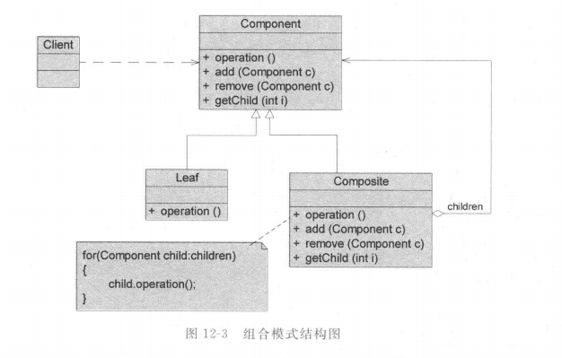
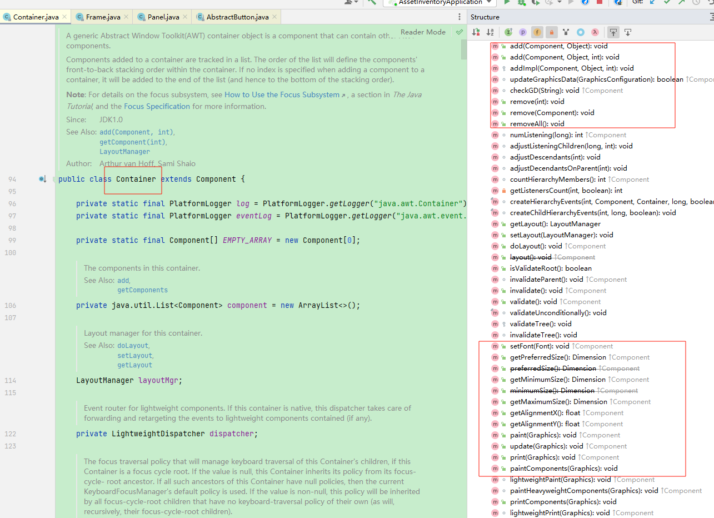
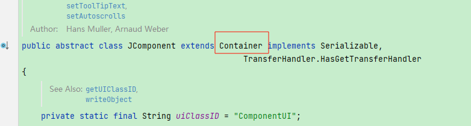
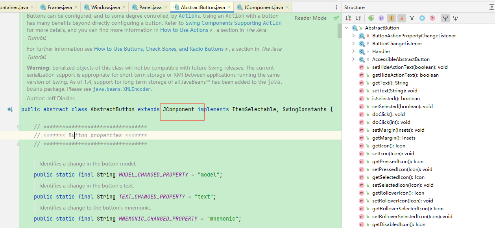
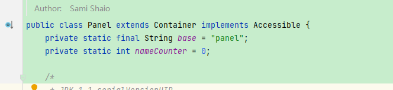
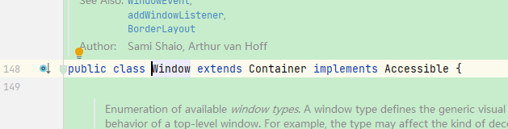
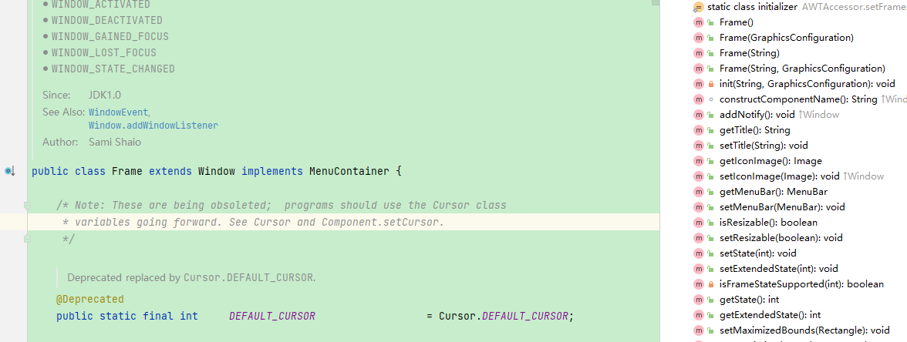

## 引入

在很多业务场景中，对象之间天然呈现出**树形结构**。
以文件系统为例：

- **文件夹**中可以包含：
  - 文件
  - 其他文件夹
- 文件夹本身也可以被视为一种“文件系统节点”

在使用文件系统时，调用方往往并不关心某个节点究竟是**文件**还是**文件夹**，而更关心以下这类操作：

- 获取名称
- 获取路径
- 展示结构
- 统计大小
- 执行统一操作（如删除、打印）

也就是说，从**使用者视角**来看：

> 文件与文件夹在“被使用”这一层面上，具有高度一致性。

## 传统方法实现

​	在文件系统中，**文件**与**文件夹**是两种不同的事物，因此最直观的做法是使用两个不同的类来进行建模。

文件类：

~~~ java
public class File {
    private String name;
    private long size;
    public File(String name, long size) {
        this.name = name;
        this.size = size;
    }
    public String getName() {
        return name;
    }
    public long getSize() {
        return size;
    }
    public void print() {
        System.out.println("File: " + name);
    }
}
~~~

文件夹类：

​	在该实现中，文件夹内部可以包含文件或其他文件夹，但由于二者之间缺乏统一的抽象，只能通过 `Object` 的形式进行存储。

~~~ java
public class Folder {
    private String name;
    private List<Object> children = new ArrayList<>();
    public Folder(String name) {
        this.name = name;
    }
    public String getName() {
        return name;
    }
    public void add(Object obj) {
        children.add(obj);
    }
    public List<Object> getChildren() {
        return children;
    }
    public void print() {
        System.out.println("Folder: " + name);
    }
}
~~~

客户端：

​	可以看到，在客户端代码中，需要显式判断对象的具体类型，并根据不同类型执行不同逻辑，同时递归遍历的职责也落在了客户端。

~~~ java
public class Client {
    public static void main(String[] args) {
        File file1 = new File("a.txt", 100);
        File file2 = new File("b.txt", 200);
        Folder folder = new Folder("docs");
        folder.add(file1);
        folder.add(file2);
        print(folder);
    }
    public static void print(Object obj) {
        if (obj instanceof File) {
            File file = (File) obj;
            file.print();
        } else if (obj instanceof Folder) {
            Folder folder = (Folder) obj;
            folder.print();
            for (Object child : folder.getChildren()) {
                // 递归在调用方
                print(child);
            }
        }
    }
}
~~~

## 组合模式实现

### 传统方法分析

### 问题

在上述传统实现中，虽然文件与文件夹在结构上已经形成了树形关系，但这种**结构信息被直接暴露给了调用方**，从而导致以下问题：

1. **客户端必须显式区分对象类型**
    客户端需要通过 `instanceof` 判断当前对象是文件还是文件夹，并进行强制类型转换。
2. **递归逻辑由客户端维护**
    文件夹的遍历逻辑分散在客户端代码中，每增加一种操作，往往都需要重新编写一套递归逻辑。
3. **客户端与具体实现类强耦合**
    一旦新增节点类型，或调整结构层次，客户端代码就必须修改，扩展成本较高。

例如，在打印文件名称时，客户端需要先判断对象类型，再分别调用文件或文件夹的打印逻辑；
如果希望新增一个“获取文件总大小”的功能，同样需要在客户端中再次区分类型并修改代码。

**本质上，结构层的复杂性被泄露到了使用层，客户端既要关心“做什么”，又要关心“对象是如何组合的”。**

#### 优化：

​	从客户端视角来看，诸如**打印名称、获取大小、删除节点**等操作，并不需要关心当前对象究竟是文件还是文件夹。
​	这些操作本应由文件或文件夹自身负责实现，而不应由客户端通过类型判断来决定执行逻辑。

​	同时，文件与文件夹虽然是不同的对象，但它们在“被使用”这一层面上具有高度一致性，完全可以抽象出一组公共行为，使客户端只面向统一接口进行编程。

换言之：

> **客户端不应承担结构判断和递归遍历的职责，这些职责应当下沉到对象体系内部。**

#### **总结**

传统实现虽然在结构上能够表达树形关系，但由于缺乏统一抽象，导致：

- 类型判断逻辑侵入客户端
- 递归代码重复出现
- 使用层与结构层强耦合

​	为了解决上述问题，需要一种方式能够**统一对待单个对象与对象组合**，并将结构相关的复杂性隐藏在对象内部，这正是组合模式要解决的核心问题。

### 定义

类图：

​		

#### 组合模式角色说明

##### 1、Component（抽象构件）

​	抽象构件可以是接口或抽象类，用于为**叶子构件和容器构件定义统一的抽象接口**。
​	在该角色中，可以包含所有子类共有行为的声明和实现，使客户端始终面向抽象构件进行编程，而不依赖具体实现类型。

​	在抽象构件中，通常会定义访问和管理子构件的方法，如增加子构件、删除子构件、获取子构件等。
​	根据不同的组合模式实现方式（透明式组合模式与安全式组合模式），Component 中声明的方法范围可能有所不同。

- **透明式组合模式**
  Component 会声明叶子构件和容器构件的所有方法，即使某些方法（如增加子构件）在语义上对叶子节点并不成立。
- **安全式组合模式**
  Component 仅声明叶子构件和容器构件真正共有的方法，而诸如增加、删除子构件等仅属于容器构件的方法，不会出现在 Component 中，从而在接口层面保证类型安全。

##### 2、Leaf（叶子构件）

​	叶子构件表示组合结构中的叶子节点对象，叶子节点不包含子节点。
​	它实现了抽象构件中定义的业务行为，但不具备管理子构件的能力。

​	在透明式组合模式中，对于那些在语义上不适用于叶子节点的方法（如增加子构件），通常通过抛出异常等方式进行处理；
​	而在安全式组合模式中，这类方法不会出现在叶子构件中。

##### 3、Composite（容器构件）

​	容器构件表示组合结构中的容器节点对象，其子节点可以是叶子节点，也可以是其他容器节点。
​	它通常维护一个子构件集合，用于存储和管理子节点。

​	容器构件不仅实现了抽象构件中定义的业务行为，还负责实现对子构件的访问与管理操作。
​	在其业务方法中，**往往会递归调用子构件的业务方法，从而将原本由客户端承担的递归逻辑下沉到对象体系内部**。

##### 4、Client（客户端）

​	客户端通过抽象构件（Component）接口访问和操作组合结构中的对象。
​	在理想情况下，客户端无需关心对象是叶子节点还是容器节点，从而实现对单个对象和对象组合的一致使用。

### 源码

#### 透明式组合模式

在文件系统中，**文件**与**文件夹**是两种不同的对象，但它们在客户端视角下具有大量**一致的行为**，例如：

- 获取名称
- 计算大小
- 打印结构

​	因此，在透明式组合模式中，会将**文件和文件夹统一抽象为一个抽象构件（Component）**，并在该抽象构件中声明**所有对子节点的管理方法**。

> 对于不支持子节点管理的对象（如文件），这些方法在默认实现中直接抛出异常，这正是透明式组合模式的典型特征。

##### Component抽象构件-文件抽象构件：

```java
public abstract class FileSystemComponent {
    protected String name;
    public FileSystemComponent(String name) {
        this.name = name;
    }
    // 如下方法为 公共行为
    public String getName() {
        return name;
    }
    public abstract long getSize();
    public abstract void print();

    // 如下方法为子节点管理方法（透明式的核心）
    public void add(FileSystemComponent component) {
        throw new UnsupportedOperationException();
    }
    public void remove(FileSystemComponent component) {
        throw new UnsupportedOperationException();
    }
    public FileSystemComponent getChild(int index) {
        throw new UnsupportedOperationException();
    }
}
```

##### Leaf 叶子构件-File（文件）：

​	文件作为叶子节点，只需要实现公有行为即可。

​	对于子节点管理相关方法，**不做重写**，直接沿用抽象构件中的默认实现（抛出异常）。

```java
public class File extends FileSystemComponent {
    private long size;
    public File(String name, long size) {
        super(name);
        this.size = size;
    }
    @Override
    public long getSize() {
        return size;
    }
    @Override
    public void print() {
        System.out.println("File: " + name + " (" + size + " bytes)");
    }
}
```

##### Composite 容器构件-Folder（文件夹）：

文件夹作为容器节点，需要：

- 实现对子节点的管理
- 在业务方法中递归调用子节点的对应方法

```java
public class Folder extends FileSystemComponent {
    private List<FileSystemComponent> children = new ArrayList<>();
    public Folder(String name) {
        super(name);
    }
    @Override
    public void add(FileSystemComponent component) {
        children.add(component);
    }
    @Override
    public void remove(FileSystemComponent component) {
        children.remove(component);
    }
    @Override
    public FileSystemComponent getChild(int index) {
        return children.get(index);
    }
    @Override
    public long getSize() {
        long totalSize = 0;
        for (FileSystemComponent child : children) {
            totalSize += child.getSize();
        }
        return totalSize;
    }
    @Override
    public void print() {
        System.out.println("Folder: " + name);
        for (FileSystemComponent child : children) {
            child.print();
        }
    }
}
```

##### Client客户端：

客户端完全基于抽象构件进行操作：

- 不关心对象是文件还是文件夹
- 不需要 `instanceof`
- 不需要维护递归逻辑

```java
public class Client {
    File file1 = new File("a.txt", 100);
        File file2 = new File("b.txt", 200);
        Folder folder = new Folder("docs");
        folder.add(file1);
        folder.add(file2);
        Folder root = new Folder("root");
        root.add(folder);
        root.add(new File("readme.md", 50));
        root.print();
        System.out.println("Total size: " + root.getSize());
}
```

#### 透明式组合模式小结

- **优点**
  - 客户端只面向抽象构件编程
  - 文件与文件夹可被一致对待
  - 递归逻辑被封装在组合对象内部，客户端代码极简
- **缺点（透明式的代价）**
  - 叶子节点被迫实现对子节点的管理方法
  - 如果客户端错误地对叶子节点调用 `add/remove`，将导致运行时异常
  - 接口“过胖”，对上层使用者要求较高

#### 安全式组合模式

​	在安全式组合模式中，**抽象构件（Component）只声明叶子节点与容器节点真正“共有”的行为**，
而**对子节点的管理行为，仅由容器构件（Composite）自身提供**。

> 这样可以从**接口层面**避免客户端对叶子节点调用非法方法，从而提升系统的安全性。

##### Component抽象构件-文件抽象构件：

抽象构件中：

- 不再包含 `add / remove / getChild`
- 接口职责更加单一
- 客户端**从类型系统层面**无法对子节点做非法操作

~~~ java
public abstract class FileSystemComponent {
    protected String name;
    public FileSystemComponent(String name) {
        this.name = name;
    }
    // ===== 仅声明真正的公共行为 =====
    public String getName() {
        return name;
    }
    public abstract long getSize();
    public abstract void print();
}
~~~

##### Leaf 叶子构件 —— File（文件）

​	文件作为叶子节点，仅实现自身业务逻辑，不涉及任何子节点管理能力。

```java
public class File extends FileSystemComponent {
    private long size;
    public File(String name, long size) {
        super(name);
        this.size = size;
    }
    @Override
    public long getSize() {
        return size;
    }
    @Override
    public void print() {
        System.out.println("File: " + name + " (" + size + " bytes)");
    }
}
```

##### Composite 容器构件 —— Folder（文件夹）

​	文件夹除了实现抽象构件定义的公共行为外，**自行声明并实现对子节点的管理方法**。

~~~ java
public class Folder extends FileSystemComponent {
    private List<FileSystemComponent> children = new ArrayList<>();
    public Folder(String name) {
        super(name);
    }
    // ===== 仅容器节点具备的能力 =====
    public void add(FileSystemComponent component) {
        children.add(component);
    }
    public void remove(FileSystemComponent component) {
        children.remove(component);
    }
    public FileSystemComponent getChild(int index) {
        return children.get(index);
    }
    @Override
    public long getSize() {
        long totalSize = 0;
        for (FileSystemComponent child : children) {
            totalSize += child.getSize();
        }
        return totalSize;
    }
    @Override
    public void print() {
        System.out.println("Folder: " + name);
        for (FileSystemComponent child : children) {
            child.print();
        }
    }
}
~~~

##### Client客户端：

客户端在使用时：

- 仍然可以统一处理文件与文件夹的公共行为
- 但在**结构构建阶段**，需要显式区分容器节点

~~~ java
public class Client {
    public static void main(String[] args) {
        FileSystemComponent file1 = new File("a.txt", 100);
        FileSystemComponent file2 = new File("b.txt", 200);
        Folder folder = new Folder("docs");
        folder.add(file1);
        folder.add(file2);
        Folder root = new Folder("root");
        root.add(folder);
        root.add(new File("readme.md", 50));
        root.print();
        System.out.println("Total size: " + root.getSize());
    }
}
~~~

#### 安全式组合模式小结

**优点：**

- 抽象构件接口更加精简、职责更清晰
- 从编译期避免对子节点的非法操作
- 系统安全性高，可读性更好

**缺点：**

- 客户端在构建组合结构时：
  - 需要区分叶子节点与容器节点
- 在“结构操作”层面：
  - 无法做到完全透明

## 思考

### 1、两种实现区别

| 维度               | 透明式组合模式       | 安全式组合模式        |
| ------------------ | -------------------- | --------------------- |
| 子节点管理方法     | 声明在 Component 中  | 仅存在于 Composite 中 |
| 客户端是否可能误用 | 是（运行期异常）     | 否（编译期限制）      |
| 接口完整性         | 高（看起来能力完整） | 精简（职责单一）      |
| 使用透明度         | 高                   | 稍低                  |
| 安全性             | 较低                 | 较高                  |

### 2、具体体现了那些设计原则

#### 依赖倒置原则（DIP）

> **高层模块不应该依赖低层模块，二者都应该依赖抽象。**

在组合模式中：

- 客户端只依赖 **抽象构件（Component）**
- 不依赖具体的 `File` 或 `Folder`

```
FileSystemComponent component = new File("a.txt", 100);
component.print();
```

或者：

```
FileSystemComponent component = new Folder("docs");
component.print();
```

**带来的好处：**

- 客户端无需关心对象是叶子节点还是容器节点
- 新增构件类型（如 `Shortcut`、`ZipFolder`）时：
  - 不需要修改客户端代码

**组合模式通过“统一抽象”，天然符合依赖倒置原则。**

#### 开闭原则（OCP）

> **对扩展开放，对修改关闭。**

在组合模式下：

- 新增一种构件类型（例如：压缩文件、虚拟文件）
- 只需要：
  - 继承 `FileSystemComponent`
  - 实现相应业务方法

**无需修改：**

- 客户端代码
- 现有构件的逻辑

```
public class ZipFile extends FileSystemComponent {
    ...
}
```

客户端仍然可以：

```
root.add(new ZipFile("a.zip"));
```

**结构是可扩展的，使用方是稳定的。**

#### 里氏替换原则（LSP）

> **子类对象必须能够替换其父类对象，而不影响程序正确性。**

在组合模式中：

- `File` 和 `Folder` 都可以替换 `FileSystemComponent`
- 客户端不因具体类型不同而改变行为方式

```
void print(FileSystemComponent component) {
    component.print();
}
```

**注意一个关键点：**

- 透明式组合模式：
  - 在“结构操作”层面可能弱化 LSP（运行期异常）
- 安全式组合模式：
  - 在接口层面更严格遵守 LSP

这也解释了**为什么安全式组合模式在工程中更常见**。

#### 单一职责原则（SRP）

> **一个类应该只有一个引起它变化的原因。**

在组合模式中：

- `File`：
  - 只关心文件自身的行为
- `Folder`：
  - 负责子节点的管理
  - 负责递归组合逻辑
- `Client`：
  - 只负责使用，不负责结构细节

**对比传统实现：**

- 递归逻辑写在客户端
- 客户端既“使用对象”，又“理解结构”

**组合模式将“结构责任”从客户端中剥离出去。**

#### 组合优于继承原则（合成复用原则）

> **优先使用对象组合，而不是类继承来复用行为。**

组合模式的核心正是：

- 通过**对象组合**形成树形结构
- 行为通过**递归组合**完成

```
Folder root = new Folder("root");
root.add(new Folder("docs"));
root.add(new File("readme.md"));
```

而不是：

- 使用复杂的继承层级来表示“文件包含文件”

**结构的表达能力来自组合，而非继承层级。**

#### 最少知识原则（迪米特法则）

> **一个对象应该尽量少地了解其他对象的内部细节。**

在组合模式中：

- 客户端：
  - 不需要知道子节点如何存储
  - 不需要知道递归如何实现
- 只需调用：

```
component.print();
component.getSize();
```

**对象之间的耦合被控制在最小范围内。**

## 优缺点

### 优点

1、**清晰表达树形层次结构**

​	组合模式可以自然地表示“整体–部分”的层次关系，将复杂对象组织成树形结构，使对象的层次关系更加清晰，便于理解和维护。

2、**客户端调用方式统一、简洁**

​	客户端可以一致地对待单个对象和组合对象，无需区分当前操作的是叶子节点还是容器节点，从而简化了客户端代码，降低了使用复杂度。

3、**符合开闭原则，扩展性强**

​	在不修改客户端代码的前提下，可以通过新增构件类来扩展系统功能。新增叶子构件或容器构件时，仅需实现抽象构件即可。

4、**对象结构具有良好的灵活性**

​	组合模式支持动态地增加、删除或调整节点，客户端不需要感知内部结构变化，结构调整仅影响组合对象自身。

5、**封装递归逻辑，职责划分清晰**

​	树形结构的遍历和递归处理被封装在组合对象内部，客户端只负责使用对象，而不需要关心结构细节，符合单一职责原则。

### 缺点

1、**抽象层次提高，设计复杂度增加**

​	组合模式引入了抽象构件和递归结构，使系统设计更加抽象。如果业务规则复杂，理解和设计成本会明显上升。

2、**不易对容器中的构件类型进行约束**

​	由于所有构件都来自同一抽象层次，编译期难以限制某个容器只能包含特定类型的子构件，往往需要在运行期进行额外的类型校验。

3、**可能引入“接口膨胀”问题**

在透明式组合模式中，叶子节点被迫暴露对子节点的管理接口，容易造成接口语义不清晰，甚至引发运行期错误。

## 适用场景

1、**对象结构呈现树形或层次结构**

​	当系统需要表示对象的整体–部分关系，如文件系统、组织架构、菜单结构等，非常适合使用组合模式。

2、**客户端希望一致地处理单个对象与组合对象**

​	如果客户端不希望区分叶子节点和容器节点，而是统一通过抽象接口进行操作，组合模式能够显著简化客户端逻辑。

3、**对象结构需要动态调整**

​	当对象的层次结构在运行期可能发生变化（增删节点、调整层级），并且客户端不应感知这些变化时，组合模式非常适合。

4、**对象层次具有较高的抽象一致性**

​	如果叶子对象与容器对象在行为上差异过大（方法、属性差异明显），则不适合使用组合模式，此时强行抽象会导致设计臃肿。

5、**希望将结构遍历与业务逻辑解耦**

​	当遍历、统计、展示等操作具有递归特征，并且不希望这些逻辑散落在客户端时，组合模式可以很好地封装这些行为。

## 应用

###  JDK 中的组合模式 —— `java.awt.Container`

​	这是 **JDK 中最经典、最标准、最“教科书级”的组合模式实现**，采用透明式组合模式。

#### 场景说明

在 AWT / Swing GUI 中：

- 一个界面可以包含：
  - 按钮（Button）
  - 文本框（TextField）
  - 也可以包含另一个容器（Panel / Frame）
- 对外表现为：
  - 都是“组件”
  - 都可以绘制、显示、布局

**典型的“整体–部分”层次结构**

#### 角色映射

| 组合模式角色 | AWT 中的类                     |
| ------------ | ------------------------------ |
| Component    | `java.awt.Container`           |
| Leaf         | `Button`、`Label`、`TextField` |
| Composite    | `Container`、`Panel`、`Frame`  |
| Client       | GUI 构建代码                   |

如下图：

**Container，其为组合模式中的Component，其含有**

- 容器构件方法：add、remove
- 叶子构件方法：setFont、paint、print		



**AbstractButton，组合模式中的Leaf：**

​	这里`AbstractButton`继承了`JComponent`，而`JComponent`继承了`Container`。

​	可见，并非标准的组合模式，Leaf构件之间还存在多重的继承。





**Panel、Frame，组合模式中的Composite 容器构件：**

​	`Panel`直接继承了`Container`，而`Frame`继承了`Window`，`Window`继承了`Container`。







### 业务中的组合模式 —— 菜单 / 权限树（业务场景）

#### 业务场景

以后台系统菜单为例：

- 一个菜单可以是：
  - 叶子菜单（具体页面）
  - 目录菜单（包含子菜单）
- 客户端（前端 / 权限系统）希望：
  - 统一处理
  - 统一渲染
  - 统一做权限校验

------

#### 组合结构设计

```java
public abstract class MenuComponent {

    protected String name;

    public MenuComponent(String name) {
        this.name = name;
    }

    public abstract void render();

    public String getName() {
        return name;
    }
}
public class MenuItem extends MenuComponent {

    public MenuItem(String name) {
        super(name);
    }

    @Override
    public void render() {
        System.out.println("MenuItem: " + name);
    }
}
public class MenuGroup extends MenuComponent {

    private List<MenuComponent> children = new ArrayList<>();

    public MenuGroup(String name) {
        super(name);
    }

    public void add(MenuComponent component) {
        children.add(component);
    }

    @Override
    public void render() {
        System.out.println("MenuGroup: " + name);
        for (MenuComponent child : children) {
            child.render();
        }
    }
}
```

------

#### 客户端使用

```
MenuGroup root = new MenuGroup("系统管理");

MenuGroup userMenu = new MenuGroup("用户管理");
userMenu.add(new MenuItem("新增用户"));
userMenu.add(new MenuItem("删除用户"));

root.add(userMenu);
root.add(new MenuItem("日志管理"));

root.render();
```

------

#### 业务收益

- 菜单层级可无限扩展
- 前端 / 权限校验 / 渲染逻辑统一
- 新增菜单不影响已有代码

**这是安全式组合模式在业务中的典型应用**

