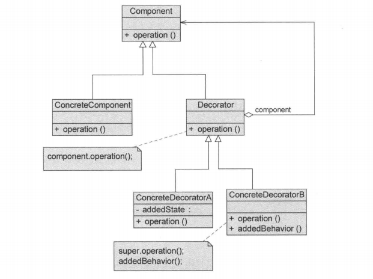
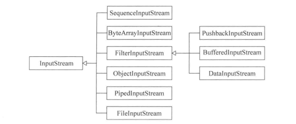
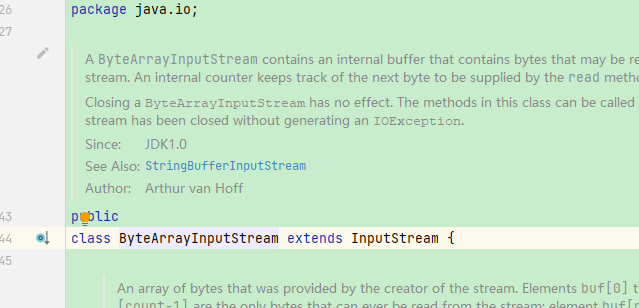
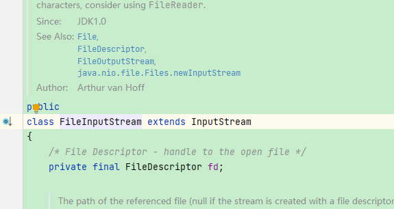
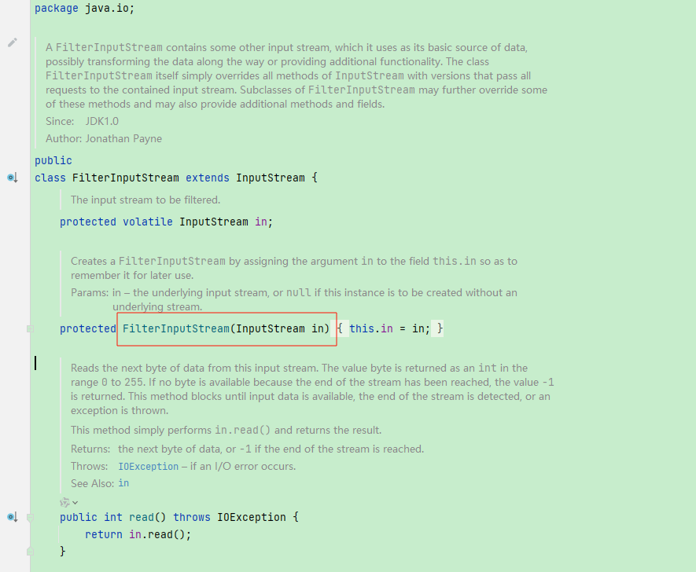
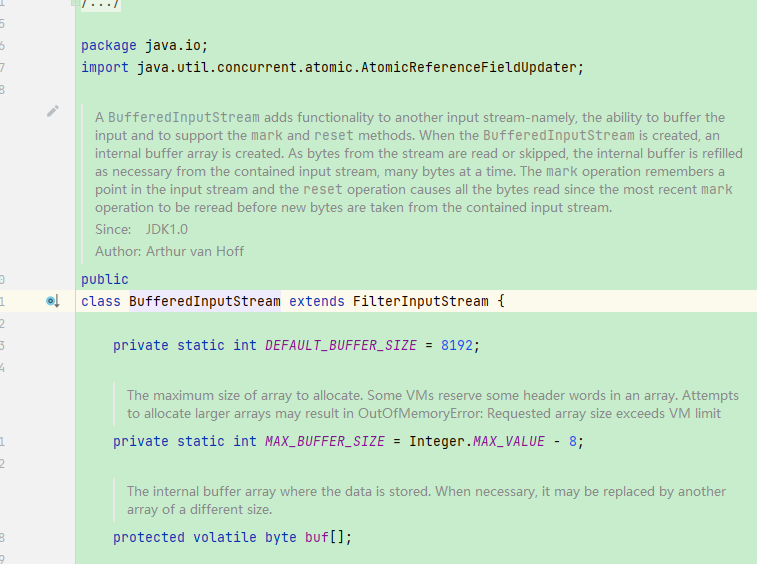
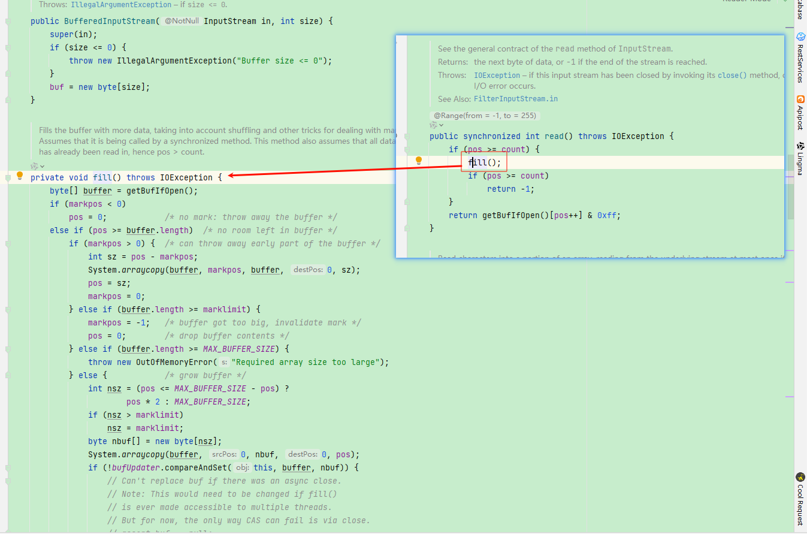

## 引入

### 示例背景：文本输出功能的增强

假设系统中有一个**最基础的文本输出功能**：

> 将字符串输出到某个目标（控制台 / 文件 / 网络）

这是一个**非常稳定的核心能力**。

------

### 最原始的需求

最开始，系统只需要：

- 输出原始文本

这时一个简单的实现就足够了。

------

### 需求开始演化

随着业务发展，对“输出”提出了**一系列可选且可组合的增强需求**：

- 输出前 **增加时间戳**
- 输出前 **进行加密**
- 输出时 **追加日志记录**
- 输出时 **做缓存 / 缓冲**
- 输出时 **格式化文本**

⚠️ **注意：**

- 这些功能**不是必选**
- 可能 **任意组合**
- 组合顺序**可能影响结果**

例如：

- 时间戳 → 加密 → 输出
- 加密 → 输出（不需要时间戳）
- 缓冲 → 格式化 → 日志 → 输出

## 传统方法实现

​	开始时，需求非常简单，直接采用继承实现即可。

然后

- 加入对文本加密需求，新增一个类
- 加入附带时间戳输出需求，新增一个类
- 时间戳+加密，新增一个类，且需要将上述两个类重复写一遍

如果再加一个需求：

- 输出时记录日志

你将被迫继续创建：

- `LogTextOutput`
- `TimestampLogTextOutput`
- `EncryptLogTextOutput`
- `TimestampEncryptLogTextOutput`
- `TimestampEncryptLogBufferedTextOutput`
- ……

⚠️ **每增加一个功能，组合数量指数级增长**。

~~~ java
// 抽象接口
public abstract class TextOutput {
    public abstract void output(String text);
}
// 输出原始文本
public class SimpleTextOutput extends TextOutput {
    @Override
    public void output(String text) {
        System.out.println(text);
    }
}
// 加密信息
public class EncryptTextOutput extends SimpleTextOutput {
    @Override
    public void output(String text) {
        String encrypted = encrypt(text);
        super.output(encrypted);
    }
    private String encrypt(String text) {
        return "ENC(" + text + ")";
    }
}
// 附带时间戳
public class TimestampTextOutput extends SimpleTextOutput {
    @Override
    public void output(String text) {
        String newText = "[" + System.currentTimeMillis() + "] " + text;
        super.output(newText);
    }
}
// 时间戳 + 加密
public class TimestampEncryptTextOutput extends SimpleTextOutput {
    @Override
    public void output(String text) {
        String withTimestamp = "[" + System.currentTimeMillis() + "] " + text;
        String encrypted = encrypt(withTimestamp);
        super.output(encrypted);
    }

    private String encrypt(String text) {
        return "ENC(" + text + ")";
    }
}
~~~

## 装饰器模式实现

### 传统方法分析

​	在传统实现中，通过**继承**的方式对原有功能进行扩展，看似直观且符合面向对象的直觉：

​	当需要新增功能时，创建一个子类，在原有行为基础上进行增强。

​	然而，当系统中的增强功能**并非单一，而是多个可选、可组合的职责**时，这种基于继承的扩展方式很快就会暴露出结构性问题。

#### 问题

**1、子类数量爆炸**

​	每一种“功能组合”都需要定义一个新的子类，新增功能并不是线性叠加，而是产生**组合级别的增长**。

​	**功能一多，类层级迅速失控，维护成本急剧上升。**

**2、职责被固化在类型层级中**

- 功能的组合顺序在编译期就被写死
- 无法在运行期灵活调整增强行为
- 若想改变顺序或裁剪某个功能，只能重新定义新的子类

这使得**类型层级承担了本应由运行期决定的变化**。

**3、单个职责无法独立复用**

- 相同的增强逻辑（如加密、时间戳）散落在多个子类中
- 同一职责被重复实现，违反“单一职责”的直觉
- 修改某个增强逻辑，需要同时修改多个类

增强行为无法作为**独立的、可复用的单元存在**。

**4、继承承担了不该承担的责任**

​	继承本应表达的是一种 **is-a 关系**，但在该方案中却被用于描述：

> “这个类 **拥有** 某些增强职责”

即通过继承来表达 **has-a 的职责组合关系**，这是一种明显的设计异味（Design Smell）。

#### 优化思路

从需求本身来看：

- 核心功能“文本输出”始终保持不变
- 变化的只是**在输出前后附加的一些可选操作**

如果继续使用继承，将所有增强行为堆叠在类型层级中：

- 新需求的叠加会导致类数量指数级增长
- 任一增强逻辑的修改，都会波及大量子类

因此，更合理的做法是：

> 将这些“增强职责”从类型层级中拆解出来，
>  使其成为可以在运行期**动态组合、按需叠加**的独立对象。

这正是引入**装饰器模式**的动机。

#### 总结

传统继承方案在该场景下失败的根本原因并不在于实现细节，而在于**变化点判断失误**：

> 系统中真正变化的不是“对象的类型”，
>  而是“对象所承担的职责”。

当职责具有**可选性、可组合性和顺序敏感性**时，将职责固化到继承体系中必然导致：

- 类型膨胀
- 复用困难
- 扩展受限

装饰器模式通过**对象组合代替继承**，将职责从类型层级中解耦出来，为后续的动态扩展提供了结构基础。

### 定义

​	装饰器模式（Decorator Pattern）是一种**结构型设计模式**，它通过对象组合的方式，在**不改变原有对象接口的前提下**，为对象**动态地添加额外职责**。

#### **类图：**

​	装饰器模式的核心结构特点在于：**装饰器与被装饰对象拥有相同的抽象父类，同时内部持有一个该抽象类型的引用**，从而在类型层面对客户端保持透明。



#### **角色说明：**

**1、Component（抽象构件）**

​	抽象构件定义了系统中**稳定不变的对外接口**，是具体构件和装饰器的**共同父类**。

- 声明了客户端所依赖的业务方法
- 保证了装饰前后对象在类型上的一致性
- 使客户端能够以统一的方式使用原始对象和装饰后的对象

> 抽象构件的引入，是实现**“对客户端透明”**的关键。

**2、ConcreteComponent（具体构件）**

​	具体构件是抽象构件的直接实现，它定义了系统中**最核心、最基础的功能**，不包含任何增强逻辑。

- 实现抽象构件中声明的方法
- 作为被装饰的原始对象存在
- 不感知装饰器的存在

> 具体构件只关注自身职责，增强行为通过装饰器在外部完成。

**3、Decorator（抽象装饰类）**
	抽象装饰类同样继承自抽象构件，并在内部维护一个**指向抽象构件的引用**。

- 在类型上与具体构件保持一致
- 在结构上通过组合关联被装饰对象
- 将“装饰行为”从具体构件中解耦出来

抽象装饰类本身通常不实现具体增强逻辑，而是为其子类提供统一的扩展入口。

> 它是装饰器模式中实现： **“is-a + has-a” 结构的关键角色**。

**4、ConcreteDecorator（具体装饰类）**

​	具体装饰类是抽象装饰类的子类，负责在调用被装饰对象原有行为的基础上，**附加新的职责**。

- 每一个具体装饰类通常只关注一种增强行为
- 可以在调用前后插入额外逻辑
- 多个装饰器可以相互嵌套，形成装饰链

> 装饰器的可叠加性，正是通过多个具体装饰类的组合实现的。

### 源码

**1、Component（抽象构件）**

~~~ java
/**
 * @author: gj
 * @description: Component（抽象构件）,对外接口
 */
public interface TextOutput {
    /**
     * 文本输出
     */
    void output(String text);
}
~~~

**2、ConcreteComponent（具体构件）**

~~~ java
/**
 * @author: gj
 * @description: ConcreteComponent（具体构件）:简单文本输出实现
 */
public class SimpleTextOutput implements TextOutput {
    @Override
    public void output(String text) {
        System.out.println(text);
    }
}

~~~

**3、Decorator（抽象装饰类）**

~~~ java
/**
 * @author: gj
 * @description: Decorator（抽象装饰类）
 */
public abstract class AbstractTextOutput implements TextOutput {
    private TextOutput textOutput;
    public AbstractTextOutput(TextOutput textOutput) {
        this.textOutput = textOutput;
    }
    @Override
    public void output(String text) {
        // 调用基础构件实现
        textOutput.output(text);
    }
}
~~~

**4、ConcreteDecorator（具体装饰类）**

~~~ java
/**
 * @author: gj
 * @description: ConcreteDecorator（具体装饰类）:加密
 */
public class EncryptTextOutput extends AbstractTextOutput {
    public EncryptTextOutput(TextOutput textOutput) {
        super(textOutput);
    }
    @Override
    public void output(String text) {
        String encrypted = encrypt(text);
        super.output(encrypted);
    }
    private String encrypt(String text) {
        return "ENC(" + text + ")";
    }
}
/**
 * @author: gj
 * @description: ConcreteDecorator（具体装饰类）：时间戳
 */
public class TimestampTextOutput extends AbstractTextOutput {
    public TimestampTextOutput(TextOutput textOutput) {
        super(textOutput);
    }
    @Override
    public void output(String text) {
        String newText = "[" + System.currentTimeMillis() + "] " + text;
        super.output(newText);
    }
}

~~~

**5、客户端**

​	注意，关键点在于客户端，一个具体装饰类只需要实现一种增强。多个组合（例如对象`timestampEncryptTextOutput`）是在运行期进行的，不需要在编译器创建新的类。

注意，在装饰器的使用上，有一些区别：

- 透明式装饰器：客户端完全依赖接口（TextOutput）

- 半透明式装饰器：客户端依赖具体 Decorator 类型（通常是为了使用新增能力）

~~~ java
/**
 * @author: gj
 * @description: 客户端
 */
public class Client {
    // 透明式
    public static void fun1(){
        String msg = "hello world";
        TextOutput textOutput = new SimpleTextOutput();
        textOutput.output(msg);
        TextOutput timestampTextOutput = new TimestampTextOutput(textOutput);
        timestampTextOutput.output(msg);
        TextOutput encryptTextOutput = new EncryptTextOutput(textOutput);
        encryptTextOutput.output(msg);
        // 注意：时间+加密的组合是在运行期期间创建的，而不是在编译期创建的，这样一个类一个增强职责，且可以复用
        TextOutput timestampEncryptTextOutput =
                new EncryptTextOutput(
                        new TimestampTextOutput(
                                new SimpleTextOutput()
                        )
                );
        timestampEncryptTextOutput.output(msg);
    }

    // 半透明式
    public static void fun2(){
        String msg = "hello world";
        TextOutput textOutput = new SimpleTextOutput();
        textOutput.output(msg);
        TimestampTextOutput timestampTextOutput = new TimestampTextOutput(textOutput);
        timestampTextOutput.output(msg);
        EncryptTextOutput encryptTextOutput = new EncryptTextOutput(textOutput);
        encryptTextOutput.output(msg);
        // 注意：时间+加密的组合是在运行期期间创建的，而不是在编译期创建的，这样一个类一个增强职责，且可以复用
        TextOutput timestampEncryptTextOutput =
                new EncryptTextOutput(
                        new TimestampTextOutput(
                                new SimpleTextOutput()
                        )
                );
        timestampEncryptTextOutput.output(msg);
    }
}
~~~

## 思考

### 1、两种使用区别

​	装饰器模式在结构上只有一种，但在**客户端的使用方式上**，通常可以分为透明式和半透明式两种。

#### （1）透明式装饰器

透明式装饰器中，客户端**始终面向抽象构件（接口）编程**，不关心对象是否被装饰、被装饰了多少层。

- 装饰前后对象在**类型上完全一致**
- 客户端无需感知增强逻辑的存在
- 可以自由替换、自由组合装饰器

这种方式的核心价值在于：

> **最大化系统的扩展性与可替换性**

但其代价是：

- 客户端无法访问装饰器中新增的能力
- 装饰器对客户端是“完全透明”的

因此，透明式更适合**基础能力增强、通用横切功能**的场景。

------

#### （2）半透明式装饰器

半透明式装饰器中，客户端**依赖具体的装饰类类型**，而不仅仅是抽象构件接口。

- 客户端可以显式使用装饰器新增的行为
- 装饰器不再对客户端完全透明
- 类型替换能力有所下降

这种方式本质上是一种**实用性取舍**：

> 用一定的类型耦合，换取对增强能力的可见性和可操作性

半透明式通常出现在：

- 客户端确实需要使用增强后的特定能力
- 增强行为本身是业务语义的一部分

需要注意的是：

> 半透明式并没有破坏装饰器的结构，只是降低了“透明性”。

------

#### （3）本质区别总结

两种方式的区别**不在于类图结构，而在于客户端的依赖层级**：

- 透明式：客户端 → 抽象构件
- 半透明式：客户端 → 具体装饰类

这是**使用方式的差异，而不是模式实现的差异**。

### 2、具体体现了那些设计原则

| 设计原则             | 装饰器模式体现 | 说明                                                         |
| -------------------- | -------------- | ------------------------------------------------------------ |
| 开闭原则（OCP）      | ✅              | 对扩展开放，对修改关闭；新功能通过新增装饰类实现，不修改原有构件 |
| 单一职责原则（SRP）  | ✅              | 每个具体装饰类只关注一种增强职责（加密、时间戳等），职责拆分明确 |
| 合成复用原则（CARP） | ✅              | 优先使用对象组合而非类继承，运行期组合实现功能叠加           |
| 里氏替换原则（LSP）  | ✅              | 透明式装饰器中，装饰对象可替换原构件，客户端行为不变         |
| 依赖倒置原则（DIP）  | ✅              | 客户端依赖抽象接口，装饰器和具体构件都依赖抽象，变化点被隔离 |

### 3、装饰器模式 vs 适配器模式

| 维度           | 装饰器模式                             | 适配器模式                                         |
| -------------- | -------------------------------------- | -------------------------------------------------- |
| 目的           | 动态增强对象功能，添加额外行为         | 将一个接口转换成客户端期望的接口，使不兼容接口协作 |
| 依赖关系       | 装饰器依赖抽象接口，组合具体构件       | 适配器依赖被适配类，实现目标接口                   |
| 增强 vs 兼容   | 增强对象功能                           | 保持功能不变，实现兼容                             |
| 对客户端透明性 | 透明式可完全透明，半透明可暴露增强能力 | 对客户端一般是半透明，客户端必须通过目标接口使用   |
| 实现方式       | 组合 + 接口实现                        | 组合或继承 + 接口适配                              |
| 灵活性         | 高，可多层嵌套组合                     | 一般只做一次适配，不叠加功能                       |
| 应用场景       | 需求组合、动态增强、避免子类爆炸       | 现有类接口不兼容，需要统一调用方式                 |

## 优缺点

### 优点

1. **比继承更灵活**
   装饰器模式和继承都能扩展对象功能，但装饰器通过组合的方式提供了比继承更高的灵活性，不需要为每种功能组合创建子类。
2. **动态扩展功能**
    可以在运行时选择不同的装饰器组合，甚至通过配置文件决定对象行为，实现动态、可配置的功能扩展。
3. **多组合能力强**
    不同具体装饰类可以任意组合装饰同一对象，从而得到多种功能叠加效果，而不增加类层级数量。
4. **符合开闭原则**
    具体构件类和具体装饰类可以独立变化，新增功能只需增加新的具体装饰类或构件类，原有代码无需修改。

------

### 缺点

1. **对象和类数量增加**
   系统中会产生许多小对象，这些对象的差异在于它们的组合方式，而非自身属性。同时需要定义多个具体装饰类，增加了系统复杂度，提高学习和理解成本。
2. **调试较复杂**
   由于装饰器可以多层嵌套，功能叠加路径在运行时动态形成，排查多层装饰对象的问题可能需要逐层分析，调试相对繁琐。

## 适用场景

装饰器模式适用于以下情况：

1. **动态、透明地给单个对象添加职责**
   - 需要在不影响其他对象的情况下，对某个对象增加新的功能。
   - 功能的添加和移除可以在运行时动态完成。
2. **功能可组合或可撤销**
   - 对象的增强功能可能有多种组合方式。
   - 可以在运行期自由组合多个装饰器，实现不同的行为效果。
3. **继承不适用或不利于扩展**
   - 当继承会导致子类数量爆炸时（每种功能组合都需要一个子类）。
   - 当类不可继承（如 `final` 类）或继承不利于系统维护时。

> 核心思想：装饰器模式通过**运行期组合对象**，解决了继承方案在功能扩展上的局限性，同时保证了系统的灵活性和可维护性。

## 应用

### 1、JDK源码中的应用：java.io 包的 I/O 流

- **核心思想**：`InputStream` / `OutputStream` 系列通过装饰器模式实现功能增强。

- **结构**：

  - `InputStream` / `OutputStream` → 抽象构件（Component）
  - `FileInputStream` / `FileOutputStream` → 具体构件（ConcreteComponent）
  - `BufferedInputStream` / `DataInputStream` → 具体装饰类（ConcreteDecorator）

- **特点**：

  - 每个装饰器只实现一个增强功能（如缓冲、数据类型转换、加密等）。

  - 可以在运行期自由组合：

    ```
    InputStream in = new BufferedInputStream(
                         new DataInputStream(
                             new FileInputStream("test.txt")));
    ```

  - 避免了为每种功能组合创建子类，实现了**动态增强和灵活复用**。

- **价值**：

  - 充分体现透明式装饰器（客户端依赖 `InputStream` 接口）。
  - 满足开闭原则、单一职责原则和组合复用原则。

### 代码分析：



**1、Component（抽象构件）**

​	对应`java.io.InputStream`接口，其定义类一系列的read()方法。

**2、ConcreteComponent（具体构件）**

​	具体构件有多个实现：

| 类   | 作用 | 图                                                      |
| ---- | ---- | ------------------------------------------------------- |
|  `ByteArrayInputStream`  |  字节输入流  |  |
|   `FileInputStream`   |   文件输入流   |  |

**3、Decorator（抽象装饰类）**

`java.io.FilterInputStream`:

​	对于FilterInputStream类，它也是InputStream的子类，但是它的构造函数需要传递一个InputStream对象的引用，并且它将保存对此对象的引用，其代码片段如下：

​	如果没有具体的InputStream对象，我们将无法创建FilterInputStream。

​	由于其中定义的in对象既可以是指向FilterInputStream类型的引用，也可以是指向FileInputStream、ByteArrayInputStream等具体类型的引用，因此可以使用多层嵌套的方式，为某个对象添加多种装饰，这是透明装饰模式的应用。

​	它的read方法直接调用了传入类的read方法，没用进行任何装饰处理，所以本质上其就是抽象装饰类 ，其子类需要覆盖相关方法达到装饰的目的。



**4、ConcreteDecorator（具体装饰类）**

`java.io.BufferedInputStream`  :

​	提供了一个缓存机制，它使用一个数组作为数据读人的缓冲区，如可以将数据先从文件一次读入到一个数组中，再将数组中的数据读人到程序中，这样可以减少对文件操作的次数。

​	BufferedInputStream继承了FilterInputStream，并且覆盖了父类的read（）方法，在调用输人流读取数据前都会检查缓存是否已满，如果未满且文件未结束，则不进行读取，这样就实现了对输人流对象动态的添加新功能的目的，在此处的新功能即为缓冲控制。





### 2、业务上的最佳实践：日志/审计功能增强

- **场景**：

  - 系统中多个服务或模块需要输出日志、加密敏感信息或记录操作审计。
  - 功能组合多样化：有些需要加密+日志，有些需要时间戳+审计，有些仅日志。

- **实现方式**：

  - 定义统一接口 `MessageProcessor` → Component

  - 基础实现 `SimpleMessageProcessor` → ConcreteComponent

  - 具体装饰类：

    - `EncryptDecorator` → 增加加密功能
    - `TimestampDecorator` → 增加时间戳
    - `AuditDecorator` → 记录审计日志

  - 客户端在运行期根据需求组合：

    ```
    MessageProcessor processor = new AuditDecorator(
                                    new TimestampDecorator(
                                        new EncryptDecorator(
                                            new SimpleMessageProcessor()
                                        )
                                    ));
    processor.process(msg);
    ```

- **价值**：

  - 每个增强职责独立封装，复用性高。
  - 可以自由组合，避免了继承方式下子类爆炸问题。
  - 符合开闭原则和单一职责原则，易于扩展和维护。

