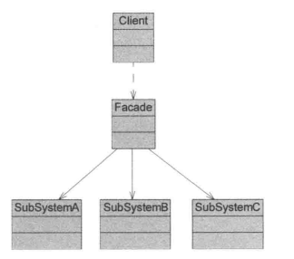

## 引入

在企业级系统中，经常会遇到这样一类需求：

> **对外提供一个看似简单的业务能力，但其内部需要协调多个子系统完成**

例如：

- 下单
- 支付
- 发货
- 发送通知

从业务角度看，这可能只是一个：

> “创建订单”的操作

但从系统内部看，它往往涉及多个模块、多个服务，甚至多个基础设施组件。

## 传统方法实现

在系统早期，最直接、也最容易想到的做法是：

> **在调用方中，按顺序显式调用各个子系统**

例如（逻辑层面）：

- 校验参数
- 调用订单系统
- 调用库存系统
- 调用支付系统
- 调用通知系统

这种方式的优点是显而易见的：

- 实现简单
- 调用流程清晰
- 不需要额外抽象

在需求刚出现、系统规模较小时，这种实现方式**完全合理**。

**代码：**

~~~ java
// 四个服务
// 订单
public class OrderService {
    public void createOrder(){
        System.out.println("创建订单");
    }
}
// 支付
public class PaymentService {
    public boolean pay() {
        System.out.println("支付成功！");
        return true;
    }
}
// 库存
public class InventoryService {
    public boolean reduceInventory() {
        // 模拟库存服务
        System.out.println("减少库存");
        return true;
    }
}
// 通知
public class NoticeService {
    public void sendNotice() {
        System.out.println("订单已发货");
    }
}
// 客户端
// 管理后台
public class AdminClient {
    private OrderService orderService = new OrderService();
    private InventoryService inventoryService = new InventoryService();
    private PaymentService paymentService = new PaymentService();
    private NoticeService noticeService = new NoticeService();
    public void createOrder() {
        // 1、创建订单
        orderService.createOrder();
        // 2、付款
        paymentService.pay();
        // 3、扣减库存
        inventoryService.reduceInventory();
        // 4、发送通知
        noticeService.sendNotice();
    }
}
// 定时任务
public class JobClient {
    private OrderService orderService = new OrderService();
    private InventoryService inventoryService = new InventoryService();
    private PaymentService paymentService = new PaymentService();
    private NoticeService noticeService = new NoticeService();
    public void createOrder() {
        // 1、创建订单
        orderService.createOrder();
        // 2、付款
        paymentService.pay();
        // 3、扣减库存
        inventoryService.reduceInventory();
        // 4、发送通知
        noticeService.sendNotice();
    }
}
// web端
public class WebClient {
    private OrderService orderService = new OrderService();
    private InventoryService inventoryService = new InventoryService();
    private PaymentService paymentService = new PaymentService();
    private NoticeService noticeService = new NoticeService();
    public void createOrder() {
        // 1、创建订单
        orderService.createOrder();
        // 2、付款
        paymentService.pay();
        // 3、扣减库存
        inventoryService.reduceInventory();
        // 4、发送通知
        noticeService.sendNotice();
    }
}
~~~

## 外观模式实现

### 传统方法分析

### 问题

​	随着业务发展，新的需求出现了。

例如：

- 支付阶段需要新增 **风控参数**：来源于订单信息 + 用户信息
- 发货阶段需要区分 **虚拟商品 / 实体商品**：参数结构发生变化
- 通知服务需要支持 **多渠道推送**：邮件 / 短信 / 站内信

这些变化的共同特点是：

- **业务语义没有改变**：仍然是“创建订单”
- 但**子系统的调用方式发生了变化**
  - 方法签名调整
  - 参数结构变化
  - 调用顺序可能需要微调

问题：

1、在当前结构下，这类变化会直接导致，三类客户端都需要改动，重新理解参数变化、重新测试完整流程

2、即使改动本身并不复杂，**影响面却极其广泛**。

3、同一套流程逻辑被**重复实现多次**

4、任意一个步骤的变动，都可能影响所有客户端

#### 优化：

​	分析，系统缺少一个统一承载“创建订单”这一业务语义的结构单元。

​	换句话说：**“创建订单”这个业务语义，并不存在于系统结构中，而是分散在多个客户端代码里。**

​	因此，可以设立一个统一的系统入口，将创建订单的操作封装起来，给客户端提供一个统一的入口。

### 定义

类图：

​	

角色分析：

1、`Facade`（外观角色）

​	在客户端可以调用这个角色的方法，在外观角色中可以知道相关的（一个或者多个）子系统的功能和责任；

​	在正常情况下，它将所有从客户端发来的请求委派到相应的子系统去，传递给相应的子系统对象处理。

2、`SubSystem`（子系统角色）

​	在软件系统中可以同时有一个或者多个子系统角色，每一个子系统可以不是一个单独的类，而是一个类的集合，它实现子系统的功能；

​	每一个子系统都可以被客户端直接调用，或者被外观角色调用，它处理由外观类传过来的请求；

​	子系统并不知道外观的存在，对于子系统而言，外观仅仅是另外一个客户端而已。

### 源码

1、引入`OrderFacade`，由外观类完成订单的创建流程等操作

2、其他客户端不需要依赖大量的子系统服务，只需要依赖系统门面服务即可

​	这样，如果出现了流程调整，参数修改等需求，只需要改造外观类即可（各类参数信息理论上都是放到上下文内），对于其他模块几乎无感。

~~~ java
// 外观类：订单门面
public class OrderFacade {
    private OrderService orderService = new OrderService();
    private InventoryService inventoryService = new InventoryService();
    private PaymentService paymentService = new PaymentService();
    private NoticeService noticeService = new NoticeService();
    public void createOrder() {
        // 1、创建订单
        orderService.createOrder();
        // 2、付款
        paymentService.pay();
        // 3、扣减库存
        inventoryService.reduceInventory();
        // 4、发送通知
        noticeService.sendNotice();
    }
}
// 管理后台
public class AdminClient {
    private OrderFacade orderFacade = new OrderFacade();
    public void createOrder() {
        orderFacade.createOrder();
    }
}
// 定时任务
public class JobClient {
    private OrderFacade orderFacade = new OrderFacade();
    public void createOrder() {
        orderFacade.createOrder();
    }
}
// Web 控制层
public class WebClient {
    private OrderFacade orderFacade = new OrderFacade();
    public void createOrder() {
        orderFacade.createOrder();
    }
}
~~~

## 思考

​	外观模式本身并不复杂，但它背后体现的设计思想却非常典型。如果只把它理解为“加一层封装”，会低估这个模式真正解决的问题。

​	从设计思想和模式对比两个角度来看，外观模式的价值会更加清晰。

### 一、对核心设计思想的体现

#### 1. 对「单一职责原则（SRP）」的体现

表面上看，外观类往往会“做很多事”：

- 创建订单
- 调用支付
- 扣减库存
- 发送通知

这很容易让人产生疑问：**外观模式是不是违背了单一职责？**

关键在于如何理解“职责”。

- 子系统的职责是：**完成某一类具体业务能力**
- 外观类的职责是：**对外提供一个稳定、简化的业务入口**

外观类并不关心：

- 支付是如何实现的
- 库存如何扣减
- 通知如何发送

它只关心一件事：

> **如何把多个子系统组合成一个对外可用的业务语义**

从这个角度看，外观类的职责是**高度单一的**，并没有违反 SRP。

------

#### 2. 对「接口隔离原则（ISP）」的体现

在没有外观模式的情况下：

- 客户端往往需要依赖多个子系统接口
- 即使客户端只想“创建订单”，也被迫了解：
  - 支付接口
  - 库存接口
  - 通知接口

这实际上是一种**接口污染**。

引入外观模式后：

- 客户端只依赖一个高层接口
- 不再关心子系统的细节和变化

外观模式并不是让接口“更细”，而是让接口**更贴近客户端真实需求**。

------

#### 3. 对「依赖倒置原则（DIP）」的弱体现

外观模式并不会天然引入抽象接口，但它在结构上已经完成了一次**依赖方向的收敛**：

- 多个客户端 → 依赖 Facade
- Facade → 依赖具体子系统

相比客户端直接依赖多个子系统：

- 依赖关系更加集中
- 变化的扩散路径被明显压缩

在实际项目中，Facade 往往会进一步配合接口、依赖注入框架使用，从而更好地满足 DIP。

## 优缺点

​	外观模式的结构非常简单，但它并不是“只有优点没有代价”的模式。理解它的优势之前，必须先接受一个前提：

> **外观模式是在“控制复杂度”和“牺牲灵活性”之间做出的权衡。**

### 优点

#### 1. 显著降低系统使用复杂度

这是外观模式最直接、也是最核心的价值。

在没有外观模式的情况下：

- 客户端需要了解多个子系统
- 需要掌握调用顺序
- 需要处理子系统之间的协作关系

引入外观模式后：

- 客户端只面对一个统一入口
- 复杂的调用细节被封装在系统内部
- 系统的“使用成本”显著降低

尤其在以下场景中，这一点非常明显：

- 多客户端共用同一套业务能力
- 对外提供 SDK、API、服务能力

------

#### 2. 有效控制变化的扩散范围

外观模式并不能消灭变化，但它可以**改变变化传播的路径**。

当变化集中在以下方面时：

- 子系统调用顺序调整
- 参数组织方式变化
- 新子系统的引入或替换

引入外观模式后：

- 变化往往只需要在 Facade 内部消化
- 客户端几乎不需要感知这些变化

这使得系统在演进过程中：

- 修改成本更可控
- 回归测试范围更小
- 架构稳定性更高

------

#### 3. 强化系统的业务语义边界

在传统实现中，“创建订单”往往只是：

> 一段散落在多个客户端中的调用流程

引入外观模式后：

- 业务语义第一次成为一个**明确存在的结构单元**
- 系统对外暴露的是“做什么”，而不是“怎么做”

这对于：

- 代码可读性
- 新成员理解系统
- 架构文档与代码的一致性

都有非常明显的正向作用。

------

#### 4. 对客户端友好，降低心智负担

外观模式让客户端：

- 不再关心系统内部的组织结构
- 不需要随着系统演进频繁调整代码

客户端关注点被强制收敛到：

> **“我要完成什么业务”**

而不是：

> “我需要调用哪些系统、按什么顺序调用”。

### 缺点

#### 1. 可能隐藏系统真实复杂度

外观模式通过封装隐藏复杂性，但这也带来一个副作用：

- 系统内部依然复杂
- 复杂度只是被“挪走”，而不是消失

当 Facade 设计不当时：

- 调试问题变得困难
- 排查问题需要频繁“穿透外观”

尤其在异常处理、事务控制较复杂的场景下，这一点会被放大。

------

#### 2. Facade 容易膨胀，变成“上帝类”

随着业务发展，外观类常见的演化路径是：

- 初期：只负责流程编排
- 中期：开始承载部分判断逻辑
- 后期：逐渐堆积条件分支和业务细节

一旦 Facade 承担了过多职责：

- 可维护性下降
- 修改风险上升
- 反而成为系统中的“变化热点”

这也是外观模式在实践中**最需要警惕的问题**。

------

#### 3. 降低客户端的灵活性

外观模式为客户端提供的是：

- **“通用路径”**
- **“标准流程”**

但当客户端需要：

- 跳过某些步骤
- 定制特殊流程
- 精细控制子系统行为

时，外观接口可能会变得不够用。

此时往往需要：

- 扩展 Facade 接口
- 或允许部分客户端绕过 Facade 直接访问子系统

这本身并不是错误，而是外观模式的天然取舍。

------

#### 4. 不适合高频变化的核心业务逻辑

如果某个业务流程：

- 本身变化非常频繁
- 规则高度动态
- 依赖大量上下文判断

那么强行使用外观模式：

- Facade 会迅速复杂化
- 修改成本并不会真正降低

外观模式更适合：

> **业务语义稳定，但实现复杂的场景**

而不适合：

> **业务规则本身高度不稳定的核心领域逻辑**

## 适用场景

外观模式并不是为了“减少代码量”，而是为了**控制复杂性扩散的方向**。

当系统复杂度已经不可避免地产生时，外观模式用于**将复杂性限制在系统内部，而不是让其向客户端蔓延**。

综合实践经验，外观模式主要适用于以下场景。

### 1、为复杂子系统提供一个简单、统一的对外接口

当系统内部由多个子系统协作完成某个业务功能时：

- 子系统数量多
- 调用顺序固定或半固定
- 参数在子系统之间流转
- 对外却只体现为一个业务动作

此时，可以使用外观模式，为整个子系统群提供一个**高层接口**。

这个接口：

- 覆盖 **大多数客户端的使用场景**
- 封装内部子系统的协作细节
- 对客户端暴露稳定、易理解的业务语义

需要强调的是：

> 外观模式并不强制“禁止”客户端直接访问子系统。
> 当有特殊需求时，客户端仍然可以绕过外观，直接使用子系统能力。

因此，外观模式提供的是：

- **默认路径**（推荐使用）
- 而非**唯一通路**

这使得系统在“简化使用”和“保留灵活性”之间取得平衡。

------

### 2、客户端与多个子系统存在强耦合，且依赖关系不断扩散

当出现以下现象时，往往意味着可以考虑引入外观模式：

- 客户端直接依赖多个子系统
- 同一套业务流程在多个客户端中重复实现
- 子系统接口或参数发生变化时，需要修改大量客户端代码

此时的问题并不在于某一个子系统设计得不好，而在于：

> **客户端承担了本应由系统内部负责的协调职责。**

引入外观模式后：

- 客户端只依赖外观类
- 子系统之间的协作关系被集中管理
- 子系统可以在不影响客户端的情况下独立演进

这带来的直接收益是：

- 降低客户端与子系统之间的耦合度
- 提高子系统的独立性与可移植性
- 缩小变更的影响范围

------

### 3、在分层架构中，为每一层提供清晰、稳定的访问入口

在层次化系统结构中（如：表现层 / 应用层 / 领域层 / 基础设施层）：

- 上层不应直接感知下层的复杂实现
- 层与层之间应通过清晰的边界进行交互

外观模式可以用于：

> **为某一层定义统一的访问入口（Layer Facade）**

通过外观类：

- 层与层之间不再直接依赖多个具体类
- 只通过外观建立联系
- 有效降低层间耦合

在这种场景下，外观模式的价值不在于“封装几个方法”，而在于：

- 强化系统的分层边界
- 防止依赖关系跨层蔓延
- 让架构约束在代码层面“落地”

## 应用

### Spring 源码中的经典应用：`JdbcTemplate`

#### 1、背景：原生 JDBC 的复杂性

在没有 `JdbcTemplate` 之前，使用 JDBC 进行一次数据库查询，通常需要客户端完成如下步骤：

- 获取数据库连接
- 创建 `Statement / PreparedStatement`
- 绑定参数
- 执行 SQL
- 解析 `ResultSet`
- 处理异常
- 关闭资源（ResultSet / Statement / Connection）

即便只是一次简单的查询，客户端代码也往往呈现出：

- **样板代码大量重复**
- **调用顺序严格且容易出错**
- **异常处理与业务逻辑强耦合**
- **资源释放高度依赖人工规范**

本质上，这是一种典型的“**子系统复杂性直接暴露给客户端**”的问题。

------

#### 2、问题本质分析

从设计角度看，JDBC 的问题并不在于功能不足，而在于：

- JDBC API 本身是一个**低层子系统集合**
  - `DataSource`
  - `Connection`
  - `Statement`
  - `ResultSet`
- 客户端必须理解并正确协调这些对象
- **一次数据库操作的业务语义（如“查询一条记录”）并未在结构中体现**

这与前面“创建订单”示例中的问题完全一致：

> 业务语义清晰，但实现步骤被迫散落在客户端中。

------

#### 3、JdbcTemplate 的角色定位

`JdbcTemplate` 在 Spring 中扮演的正是**外观角色（Facade）**。

它对外提供的是一组：

- 高层次
- 面向业务语义
- 使用成本极低

的方法，例如：

- `query(...)`
- `queryForObject(...)`
- `update(...)`
- `execute(...)`

而在其内部，则封装并协调了 JDBC 的完整调用流程。

------

#### 4、结构映射（外观模式视角）

从外观模式的角度看，其角色对应关系非常清晰：

| 外观模式角色        | Spring JDBC 中的对应                                 |
| ------------------- | ---------------------------------------------------- |
| Facade（外观）      | `JdbcTemplate`                                       |
| SubSystem（子系统） | `DataSource`、`Connection`、`Statement`、`ResultSet` |
| Client（客户端）    | DAO / Repository 层代码                              |

关键点在于：

- 客户端 **只依赖 JdbcTemplate**
- JDBC 子系统的复杂协作 **被完全隐藏在外观内部**
- 子系统并不知道 `JdbcTemplate` 的存在，它只是“另一个调用者”

------

#### 5、对比示例

**使用 JdbcTemplate 之前（概念层面）：**

```
Connection conn = dataSource.getConnection();
PreparedStatement ps = conn.prepareStatement(sql);
ResultSet rs = ps.executeQuery();
// 手动解析
// 手动关闭资源
```

**使用 JdbcTemplate 之后：**

```
User user = jdbcTemplate.queryForObject(
    sql,
    new Object[]{id},
    new BeanPropertyRowMapper<>(User.class)
);
```

客户端关注点发生了本质变化：

- ❌ 不再关心连接、语句、结果集
- ❌ 不再关心异常与资源释放
- ✅ 只关心“我要查什么”和“结果映射成什么”

------

#### 6、为什么这是“标准的外观模式”

`JdbcTemplate` 之所以是一个**非常经典的外观模式案例**，原因在于：

1️⃣ **它没有增强 JDBC 的能力**

- 并未改变 JDBC 能做什么
- 只是改变了 *“如何使用”*

2️⃣ **它没有引入新的业务语义**

- 查询、更新仍然是 JDBC 的能力
- 只是将其包装为更易用的接口

3️⃣ **它的核心职责是“简化使用 + 隔离变化”**

- JDBC API 细节变化，对客户端影响极小
- 数据源、事务、异常策略都可以在外观内部演进

这正是外观模式的核心价值。