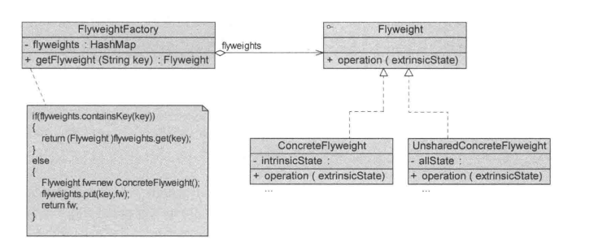
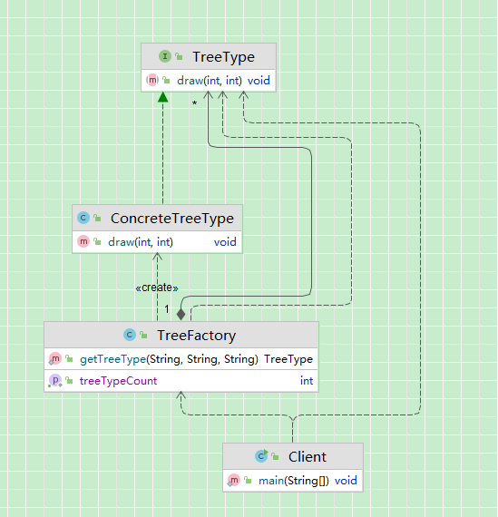

## 引入

​	现在有一个游戏系统，其中有一张森林类型的地图，地图中存在 10000 棵树，并且每棵树都可以进行实际交互。

​	在面向对象设计中，我们通常会将“一棵树”抽象为一个对象。

## 传统方法实现

​	每棵树都包含如下信息：

- 模型（mesh）
- 贴图（texture）
- 类型（type）
- 坐标（point）

因此，我们会创建 10000 个 Tree 对象来表示这 10000 棵树。

这是最符合直觉的建模方式 ：一棵树就是一个完整对象。

代码：

~~~java
// 坐标
public class Point {
    private int x;
    private int y;
}
// 树
public class Tree {
    private String mesh;
    private String texture;
    private String type;
    private Point point;
}
// 客户端
public class Client {
    public List<Tree> getTrees() {
        List<Tree> trees = new ArrayList<>();
        int n = 10000;
        for (int i = 0; i < n; i++) {
            // 后续根据需求获取模型，这里简化，且模型也简化为两种
            String mesh = i % 2 == 0 ? "大树模型" : "小树模型";
            // 后续根据需求获取贴图，这里简化，且贴图也简化为两种
            String texture = i % 2 == 0 ? "松树贴图" : "橡树贴图";
            // 后续根据需求获取类型，这里简化，且类型也简化为两种
            String type = i % 2 == 0 ? "松树" : "橡树";
            // 坐标
            Point point = new Point(i, i);
            trees.add(new Tree(mesh, texture, type, point));
        }
        return trees;
    }
}
~~~

## 享元模式实现

### 传统方法分析

在上述实现中：

- 地图中有 10000 棵树
- 因此会创建 10000 个 Tree 对象
- 每个对象都包含模型、贴图、类型等信息

进一步观察可以发现：

- 树的模型种类是有限的
- 贴图种类是有限的
- 类型种类是有限的
- 仅坐标不同

也就是说：

> 在 10000 个对象中，大量字段值是完全相同的。

### 问题

​	传统实现存在以下问题：

**1、对象数量过多**

​	系统中存在大量结构相似的对象。

**2、重复数据大量存在**

​	每个对象都保存一份模型、贴图、类型等信息，而这些数据实际上是可以共享的。

这会导致：

- 内存占用显著增加
- 对象创建成本增加
- 垃圾回收压力增大

**3、状态没有进行分离**

当前实现中：

- 可共享的状态
- 不可共享的状态

被混合在同一个对象中，无法复用。

#### 优化：

​	可以将树的状态拆分为两类：

**1、内部状态（可共享）**

- 模型
- 贴图
- 类型

这些状态：

- 不随环境变化
- 可在多个对象之间共享
- 可以抽取为一个独立类（TreeType）

**2、外部状态（不可共享）**

- 坐标

这些状态：

- 随具体实例变化
- 不适合共享
- 由客户端在使用时传入

**优化后的核心思想:**

- 将可共享状态抽离为享元对象（TreeType）
- 通过工厂统一管理 TreeType 的创建与缓存
- 相同类型的树只创建一次
- 坐标作为外部状态，在调用时传入

这样：

- 10000 棵树
- 可能只创建 2~3 个 TreeType 对象
- 大幅减少物理对象数量

#### 核心变化总结

​	这不是简单的“字段拆分”。而是：通过“状态分离 + 对象共享”,让大量逻辑对象映射到少量物理对象。

这样整理后：

- 逻辑更严谨
- 更贴近享元模式本质
- 为后续“定义”“类图”“源码分析”自然铺垫

| 传统实现           | 优化后           |
| ------------------ | ---------------- |
| 每棵树一个完整对象 | 共享树类型对象   |
| 重复存储模型和贴图 | 统一缓存         |
| 状态混合           | 内外状态分离     |
| 无复用机制         | 工厂管理共享对象 |

### 定义

​	运用共享技术有效地支持大量细粒度对象的复用。系统只使用少量的对象，而这些对象都很相似，状态变化很小，可以实现对象的多次复用。

​	由于享元模式要求能够共享的对象必须是细粒度对象，因此它又称为轻量级模式，它是一种对象结构型模式。

#### 类图：

#### 角色说明：

**1.Flyweight（抽象享元类）**

​	抽象享元类声明一个接口，通过它可以接受并作用于外部状态。

​	在抽象享元类中定义了具体享元类公共的方法，这些方法可以向外界提供享元对象的内部数据（内部状态），同时也可以通过这些方法来设置外部数据（外部状态）。

**2.ConcreteFlyweight（具体享元类）**

​	具体享元类实现了抽象享元接口，其实例称为享元对象；

​	在具体享元类中为内部状态提供了存储空间，由于具体享元对象必须是可以共享的，因此它所存储的状态必须是内部的，即它独立存在于自己的环境中。

​	可以结合单例模式来设计具体享元类，为每一个具体享元类提供唯一的享元对象。

**3.UnsharedConcreteFlyweight（非共享具体享元类）**

​	并不是所有的抽象享元类的子类都需要被共享，不能被共享的子类则设计为非共享具体享元类；

​	当需要一个非共享具体享元类的对象时可以直接通过实例化创建；

​	在某些享元模式的层次结构中，非共享具体享元对象还可以将具体享元对象作为子节点。

**4.FlyweightFactory（享元工厂类）**

​	享元工厂类用于创建并管理享元对象；

​	它针对抽象享元类编程，将各种类型的具体享元对象存储在一个享元池中，享元池一般设计为一个存储键值对的集合（也可以是其他集合类型），可以结合工厂模式进行设计；

​	当用户请求一个具体享元对象时，享元工厂提供一个存储在享元池中已创建的实例或者创建一个新的实例（如果不存在的话），返回该新创建的实例并将其存储在享元池中。

### 源码

类图：

代码：

~~~ java
/**
 * 抽象享元->Flyweight：将所有外部状态抽象为方法参数
 */
public interface TreeType {
    /**
     * 外部状态作为参数传入
     *
     * @param x 坐标x
     * @param y 坐标y
     */
    void draw(int x, int y);
}

/**
 * 具体享元-ConcreteFlyweight：保存内部状态（可共享）。
 * @author gj
 */
public class ConcreteTreeType implements TreeType {
    // 内部状态（可共享）
    private final String mesh;
    private final String texture;
    private final String type;
    public ConcreteTreeType(String mesh, String texture, String type) {
        this.mesh = mesh;
        this.texture = texture;
        this.type = type;
    }
    @Override
    public void draw(int x, int y) {
        // 模拟渲染
        System.out.println("渲染树 -> 类型：" + type +
                ", 模型：" + mesh +
                ", 贴图：" + texture +
                ", 坐标：(" + x + "," + y + ")");
    }
}

/**
 * 享元工厂-FlyweightFactory：负责缓存和创建共享对象。
 * @author gj
 */
public class TreeFactory {
    /**
     * 缓存池
     */
    private static final Map<String, TreeType> CACHE = new HashMap<>();

    public static TreeType getTreeType(String mesh, String texture, String type) {
        String key = mesh + "_" + texture + "_" + type;

        if (!CACHE.containsKey(key)) {
            CACHE.put(key, new ConcreteTreeType(mesh, texture, type));
        }

        return CACHE.get(key);
    }

    // 查看当前共享对象数量
    public static int getTreeTypeCount() {
        return CACHE.size();
    }
}

// 客户端
public class Client {

    public static void main(String[] args) {
        int n = 10000;
        for (int i = 0; i < n; i++) {
            String mesh = i % 2 == 0 ? "大树模型" : "小树模型";
            String texture = i % 2 == 0 ? "松树贴图" : "橡树贴图";
            String type = i % 2 == 0 ? "松树" : "橡树";
            TreeType treeType = TreeFactory.getTreeType(mesh, texture, type);
            int x = i;
            int y = i;
            // 直接使用共享对象 + 外部状态
            treeType.draw(x, y);
        }
        System.out.println("实际创建的树类型对象数量：" +
                TreeFactory.getTreeTypeCount());
    }
}
~~~

## 思考

### 一、享元模式的本质

​	享元模式的根本思想不是“共享对象”。

它的本质是：

> 将原本完整的对象拆分为【内部状态】与【外部状态】，
>  通过共享内部状态、外部状态外置，从而减少内存占用。

它解决的是：

> 大量细粒度对象中存在重复数据所导致的内存浪费问题。

**内部状态与外部状态**

| -                  | 内部状态                                                     | 外部状态                                                     |
| ------------------ | ------------------------------------------------------------ | ------------------------------------------------------------ |
| 含义               | 不随环境改变  可被多个对象共享  通常是重复出现的数据  存储在享元对象内部 | 随环境变化  不可共享  由客户端在使用时传入  不存储在享元内部 |
| 举例（上述树例子） | 模型（mesh）  贴图（texture）  类型（type） 这些属性：不会因为树的位置改变 多棵树可能完全相同 | 坐标（x, y）  当前血量  当前动画状态 它们不放在享元内部，而是：通过方法参数传入 |

### 二、非共享具体享元和复合享元

| -      | 非共享具体享元                                             | 符合享元                                                     |
| ------ | ---------------------------------------------------------- | ------------------------------------------------------------ |
| 结构   | 实现 Flyweight 接口  但不被缓存  每次单独创建    | 内部包含多个  Flyweight 形成树形结构  统一对外提供操作 |
| 意义   | 保持接口统一  支持组合结构  支持特殊不可共享对象 | 本质上是：享元模式 + 组合模式                                |
| 关注点 | 是否参与共享                                               | 是否共享                                                     |

### 三、对核心设计思想的体现

| 设计原则                   | 在享元模式中的体现                                           | 核心思想总结                     |
| -------------------------- | ------------------------------------------------------------ | -------------------------------- |
| 单一职责原则（SRP）        | 将对象拆分为内部状态与外部状态，内部状态由享元对象负责，外部状态由客户端维护 | 拆分职责，避免一个类承担过多变化 |
| 开闭原则（OCP）            | 新增享元类型只需扩展具体享元类或新增 key，不需要修改已有代码 | 通过抽象与工厂机制支持扩展       |
| 依赖倒置原则（DIP）        | 客户端依赖抽象 Flyweight，而不是具体实现类                   | 面向接口编程，隐藏具体实现       |
| 里氏替换原则（LSP）        | ConcreteFlyweight、UnsharedConcreteFlyweight、CompositeFlyweight 都可替换 Flyweight 使用 | 保证统一抽象下的可替换性         |
| 迪米特法则（最少知道原则） | 客户端通过工厂获取对象，而不是直接创建具体类                 | 降低耦合，隐藏创建细节           |

核心：

​	通过分离不变和可变的哲学思想，实现对象的共享复用，避免内存浪费。

## 优缺点

### 优点

（1）享元模式的优点在于它可以极大减少内存中对象的数量，使得相同对象或相似对象在内存中只保存一份。

（2）享元模式的外部状态相对独立，而且不会影响其内部状态，从而使得享元对象可以在不同的环境中被共享。

### 缺点

（1）享元模式使得系统更加复杂，需要分离出内部状态和外部状态，这使得程序的逻辑复杂化。

（2）为了使对象可以共享，享元模式需要将享元对象的状态外部化，而读取外部状态使得运行时间变长。

## 适用场景

（1）一个系统有大量相同或者相似的对象，由于这类对象的大量使用，造成内存的大量耗费。

（2）对象的大部分状态都可以外部化，可以将这些外部状态传人对象中。

（3）使用享元模式需要维护一个存储享元对象的享元池，而这需要耗费资源，因此，应当在多次重复使用享元对象时才值得使用享元模式。

## 应用

### JDK中String

~~~ java
 public static void main(String[] args) {
        String str1 = "abcd";
        String str2 = "abcd";
        String str3 = "ab" + "cd";
        String str4 = "ab";
        str4 += "cd";
        System.out.println(str1 == str2);
        System.out.println(str1 == str3);
        System.out.println(str1 == str4);
    }
// 输出：
true
true
false
~~~

​	在Java语言中，如果每次执行Stringstrl="abcd"操作时都创建一个新的字符串对象将导致内存开销很大。

​	因此如果第一次创建了内容为“abcd”的字符串对象str1，则下一次再创建内容相同的字符串对象str2时只需把它的引用指向“abcd”，无须重新分配内存，从而实现了“abcd"在内存中的共享。

​	可以看出，前两个输出语句均为true，说明strl、str2、str3在内存中引I用了相同的对象。

​	但是如果有一个字符串str4，其初值为ab，再对它进行操作str4十="cd"，此时虽然str4的内容与strl相同，但是它们的引用是不同的，由于str4的初始值不同，因此在创建str4时重新分配了内存，所以第三个输出语句结果为false。

### 编辑器中图片

​	享元模式在编辑器软件中大量使用，如在一个文档中多次出现相同的图片，则只需要创建一个图片对象，通过在应用程序中设置该图片出现的位置，可以实现该图片在不同地方多次重复显示。

