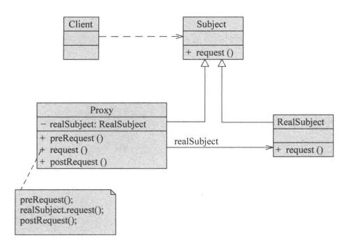
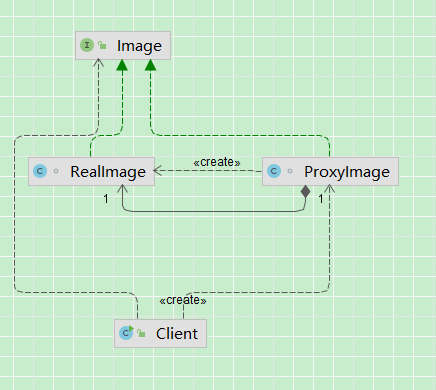

## 引入

在软件开发中，有些对象的创建或访问成本较高，例如：

- 从磁盘加载大文件
- 远程网络请求
- 数据库查询
- 加载高分辨率图片

如果在系统启动时就直接创建这些对象，可能会造成 **性能浪费或资源消耗过大**。

因此，我们往往希望：**只有在真正使用对象时才创建它。**

比如：

​	假设我们正在开发一个图片浏览系统，需要显示大量高清图片。

图片对象在创建时需要：

- 从磁盘读取图片
- 解析图片数据
- 占用大量内存

## 传统方法实现

​	在创建图片对象时，直接加载对应图片的数据。

~~~ java
/**
 * 图片接口
 */
public interface Image {
    /**
     * 显示图片
     */
    void display();
}

/**
 * 真实图片
 */
class RealImage implements Image {
    private String fileName;
    public RealImage(String fileName) {
        this.fileName = fileName;
        // 创建时直接加载
        loadFromDisk(fileName);
    }
    private void loadFromDisk(String fileName) {
        System.out.println("真实加载图片：" + fileName);
    }
    @Override
    public void display() {
        System.out.println("展示图片：" + fileName);
    }
}

/**
 * 客户端
 */
public class Client {
    public static void main(String[] args) {
        Image image1 = new RealImage("1.jpg");
        Image image2 = new RealImage("2.jpg");
        Image image3 = new RealImage("3.jpg");
        System.out.println("图片创建完成");
        image1.display();
    }
}
~~~

**输出：**

~~~ java
真实加载图片：1.jpg
真实加载图片：2.jpg
真实加载图片：3.jpg
图片创建完成
展示图片：1.jpg
~~~

## 代理模式实现

### 传统方法分析

### 问题

1、资源浪费

​	在上述示例中，客户端创建了`image1、image2、image3`三个图片，最终仅使用了`image1`，但是`、image2、image3`在创建时，依旧加载了数据，浪费了内存、io资源等。

2、无控制能力

​	客户端无法做到需要时再加载。

#### 优化：

​	针对上述问题，可以考虑在客户端与真实对象之间引入一个**中间层对象**，用于控制对真实对象的访问。

核心思路如下：

1、引入代理对象

​	客户端不再直接创建和使用真实对象（`RealImage`），而是通过一个代理对象（`ProxyImage`）来间接访问真实对象。

2、延迟加载（Lazy Loading）

​	代理对象在初始化时并不会立即创建真实对象，而是在客户端**真正调用业务方法（如 display()）时**，才创建真实对象并执行实际逻辑。

​	这样可以避免无用对象的提前加载，从而减少资源浪费。

3、访问控制

​	代理对象可以在调用真实对象前后增加额外控制逻辑，例如：

- 判断真实对象是否已创建
- 控制对象创建时机
- 统一管理对象生命周期

4、对客户端透明

代理对象与真实对象实现相同的接口（`Image`），客户端无需感知代理的存在，依然通过接口进行调用：

```java
Image image = new ProxyImage("test.jpg");
image.display();
```

从而实现：

```
客户端 → 代理对象 → 真实对象
```

而不是：

```
客户端 → 真实对象
```

### 定义

#### 类图：



#### 角色说明：

1.Subject（抽象主题角色）

​	抽象主题角色声明了真实主题和代理主题的共同接口，这样一来在任何使用真实主题的地方都可以使用代理主题。

​	客户端需要针对抽象主题角色进行编程。

2.Proxy（代理主题角色）

​	代理主题角色内部包含对真实主题的引用，从而可以在任何时候操作真实主题对象。

​	在代理主题角色中提供一个与真实主题角色相同的接口，以便在任何时候都可以替代真实主体。

​	代理主题角色还可以控制对真实主题的使用，负责在需要的时候创建和删除真实主题对象，并对真实主题对象的使用加以约束。

​	代理角色通常在客户端调用所引用的真实主题操作之前或之后还需要执行其他操作，而不仅仅是单纯的调用真实主题对象中的操作。

3.RealSubject（真实主题角色）

​	真实主题角色定义了代理角色所代表的真实对象，在真实主题角色中实现了真实的业务操作，客户端可以通过代理主题角色间接调用真实主题角色中定义的方法。

### 源码

类图：



代码：

~~~ java
/**
 * 图片接口
 */
public interface Image {
    /**
     * 显示图片
     */
    void display();
}

/**
 * 真实主题
 */
class RealImage implements Image {
    private String fileName;
    public RealImage(String fileName) {
        this.fileName = fileName;
        // 创建时加载资源
        loadFromDisk(fileName);
    }
    private void loadFromDisk(String fileName) {
        System.out.println("Loading " + fileName);
    }
    @Override
    public void display() {
        System.out.println("Displaying " + fileName);
    }
}

/**
 * 代理主题
 */
class ProxyImage implements Image {
    private RealImage realImage;
    private String fileName;
    public ProxyImage(String fileName) {
        this.fileName = fileName;
    }
    @Override
    public void display() {
        // 延迟加载：真正使用时才创建真实对象
        if (realImage == null) {
            realImage = new RealImage(fileName);
        }
        realImage.display();
    }
}

/**
 * 客户端
 */
public class Client {
    public static void main(String[] args) {

        Image image1 = new ProxyImage("1.jpg");
        Image image2 = new ProxyImage("2.jpg");
        Image image3 = new ProxyImage("3.jpg");

        System.out.println("Images created");

        image1.display();
    }
}
~~~

**输出：**

​	可见，只有图片1真正加载了数据

~~~
图片创建完成
真实加载图片：1.jpg
展示图片：1.jpg
~~~

## 思考

### 一、代理模式的本质

代理模式的核心思想可以总结为：

> **在不改变原有对象接口的前提下，通过引入代理对象来控制对真实对象的访问。**

进一步拆解有三个关键点：

1、**控制访问（Control Access）**

​	代理对象作为中间层，统一接管客户端对真实对象的调用入口：

```
Client → Proxy → RealSubject
```

​	从而可以在调用前后插入额外逻辑。

------

2、**关注调用边界（Method Boundary）**

​	代理模式本质是在方法调用的“边界”上做增强：

```
before
method.invoke()
after
```

​	而不是改变方法本身的业务逻辑。

------

3、**对客户端透明**

​	客户端始终面向 `Subject` 编程：

```
Image image = new ProxyImage();
```

​	无需感知代理的存在，实现**无侵入增强**。

------

一句话总结本质：

> **代理模式是在对象调用边界插入控制逻辑。**

### 二、代理模式的实现方式

代理模式根据使用场景不同，通常有以下几种典型实现：

------

#### 1、虚拟代理（Virtual Proxy）

**核心：延迟加载**

- 适用于创建成本高的对象
- 在真正使用时才创建对象

典型场景：

- 图片加载（本例）
- 大对象初始化
- ORM 懒加载

------

#### 2、远程代理（Remote Proxy）

**核心：本地调用远程对象**

- 隐藏网络通信细节
- 将远程服务伪装成本地对象

调用形式：

```
Client → Proxy → 网络 → Remote Service
```

典型场景：

- RPC 框架
- 微服务调用

------

#### 3、保护代理（Protection Proxy）

**核心：访问控制（权限）**

- 在调用前做权限校验
- 控制不同用户访问不同功能

典型场景：

- 权限系统
- 安全控制

------

#### 4、智能引用代理（Smart Proxy） / 动态代理

**核心：在访问时附加额外操作**

- 日志记录
- 事务控制
- 缓存处理
- 性能统计

典型技术实现：

- JDK 动态代理
- CGLIB

典型场景：

- Spring AOP
- 方法拦截

------

### 三、与类似设计模式对比

| 模式       | 核心目的     | 是否改变接口 | 是否改变能力 | 特点         |
| ---------- | ------------ | ------------ | ------------ | ------------ |
| 代理模式   | 控制访问     | ❌            | ❌            | 关注调用过程 |
| 装饰器模式 | 动态扩展功能 | ❌            | ✅            | 支持多层嵌套 |
| 适配器模式 | 接口转换     | ✅            | ❌            | 解决兼容问题 |

------

### 四、对设计原则的体现

------

#### 1、开闭原则（OCP）

- 不修改 `RealSubject`
- 通过新增 `Proxy` 扩展功能

  **对扩展开放，对修改关闭**

------

#### 2、依赖倒置原则（DIP）

- 客户端依赖 `Subject` 接口，而不是具体实现

```
Image image = new ProxyImage();
```

​	降低耦合，提高灵活性

------

#### 3、单一职责原则（SRP）

- `RealSubject`：只负责核心业务
- `Proxy`：负责访问控制

  职责清晰分离

------

#### 4、迪米特法则（LoD）

- 客户端只与 `Proxy` 交互
- 不直接接触 `RealSubject`

  降低对象之间的耦合


## 优缺点

### 优点

1、**降低耦合**

- 客户端通过代理对象间接访问真实对象
- 屏蔽了具体实现细节

实现调用方与被调用方解耦

------

2、**增强访问控制能力**

- 可以在调用前后统一处理逻辑，例如：
  - 权限校验
  - 日志记录
  - 事务控制

实现对访问过程的统一管理

------

3、**支持延迟加载，优化性能**

- 通过虚拟代理延迟创建高开销对象
- 减少内存占用和不必要的资源消耗

提升系统运行效率

------

4、**支持远程调用封装**

- 将远程对象调用封装为本地调用
- 屏蔽网络通信细节

提高系统的可扩展性和透明性

------

5、**符合开闭原则**

- 无需修改真实对象代码
- 通过引入代理扩展功能

扩展能力强

------

### 缺点

1、**增加系统复杂度**

- 引入代理类，增加系统结构层次
- 对理解和维护有一定成本

------

2、**可能影响性能**

- 多了一层调用（Client → Proxy → RealSubject）
- 在高频调用场景下可能带来轻微性能损耗

------

3、**实现复杂（尤其动态代理）**

- 如 JDK 动态代理、CGLIB 等实现较复杂
- 调试和排查问题成本较高

------

## 适用场景

可以从“控制访问”这一核心出发，将场景进行归类理解：

### 一、资源控制类

#### 1、虚拟代理（Virtual Proxy）

**特点：延迟加载**

适用于：

- 大对象创建成本高（图片、文件、对象图）
- ORM 懒加载

------

#### 2、Copy-on-Write 代理

**特点：延迟复制**

- 将对象拷贝操作延迟到真正需要时执行
- 避免不必要的深拷贝开销

------

#### 3、缓存代理（Cache Proxy）

**特点：结果复用**

- 缓存方法执行结果
- 多个客户端共享数据

典型：缓存系统

------

### 二、访问控制类

#### 4、保护代理（Protection Proxy）

**特点：权限控制**

- 控制不同用户访问不同功能

典型：权限系统

------

#### 5、防火墙代理（Firewall Proxy）

**特点：安全防护**

- 过滤非法请求
- 防止恶意访问

------

### 三、系统增强类

#### 6、智能引用代理（Smart Reference Proxy）

**特点：附加行为**

在访问对象时增加：

- 日志记录
- 调用统计
- 监控

本质就是 AOP 场景

------

#### 7、同步代理（Synchronization Proxy）

**特点：并发控制**

- 控制多线程访问同一对象
- 保证线程安全

------

### 四、分布式场景

#### 8、远程代理（Remote Proxy）

**特点：本地调用远程对象**

```
Client → Proxy → 网络 → Remote Service
```

适用于：

- RPC 调用
- 微服务架构

## 应用

### 一、Spring 中的动态代理（重点）

在实际开发中，代理模式最典型的应用就是 AOP，而 AOP 的底层正是基于动态代理实现的。

在 Spring Framework 中，当我们使用如下代码时：

```
@Transactional
public void createOrder() {
    // 业务逻辑
}
```

看似只是一个普通方法，但实际执行流程已经被代理增强。

------

### 1、执行流程本质

运行时结构如下：

```
Client
   ↓
Proxy（代理对象）
   ↓
Target（真实对象）
```

方法调用过程：

```
Proxy.invoke()
   ↓
开启事务
   ↓
调用目标方法
   ↓
提交/回滚事务
```

核心点：

> **Spring 在方法调用边界插入了事务逻辑**

------

### 2、Spring 动态代理的两种实现方式

Spring 根据目标对象情况，自动选择代理方式：

------

#### （1）JDK 动态代理

**前提：目标类实现接口**

基于 JDK 提供的：

```java
java.lang.reflect.Proxy
```

示例：

```java
interface UserService {
    void addUser();
}
class UserServiceImpl implements UserService {
    public void addUser() {
        System.out.println("add user");
    }
}
```

动态代理实现：

```java
import java.lang.reflect.*;

class JdkProxy {

    public static Object createProxy(Object target) {
        return Proxy.newProxyInstance(
                target.getClass().getClassLoader(),
                target.getClass().getInterfaces(),
                (proxy, method, args) -> {
                    System.out.println("before");

                    Object result = method.invoke(target, args);

                    System.out.println("after");
                    return result;
                }
        );
    }
}
```

使用：

```java
UserService service = (UserService) JdkProxy.createProxy(new UserServiceImpl());
service.addUser();
```

执行流程：

```
before
add user
after
```

------

#### （2）CGLIB 动态代理

**前提：目标类没有实现接口**

Spring 会使用 CGLIB 生成目标类的子类：

```
TargetClass → 子类（代理类）
```

核心原理：

- 继承目标类
- 重写方法
- 在方法前后增强

示意：

```java
class UserServiceProxy extends UserService {
    @Override
    public void addUser() {
        System.out.println("before");
        super.addUser();
        System.out.println("after");
    }
}
```

------

### 3、Spring 为什么优先用 JDK 动态代理

原因：

- 基于接口，更符合设计原则（面向接口编程）
- 不依赖继承，耦合更低
- 实现更轻量

只有在**没有接口时才使用 CGLIB**

------

### 4、动态代理的本质总结

无论 JDK 还是 CGLIB，本质都是：

```
拦截方法调用 → 在调用前后插入逻辑
```

👉 即：

> **在方法调用边界进行增强（AOP 的本质）**

------

### 二、开发中的应用场景

------

#### 场景：接口调用日志 + 耗时统计

在实际项目中，我们经常需要对服务方法进行：

- 日志记录
- 调用耗时统计

------

#### 传统实现（问题）

```java
public void queryUser() {
    long start = System.currentTimeMillis();

    System.out.println("start query");
    // 业务逻辑

    System.out.println("cost:" + (System.currentTimeMillis() - start));
}
```

问题：

- 代码侵入严重
- 每个方法都要写重复逻辑
- 难以统一维护

------

#### 使用代理模式优化

通过代理统一处理：

```
Client → Proxy → Target
```

代理逻辑：

```
before：记录开始时间
method.invoke()
after：统计耗时 + 打印日志
```

------

#### 优化效果

- 业务代码保持纯净
- 日志逻辑集中管理
- 易扩展（可加入监控、告警等）