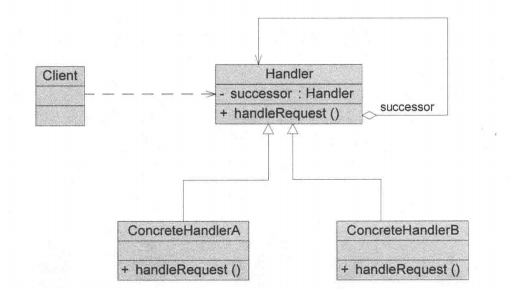
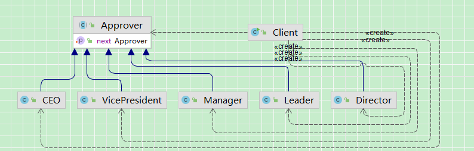

## 引入

在实际业务系统中，经常会遇到这样一类需求：

> **一个请求需要根据不同条件，由不同的处理者进行处理，但请求的发送者并不应该关心最终由谁处理。**

**典型场景：报销审批流程**

假设公司有一套报销审批制度：

- 报销金额 ≤ 1000 元 → **组长审批**
- 报销金额 ≤ 5000 元 → **部门经理审批**
- 报销金额 ≤ 10000 元 → **总监审批**
- 报销金额 > 10000 元 → **总经理审批**

后续发生需求变更，总经理只能审批20000以下的报销，20000以上需要副总裁进行审批。

## 传统方法实现

​	可见，哪个领导审批多少逻辑需要由客户端维护，若修改需求新增需求，需要客户端改if else分支逻辑。

~~~ java
/**
 * 审批请求
 */
public class ExpenseRequest {

    private double amount;

    public ExpenseRequest(double amount) {
        this.amount = amount;
    }

    public double getAmount() {
        return amount;
    }
}

/**
 * 审批者接口
 */
public interface Approver {
    /**
     * 审批
     */
    void approve(ExpenseRequest request);
}

/**
 * 组长
 */
public class Leader implements Approver {

    @Override
    public void approve(ExpenseRequest request) {
        System.out.println("组长审批通过，金额：" + request.getAmount());
    }
}

/**
 * 部门经理
 */
public class Manager implements Approver {

    @Override
    public void approve(ExpenseRequest request) {
        System.out.println("部门经理审批通过，金额：" + request.getAmount());
    }
}

/**
 * 总监
 */
public class Director implements Approver {

    @Override
    public void approve(ExpenseRequest request) {
        System.out.println("总监审批通过，金额：" + request.getAmount());
    }
}

/**
 * 总经理
 */
public class CEO implements Approver {

    @Override
    public void approve(ExpenseRequest request) {
        System.out.println("总经理审批通过，金额：" + request.getAmount());
    }
}

/**
 * 客户端
 */
public class Client {

    public static void main(String[] args) {
        // 1. 创建所有审批人（客户端必须知道所有角色）
        Leader leader = new Leader();
        Manager manager = new Manager();
        Director director = new Director();
        CEO ceo = new CEO();
        // 2. 构造请求
        ExpenseRequest request = new ExpenseRequest(18000);
        // 3. 客户端手动判断由谁审批（核心问题）
        double amount = request.getAmount();
        if (amount <= 1000) {
            leader.approve(request);
        } else if (amount <= 5000) {
            manager.approve(request);
        } else if (amount <= 10000) {
            director.approve(request);
        } else {
            ceo.approve(request);
        }
    }
}
~~~

修改需求后，需要新增一个副总裁的审批者，同时需要修改客户端业务逻辑

~~~ java
/**
 * 副总裁
 */
public class VicePresident implements Approver {
    @Override
    public void approve(ExpenseRequest request) {
        System.out.println("副总裁审批通过，金额：" + request.getAmount());
    }
}

public class Client {
    public static void main(String[] args) {
				// 1. 创建所有审批人（客户端必须知道所有角色）
        Leader leader = new Leader();
        Manager manager = new Manager();
        Director director = new Director();
        CEO ceo = new CEO();
        VicePresident vp = new VicePresident();
        // 2. 构造请求
        ExpenseRequest request = new ExpenseRequest(18000);
        // 3. 客户端手动判断由谁审批（核心问题）
        double amount = request.getAmount();

        if (amount <= 1000) {
            leader.approve(request);
        } else if (amount <= 5000) {
            manager.approve(request);
        } else if (amount <= 10000) {
            director.approve(request);
        }
        // 此处业务逻辑被修改
        else if (amount <= 20000) {
            ceo.approve(request);
        } else {
            vp.approve(request);
        }
    }
}
~~~

## 责任链模式实现

### 传统方法分析

### 问题

**1、客户端承担了“决策责任”**

​	请求发送者不应该关心“谁来处理”，但现在却必须知道所有处理者及其规则。

客户端不仅负责发起请求，还需要决定：

- 哪个领导审批
- 每个领导的审批范围

```java
if (amount <= 1000) {
    leader.approve(request);
}
```

**2、业务规则与客户端强耦合**

审批规则：

- “≤1000 组长”
- “≤5000 经理”

全部写死在 `Client` 中

导致：

- 规则变化 → 必须修改客户端代码
- 规则无法复用

**3、 扩展性差（违反开闭原则）**

**每次扩展都要改原代码**,当需求变更：

- 新增“副总裁”
- 修改审批额度

必须修改：

```java
else if (amount <= 20000) {
    ceo.approve(request);
}
```

**4、 无法灵活调整处理流程**

当前流程是固定的：

```
组长 → 经理 → 总监 → 总经理
```

但现实中可能需要：

- 跳过某些节点
- 动态增加审批人
- 不同流程走不同审批链

当前实现完全不支持。

#### 优化：

1、**客户端只负责发起请求**

```java
handler.handle(request);
```

2、**每个审批人只关心一件事**

- 我能不能处理？
- 不能处理 → 交给下一个

3、**审批流程可以灵活组合**

```
组长 → 经理 → 总监 → 总经理 → 副总裁
```

甚至可以：

```
经理 → 总监
```

4、**新增审批人无需修改已有代码**

​	只需要“加入流程”


**关键转变：**从： **Client 决定“谁来处理”** 变成：**处理者自己决定“是否处理，否则交给下一个”**

### 定义

#### 类图：



#### 角色说明：

**1.Handler（抽象处理者）**

​	抽象处理者定义了一个处理请求的接口，它一般设计为抽象类，由于不同的具体处理者处理请求的方式不同，因此在其中定义了抽象请求处理方法。

​	因为每一个处理者的下家还是一个处理者，因此在抽象处理者中定义了一个自类型（抽象处理者类型）的对象，作为其对下家的引用。通过该引用，处理者可以连成一条链。

**2.`ConcreteHandler`（具体处理者）**

​	具体处理者是抽象处理者的子类，它可以处理用户请求，在具体处理者类中实现了抽象处理者中定义的抽象请求处理方法。

​	在处理请求之前需要进行判断，看是否有相应的处理权限，如果可以处理请求就处理它，否则将请求转发给后继者；

​	在具体处理者中可以访问链中下一个对象，以便请求的转发。

**3.Client（客户类）**

​	客户类用于向链中的对象提出最初的请求，客户类只需要关心链的源头，而无须关心请求的处理细节以及请求的传递过程。

### 源码

类图：



代码：

~~~ java
/**
 * 抽象审批人
 */
public abstract class Approver {

    // 下一个处理者（链的关键）
    protected Approver next;

    public void setNext(Approver next) {
        this.next = next;
    }

    /**
     * 处理请求
     */
    public abstract void handle(ExpenseRequest request);
}

/**
 * 组长
 */
public class Leader extends Approver {
    @Override
    public void handle(ExpenseRequest request) {
        if (request.getAmount() <= 1000) {
            System.out.println("组长审批通过，金额：" + request.getAmount());
        } else if (next != null) {
            next.handle(request);
        }
    }
}

/**
 * 部门经理
 */
public class Manager extends Approver {
    @Override
    public void handle(ExpenseRequest request) {
        if (request.getAmount() <= 5000) {
            System.out.println("部门经理审批通过，金额：" + request.getAmount());
        } else if (next != null) {
            next.handle(request);
        }
    }
}

/**
 * 总监
 */
public class Director extends Approver {
    @Override
    public void handle(ExpenseRequest request) {
        if (request.getAmount() <= 10000) {
            System.out.println("总监审批通过，金额：" + request.getAmount());
        } else if (next != null) {
            next.handle(request);
        }
    }
}

/**
 * 总经理
 */
public class CEO extends Approver {
    @Override
    public void handle(ExpenseRequest request) {
        if (request.getAmount() <= 20000) {
            System.out.println("总经理审批通过，金额：" + request.getAmount());
        } else if (next != null) {
            next.handle(request);
        }
    }
}

/**
 * 副总裁
 */
public class VicePresident extends Approver {
    @Override
    public void handle(ExpenseRequest request) {
        // 兜底处理
        System.out.println("副总裁审批通过，金额：" + request.getAmount());
    }
}

/**
 * 客户端
 */
public class Client {
    public static void main(String[] args) {
        // 1. 创建审批人
        Leader leader = new Leader();
        Manager manager = new Manager();
        Director director = new Director();
        CEO ceo = new CEO();
        VicePresident vp = new VicePresident();

        // 2. 构建职责链（客户端负责“组装链”）
        leader.setNext(manager);
        manager.setNext(director);
        director.setNext(ceo);
        ceo.setNext(vp);

        // 3. 发起请求（客户端不再关心谁处理）
        ExpenseRequest request = new ExpenseRequest(18000);
        leader.handle(request);
    }
}
~~~


## 思考

### 一、责任链模式的本质

从表面上看，职责链模式是在“多个处理者之间传递请求”，但其核心本质可以总结为：

> **将“请求的处理者选择逻辑”从客户端转移到处理链中，实现请求与处理者的解耦。**

职责链模式做了两件关键的事情：

即：**职责链模式 = 行为对象化 + 流程链式化**

**处理逻辑“对象化”**

​	在传统实现中：`if (amount <= 1000) { ... }`这些判断逻辑是“写死在代码里的”

而在职责链中,将“行为”封装为对象：

- 每个判断逻辑变成一个对象（Handler）
- 每个对象负责一段处理逻辑

**处理流程“链式化”**

请求不再是：客户端选择一个处理者，而是：请求在多个处理者之间**自动流转**

```
请求 → Handler1 → Handler2 → Handler3 → ...
```

本质：将“流程控制”从代码结构（if-else）转变为对象结构（链）

### 二、与类似设计模式对比

​	职责链模式很容易和其他行为型模式混淆，尤其是策略模式、状态模式。

**策略模式**

| 对比点       | 职责链模式             | 策略模式             |
| ------------ | ---------------------- | -------------------- |
| 核心思想     | 多个处理者依次尝试处理 | 从多个算法中选择一个 |
| 执行方式     | **可能经过多个节点**   | **只会执行一个策略** |
| 决策位置     | 在链中动态决定         | 在客户端提前选择     |
| 是否有“传递” | ✅ 有                   | ❌ 没有               |

​	职责链：**“谁能处理就处理”**， 策略模式：**“我选择你来处理”**

**状态模式**

| 对比点   | 职责链模式 | 状态模式     |
| -------- | ---------- | ------------ |
| 目的     | 处理请求   | 管理状态转换 |
| 结构     | 链式结构   | 状态切换     |
| 是否传递 | ✅ 会传递   | ❌ 不传递     |

​	状态模式是“状态驱动行为”，职责链是“责任传递处理”

**模板方法模式**

| 对比点   | 职责链模式     | 模板方法模式     |
| -------- | -------------- | ---------------- |
| 控制流程 | 动态（链决定） | 固定（父类定义） |
| 扩展方式 | 新增节点       | 子类重写步骤     |
| 灵活性   | 高             | 较低             |

​	模板方法是“固定流程 + 可变步骤”，职责链是“可变流程”

### 三、职责链模式的不同实现方式

​	在实际工程中，职责链并不是只有一种写法，常见有以下几种变体：

**标准职责链（当前实现）**

```java
if (能处理) {
    处理
} else {
    传递给下一个
}
```

特点：

- 只会有一个节点处理请求
- 一旦处理就结束

适用于：审批流程

**责任链（全链执行型）**

```
处理当前逻辑
传递给下一个
```

特点：

- 所有节点都会执行
- 更像“过滤器链”

典型场景：

- Servlet Filter
- Spring 拦截器

**可中断链（增强版）**

```java
boolean handled = doHandle();

if (!handled && next != null) {
    next.handle();
}
```

特点：

- 可以决定是否继续传递
- 更灵活

**环形职责链（较少见）**

```
A → B → C → A
```

特点：

- 没有明确终点
- 需要避免死循环

### 四、对设计原则的体现

| 设计原则                   | 在职责链模式中的体现           | 说明                                                         |
| -------------------------- | ------------------------------ | ------------------------------------------------------------ |
| 单一职责原则（SRP）        | 每个处理者只负责自己的处理逻辑 | 如 Leader 只处理 ≤1000，Manager 只处理 ≤5000，各节点职责清晰、互不干扰 |
| 开闭原则（OCP）            | 新增处理者无需修改已有代码     | 只需新增 Handler 并接入链中（如 `ceo.setNext(vp)`），无需改动原有逻辑 |
| 迪米特法则（最少知识原则） | 客户端无需了解链的内部结构     | 客户端只需调用链头 `handle`，不需要知道具体由谁处理          |
| 依赖倒置原则（DIP）        | 客户端依赖抽象而非具体实现     | 客户端面向 `Approver` 编程，而不是依赖具体的 Leader、Manager 等类 |

## 优缺点

### 优点

1、**降低耦合度（核心价值）**：请求发送者无需关心具体由谁处理请求，实现了**请求发送者与处理者的解耦**。

- 客户端只需发起请求：

  ```
  handler.handle(request);
  ```

- 不需要知道：

  - 有哪些处理者
  - 谁最终处理

2、**简化对象之间的关系**:从`一个对象依赖多个处理者`变成：`每个对象只依赖下一个`,降低系统复杂度

- 每个处理者只需持有**下一个节点的引用**
- 不需要维护所有处理者

3、**提高系统的灵活性（流程可配置）**: **处理流程从“代码逻辑”变为“结构配置”**

- 可以动态调整链结构：

```
leader.setNext(manager);
manager.setNext(director);
```

- 支持：
  - 调整顺序
  - 插入节点
  - 删除节点

4、**易于扩展（符合开闭原则）**

新增处理者：

- 不需要修改已有代码
- 只需加入链中

```
ceo.setNext(vp);
```

**职责清晰（符合单一职责原则）**

- 每个处理者只负责一段逻辑
- 避免“巨型方法”

### 缺点

1、**不能保证请求一定被处理**，请求可能“悄无声息地丢失”

- 如果链上没有节点能处理请求
- 或链配置错误

建议：

- 增加兜底处理节点（如 VP）
- 或抛出异常

2、**性能可能下降（链过长时）**

- 请求需要逐个节点判断
- 链越长，性能越差

特别是在：

- 高并发场景
- 长链路场景

建议：

- 控制链长度
- 提前剪枝（快速失败）

**3、调试困难**

请求是“链式传递”的：

```
A → B → C → D
```

调试时需要：

- 跟踪整个调用链
- 不容易快速定位问题

建议：

- 打日志（每个节点）
- 加 traceId

4、**可能出现循环调用（严重问题）**

如果链配置错误：

```
A → B → C → A
```

会导致：

- 死循环
- 栈溢出

建议：

- 构建链时做校验
- 避免动态错误拼接

5、**本质仍然包含条件判断**

职责链并没有消除：

```
if (amount <= xxx)
```

只是：

> **将判断逻辑从客户端分散到了各个处理者中**

 **影响：**

- 节点内部仍然可能复杂
- 不是“消灭 if-else”，而是“重构 if-else”

## 适用场景

1、有多个对象可以处理同一个请求，具体哪个对象处理该请求由运行时刻自动确定。客户端只需将请求提交到链上，无须关心请求的处理对象是谁以及它是如何处理的。

2、在不明确指定接收者的情况下，向多个对象中的一个提交一个请求。请求的发送者与请求的处理者解耦，请求将沿着链进行传递，寻求相应的处理者。

3、可动态指定一组对象处理请求。客户端可以动态创建职责链来处理请求，还可以动态改变链中处理者之间的先后次序。


## 应用

### 一、JDK 源码中的应用 —— Servlet Filter 链（经典职责链）

职责链模式在 Java Web 中有一个非常经典的实现：**Servlet Filter（过滤器链）**，相关核心接口：

- `javax.servlet.Filter`
- `javax.servlet.FilterChain`

------

#### 1、基本使用方式

我们平时写过滤器：

```java
public class LogFilter implements Filter {
    @Override
    public void doFilter(ServletRequest request, ServletResponse response, FilterChain chain) {
        System.out.println("日志记录前");
        // 传递给下一个过滤器
        chain.doFilter(request, response);
        System.out.println("日志记录后");
    }
}
```

#### 2、执行流程（链式结构）

假设有多个过滤器：

```
Filter1 → Filter2 → Filter3 → Servlet
```

执行流程：

```java
请求 →
    Filter1 前置 →
        Filter2 前置 →
            Filter3 前置 →
                Servlet →
            Filter3 后置 →
        Filter2 后置 →
    Filter1 后置
```

这是一个**典型的职责链（且是“全链执行型”）**

#### 3、源码核心（简化理解）

`FilterChain` 的核心逻辑本质上类似这样：

```java
public class ApplicationFilterChain implements FilterChain {
    private List<Filter> filters;
    private int index = 0;
    @Override
    public void doFilter(ServletRequest request, ServletResponse response) {
        if (index < filters.size()) {
            Filter current = filters.get(index++);
            current.doFilter(request, response, this);
        } else {
            // 最终执行 Servlet
            servlet.service(request, response);
        }
    }
}
```

#### 4、为什么这是职责链模式？

对照职责链特征来看：

1、请求沿链传递

```
chain.doFilter(...)
```

显式“交给下一个处理者”

2、每个节点只关心自己的逻辑

```
前置逻辑
chain.doFilter(...)
后置逻辑
```

3、客户端不关心具体执行流程

用户只发起请求：

```
HTTP 请求 → 容器
```

不关心：

- 有多少 Filter
- 谁先执行

4、支持动态扩展

新增 Filter：

- 配置即可
- 无需修改已有代码

#### 关键理解（非常重要）

Servlet Filter 并不是“只处理一次”的职责链，而是：**全链执行 + 可嵌套（前置/后置）**

### 二、实际开发中的应用 —— 导出流程处理链

#### 1、场景描述

导出功能在执行前，需要进行多个步骤处理：

- 参数校验
- 权限校验
- 数据范围校验
- 防重复提交
- 数据预处理

#### **2、传统问题**

如果使用 if-else：

```java
if (!checkParam()) return;
if (!checkPermission()) return;
if (!checkData()) return;
```

 问题：

- 逻辑耦合
- 不可扩展
- 不可复用

#### **3、职责链实现思路**

定义统一处理接口：

```java
public abstract class ExportHandler {
    protected ExportHandler next;
    public void setNext(ExportHandler next) {
        this.next = next;
    }
    public abstract void handle(ExportContext context);
}
```

各个处理节点

```java
public class ParamCheckHandler extends ExportHandler {

    @Override
    public void handle(ExportContext context) {
        if (!check(context)) {
            throw new RuntimeException("参数错误");
        }
        if (next != null) next.handle(context);
    }
}
public class PermissionHandler extends ExportHandler {

    @Override
    public void handle(ExportContext context) {
        if (!checkPermission(context)) {
            throw new RuntimeException("无权限");
        }
        if (next != null) next.handle(context);
    }
}
```

#### 4、链的构建（可结合 Spring）

```java
handler1.setNext(handler2);
handler2.setNext(handler3);
```

或：

```java
@Autowired
List<ExportHandler> handlers;
```

自动排序构建链

#### 5、优势体现

1. 逻辑解耦

每个 Handler：

- 只负责一件事
- 可独立开发

2. 灵活扩展

新增一个校验：

```
class RiskControlHandler extends ExportHandler
```

直接加入链

3. 支持不同流程

可以构建不同链：

```
普通导出链
高级导出链
管理员导出链
```

