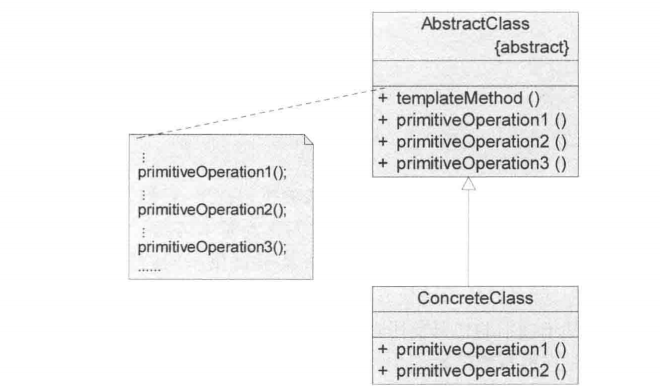
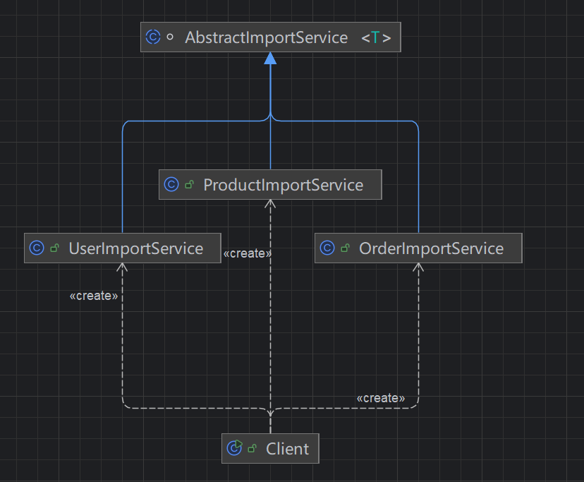

## 引入

**文件导入处理流程**

在一个后台系统中，有一个“文件导入”功能，支持导入不同类型的数据，例如：

-  用户数据导入 
-  订单数据导入 
-  商品数据导入 

一开始，系统只支持“用户数据导入”，处理流程大致如下：

```
1、读取文件  
2、解析数据  
3、校验数据  
4、写入数据库  
5、记录日志  
```

此时使用一个普通方法实现即可，没有任何问题。

**需求变化**

随着业务发展，系统逐渐需要支持更多类型的导入：

-  订单导入：需要额外做金额校验 
-  商品导入：需要校验库存、分类 
-  某些导入：写入数据库前需要做数据转换 
-  某些导入：不需要记录日志 

这时会发现一个问题：

**虽然整体流程是类似的，但每种导入在“某些步骤”上存在差异**

## 传统方法实现

**实体类：**

~~~ java
public class User {
    private String name;
    private int age;

    public User(String name, int age) {
        this.name = name;
        this.age = age;
    }

    public String getName() {
        return name;
    }

    public int getAge() {
        return age;
    }
}
~~~

**初始需求实现（仅支持用户导入）:**

~~~ java
public class ImportService {

    public void importUser(File file) {
        // 1. 读取文件
        List<String> lines = readFile(file);
        // 2. 解析数据
        List<User> users = parseUser(lines);
        // 3. 校验数据
        validateUser(users);
        // 4. 写入数据库
        saveUser(users);
        // 5. 记录日志
        log("用户导入完成");
    }
    private List<String> readFile(File file) {
        List<String> lines = new ArrayList<>();
        BufferedReader reader = null;
        try {
            reader = new BufferedReader(new FileReader(String.valueOf(file)));
            String line;
            while ((line = reader.readLine()) != null) {
                lines.add(line);
            }
        } catch (Exception e) {
            throw new RuntimeException("读取文件失败", e);
        } finally {
            try {
                if (reader != null) {
                    reader.close();
                }
            } catch (Exception e) {
                throw new RuntimeException("关闭文件失败", e);
            }
        }
        return lines;
    }
    private List<User> parseUser(List<String> lines) {
        List<User> users = new ArrayList<>();
        for (String line : lines) {
            String[] arr = line.split(",");
            String name = arr[0];
            int age = Integer.parseInt(arr[1]);
            users.add(new User(name, age));
        }
        return users;
    }
    private void validateUser(List<User> users) {
        for (User user : users) {
            if (user.getName() == null || user.getName().isEmpty()) {
                throw new RuntimeException("用户名不能为空");
            }
            if (user.getAge() < 0) {
                throw new RuntimeException("年龄不能为负数");
            }
        }
    }
    private void saveUser(List<User> users) {
        for (User user : users) {
            System.out.println("保存用户: " + user.getName() + ", " + user.getAge());
        }
    }
    private void log(String msg) {
        System.out.println(msg);
    }
}
~~~

**需求扩展后新增实体：**

~~~ java
public class Order {
    private String orderId;
    private double amount;

    public Order(String orderId, double amount) {
        this.orderId = orderId;
        this.amount = amount;
    }

    public String getOrderId() {
        return orderId;
    }

    public double getAmount() {
        return amount;
    }
}

public class Product {
    private String name;
    private int stock;

    public Product(String name, int stock) {
        this.name = name;
        this.stock = stock;
    }

    public String getName() {
        return name;
    }

    public int getStock() {
        return stock;
    }
}

~~~

**需求扩展后的实现（支持多种导入类型）：**

~~~ java

public class ImportService2 {
    public void importUser(File file) {
        List<String> lines = readFile(file);
        List<User> users = parseUser(lines);
        validateUser(users);
        saveUser(users);
        log("用户导入完成");
    }
    public void importOrder(File file) {
        List<String> lines = readFile(file);
        List<Order> orders = parseOrder(lines);
        validateOrder(orders);
        convertOrder(orders);
        saveOrder(orders);
        log("订单导入完成");
    }
    public void importProduct(File file) {
        List<String> lines = readFile(file);
        List<Product> products = parseProduct(lines);
        validateProduct(products);
        saveProduct(products);
    }
    private List<String> readFile(File file) {
        List<String> lines = new ArrayList<>();
        BufferedReader reader = null;
        try {
            reader = new BufferedReader(new FileReader(String.valueOf(file)));
            String line;
            while ((line = reader.readLine()) != null) {
                lines.add(line);
            }
        } catch (Exception e) {
            throw new RuntimeException("读取文件失败", e);
        } finally {
            try {
                if (reader != null) {
                    reader.close();
                }
            } catch (Exception e) {
                throw new RuntimeException("关闭文件失败", e);
            }
        }
        return lines;
    }
    private List<User> parseUser(List<String> lines) {
        List<User> users = new ArrayList<>();
        for (String line : lines) {
            String[] arr = line.split(",");
            users.add(new User(arr[0], Integer.parseInt(arr[1])));
        }
        return users;
    }
    private List<Order> parseOrder(List<String> lines) {
        List<Order> orders = new ArrayList<>();
        for (String line : lines) {
            String[] arr = line.split(",");
            orders.add(new Order(arr[0], Double.parseDouble(arr[1])));
        }
        return orders;
    }
    private List<Product> parseProduct(List<String> lines) {
        List<Product> products = new ArrayList<>();
        for (String line : lines) {
            String[] arr = line.split(",");
            products.add(new Product(arr[0], Integer.parseInt(arr[1])));
        }
        return products;
    }
    private void validateUser(List<User> users) {
        for (User user : users) {
            if (user.getName() == null || user.getName().isEmpty()) {
                throw new RuntimeException("用户名不能为空");
            }
            if (user.getAge() < 0) {
                throw new RuntimeException("年龄不能为负数");
            }
        }
    }
    private void validateOrder(List<Order> orders) {
        for (Order order : orders) {
            if (order.getAmount() <= 0) {
                throw new RuntimeException("订单金额必须大于0");
            }
        }
    }
    private void validateProduct(List<Product> products) {
        for (Product product : products) {
            if (product.getStock() < 0) {
                throw new RuntimeException("库存不能为负数");
            }
        }
    }
    private void convertOrder(List<Order> orders) {
        for (Order order : orders) {
            System.out.println("转换订单数据: " + order.getOrderId());
        }
    }
    private void saveUser(List<User> users) {
        for (User user : users) {
            System.out.println("保存用户: " + user.getName());
        }
    }
    private void saveOrder(List<Order> orders) {
        for (Order order : orders) {
            System.out.println("保存订单: " + order.getOrderId());
        }
    }
    private void saveProduct(List<Product> products) {
        for (Product product : products) {
            System.out.println("保存商品: " + product.getName());
        }
    }
    private void log(String msg) {
        System.out.println(msg);
    }
}
~~~


## 模板方法模式实现

### 传统方法分析

#### 问题

#####  **问题1：大量重复代码**

```
readFile()
parseXxx()
validateXxx()
saveXxx()
log()
```

每个方法流程几乎一模一样，只是“换了类型 + 换了细节”

#####  **问题2：修改成本极高**

假设现在要加一个新需求：

“所有导入都要增加‘导入前权限校验’”

你需要改：**所有方法都要改一遍**

```
importUser
importOrder
importProduct
...
```

#####  **问题3：流程不一致（容易失控）**

注意这里：

```
// 用户导入：有日志
log("用户导入完成");

// 商品导入：没日志
```

很容易出现：

-  有的有步骤 
-  有的没步骤 
-  顺序还可能不一样 

**流程失去统一控制**

#####  **问题4：扩展违反开闭原则**

新增一个“库存导入”：

```
public void importStock(File file) {
    // 再复制一份流程...
}
```

本质是：

> **每新增一个类型 = 修改已有类**

### 优化：

根据问题分析，实际上，这些所有的问题都是因为没有一个统一的流程控制，应该：

​	**流程应该由一个地方统一控制** 

​	**变化点应该被“抽出来”**

也就是：固定流程（父类定义）+ 可变步骤（子类实现）

### 定义

​	模板方法模式（TemplateMethod Pattern）定义：定义一个操作中算法的骨架，而将一些步骤延迟到子类中，模板方法使得子类可以不改变一个算法的结构即可重定义该算法的某些特定步骤。

​	模板方法模式是一种类行为型模式。

#### 类图：



#### 角色说明：

**1. `AbstractClass`（抽象类）**

​	在抽象类中定义一系列基本操作（PrimitiveOperations），这些基本操作可以是具体的，也可以是抽象的，每一个基本操作对应算法的一个步骤，在其子类中可以重定义并实现一个算法的各个步骤。

​	同时，在抽象类中实现了一个模板方法，用于定义一个算法的骨架，此模板方法不仅可以调用基本操作，还可以调用在抽象类中声明而在其子类中实现的抽象方法，当然也可以调用其他对象中的方法。

**2.`ConcreteClass`（体子类）**

​	具体子类是抽象类的子类，用于实现在父类中定义的抽象基本操作以完成子类特定算法的步骤，也可以覆盖在父类中实现的具体基本操作。

### 源码

#### 类图：



#### 代码：

**`AbstractClass`（抽象类）:抽象导入类，定义流程骨架**

~~~ java
/**
 * 抽象模板类：定义流程骨架
 */
abstract class AbstractImportService<T> {
    /**
     * 模板方法：定义完整流程（不可被子类重写）
     */
    public final void importData(File file) {
        // 1. 读取文件
        List<String> lines = readFile(file);
        // 2. 解析数据
        List<T> dataList = parse(lines);
        // 3. 校验数据
        validate(dataList);
        // 4. 是否需要转换（钩子）
        if (needConvert()) {
            convert(dataList);
        }
        // 5. 写入数据库
        save(dataList);
        // 6. 是否需要日志（钩子）
        if (needLog()) {
            log();
        }
    }

    /**
     * 公共步骤：读取文件
     */
    private List<String> readFile(File file) {
        List<String> lines = new ArrayList<>();
        BufferedReader reader = null;
        try {
            reader = new BufferedReader(new FileReader(file));
            String line;
            while ((line = reader.readLine()) != null) {
                lines.add(line);
            }
        } catch (Exception e) {
            throw new RuntimeException("读取文件失败", e);
        } finally {
            try {
                if (reader != null) {
                    reader.close();
                }
            } catch (Exception e) {
                throw new RuntimeException("关闭文件失败", e);
            }
        }
        return lines;
    }

    /**
     * 子类必须实现的步骤
     */
    protected abstract List<T> parse(List<String> lines);

    protected abstract void validate(List<T> dataList);

    protected abstract void save(List<T> dataList);

    /**
     * 可选步骤（默认空实现）
     */
    protected void convert(List<T> dataList) {
        // 默认不做任何处理
    }

    /**
     * 钩子方法：是否需要转换
     */
    protected boolean needConvert() {
        return false;
    }

    /**
     * 钩子方法：是否需要日志
     */
    protected boolean needLog() {
        return true;
    }

    /**
     * 公共步骤：日志
     */
    protected void log() {
        System.out.println("导入完成");
    }
}
~~~

**具体导入类：**

~~~ java
// 订单导入
public class OrderImportService extends AbstractImportService<Order> {
    @Override
    protected List<Order> parse(List<String> lines) {
        List<Order> orders = new ArrayList<>();
        for (String line : lines) {
            String[] arr = line.split(",");
            orders.add(new Order(arr[0], Double.parseDouble(arr[1])));
        }
        return orders;
    }
    @Override
    protected void validate(List<Order> orders) {
        for (Order order : orders) {
            if (order.getAmount() <= 0) {
                throw new RuntimeException("订单金额必须大于0");
            }
        }
    }
    @Override
    protected boolean needConvert() {
        return true;
    }
    @Override
    protected void convert(List<Order> orders) {
        for (Order order : orders) {
            System.out.println("转换订单数据: " + order.getOrderId());
        }
    }
    @Override
    protected void save(List<Order> orders) {
        for (Order order : orders) {
            System.out.println("保存订单: " + order.getOrderId());
        }
    }
    @Override
    protected void log() {
        System.out.println("订单导入完成");
    }
}
// 商品导入（无日志）
public class ProductImportService extends AbstractImportService<Product> {
    @Override
    protected List<Product> parse(List<String> lines) {
        List<Product> products = new ArrayList<>();
        for (String line : lines) {
            String[] arr = line.split(",");
            products.add(new Product(arr[0], Integer.parseInt(arr[1])));
        }
        return products;
    }
    @Override
    protected void validate(List<Product> products) {
        for (Product product : products) {
            if (product.getStock() < 0) {
                throw new RuntimeException("库存不能为负数");
            }
        }
    }
    @Override
    protected void save(List<Product> products) {
        for (Product product : products) {
            System.out.println("保存商品: " + product.getName());
        }
    }
    @Override
    protected boolean needLog() {
        return false;
    }
}
// 用户导入
public class UserImportService extends AbstractImportService<User> {
    @Override
    protected List<User> parse(List<String> lines) {
        List<User> users = new ArrayList<>();
        for (String line : lines) {
            String[] arr = line.split(",");
            users.add(new User(arr[0], Integer.parseInt(arr[1])));
        }
        return users;
    }
    @Override
    protected void validate(List<User> users) {
        for (User user : users) {
            if (user.getName() == null || user.getName().isEmpty()) {
                throw new RuntimeException("用户名不能为空");
            }
            if (user.getAge() < 0) {
                throw new RuntimeException("年龄不能为负数");
            }
        }
    }
    @Override
    protected void save(List<User> users) {
        for (User user : users) {
            System.out.println("保存用户: " + user.getName());
        }
    }
    @Override
    protected void log() {
        System.out.println("用户导入完成");
    }
}
~~~

客户端：

~~~ java
// 客户端
public class Client {
    public static void main(String[] args) {
        File file = new File("data.txt");

        AbstractImportService<?> userImport = new UserImportService();
        userImport.importData(file);

        AbstractImportService<?> orderImport = new OrderImportService();
        orderImport.importData(file);

        AbstractImportService<?> productImport = new ProductImportService();
        productImport.importData(file);
    }
}
~~~

## 思考

### 一、模板方法模式的本质

模板方法模式表面上看是“继承 + 方法调用”，但其真正的本质是：

```
控制流程（不变） + 延迟实现（可变）
```

可以进一步抽象为：

```
父类定义算法骨架（流程顺序）
子类实现具体步骤（差异逻辑）
```

#### 1、控制权上移（核心本质）

在传统实现中：

```
调用方控制流程 → 各种方法拼装流程
```

而模板方法模式中：

```
父类控制流程 → 子类只能填充步骤
```

本质变化：

> **流程控制权从“调用方”转移到了“抽象父类”**

这也是为什么模板方法通常会：

-  将模板方法设为 `final` 
-  禁止子类改变流程结构 

#### 2、流程稳定，变化受控

模板方法模式解决的核心矛盾：

```
流程希望稳定（不能乱）
步骤需要变化（要扩展）
```

它的解决方式不是“完全开放”，而是：

```
变化点由父类预先定义（抽象方法 / hook）
子类只能在这些点上扩展
```

关键理解：

> **不是让你随便扩展，而是“限制范围内的扩展”**

#### 3、复用的本质不是代码，而是“流程结构”

很多人会误以为模板方法是为了“减少重复代码”，但这只是表象。

更深一层是：

```
复用流程结构，而不是复用代码片段
```

例如：

```
读文件 → 解析 → 校验 → 入库 → 日志
```

这个“顺序结构”才是被复用的核心

#### 4、面向“步骤分解”的设计思想

模板方法隐含一个重要前提：

**一个业务可以被拆分为多个清晰步骤**

如果一个逻辑：

-  无法拆分步骤 
-  或步骤之间高度耦合 

就不适合模板方法模式

### 二、关键设计点

#### 1、模板方法必须限制重写（final）

```java
public final void process() { ... }
```

否则子类可以：

-  改流程 
-  跳步骤 
-  插逻辑 

模式直接失效

#### 2、Hook（钩子方法）的使用

```java
protected boolean needLog() {
    return true;
}
```

作用：

-  控制步骤是否执行 
-  提供默认行为 
-  增强灵活性 

本质：

```
在“固定流程”中提供“有限弹性”
```

#### 3、抽象方法 vs 默认实现

| 类型     | 作用         |
| -------- | ------------ |
| 抽象方法 | 强制子类实现 |
| 默认方法 | 子类可选覆盖 |

设计原则：

```
稳定的步骤 → 放父类实现
变化的步骤 → 抽象方法
可选步骤 → hook + 默认实现
```

#### 4、继承带来的问题

模板方法的一个天然缺点：

```
强依赖继承（类爆炸风险）
```

表现为：

-  每种变体都需要一个子类 
-  层级可能变复杂 

这也是为什么：

```
更复杂场景会引入策略模式（组合优先）
```

### 三、工程上使用

在实际工程中，**模板方法模式很少单独使用**，通常会与：

-  **工厂模式** 
-  **策略模式** 

进行组合使用，形成一套更灵活、可扩展的结构。

整体核心思想可以概括为：

```
模板方法：控制流程
策略模式：扩展变化
工厂模式：管理对象
```

即：

~~~
1、模板类：定义流程（必须稳定）
2、子类：实现差异（只关心步骤）
3、工厂：管理实例（避免if-else）
4、上下文：对外统一调用入口
~~~

实际结构：

~~~
import-template/
├── template/
│   └── AbstractImportService.java        // 模板抽象类（定义流程）
├── service/
│   ├── UserImportService.java           // 具体实现类
│   ├── OrderImportService.java
│   └── ProductImportService.java
├── factory/
│   └── ImportServiceFactory.java        // 工厂（管理具体实现）
├── context/
│   └── ImportContext.java               // 上下文（对外统一入口）
└── Main.java                           // 使用示例
~~~

调用链：

```
调用方
   ↓
Context（统一入口）
   ↓
Factory（选择实现）
   ↓
Concrete Service（具体实现类）
   ↓
Template Method（执行流程）
```

总结

```
模板方法模式在工程中通常以“模板 + 工厂 + 策略”的组合形式出现：
模板控制流程，策略扩展步骤，工厂负责管理实例。
```

## 优缺点

### 优点

1、模板方法模式在一个类中形式化地定义算法，而由它的子类实现细节的处理。模板方法模式的优势是在子类定义详细的处理算法时不会改变算法的结构。

2、模板方法模式是一种代码复用的基本技术，它在类库设计中尤为重要，它提取了类库中的公共行为，将公共行为放在父类中，而通过其子类来实现不同的行为。

3、模板方法模式提供了一种反向的控制结构，通过一个父类调用其子类的操作，通过对子类的扩展增加新的行为，符合“开闭原则”。

### 缺点

​	每个不同的实现都需要定义一个子类，这会导致类的个数增加，系统更加庞大，设计也更加抽象，但是更加符合“单一职责原则”，使得类的内聚性得以提高。

## 适用场景

1、一次性实现一个算法的不变部分，并将可变行为留给子类来实现。

2、各子类中公共的行为应被提取出来并集中到一个公共父类中以避免代码重复。首先需要识别现有代码中的不同之处，并且将不同之处分离为新的操作；然后，用一个调用这些新的操作的模板方法来替换这些不同的代码。

3、对一些复杂的算法进行分割，将其算法中固定不变的部分设计为模板方法和父类具体方法，而一些可以改变的细节由其子类来实现。

4、控制子类的扩展。模板方法只在特定点调用钩子方法，这样就只允许在这些点进行扩展，也就是说对于某些方法，可以通过钩子方法来进行扩展，而对于不能进行扩展的方法可以将其定义为final方法，对算法的扩展进行效的控制和约束。

## 应用

### 一、JDK 经典应用：Template Method —— `InputStream`

在 JDK 中，模板方法模式的一个非常典型实现是： `InputStream` 读取数据流程

**核心结构说明**

```
InputStream（抽象类）
    ↓
定义通用读取流程（read(byte[] b, int off, int len)）
    ↓
调用 read()（单字节读取，抽象方法）
    ↓
子类实现 read()
```

**关键代码（JDK源码简化版）**

```java
public abstract class InputStream {

    public int read(byte[] b, int off, int len) throws IOException {
        if (b == null) {
            throw new NullPointerException();
        }
        if (len == 0) {
            return 0;
        }
        int c = read();
        if (c == -1) {
            return -1;
        }
        b[off] = (byte) c;
        int i = 1;
        for (; i < len; i++) {
            c = read();
            if (c == -1) {
                break;
            }
            b[off + i] = (byte) c;
        }

        return i;
    }
    public abstract int read() throws IOException;
}
```

**子类实现**

```java
public class FileInputStream extends InputStream {
    @Override
    public int read() throws IOException {
        // 从文件中读取一个字节
        return 0;
    }
}
```

**说明**

```
模板方法：read(byte[], off, len)
抽象步骤：read()
```

流程由父类控制：

```
循环读取 → 填充数组 → 返回结果
```

子类只负责：

```
如何读取一个字节
```

### 二、Spring 经典应用：JdbcTemplate

Spring 中模板方法模式的经典代表：`JdbcTemplate`

**核心思想**

```
固定流程：
获取连接 → 执行SQL → 处理结果 → 关闭资源

变化点：
如何设置参数
如何解析结果
```

**核心代码（简化版）**

```java
public class JdbcTemplate {

    public <T> T query(String sql, RowMapper<T> rowMapper) {
        Connection conn = null;
        PreparedStatement ps = null;
        ResultSet rs = null;
        try {
            conn = getConnection();
            ps = conn.prepareStatement(sql);
            rs = ps.executeQuery();
            List<T> result = new ArrayList<>();
            while (rs.next()) {
                result.add(rowMapper.mapRow(rs));
            }
            return result.get(0);

        } catch (Exception e) {
            throw new RuntimeException(e);
        } finally {
            close(rs, ps, conn);
        }
    }
}
```

**变化点（策略）**

```java
public interface RowMapper<T> {
    T mapRow(ResultSet rs) throws Exception;
}
```

**使用方式**

```java
List<User> users = jdbcTemplate.query(
    "select * from user",
    rs -> new User(rs.getString("name"))
);
```

**说明**

```
模板方法：query()
固定流程：连接管理 + SQL执行 + 资源释放
变化点：RowMapper（结果映射）
```

本质结构：

```
模板方法 + 策略模式
```

### 三、实际开发场景：统一业务处理流程（如审批/任务执行）

**示例结构**

```java
public abstract class AbstractTaskProcessor {

    public final void process() {
        before();
        execute();
        after();
    }

    protected void before() {
        System.out.println("通用前置处理");
    }

    protected abstract void execute();

    protected void after() {
        System.out.println("通用后置处理");
    }
}
```

**具体实现**

```java
public class OrderTaskProcessor extends AbstractTaskProcessor {

    @Override
    protected void execute() {
        System.out.println("处理订单逻辑");
    }
}
public class UserTaskProcessor extends AbstractTaskProcessor {

    @Override
    protected void execute() {
        System.out.println("处理用户逻辑");
    }
}
```

**使用方式**

```java
AbstractTaskProcessor processor = new OrderTaskProcessor();
processor.process();
```

**场景特点**

```java
1、流程固定（前置 → 核心 → 后置）
2、核心逻辑不同
3、需要统一控制流程
```