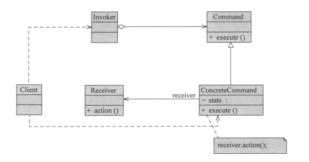
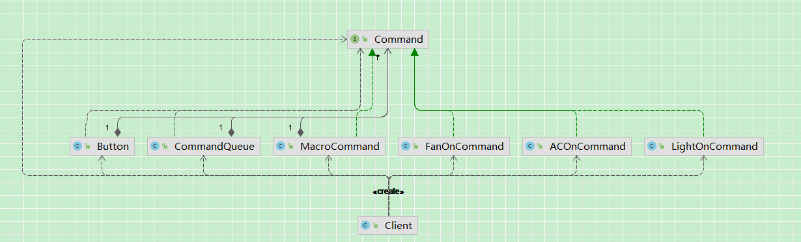

## 引入

​	假设我们正在做一个“智能家居控制面板”，有一个按钮控制电灯。

后面又有了新的需求：

1、支持不同设备

​	现在按钮不仅要控制灯，还要控制：风扇、空调、音响

2、支持“撤销操作”（Undo）

​	按下按钮执行操作后，可以撤销上一步（比如关灯 → 再按撤销 → 灯重新打开）

3、支持“操作队列”（延迟执行）

例如：定时任务（晚上自动关灯） 

4、支持“宏命令”（组合操作）

​	一个按钮执行一组操作（回家模式 / 离家模式），比如 离家模式：关灯 + 关空调 + 关门

## 传统方法实现

### 几类电器：

~~~ java
// 空调
public class AirConditioner {
    public void on() {
        System.out.println("空调打开");
    }

    public void off() {
        System.out.println("空调关闭");
    }
}
// 风扇
public class Fan {
    public void start() {
        System.out.println("风扇启动");
    }

    public void stop() {
        System.out.println("风扇停止");
    }
}
// 灯
public class Light {
    public void on() {
        System.out.println("灯打开了");
    }

    public void off() {
        System.out.println("灯关闭了");
    }
}
~~~

### 原始需求实现：

~~~ java
// 按钮
public class Button {
    private Light light;

    public Button(Light light) {
        this.light = light;
    }

    public void click() {
        light.on();
    }
}
// 客户端
    public static void excute1() {
        Light light = new Light();
        Button button = new Button(light);
        // 打开灯
        button.click();
    }
~~~

### 新需求-支持多种设备实现：

~~~ java
public class Button2 {
    private Object device;

    public Button2(Object device) {
        this.device = device;
    }

    public void click() {
        if (device instanceof Light) {
            ((Light) device).on();
        } else if (device instanceof Fan) {
            ((Fan) device).start();
        } else if (device instanceof AirConditioner) {
            ((AirConditioner) device).on();
        }
    }
}
// 客户端
    public static void excute2() {
        Button2 lightBtn = new Button2(new Light());
        Button2 fanBtn = new Button2(new Fan());

        lightBtn.click();
        fanBtn.click();
    }
~~~

### 新需求-支持撤销:

~~~java
public class Button3 {
    private Light light;
    // 记录上一次状态
    private boolean lastState;

    public Button3(Light light) {
        this.light = light;
    }

    public void click() {
        light.on();
        lastState = true;
    }

    public void undo() {
        if (lastState) {
            light.off();
        }
    }
}
// 客户端
    public static void excute3() {
        Button3 lightBtn = new Button3(new Light());

        lightBtn.click();
        lightBtn.undo();
    }
~~~

### 新需求-支持操作队列（延迟执行）：

~~~ java
public class Button4 {

    private Queue<Runnable> queue = new LinkedList<>();

    public void addTask(Runnable task) {
        queue.add(task);
    }

    public void executeTasks() {
        while (!queue.isEmpty()) {
            queue.poll().run();
        }
    }
}
// 客户端
    public static void excute4() {
        Light light = new Light();
        Fan fan = new Fan();

        Button4 button = new Button4();

        // 添加任务
        button.addTask(() -> light.on());
        button.addTask(() -> fan.start());

        // 执行任务
        button.executeTasks();
    }
~~~

### 新需求-支持宏命令（组合操作）：

~~~ java
public class Button5 {

    private Light light;
    private Fan fan;
    private AirConditioner ac;

    public Button5(Light light, Fan fan, AirConditioner ac) {
        this.light = light;
        this.fan = fan;
        this.ac = ac;
    }

    // 一键执行多个操作（离家模式）
    public void click() {
        light.off();
        fan.stop();
        ac.off();
    }
}
// 客户端
    public static void excute5() {
        Light light = new Light();
        Fan fan = new Fan();
        AirConditioner ac = new AirConditioner();

        Button5 button = new Button5(light, fan, ac);

        // 一键执行
        button.click();
    }
~~~

## 命令模式实现

### 传统方法分析

### 问题

​	对于原始需求，结构简单、调用直接，没有其他问题。但是，一旦引入了新需求，就出现了一系列的问题：

#### 问题1：

​	添加多设备时，需要改动按钮类，出现大量if-else，且强依赖具体设备类。

```java
public class Button2 {
    private Object device;
    public Button2(Object device) {
        this.device = device;
    }
    public void click() {
        if (device instanceof Light) {
            ((Light) device).on();
        } else if (device instanceof Fan) {
            ((Fan) device).start();
        } else if (device instanceof AirConditioner) {
            ((AirConditioner) device).on();
        }
    }
}
```
#### 问题2：

​	引入支持撤销动作需求后，严重依赖具体设备，比如这里就只能使用Light，换成其他设备就会失效。

​	且撤销逻辑耦合在 Button 中，需要让按钮知道如何撤销，而非是设备自身去撤销。

​	多个设备的话，就需要加大量的if-else了。

​	本质上，**“操作的反向逻辑”无法抽象，导致调用者承担过多责任**

​	即：**系统中并没有“操作”的统一抽象，导致无法为不同操作定义统一的“正向执行 + 反向撤销”结构**

~~~ java
class Button {
    private Light light;
 	 	// 记录上一次状态
    private boolean lastState; 
    public Button(Light light) {
        this.light = light;
    }
    public void click() {
        light.on();
        lastState = true;
    }
    public void undo() {
        if (lastState) {
            light.off();
        }
    }
}
~~~

####  问题3：

​	引入支持操作队列（延迟执行）需求时，可以发现：

1. 操作是“临时函数”：不可复用、不可持久化、不可记录
2. 无法统一扩展能力：想要扩展undo、日志、权限控制等操作时，`Runnable` 不支持。
3. 缺乏结构语义：这只是“代码块”，不是“业务操作对象”

本质上，`Runnable` 只是对“执行逻辑”的封装，而不是对“业务操作”的抽象，因此无法承载更丰富的行为语义。

~~~ java
public class Button4 {
    private Queue<Runnable> queue = new LinkedList<>();
    public void addTask(Runnable task) {
        queue.add(task);
    }
    public void executeTasks() {
        while (!queue.isEmpty()) {
            queue.poll().run();
        }
    }
}
// 客户端
    public static void excute4() {
        Light light = new Light();
        Fan fan = new Fan();
        Button4 button = new Button4();
        // 添加任务
        button.addTask(() -> light.on());
        button.addTask(() -> fan.start());
        // 执行任务
        button.executeTasks();
    }
~~~

#### 问题4：

​	引入需求支持宏命令（组合操作）时，也会有如下问题：

1. 强耦合:Button 直接依赖所有设备
2. 无法复用:每个组合都要写一遍代码
3. 无法动态配置:无法运行时组合

本质上，系统缺乏对“操作”的统一抽象，导致无法将多个操作进行组合与复用。

~~~ java
class Button {
    public void click() {
        light.off();
        fan.stop();
        ac.off();
    }
}
~~~

#### 问题总结：

| 需求   | 问题本质     |
| ------ | ------------ |
| 多设备 | if-else膨胀  |
| 撤销   | 调用不可逆   |
| 队列   | 操作不可存储 |
| 宏命令 | 操作不可组合 |

最终指向一个核心问题：**“操作只是调用，不是对象”**

### 优化：

**核心问题：**

​	请求在当前设计中只是“一次调用”，而不是“一个可以被操作的对象”，  因此无法对其进行统一管理。

**直接后果：**

- 无法撤销（缺乏统一的操作结构）
- 无法排队（请求无法稳定存储）
- 无法组合（操作之间无法抽象与复用）
- 无法扩展（逻辑分散，难以统一增强）

**关键转折：**

​	如果将“操作请求”封装为对象，使其具备统一结构，那么上述问题将可以被统一解决。

### 定义

#### 类图：



#### 角色说明：

**1.`Command`（抽象命令类）**

​	抽象命令类一般是一个接口，在其中声明了用于执行请求的execute（）等方法，通过这些方法可以调用请求接收者的相关操作。

**2.`ConcreteCommand`（具体命令类）**

​	具体命令类是抽象命令类的子类，实现了在抽象命令类中声明的方法，它对应具体的接收者对象，绑定接收者对象的动作。

​	在实现execute（）方法时，将调用接收者对象的相关操作（Action）。

**3.Invoker（调用者）**

​	调用者即请求的发送者，又称为请求者，它通过命令对象来执行请求。

​	一个调用者并不需要在设计时确定其接收者，因此它只与抽象命令类之间存在关联关系。

​	在程序运行时将调用具体命令对象的execute（）方法，间接调用接收者的相关操作。

**4.Receiver（接收者）**

​	接收者执行与请求相关的操作，它具体实现对请求的业务处理。

**5.Client（客户类）**

​	在客户类中需要创建发送者对象和具体命令类对象，在创建具体命令对象时指定其对应的接收者，发送者和接收者之间无直接关系，通过具体命令对象实现间接调用。

### 源码

类图：



代码：

#### Button 按钮类(Invoker)

~~~ java
/**
 * 按钮（调用者 Invoker）
 */
public class Button {

    private Command command;

    public void setCommand(Command command) {
        this.command = command;
    }

    public void click() {
        command.execute();
    }

    public void undo() {
        command.undo();
    }
}
~~~

#### 各种命令

​	使用Command，将具体操作抽象。

~~~ java
/**
 * 命令接口
 */
public interface Command {
    void execute();

    // 支持撤销
    void undo();
}
// 空调开启命令
public class ACOnCommand implements Command {

    private AirConditioner ac;

    public ACOnCommand(AirConditioner ac) {
        this.ac = ac;
    }

    @Override
    public void execute() {
        ac.on();
    }

    @Override
    public void undo() {
        ac.off();
    }
}
// 启动风扇命令
public class FanOnCommand implements Command {

    private Fan fan;

    public FanOnCommand(Fan fan) {
        this.fan = fan;
    }

    @Override
    public void execute() {
        fan.start();
    }

    @Override
    public void undo() {
        fan.stop();
    }
}
// 开灯命令
public class LightOnCommand implements Command {

    private Light light;

    public LightOnCommand(Light light) {
        this.light = light;
    }

    @Override
    public void execute() {
        light.on();
    }

    @Override
    public void undo() {
        light.off();
    }
}

~~~

#### 新需求-支持多种设备实现：

​	无需像传统方式一样，大量`if-else`，不再依赖具体设备，新增设备时只需要新增一个对应设备的命令接口实现类即可(符合开闭原则)。

```java
// 客户端：支持多设备
    public static void execute1() {
        Button button = new Button();

        button.setCommand(new LightOnCommand(new Light()));
        button.click();

        button.setCommand(new FanOnCommand(new Fan()));
        button.click();
    }
```

#### 新需求-支持撤销:

​	每个命令自带 undo，Button 不需要知道撤销逻辑

```java
    // 支持撤销
    public static void execute2() {
        Button button = new Button();

        button.setCommand(new LightOnCommand(new Light()));

        button.click();  // 开灯
        button.undo();   // 关灯
    }
```

#### 新需求-支持操作队列（延迟执行）：

​	操作是对象（可存储） 

​	可扩展（日志 / 权限 / retry） 

​	不再是临时 lambda

```java
public class CommandQueue {
    private Queue<Command> queue = new LinkedList<>();
    public void addCommand(Command command) {
        queue.add(command);
    }
    public void execute() {
        while (!queue.isEmpty()) {
            queue.poll().execute();
        }
    }
}
// 客户端
    // 支持操作队列（延迟执行）
    public static void execute3() {
        CommandQueue queue = new CommandQueue();

        queue.addCommand(new LightOnCommand(new Light()));
        queue.addCommand(new FanOnCommand(new Fan()));

        queue.execute();
    }
```

#### 新需求-支持宏命令（组合操作）：

​	操作可组合 

​	可复用已有命令 

​	支持动态组装

```java
/**
 * 宏命令（组合命令）
 */
public class MacroCommand implements Command {
    private List<Command> commands;
    public MacroCommand(List<Command> commands) {
        this.commands = commands;
    }
    @Override
    public void execute() {
        for (Command command : commands) {
            command.execute();
        }
    }
    @Override
    public void undo() {
        for (Command command : commands) {
            command.undo();
        }
    }
}
// 客户端
    // 支持宏命令（组合操作）
    public static void execute4() {
        Command light = new LightOnCommand(new Light());
        Command fan = new FanOnCommand(new Fan());
        Command ac = new ACOnCommand(new AirConditioner());

        Command macro = new MacroCommand(Arrays.asList(light, fan, ac));

        Button button = new Button();
        button.setCommand(macro);

        button.click();  // 一键执行多个操作
    }
```

### 总结

通过命令模式，将“操作”从“方法调用”提升为“对象”，从而使系统具备以下能力：

- 请求参数化（不同命令代表不同操作）
- 请求排队（CommandQueue）
- 请求记录（可扩展日志 / 历史）
- 请求撤销（undo）
- 请求组合（MacroCommand）

本质上，命令模式实现了：**将“调用行为”转化为“可管理的数据对象”**

## 思考

### 一、命令模式的本质

​	命令模式的核心并不仅仅是“解耦调用者和接收者”，而是： **将“操作请求”从“一次调用”提升为“一个对象”**

#### 1. 从“调用”到“对象”的转变

在传统方式中：

```
light.on();
```

-  操作是一次瞬时调用 
-  不可存储、不可传递、不可管理 

而在命令模式中：

```
Command cmd = new LightOnCommand(light);
```

-  操作被封装为对象 
-  可以被存储、传递、组合、记录 

#### 2. 本质能力提升

将“操作对象化”后，系统具备了以下能力：

-  ✔ 请求参数化（不同命令代表不同操作） 
-  ✔ 请求排队（任务队列） 
-  ✔ 请求记录（操作日志） 
-  ✔ 请求撤销（undo） 
-  ✔ 请求组合（宏命令） 

------

#### 3. 本质总结

命令模式的本质是：**将行为（方法调用）抽象为数据（对象），从而实现对行为的统一管理。**

### 二、与类似设计模式对比

命令模式容易与策略模式、职责链模式混淆，本质区别如下：

------

#### 1. 命令模式 vs 策略模式

| 维度         | 命令模式             | 策略模式              |
| ------------ | -------------------- | --------------------- |
| 本质         | 封装“请求”           | 封装“算法”            |
| 关注点       | 谁来执行操作         | 如何执行操作          |
| 调用方式     | Invoker 调用 Command | Context 调用 Strategy |
| 是否支持撤销 | ✔ 常见               | ❌ 一般不支持          |
| 是否可队列化 | ✔ 支持               | ❌ 一般不支持          |

**一句话区别：**

-  策略模式：替换算法 
-  命令模式：封装调用 

------

#### 2. 命令模式 vs 职责链模式

| 维度     | 命令模式           | 职责链模式         |
| -------- | ------------------ | ------------------ |
| 本质     | 封装请求           | 传递请求           |
| 执行方式 | 一个命令执行一次   | 多个处理者逐级处理 |
| 控制权   | Invoker 控制       | 链条动态决定       |
| 使用场景 | 操作抽象、任务管理 | 过滤器、审批流     |

**一句话区别：**

-  命令模式：谁执行是确定的 
-  职责链模式：谁执行是动态的 

### 三、命令模式的不同实现（扩展）方式

| 实现方式                | 结构特点                 | 核心能力             | 优点                        | 局限性                             | 适用场景                     |
| ----------------------- | ------------------------ | -------------------- | --------------------------- | ---------------------------------- | ---------------------------- |
| 简化版命令              | 仅包含 execute()         | 解耦调用与执行       | 实现简单、结构清晰          | 不支持撤销、记录等高级能力         | 仅需解耦调用的简单场景       |
| 增强版命令（支持 undo） | execute() + undo()       | 支持操作回滚         | 可实现撤销/重做             | 每个命令需实现反向逻辑，复杂度增加 | 编辑器、事务回滚等场景       |
| 队列化命令              | Command + Queue          | 支持延迟执行、批处理 | 可排队、调度、扩展日志/重试 | 需要额外管理队列、状态             | 任务调度、线程池、消息队列   |
| 宏命令（组合命令）      | Command 组合多个 Command | 支持操作组合         | 可复用、可动态组装          | 组合复杂时管理成本增加             | 批量操作、一键执行多个动作   |
| 函数式实现（Lambda）    | 使用 Runnable/函数式接口 | 简化命令定义         | 代码简洁、轻量              | 无法支持 undo、缺乏语义            | 简单任务执行、临时操作       |
| 命令日志（可恢复系统）  | Command + 日志存储       | 支持操作记录与回放   | 可实现系统恢复、审计        | 实现复杂、存储成本高               | 审计系统、操作回放、容错恢复 |

### 四、对设计原则的体现

| 设计原则            | 体现方式               | 具体表现                                                  | 带来的好处                   |
| ------------------- | ---------------------- | --------------------------------------------------------- | ---------------------------- |
| 开闭原则（OCP）     | 新增命令类扩展功能     | 新增设备/操作只需新增 Command 实现类                      | 避免修改已有代码，提升扩展性 |
| 单一职责原则（SRP） | 各角色职责清晰         | Command 负责请求封装，Receiver 负责执行，Invoker 负责触发 | 降低复杂度，提高可维护性     |
| 依赖倒置原则（DIP） | 依赖抽象而非具体实现   | Invoker 依赖 Command 接口，而非具体设备类                 | 降低耦合，提高灵活性         |
| 组合复用原则（CRP） | 使用组合代替继承       | MacroCommand 组合多个 Command                             | 提高复用性，避免继承膨胀     |
| 迪米特法则（LoD）   | 减少对象之间的直接交互 | Invoker 不直接依赖 Receiver，仅与 Command 交互            | 降低系统耦合，减少依赖传播   |

## 优缺点

### 优点

| 优点                        | 体现方式                                     | 本质说明                           | 工程价值                     |
| --------------------------- | -------------------------------------------- | ---------------------------------- | ---------------------------- |
| 解耦调用者与接收者          | Invoker 依赖 Command 抽象，而非具体 Receiver | 依赖从“具体实现”转为“抽象接口”     | 降低耦合，提高系统灵活性     |
| 良好的扩展性（开闭原则）    | 新增操作只需新增 Command 实现类              | 将“变化点”隔离在命令类中           | 扩展功能无需修改已有代码     |
| 支持命令组合与批处理        | 宏命令（MacroCommand）、命令队列             | 操作具备统一结构，可被组织和编排   | 支持批量操作、流程编排       |
| 支持撤销与恢复（Undo/Redo） | 每个命令实现 undo，结合历史记录              | 操作从“不可逆调用”变为“可回溯行为” | 适用于编辑器、事务回滚等场景 |
| 支持操作记录与回放          | 命令对象可持久化（日志）                     | 操作可被数据化存储                 | 支持审计、系统恢复、回放     |

### 缺点

| 缺点             | 体现方式                      | 本质说明                 | 工程影响               |
| ---------------- | ----------------------------- | ------------------------ | ---------------------- |
| 命令类数量膨胀   | 每个操作对应一个具体命令类    | 抽象粒度变细，类数量增加 | 增加开发与维护成本     |
| 系统复杂度提升   | 引入 Command 抽象层和额外对象 | 用“间接性”换“灵活性”     | 简单场景下可能过度设计 |
| 部分功能实现复杂 | undo 需实现反向操作           | 并非所有操作都天然可逆   | 增加设计难度和实现成本 |

## 适用场景

命令模式适用于对“操作本身”需要管理的场景：
- 解耦调用关系
- 控制执行时机（延迟 / 队列）
- 支持操作回溯（Undo / Redo）
- 支持操作组合（宏命令）

如果操作只是简单调用且无需扩展，则不适用。

| 场景                              | 体现方式                                      | 本质说明                               | 工程示例 / 典型场景                                   |
| --------------------------------- | --------------------------------------------- | -------------------------------------- | ----------------------------------------------------- |
| 解耦请求调用者与接收者            | 调用者依赖 Command 抽象，Receiver 专注业务    | 将“调用关系”转为“对象依赖”，降低耦合   | UI 按钮 → 业务操作，控制器 → 服务调用解耦             |
| 支持请求调度（延迟 / 队列化）     | 命令对象可存储，独立于调用者生命周期          | 请求具备独立生命周期，可延迟或异步执行 | 任务队列、线程池、消息队列、定时任务                  |
| 支持操作撤销与恢复（Undo / Redo） | 每个命令封装 execute() + undo()，结合历史记录 | 操作从“不可逆调用”变为“可回溯行为”     | 编辑器撤销/重做、事务回滚、数据补偿                   |
| 支持操作组合与批量执行（宏命令）  | 宏命令组合多个命令对象                        | 操作具备组合性，可批处理               | 一键执行多个设备操作（如“离家模式”）、工作流/流程编排 |

## 应用

### **JDK 示例： Runnable / Executor**

-  **Invoker**：`Executor`（执行器） 
-  **Command**：`Runnable`（任务封装对象） 
-  **Receiver**：具体任务逻辑，例如 `ThreadPoolExecutor` 内部线程执行的任务 
- 特点
  1.  调用者和任务执行者解耦 
  2.  支持延迟执行、队列化执行 
  3.  命令对象可复用、存储、组合（批量提交任务） 

```java
Executor executor = Executors.newFixedThreadPool(2);
Runnable task = () -> System.out.println("执行任务");
executor.execute(task);  // Invoker 调用 Command
```

**分析**：
	`Runnable` 封装操作，Executor 不关心具体任务逻辑，实现了命令模式的核心思想：操作是对象，Invoker 与 Receiver 解耦。

### 委派事件模型

​	Java语言使用命令模式实现AWT/SwingGUI的委派事件模型（DelegationEventModel，DEM)。

​	在AWT/Swing中，Frame、Button等界面组件是请求发送者，而AWT提供的事件监听器接口和事件适配器类是抽象命令接口，用户可以自已写抽象命令接口的子类来实现事件处理，即实现具体命令类，而在具体命令类中可以调用业务处理方法来实现该事件的处理。

​	对于界面组件而言，只需要了解命令接口即可，无须关心接口的实现，组件类并不关心实际操作，而操作由用户来实现。

​	在实现时，可以结合观察者模式，将具体命令对象注册到组件类中，组件在事件触发时将回调（Callback）具体命令类中定义的事件处理方法，从而实现事件处理。

例如：

​	对于一个按钮事件：

​	按钮类JButton充当请求调用者

​	事件监听接口ActionListener充当抽象命令类

​	实现ActionListener接口的子类充当具体命令类，在具体命令类中可以调用业务类来实现事件处理，如数据操作类。

### **场景：智能家居一键控制系统**

-  **Invoker**：智能面板按钮 `Button` 
-  **Command**：具体命令对象 `LightOnCommand` / `FanOnCommand` / `ACOnCommand` 
-  **Receiver**：设备对象 `Light` / `Fan` / `AirConditioner` 
- 特点
  1.  每个设备操作封装成命令类 
  2.  支持撤销（undo）、组合（宏命令）、队列执行 
  3.  新设备或新操作无需修改按钮类，实现开闭原则 

```java
// 组合命令（宏命令）
Command light = new LightOnCommand(new Light());
Command fan = new FanOnCommand(new Fan());
Command ac = new ACOnCommand(new AirConditioner());

Command macro = new MacroCommand(Arrays.asList(light, fan, ac));
Button button = new Button();
button.setCommand(macro);
button.click(); // 一键执行所有设备
```

**分析**：

> -  命令模式让“操作对象化”，支持动态组合 
> -  Button（Invoker）无需关心设备类型 
> -  系统可扩展性强：新增设备只需新增命令类 
> -  支持撤销和队列操作，增强业务灵活性