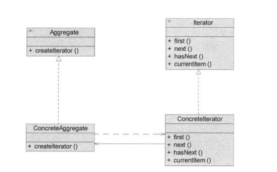
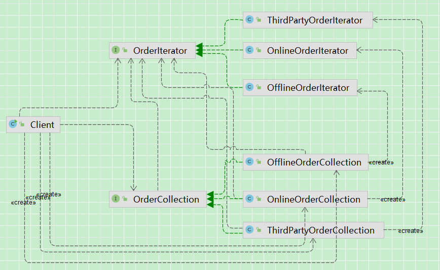

## 引入

​	现在在一个电商系统内，遍历所有订单并进行处理（例如打印、统计金额等）。

目前有两种订单数据：

线上订单：

​	数据来自数据库，用 `List` 存储

~~~ java
class OnlineOrderCollection {
    private List<Order> orders;
}
~~~

线下订单：

​	数据来自导入文件，用 **数组** 存储

~~~ java
class OfflineOrderCollection {
    private Order[] orders;
}
~~~

后面发生了需求变更，出现了新的订单类型：

第三方平台订单（比如美团/淘宝）：

~~~ java
class ThirdPartyOrderCollection {
    private LinkedList<Order> orders;
}
~~~

又有新的订单类型：

~~~ java
void processThirdPartyOrders(ThirdPartyOrderCollection third) {
    LinkedList<Order> orders = third.getOrders();
    // 又一套遍历逻辑...
}
~~~

## 传统方法实现

订单类：

~~~ java
/**
 * @author: gj
 * @description: 订单类
 */
public class Order {
    private String name;
    private double price;
}
~~~

线上订单和线下订单集合:

~~~ java
/**
 * 线下导入订单
 */
public class OfflineOrderCollection {
    private Order[] orders;
    public OfflineOrderCollection(Order[] orders) {
        this.orders = orders;
    }
}
/**
 * 线上订单
 */
public class OnlineOrderCollection {
    private List<Order> orders;
    public OnlineOrderCollection(List<Order> orders) {
        this.orders = orders;
    }
}
~~~

客户端：

​	客户端需要判断到底是哪种订单来源，且需要负责不同订单实际遍历的逻辑实现。

~~~ java
/**
 * @author: gj
 * @description: 客户端
 */
public class Client {
    public static void main(String[] args) {
        // 从某处得到订单集合
        Order[] orders = new Order[]{new Order("1", 1), new Order("2", 2)};
        OnlineOrderCollection onlineOrders = new OnlineOrderCollection(Arrays.asList(orders));
        OfflineOrderCollection offlineOrderCollection = new OfflineOrderCollection(orders);
        ThirdPartyOrderCollection thirdPartyOrderCollection = new ThirdPartyOrderCollection(new LinkedList<>(Arrays.asList(orders)));

        processOrders(onlineOrders);
        processOrders(offlineOrderCollection);

    }

    static void processOrders(Object orderCollection){
        if(orderCollection instanceof OnlineOrderCollection){
            OnlineOrderCollection online = (OnlineOrderCollection) orderCollection;
            List<Order> orders = online.getOrders();
            for (int i = 0; i < orders.size(); i++) {
                System.out.println(orders.get(i));
            }
        }else if(orderCollection instanceof OfflineOrderCollection){
            OfflineOrderCollection offline = (OfflineOrderCollection) orderCollection;
            Order[] orders = offline.getOrders();
            for (int i = 0; i < orders.length; i++) {
                System.out.println(orders[i]);
            }
        }
    }
}
~~~

新需求：

​	引入三方订单。

~~~ java
/**
 * 三方订单
 */
public class ThirdPartyOrderCollection {
    private LinkedList<Order> orders;
    public ThirdPartyOrderCollection(LinkedList<Order> orders) {
        this.orders = orders;
    }
}
  
// 客户端需要新实现一个新集合的遍历方法
    static void processOrders(Object orderCollection){
        if(orderCollection instanceof OnlineOrderCollection){
            OnlineOrderCollection online = (OnlineOrderCollection) orderCollection;
            List<Order> orders = online.getOrders();
            for (int i = 0; i < orders.size(); i++) {
                System.out.println(orders.get(i));
            }
        }else if(orderCollection instanceof OfflineOrderCollection){
            OfflineOrderCollection offline = (OfflineOrderCollection) orderCollection;
            Order[] orders = offline.getOrders();
            for (int i = 0; i < orders.length; i++) {
                System.out.println(orders[i]);
            }
         // 新增三方平台的遍历方式
        }else if(orderCollection instanceof ThirdPartyOrderCollection){
            ThirdPartyOrderCollection third = (ThirdPartyOrderCollection) orderCollection;
            LinkedList<Order> orders = third.getOrders();
            for (int i = 0; i < orders.size(); i++) {
                System.out.println(orders.get(i));
            }
        }
    }
~~~

## 迭代器模式实现

### 传统方法分析

#### 问题

**1、严重依赖内部结构（违反封装原则）**

客户端在遍历订单时，必须显式获取集合内部数据结构：

```java
List → size + get
数组 → length + []
LinkedList → size + get
```

即客户端必须知道：**“这个订单集合底层是如何存储数据的”**

这导致：

-  集合的内部实现细节暴露给外部 
-  一旦数据结构发生变化（如数组 → List），客户端代码必须修改 

**2、无法统一遍历方式（缺乏抽象）**

不同集合的遍历方式完全不同：

-  数组遍历 
-  List 遍历 
-  LinkedList 遍历 

导致客户端必须为每种集合编写不同逻辑，**系统缺乏统一的遍历接口**：

```java
processOnlineOrders(...)
processOfflineOrders(...)
processThirdPartyOrders(...)
```

**3、客户端扩展困难（违反开闭原则）**

当新增一种订单集合（如三方订单）时：

-  必须修改 `processOrders` 方法 
-  新增 `else if` 分支 
-  增加新的遍历逻辑 

```java
}else if(orderCollection instanceof ThirdPartyOrderCollection){
    ...
}
```

### 优化：

**核心问题：**

​	集合的遍历依赖具体存储结构（如数组、List、LinkedList），遍历逻辑分散在客户端代码中，缺乏统一的访问方式，
​	因此无法对不同集合进行统一遍历和处理。

**直接后果：**

-  无法统一遍历（不同结构对应不同遍历方式） 
-  无法扩展（新增集合类型需要修改客户端代码） 
-  无法封装（集合内部结构暴露给外部） 
-  无法复用（遍历逻辑在各处重复实现） 
-  代码膨胀（大量 `instanceof + 分支判断`） 

------

**关键转折：**

​	如果将“遍历行为”从集合中抽离出来，并抽象为一个独立的对象（迭代器），使其具备统一的访问接口（如 `hasNext / next`），
​	同时让集合只负责“提供迭代器”，而不暴露内部结构，那么上述问题将可以被统一解决。

​	即：**从“基于具体结构的遍历” → 转变为“基于统一接口的访问”**

### 定义

#### 类图：



#### 角色说明：

**1.`Iterator`（抽象迭代器）**

​	抽象迭代器定义了访问和遍历元素的接口，一般声明如下方法：

​		用于获取第一个元素的`first()`

​		用于访问下一个元素的`next()`

​		用于判断是否还有下一个元素的`hasNext()`

​		用于获取当前元素的`currentItem()`

**2.`Concretelterator`（具体迭代器）**

​	具体迭代器实现了抽象迭代器接口，完成对聚合对象的遍历，同时在对聚合进行遍历时跟踪其当前位置。

**3.`Aggregate`（抽象聚合类）**

​	抽象聚合类用于存储对象，并定义创建相应选代器对象的接口，声明一个`createIterator()`方法用于创建一个迭代器对象。

**4.`ConcreteAggregate`（具体聚合类）**

​	具体聚合类实现了创建相应选代器的接口，实现了在聚合类中声明的`createIterator()`方法，该方法返回一个与该具体聚合对应的具体选代器`ConcreteIterator`实例。

### 源码

类图：



代码：

订单集合接口和订单迭代器接口：

~~~ java
/**
 * 订单集合接口,提供迭代器能力(抽象聚合类:Aggregate)
 */
public interface OrderCollection {
    OrderIterator iterator();
}
/**
 * 订单迭代器接口(抽象迭代器:Iterator)
 */
public interface OrderIterator {
    // 是否有下一个订单
    boolean hasNext();

    // 获取下一个订单
    Order next();
}

~~~

订单迭代器实现类：

~~~ java
/**
 * 线下订单迭代器，基于数组(具体迭代器：Concretelterator)
 */
public class OfflineOrderIterator implements OrderIterator {
    private Order[] orders;
    private int cursor = 0;
    public OfflineOrderIterator(Order[] orders) {
        this.orders = orders;
    }
    @Override
    public boolean hasNext() {
        return cursor < orders.length;
    }
    @Override
    public Order next() {
        return orders[cursor++];
    }
}

/**
 * 线上订单迭代器,基于 List(具体迭代器：Concretelterator)
 */
public class OnlineOrderIterator implements OrderIterator {
    private List<Order> orders;
    private int cursor = 0;
    public OnlineOrderIterator(List<Order> orders) {
        this.orders = orders;
    }
    @Override
    public boolean hasNext() {
        return cursor < orders.size();
    }
    @Override
    public Order next() {
        return orders.get(cursor++);
    }
}

/**
 * 三方订单迭代器，基于 LinkedList，(具体迭代器：Concretelterator)
 */
public class ThirdPartyOrderIterator implements OrderIterator {
    private LinkedList<Order> orders;
    private int cursor = 0;
    public ThirdPartyOrderIterator(LinkedList<Order> orders) {
        this.orders = orders;
    }
    @Override
    public boolean hasNext() {
        return cursor < orders.size();
    }
    @Override
    public Order next() {
        return orders.get(cursor++);
    }
}
~~~

订单集合实现类：

~~~ java
/**
 * 线下订单集合（具体聚合类：ConcreteAggregate）
 */
public class OfflineOrderCollection implements OrderCollection {
    private Order[] orders;
    public OfflineOrderCollection(Order[] orders) {
        this.orders = orders;
    }
    @Override
    public OrderIterator iterator() {
        return new OfflineOrderIterator(orders);
    }
}
/**
 * 线上订单集合（具体聚合类：ConcreteAggregate）
 */
public class OnlineOrderCollection implements OrderCollection {
    private List<Order> orders;
    public OnlineOrderCollection(List<Order> orders) {
        this.orders = orders;
    }
    @Override
    public OrderIterator iterator() {
        return new OnlineOrderIterator(orders);
    }
}
/**
 * 三方订单集合（具体聚合类：ConcreteAggregate）
 */
public class ThirdPartyOrderCollection implements OrderCollection {
    private LinkedList<Order> orders;
    public ThirdPartyOrderCollection(LinkedList<Order> orders) {
        this.orders = orders;
    }
    @Override
    public OrderIterator iterator() {
        return new ThirdPartyOrderIterator(orders);
    }
}
~~~

## 思考

### 一、迭代器模式的本质

​	迭代器模式的核心在于：**将集合的遍历行为从集合对象中抽离出来，封装为独立的迭代器对象，并通过统一接口对外提供访问能力。**

​	**将“遍历行为 + 遍历状态”从集合中解耦，统一为可复用的访问机制。**

**本质拆解：**

-  **行为抽离**：将“如何遍历”从集合中分离出来 
-  **统一接口**：通过 `hasNext / next` 提供统一访问方式 
-  **状态外置**：遍历过程中的游标（cursor）由迭代器维护，而不是集合维护 
-  **结构解耦**：客户端无需关心底层是数组、List 还是其他结构 

#### **为什么引入 Aggregate，而不是让集合直接实现 Iterator？（关键）**

在设计上，存在两种选择：

##### **方案一：集合直接实现 Iterator**

```
class OrderCollection implements Iterator {
    // 内部维护 cursor
}
```

**存在问题：**

1、**职责混乱（违反单一职责原则）**

-  集合：负责存储数据 
-  迭代器：负责遍历数据 

2、 **无法支持多个遍历状态（核心问题）** 

```
Iterator it1 = collection;
Iterator it2 = collection;
```

本质上共享同一个 cursor：

-  it1 和 it2 会互相干扰 
-  无法同时多次遍历 

3、**无法支持多种遍历方式** 

例如：

-  正序遍历 
-  逆序遍历 
-  过滤遍历 

如果集合本身就是 Iterator：很难扩展多种遍历策略 

##### 方案二：引入 Aggregate（Iterable）

```
interface Aggregate {
    Iterator iterator();
}
```

集合职责变为：**负责“提供迭代器”，而不是“执行遍历”**

**带来的优势：**

1、**职责清晰** 

-  集合：存储数据 
-  迭代器：遍历数据 

2、**支持多个迭代器实例** 

每个 iterator 都有独立 cursor 

```java
Iterator it1 = collection.iterator();
Iterator it2 = collection.iterator();
```

3、**支持多种遍历方式** 

​	遍历策略可扩展 

```java
iterator()
reverseIterator()
filterIterator()
```

4、**抽象“可遍历能力”** 

​	通过 Aggregate（或 JDK 的 Iterable）， 判断一个对象是否支持遍历 ✔

```java
obj instanceof Iterable
```

### 二、迭代器模式的不同实现方式

| 实现方式                        | 核心特点                            | 优点                     | 缺点                 | 适用场景                   |
| ------------------------------- | ----------------------------------- | ------------------------ | -------------------- | -------------------------- |
| 外部迭代器（External Iterator） | 客户端控制遍历（`hasNext/next`）    | 灵活、可中断、可嵌套遍历 | 使用稍复杂           | 复杂遍历逻辑、需要控制流程 |
| 内部迭代器（Internal Iterator） | 集合内部控制遍历（如 `forEach`）    | 使用简单、代码简洁       | 不易中断、控制能力弱 | 简单遍历、函数式处理       |
| 基于索引的迭代器                | 使用 cursor + 索引访问              | 实现简单、性能高         | 依赖随机访问结构     | 数组、ArrayList            |
| 惰性迭代（Lazy Iterator）       | 按需生成元素                        | 节省内存、支持大数据     | 实现复杂             | 流式处理、大数据场景       |
| 多策略迭代器                    | 提供多种 iterator（正序/逆序/过滤） | 扩展性强、灵活           | 需要设计多种实现类   | 复杂业务遍历需求           |
| 快照迭代器（Snapshot Iterator） | 遍历基于数据快照                    | 避免并发修改问题         | 额外内存开销         | 并发读多写少场景           |
| 失败快速迭代器（Fail-Fast）     | 检测结构修改立即抛异常              | 保证一致性               | 不适合并发修改       | JDK 集合（ArrayList 等）   |

## 优缺点

### 优点

**1、支持多种遍历方式（行为可扩展）**

​	迭代器将遍历逻辑独立封装，使得同一个聚合对象可以通过不同的迭代器实现多种遍历方式（如正序、逆序、过滤等），只需替换迭代器即可改变遍历算法，而无需修改聚合对象或客户端代码。

**2、简化聚合类职责（职责清晰）**

​	引入迭代器后，聚合对象只负责数据存储，不再承担遍历逻辑，从而降低类的复杂度，符合**单一职责原则**。

**3、支持多重遍历（状态隔离）**

​	每个迭代器独立维护遍历状态（cursor），因此可以在同一聚合对象上同时进行多个遍历操作，互不干扰。

**4、良好的扩展性（符合开闭原则）**

​	新增聚合类或新增遍历方式时：

-  无需修改已有代码 
-  只需增加新的迭代器或聚合实现 

### 缺点

**1、类数量增加（结构复杂度上升）**

​	每个聚合通常需要对应一个或多个迭代器实现类，在系统中会形成“集合类 + 迭代器类”的配对结构，增加类的数量。

**2、简单场景下可能过度设计**

​	对于结构简单、遍历方式固定的集合，直接使用基础循环（如 `for`）即可完成需求，引入迭代器模式反而增加理解和实现成本。

**3、实现复杂度提升（尤其是特殊迭代器）**

​	在实现复杂遍历（如过滤、分页、惰性加载、并发安全）时：

-  需要额外维护状态 
-  可能引入一致性或性能问题 

## 适用场景

**1、需要隐藏聚合对象内部结构**

​	当不希望客户端直接访问集合内部数据结构（如数组、List、树结构）时，可以通过迭代器提供统一访问方式，实现**封装与解耦**。

**2、需要统一遍历不同类型的集合**

​	系统中存在多种不同存储结构的集合对象，但客户端需要对其进行统一处理时，可以通过迭代器模式提供一致的访问接口。

**3、需要支持多种遍历方式**

​	当同一个聚合对象需要支持多种遍历策略（如顺序、逆序、过滤等）时，可以通过定义不同的迭代器实现来灵活扩展。

**4、需要支持多次或并发遍历**

​	当同一集合需要被多个调用方同时遍历，且遍历状态需要独立时，可以通过多个迭代器实例实现状态隔离。

**5、需要解耦遍历逻辑与集合结构**

​	当系统中遍历逻辑复杂，且希望将“数据结构”和“访问方式”解耦时，可以使用迭代器模式提升系统的可维护性与扩展性。

## 应用

### 一、JDK中的经典应用：Iterable + Iterator

在 JDK 中，迭代器模式的典型实现是：

```
Iterable → Iterator → Collection
```

#### 1、核心结构

```java
public interface Iterable<T> {
    Iterator<T> iterator();
}
public interface Iterator<E> {
    boolean hasNext();
    E next();
}
```

这正是迭代器模式的标准结构：

| 角色               | JDK实现             |
| ------------------ | ------------------- |
| Aggregate（聚合）  | Iterable            |
| Iterator（迭代器） | Iterator            |
| ConcreteAggregate  | ArrayList / HashSet |
| ConcreteIterator   | Itr / ListItr       |

#### 2、以 ArrayList 为例（核心源码思想）

```java
public class ArrayList<E> implements List<E>, RandomAccess, Cloneable, Serializable {
    public Iterator<E> iterator() {
        return new Itr();
    }
    private class Itr implements Iterator<E> {
        int cursor;       // 当前索引
        int lastRet = -1; // 上一个返回位置
        public boolean hasNext() {
            return cursor != size;
        }
        public E next() {
            return elementData[cursor++];
        }
    }
}
```

#### 3、关键设计点分析

**（1）集合不负责遍历**

​	只负责“提供迭代器”，不负责遍历

```
iterator()
```

**（2）遍历状态由迭代器维护**

​	支持多个迭代器同时遍历

```
int cursor;
```

**（3）内部类实现迭代器**

​	可以直接访问集合内部数据,封装性好,无需暴露结构 

```
private class Itr
```

**（4）支持 fail-fast 机制**

```
modCount
```

在遍历过程中如果集合被结构性修改：

-  抛出异常 
-  避免不一致问题 

#### 4、for-each 本质

```java
for (Object o : list) { }
```

实际会被编译为：

```java
Iterator it = list.iterator();
while (it.hasNext()) {
    Object o = it.next();
}
```

### 二、开发中的常见应用：树结构遍历

​	在实际开发中，**树形结构遍历**是迭代器模式非常典型的应用场景。

#### 1、业务背景

例如：

-  菜单树 
-  组织架构 
-  分类目录 
-  文件系统 

```java
class TreeNode {
    String name;
    List<TreeNode> children;
}
```

#### 2、传统实现问题

```java
void traverse(TreeNode node) {
    System.out.println(node.name);
    for (TreeNode child : node.children) {
        traverse(child);
    }
}
```

问题：

-  遍历逻辑写死（DFS） 
-  无法切换 BFS / 过滤 
-  不支持中断 / 灵活控制 

#### 3、引入迭代器模式

定义迭代器

```java
interface TreeIterator {
    boolean hasNext();
    TreeNode next();
}
```

深度优先迭代器（DFS）

```java
class DfsIterator implements TreeIterator {
    private Stack<TreeNode> stack = new Stack<>();
    public DfsIterator(TreeNode root) {
        stack.push(root);
    }
    public boolean hasNext() {
        return !stack.isEmpty();
    }
    public TreeNode next() {
        TreeNode node = stack.pop();
        List<TreeNode> children = node.children;
        for (int i = children.size() - 1; i >= 0; i--) {
            stack.push(children.get(i));
        }
        return node;
    }
}
```

广度优先迭代器（BFS）

```java
class BfsIterator implements TreeIterator {
    private Queue<TreeNode> queue = new LinkedList<>();
    public BfsIterator(TreeNode root) {
        queue.offer(root);
    }
    public boolean hasNext() {
        return !queue.isEmpty();
    }
    public TreeNode next() {
        TreeNode node = queue.poll();
        queue.addAll(node.children);
        return node;
    }
}
```