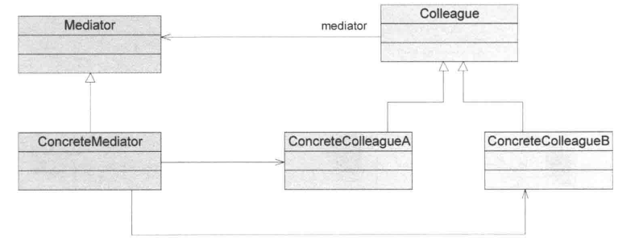
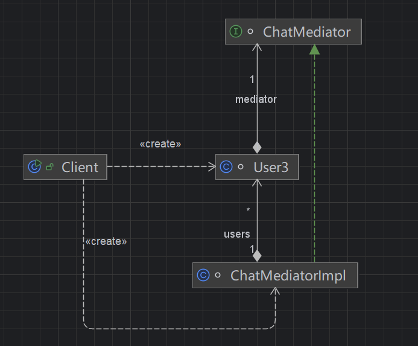

## 引入

**即时通讯系统（聊天系统）**

系统中有多个用户：A、B、C、D……

**第一阶段（初始需求）**

需求很简单：

> 用户之间可以互相发送消息

于是很自然的设计是：

-  每个用户对象都持有“其他用户”的引用 
-  发送消息时，直接调用对方的方法 

例如逻辑上是：

-  A 给 B 发消息 → A 直接调用 B 
-  B 给 C 发消息 → B 直接调用 C 

此时看起来完全没问题，甚至很直观。

**第二阶段（需求增加）**

随着系统发展，需求开始变复杂：

1.  增加“群聊”功能（一个人发，多人接收） 
2.  增加“用户上下线状态”（不在线不能发送） 
3. 增加“消息过滤”（敏感词、权限控制） 
4.  增加“不同消息类型”（私聊、群聊、系统通知） 
5. 增加“黑名单机制”（A不能给B发消息）

## 传统方法实现

**原始需求：**

​	需求简单，用户少，每个用户都持有其他所有用户。

~~~ java
/**
 * 第一阶段：初始需求（简单点对点通信）
 * 特点：
 * - 只支持简单私聊
 * - 结构简单，看起来没有问题
 */
public class ChatWithoutMediator {
    public static void main(String[] args) {
        User a = new User("A");
        User b = new User("B");
        User c = new User("C");
        // 建立关系（规模还小，问题不明显）
        a.addContact(b);
        a.addContact(c);
        b.addContact(a);
        b.addContact(c);
        c.addContact(a);
        c.addContact(b);
        a.sendMessage("B", "hello B");
        b.sendMessage("C", "hello C");
    }
}

class User {
    private String name;
    private Map<String, User> contacts = new HashMap<>();
    public User(String name) {
        this.name = name;
    }
    public void addContact(User user) {
        contacts.put(user.name, user);
    }
    public void sendMessage(String to, String message) {
        User target = contacts.get(to);
        if (target != null) {
            target.receiveMessage(this.name, message);
        }
    }
    public void receiveMessage(String from, String message) {
        System.out.println(name + " 收到来自 " + from + " 的消息：" + message);
    }
}
~~~

**需求变更：**

~~~ java
/**
 * 第二阶段：需求变更后（功能膨胀）
 * 新增需求：
 * 1. 在线/离线状态
 * 2. 黑名单机制
 * 3. 群聊功能
 * 4. 系统消息
 * 5. 简单敏感词过滤
 *
 * 结果：
 * - User 类职责严重膨胀
 * - 逻辑分散且重复
 * - 任意新需求都需要修改 User
 * - 对象之间强依赖（网状结构）
 */
public class ChatWithoutMediator2 {

    public static void main(String[] args) {
        User2 a = new User2("A");
        User2 b = new User2("B");
        User2 c = new User2("C");
        User2 d = new User2("D");
        // 建立全量关系（网状依赖开始明显）
        List<User2> users = Arrays.asList(a, b, c, d);
        for (User2 u1 : users) {
            for (User2 u2 : users) {
                if (u1 != u2) {
                    u1.addContact(u2);
                }
            }
        }
        // 设置状态
        c.setOnline(false);
        // 设置黑名单
        b.block("A");
        // 私聊
        a.sendPrivateMessage("B", "hello B");
        a.sendPrivateMessage("C", "hello C");
        // 群聊
        a.sendGroupMessage(Arrays.asList("B", "C", "D"), "hello everyone");
        // 系统消息
        a.sendSystemMessage("系统维护通知");
    }
}

class User2 {

    private String name;
    // 强依赖所有其他用户
    private Map<String, User2> contacts = new HashMap<>();
    // 状态
    private boolean online = true;
    // 黑名单
    private Set<String> blacklist = new HashSet<>();

    public User2(String name) {
        this.name = name;
    }

    public void addContact(User2 user) {
        contacts.put(user.name, user);
    }

    public void setOnline(boolean online) {
        this.online = online;
    }

    public void block(String username) {
        blacklist.add(username);
    }

    /**
     * 私聊（逻辑不断堆积）
     */
    public void sendPrivateMessage(String to, String message) {
        User2 target = contacts.get(to);
        if (target == null) {
            System.out.println(name + " -> " + to + " 失败：用户不存在");
            return;
        }
        if (!target.online) {
            System.out.println(name + " -> " + to + " 失败：对方不在线");
            return;
        }
        if (target.blacklist.contains(this.name)) {
            System.out.println(name + " -> " + to + " 失败：被拉黑");
            return;
        }
        if (message.contains("bad")) {
            System.out.println(name + " -> " + to + " 失败：敏感词");
            return;
        }
        target.receiveMessage(this.name, message);
    }

    /**
     * 群聊（重复逻辑 + 分支膨胀）
     */
    public void sendGroupMessage(List<String> users, String message) {
        for (String username : users) {
            User2 target = contacts.get(username);
            if (target == null) {
                continue;
            }
            if (!target.online) {
                continue;
            }
            if (target.blacklist.contains(this.name)) {
                continue;
            }
            target.receiveMessage(this.name, message);
        }
    }

    /**
     * 系统消息（又一套类似逻辑）
     */
    public void sendSystemMessage(String message) {
        for (User2 user : contacts.values()) {
            if (!user.online) {
                continue;
            }
            // 系统消息忽略黑名单（规则又不同）
            user.receiveSystemMessage(message);
        }
    }

    public void receiveMessage(String from, String message) {
        System.out.println(name + " 收到来自 " + from + " 的消息：" + message);
    }

    public void receiveSystemMessage(String message) {
        System.out.println(name + " 收到系统消息：" + message);
    }
}
~~~


## 中介者模式实现

### 传统方法分析

#### 问题

结合上面两版代码（`ChatWithoutMediator` → `ChatWithoutMediator2`），可以明显看到：**随着需求演进，系统复杂度迅速失控**。

下面将核心问题统一整理如下：

| 问题类别                 | 具体表现                                              | 本质原因               | 带来的后果                               |
| ------------------------ | ----------------------------------------------------- | ---------------------- | ---------------------------------------- |
| 对象关系复杂（网状依赖） | 每个用户都持有其他所有用户引用                        | 对象之间直接通信       | 对象数量增加时，关系呈指数增长，难以维护 |
| 类职责膨胀               | User 中包含：通信、状态判断、权限控制、消息类型处理等 | 缺少职责划分           | 违反单一职责原则，类变得臃肿             |
| 业务逻辑分散             | 黑名单、在线状态、敏感词等逻辑分布在多个方法中        | 没有统一调度中心       | 相同规则在多处重复实现，容易不一致       |
| 代码重复严重             | 私聊、群聊、系统消息中存在大量重复判断逻辑            | 缺少抽象与复用         | 修改规则需要改多处代码，容易遗漏         |
| 扩展性差（违反开闭原则） | 新增功能（如消息审计、消息类型）需要修改 User 类      | 核心逻辑写死在具体类中 | 每次需求变更都要修改已有代码，风险高     |
| 强耦合                   | User 之间相互依赖                                     | 没有中间层隔离         | 无法独立演化，测试困难                   |
| 规则难以统一管理         | 不同方法中规则略有差异（如系统消息忽略黑名单）        | 规则散落在各处         | 业务规则混乱，后期难以维护               |
| 系统复杂度不可控         | 随需求增加，方法越来越多、分支越来越复杂              | 缺少结构化设计         | 代码可读性、可维护性急剧下降             |

从上述问题可以抽象出一个核心矛盾：

> **对象之间的“交互逻辑”被分散在各个对象内部，导致系统失控**


### 优化：

**问题本质**

当前设计本质是：

```
对象 A ↔ 对象 B ↔ 对象 C ↔ 对象 D
```

 特点：

-  任意对象都可以直接操作其他对象 
-  交互逻辑分散在各个对象中 

本质问题：

> **“交互关系”没有被建模，而是隐式散落在代码中**

**优化方向**

要解决问题，可以从一个非常自然的角度思考：能否把“对象之间的交互逻辑”统一抽离出来？

**优化目标**

引入优化后，系统应该具备：

| 优化目标         | 说明                 |
| ---------------- | -------------------- |
| 降低对象耦合     | 对象之间不再直接引用 |
| 集中管理交互逻辑 | 所有通信规则统一处理 |
| 消除重复代码     | 公共逻辑统一复用     |
| 提升扩展性       | 新增规则只需改一处   |
| 简化对象职责     | 对象只关注自身行为   |

**优化后的结构雏形**

从：

```
A ↔ B ↔ C ↔ D（网状结构）
```

转变为：

```
        Mediator
       /   |   \
      A    B    C    D
```

核心变化：

-  对象不再互相通信 
-  所有交互都通过“中间人”完成 

**总结**

​	当系统中**多个对象之间存在复杂且不断变化的交互关系**时，将这些交互逻辑从对象中抽离，并集中到一个“中介者”中进行统一管理，可以显著降低耦合、提升扩展性和可维护性。

### 定义

​	中介者模式（MediatorPattern）定义：一个中介对象来封装一系列的对象交互，中介者使各对象不需要显式地相互引用，从而使其耦合松散，而且可以独立地改变它们之间的交互。

​	中介者模式又称为调停者模式，它是一种**对象行为型模式**。

#### 类图：



#### 角色说明：

**1.`Mediator`（抽象中介者）**

​	抽象中介者用于定义一个接口，该接口用于与各同事对象之间的通信。

**2.`ConcreteMediator`（具体中介者）**

​	具体中介者是抽象中介者的子类，通过协调各个同事对象来实现协作行为，了解并维护它对各个同事对象的引用。

​	在通用的中介者模式类图中，具体中介者与各个具体同事类之间有关联关系，在实现时为了保证系统的扩展性，可以根据需要将该引用关联关系建立在抽象层，即具体中介者中定义的是抽象同事角色。

**3.`Colleague`（抽象同事类）**

​	抽象同事类定义各同事的公有方法。

**4.`ConcreteColleague`(具体同事类）**

​	具体同事类是抽象同事类的子类，每一个同事对象都引用一个中介者对象；

​	每一个同事对象在需要和其他同事对象通信时，先与中介者通信，通过中介者来间接完成与其他同事类的通信；

​	在具体同事类中实现了在抽象同事类中声明的抽象方法。

### 源码

#### 类图：



#### 代码：

`Mediator`（抽象中介者）

~~~ java
/**
 * 中介者接口
 */
interface ChatMediator {

    void register(User3 user);

    void sendPrivateMessage(String from, String to, String message);

    void sendGroupMessage(String from, List<String> users, String message);

    void sendSystemMessage(String message);

    void setOnline(String username, boolean online);

    void block(String username, String blockedUser);
}

~~~

`ConcreteMediator`（具体中介者）

~~~ java
/**
 * 具体中介者
 */
class ChatMediatorImpl implements ChatMediator {
    // 所有用户
    private Map<String, User3> users = new HashMap<>();
    // 在线状态
    private Map<String, Boolean> onlineMap = new HashMap<>();
    // 黑名单（谁拉黑了谁）
    private Map<String, Set<String>> blacklistMap = new HashMap<>();

    @Override
    public void register(User3 user) {
        users.put(user.getName(), user);
        onlineMap.put(user.getName(), true);
        blacklistMap.put(user.getName(), new HashSet<>());
    }

    @Override
    public void sendPrivateMessage(String from, String to, String message) {
        User3 target = users.get(to);
        if (target == null) {
            System.out.println(from + " -> " + to + " 失败：用户不存在");
            return;
        }
        if (!onlineMap.getOrDefault(to, false)) {
            System.out.println(from + " -> " + to + " 失败：对方不在线");
            return;
        }
        if (blacklistMap.getOrDefault(to, Collections.emptySet()).contains(from)) {
            System.out.println(from + " -> " + to + " 失败：被拉黑");
            return;
        }
        if (message.contains("bad")) {
            System.out.println(from + " -> " + to + " 失败：敏感词");
            return;
        }
        target.receiveMessage(from, message);
    }

    @Override
    public void sendGroupMessage(String from, List<String> users, String message) {
        for (String to : users) {
            sendPrivateMessage(from, to, message);
        }
    }

    @Override
    public void sendSystemMessage(String message) {
        for (Map.Entry<String, User3> entry : users.entrySet()) {
            String username = entry.getKey();
            User3 user = entry.getValue();
            if (!onlineMap.getOrDefault(username, false)) {
                continue;
            }
            user.receiveSystemMessage(message);
        }
    }

    @Override
    public void setOnline(String username, boolean online) {
        onlineMap.put(username, online);
    }

    @Override
    public void block(String username, String blockedUser) {
        blacklistMap.computeIfAbsent(username, k -> new HashSet<>()).add(blockedUser);
    }
}
~~~

`Colleague`（抽象同事类）

`ConcreteColleague`(具体同事类）

​	这里目前只有这一种用户，因此不需要专门抽象一个抽象同事类，后续如果有admin、管理员 、机器人，就可以专门抽象一个抽象同事类。

~~~ java
/**
 * 同事类（用户）
 */
class User3 {
    private String name;
    private ChatMediator mediator;

    public User3(String name, ChatMediator mediator) {
        this.name = name;
        this.mediator = mediator;
    }

    public String getName() {
        return name;
    }

    public void sendPrivateMessage(String to, String message) {
        mediator.sendPrivateMessage(name, to, message);
    }

    public void sendGroupMessage(List<String> users, String message) {
        mediator.sendGroupMessage(name, users, message);
    }

    public void receiveMessage(String from, String message) {
        System.out.println(name + " 收到来自 " + from + " 的消息：" + message);
    }

    public void receiveSystemMessage(String message) {
        System.out.println(name + " 收到系统消息：" + message);
    }
}
~~~


## 思考

### 一、中介者模式的本质

**一句话本质**：将“对象之间的交互关系”从对象内部抽离出来，集中到一个中介者中统一管理

**本质拆解**

| 维度         | 传统方式         | 中介者模式             |
| ------------ | ---------------- | ---------------------- |
| 对象关系     | 网状（互相调用） | 星型（统一通过中介者） |
| 交互逻辑位置 | 分散在各个对象中 | 集中在中介者中         |
| 耦合方式     | 对象之间强耦合   | 对象仅依赖中介者       |
| 扩展方式     | 修改多个类       | 修改中介者             |
| 复杂度增长   | 指数级           | 线性可控               |

**核心解决的问题**

| 问题           | 中介者的解决方式     |
| -------------- | -------------------- |
| 多对象复杂交互 | 集中调度             |
| 逻辑分散       | 统一管理             |
| 强耦合         | 解耦为“只依赖中介者” |
| 规则不一致     | 单点控制             |

**本质抽象**

中介者模式本质上是在做一件事：

> **把“关系”当成一等公民来建模**

传统设计中：

-  A 调 B、B 调 C → 关系是“隐式的” 

中介者模式中：

-  “谁和谁交互、怎么交互” → 被显式抽象到 Mediator 中

### 二、工程上使用方式

**常见落地形态**

| 使用方式                    | 描述                          | 是否标准模式 |
| --------------------------- | ----------------------------- | ------------ |
| 经典中介者（接口 + 实现类） | Mediator + Colleague          | ✔ 标准       |
| 简化中介者（无抽象同事）    | 直接使用具体类                | ✔ 常见       |
| 中央调度器                  | 一个 Service/Manager 统一调度 | ✔ 工程常见   |
| 事件中心                    | 类似 EventBus / Dispatcher    | ✔ 变体       |

**工程中常见“变形”**

| 形态              | 实际表现                      |
| ----------------- | ----------------------------- |
| 服务协调器        | 一个 Service 调用多个 Service |
| Controller/Facade | 控制层协调多个模块            |
| 消息分发中心      | 根据类型路由消息              |
| 工作流引擎        | 控制流程节点流转              |

本质都是：

> **集中控制多个对象的协作关系**

**一个工程关键点（非常重要）**

>  中介者很容易演化成“上帝类”

表现为：

-  所有逻辑都堆在 Mediator 
-  类不断膨胀 

解决思路：

| 方案         | 说明                  |
| ------------ | --------------------- |
| 拆分中介者   | 按业务拆多个 Mediator |
| 引入策略模式 | 将规则拆分            |
| 引入职责链   | 分步处理逻辑          |
| 事件驱动     | 降低集中度            |

### 三、与命令模式、观察者模式的对比

**本质对比**

| 模式       | 关注点             | 本质     |
| ---------- | ------------------ | -------- |
| 中介者模式 | 对象之间如何协作   | 管“关系” |
| 命令模式   | 请求如何发送和执行 | 管“请求” |
| 观察者模式 | 状态变化如何通知   | 管“通知” |

**结构对比**

| 维度       | 中介者模式           | 命令模式         | 观察者模式     |
| ---------- | -------------------- | ---------------- | -------------- |
| 中心对象   | Mediator             | Command          | Subject        |
| 参与者关系 | 多对多（通过中介者） | 一对一（调用链） | 一对多（广播） |
| 调用方式   | 间接调度             | 命令封装调用     | 事件通知       |
| 控制权     | 中介者集中控制       | 调用者触发       | Subject 触发   |

**调用流程对比**

| 模式   | 流程                         |
| ------ | ---------------------------- |
| 中介者 | A → Mediator → B             |
| 命令   | Invoker → Command → Receiver |
| 观察者 | Subject → 多个 Observer      |

**是否“主动控制”**

| 模式   | 是否主动调度 |
| ------ | ------------ |
| 中介者 | 主动控制交互 |
| 命令   | 主动触发执行 |
| 观察者 | 被动接收通知 |

**一句话区分**

-  **中介者模式**  谁和谁怎么协作 
-  **命令模式**  谁发请求、谁执行 
-  **观察者模式**  状态变化通知谁

## 优缺点

### 优点

1、简化了对象之间的交互

​	用中介者和同事的一对多交互代替了原来同事之间的多对多交互，一对多关系更容易理解、维护和扩展，将原本难以理解的网状结构转换成相对简单的星状结构。

2、将各同事解耦

​	中介者有利于各同事之间的松耦合，我们可以独立的改变和复用各同事和中介者，增加新的中介者和新的同事类都比较方便，更好地符合“开闭原则”。

3、减少子类生成

​	中介者将原本分布于多个对象间的行为集中在一起，改变这些行为只需生成新的中介者子类即可，这使各个同事类可被重用，无须对同事类进行扩展。

4、对于复杂的对象之间的交互，通过引入中介者，可以简化各同事类的设计和实现，但是当情况复杂时，中介者可能就会变得很复杂和难以维护，这时可以对中介者进行再分解，使其只对一种类型的同事适用，这样在中介者类中就不必包括很多的if...else...if等语句，同时当新增加一种同事时，可以通过创建与该同事类对应的中介者类，而对于其他同事的中介者类影响较小，从而便于维护和扩展。

### 缺点

​	在具体中介者类中包含了同事之间的交互细节，可能会导致具体中介者类非常复杂，使得系统难以维护。

## 适用场景

1、系统中对象之间存在复杂的引用关系，产生的相互依赖关系结构混乱且难以理解

2、一个对象由于引用了其他很多对象并且直接和这些对象通信，导致难以复用该对象

3、想通过一个中间类来封装多个类中的行为，而又不想生成太多的子类。可以通过引入中介者类来实现，在中介者中定义对象交互的公共行为，如果需要改变行为则可以增加新的中介者类。

## 应用

### 一、JDK中的应用 —— GUI 组件事件机制（中介者思想）

​	在 JDK 的 GUI 编程（如 **Swing**）中，组件之间的交互并不是彼此直接调用，而是通过一个“中间协调机制”来完成，这本质上体现了中介者模式思想。

**场景说明**

例如一个典型界面：

-  按钮（Button） 
-  输入框（TextField） 
-  列表（List） 

当用户点击按钮时：

-  更新输入框内容 
-  刷新列表数据 

**如果不用中介者**

-  Button 持有 TextField、List 引用 
-  TextField 也可能持有其他组件 
-  各组件互相调用 

很快形成“网状依赖”，难以维护

**JDK中的实现方式**

JDK 通过以下机制实现“中介者思想”：

-  **事件源（组件）**：Button、TextField 
-  **事件监听器（Listener）**：统一处理逻辑 
-  **事件机制（Event Dispatch）**：负责调度 

实际流程：

```
Button → 触发事件 → Listener（统一处理） → 更新其他组件
```

| 特征               | 是否符合                 |
| ------------------ | ------------------------ |
| 组件之间不直接通信 | ✔                        |
| 引入中间协调者     | ✔（Listener / 事件机制） |
| 交互逻辑集中管理   | ✔                        |
| 降低组件耦合       | ✔                        |

**本质总结**

> 虽然形式上是“观察者模式（事件监听）”，但在**复杂交互场景下，Listener 实际承担了中介者的角色**

### 二、订单系统中的“下单流程协调”

**业务背景**

用户下单时，涉及多个系统：

-  库存服务（扣减库存） 
-  支付服务（发起支付） 
-  优惠券服务（校验/扣减） 
-  积分系统（增加积分） 
-  通知系统（发送消息） 

**传统实现（问题）**

如果各服务互相调用：

```
OrderService → InventoryService
OrderService → PaymentService
OrderService → CouponService

InventoryService → CouponService
PaymentService → NotificationService
...
```

问题：

-  服务之间强耦合 
-  调用关系混乱 
-  修改流程困难（比如新增“风控校验”） 

**引入“中介者思想”**

引入一个：

**订单协调器（OrderMediator / OrderCoordinator）**

所有流程变为：

```
OrderService → Mediator → 各个子系统
```

**中介者负责什么？**

| 职责     | 示例                 |
| -------- | -------------------- |
| 流程编排 | 先扣库存，再支付     |
| 条件判断 | 是否使用优惠券       |
| 异常处理 | 库存不足回滚         |
| 扩展控制 | 插入风控、审计       |
| 统一入口 | 所有下单流程统一调度 |

**优势体现**

| 优势   | 说明               |
| ------ | ------------------ |
| 解耦   | 各服务不再互相调用 |
| 可扩展 | 新增流程只改中介者 |
| 可维护 | 逻辑集中清晰       |
| 可复用 | 流程可复用/编排    |

**一个非常关键的认知**

在工程中，这种中介者通常叫：

-  Coordinator（协调器） 
-  Orchestrator（编排器） 
-  Manager / Service 层 

本质就是：

> **把“流程控制”和“对象协作”集中管理**