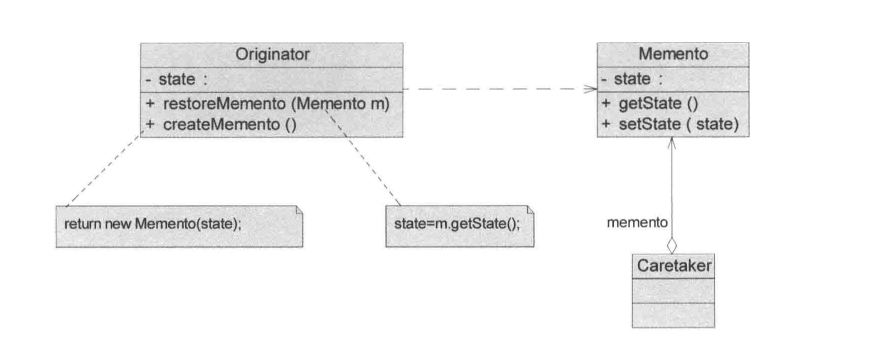
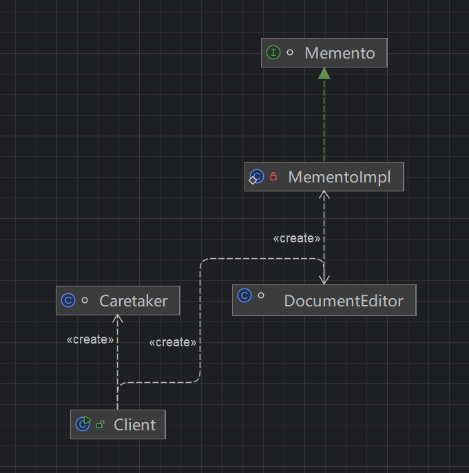

## 引入

### 示例：文档编辑器的“历史版本与撤销功能”

在一个常见的业务系统中，有一个“在线文档编辑”功能，类似简化版的协同文档或后台配置说明编辑器。

最初的需求很简单：

> 用户可以编辑一段文本内容，并点击“保存”，系统记录当前内容。

此时系统只需要维护**当前状态**即可，例如数据库中只存一份最新内容。

------

随着业务发展，需求逐步演进：

1. 新增需求一：撤销功能（Undo）
   -  用户希望可以撤销上一步操作，比如误删一段文字后可以恢复。 
2. 新增需求二：多步撤销
   -  不仅是撤销一步，而是可以连续撤销多步操作。 
3. 新增需求三：恢复指定历史版本
   -  用户希望可以查看历史版本列表，并恢复到某一个指定版本。 
4. 新增需求四：版本隔离
   -  历史版本一旦生成，不允许被后续修改影响，必须保持当时的完整状态。 

------

此时，系统不再只是“维护当前状态”，而是需要：

-  在多个时间点**记录对象的完整状态** 
-  支持**回滚到任意历史状态** 
-  保证历史状态**不可被篡改** 
-  并由系统统一管理这些“历史快照” 

## 传统方法实现

仅支持“当前内容保存”：

~~~ java
class DocumentEditorV1 {
    private String content;
    public void setContent(String content) {
        this.content = content;
    }
    public String getContent() {
        return content;
    }
    public void save() {
        System.out.println("保存成功，当前内容：" + content);
    }
}
~~~

支持“单步撤销” ：

~~~ java
class DocumentEditorV2 {
    private String content;
    private String lastContent; // 仅保存上一次状态
    public void setContent(String content) {
        this.lastContent = this.content;
        this.content = content;
    }
    public String getContent() {
        return content;
    }
    public void save() {
        System.out.println("保存成功，当前内容：" + content);
    }
    public void undo() {
        if (lastContent != null) {
            this.content = lastContent;
            System.out.println("撤销成功，当前内容：" + content);
        } else {
            System.out.println("没有可撤销的内容");
        }
    }
}
~~~

支持“多步撤销”：

~~~ java
class DocumentEditorV3 {
    private String content;
    private Stack<String> history = new Stack<>(); // 保存所有历史状态
    public void setContent(String content) {
        history.push(this.content); // 保存旧状态
        this.content = content;
    }
    public String getContent() {
        return content;
    }
    public void save() {
        System.out.println("保存成功，当前内容：" + content);
    }
    public void undo() {
        if (!history.isEmpty()) {
            this.content = history.pop();
            System.out.println("撤销成功，当前内容：" + content);
        } else {
            System.out.println("没有可撤销的内容");
        }
    }
}
~~~

支持“恢复指定历史版本”：

~~~ java
class DocumentEditorV4 {
    private String content;
    private List<String> history = new ArrayList<>(); // 所有历史版本
    public void setContent(String content) {
        history.add(this.content); // 保存旧状态
        this.content = content;
    }
    public String getContent() {
        return content;
    }
    public void save() {
        System.out.println("保存成功，当前内容：" + content);
    }
    public void undo() {
        if (!history.isEmpty()) {
            this.content = history.remove(history.size() - 1);
            System.out.println("撤销成功，当前内容：" + content);
        } else {
            System.out.println("没有可撤销的内容");
        }
    }
    public void restore(int index) {
        if (index >= 0 && index < history.size()) {
            this.content = history.get(index);
            System.out.println("恢复到版本[" + index + "]，当前内容：" + content);
        } else {
            System.out.println("版本不存在");
        }
    }
    public List<String> getHistory() {
        return history;
    }
}
~~~

状态复杂化（多字段 + 深拷贝问题）：

~~~ java
class DocumentEditorV5 {
    private String title;
    private String content;
    private List<String> attachments = new ArrayList<>();
    private List<DocumentEditorV5> history = new ArrayList<>(); // 直接保存对象（浅拷贝风险）
    public void update(String title, String content, List<String> attachments) {
        // 保存当前对象（直接引用）
        history.add(this);
        this.title = title;
        this.content = content;
        this.attachments = attachments;
    }
    public void restore(int index) {
        if (index >= 0 && index < history.size()) {
            DocumentEditorV5 old = history.get(index);
            this.title = old.title;
            this.content = old.content;
            this.attachments = old.attachments;
            System.out.println("恢复成功：" + this);
        } else {
            System.out.println("版本不存在");
        }
    }
}
~~~

尝试修复深拷贝（侵入式复制逻辑）：

~~~java
class DocumentEditorV6 {
    private String title;
    private String content;
    private List<String> attachments = new ArrayList<>();
    private List<DocumentEditorV6> history = new ArrayList<>();
    public void update(String title, String content, List<String> attachments) {
        history.add(copy()); // 手动深拷贝
        this.title = title;
        this.content = content;
        this.attachments = new ArrayList<>(attachments);
    }
    public void restore(int index) {
        if (index >= 0 && index < history.size()) {
            DocumentEditorV6 old = history.get(index);
            this.title = old.title;
            this.content = old.content;
            this.attachments = new ArrayList<>(old.attachments);
            System.out.println("恢复成功：" + this);
        } else {
            System.out.println("版本不存在");
        }
    }
    private DocumentEditorV6 copy() {
        DocumentEditorV6 copy = new DocumentEditorV6();
        copy.title = this.title;
        copy.content = this.content;
        copy.attachments = new ArrayList<>(this.attachments);
        return copy;
    }
}
~~~

## 备忘录模式实现

### 传统方法分析

#### 问题

| 问题类别         | 具体表现                       | 对应版本 | 本质问题                         |
| ---------------- | ------------------------------ | -------- | -------------------------------- |
| 状态管理能力不足 | 只能保存当前状态，无法回滚     | V1       | 没有“历史状态”的概念             |
| 扩展性差         | 仅支持单步撤销，无法扩展为多步 | V2       | 状态存储结构设计不合理           |
| 状态管理侵入业务 | `history` 直接嵌入业务类中     | V3 / V4  | 业务逻辑与状态管理耦合           |
| 职责混乱         | 类既负责业务，又负责历史管理   | V3 / V4  | 单一职责原则被破坏               |
| 对外暴露内部结构 | 直接返回 `history`             | V4       | 封装性被破坏                     |
| 恢复逻辑不统一   | `undo()` / `restore()` 混杂    | V3 / V4  | 状态恢复机制混乱                 |
| 无版本隔离       | 历史状态可能被修改             | V4       | 状态没有“快照”语义               |
| 浅拷贝问题       | 直接保存对象引用，历史被污染   | V5       | 没有真正保存“状态”，只是保存引用 |
| 深拷贝复杂       | 手动实现 copy，代码冗余且易错  | V6       | 状态复制逻辑侵入业务             |
| 可维护性差       | 每增加字段都要修改 copy 逻辑   | V6       | 违反开闭原则                     |
| 可复用性差       | 每个类都要重复实现历史管理     | V3~V6    | 没有统一的状态管理抽象           |

### 优化：

**状态与业务解耦**

当前问题：

-  `history`、`undo()`、`restore()` 全部堆在业务类中 
-  导致类职责过重 

优化方向：将“状态管理”从业务对象中剥离出去

**引入“状态快照”概念**

当前问题：

-  保存的是变量 / 引用，而不是“某一时刻的完整状态” 
-  无法保证历史数据不被污染 

优化方向：将对象某一时刻的状态封装为一个“不可变快照对象”

**统一状态保存与恢复机制**

当前问题：

-  `undo()`、`restore(index)` 各自实现，逻辑分散 

优化方向：提供统一的保存状态方法和恢复状态方法 

**解决深拷贝问题**

当前问题（V5 / V6 核心问题）：

-  浅拷贝 → 数据污染
-  深拷贝 → 侵入业务

优化方向：将“状态复制”封装到独立对象中，由该对象负责完整状态保存

这样：

-  业务类不再关心拷贝细节 
-  新增字段时只需修改“状态类” 

**限制状态访问（保护封装）**

当前问题：

-  外部可以直接访问甚至修改历史数据 

优化方向：状态对象对外只提供“只读能力”，甚至完全不可见内部结构

**引入统一的状态管理者**

当前问题：

-  历史状态直接由业务类管理 
-  无法复用、扩展（如 redo、版本管理） 

优化方向：引入一个专门的“状态管理角色”，负责：

-  存储历史 
-  提供回滚能力 
-  不关心状态内容

### 定义

​	备忘录模式（MementoPattern）定义：在不破坏封装的前提下，捕获一个对象的内部状态，并在该对象之外保存这个状态，这样可以在以后将对象恢复到原先保存的状态。它是一种对象行为型模式，其别名为Token。

#### 类图：



#### 角色说明：

**1.Originator（原发器）**

​	原发器可以创建一个备忘录，并存储它的当前内部状态，也可以使用备忘录来恢复其内部状态。

​	一般将需要保存内部状态的类设计为原发器，如一个存储用户信息或商品信息的对象。

**2.Memento（备忘录）**

​	存储原发器的内部状态，根据原发器来决定保存哪些内部状态。

​	备忘录的设计一般可以参考原发器的设计，根据实际需要确定备忘录类中的属性。

​	需要注意的是，除了原发器本身与负责人类之外，备忘录对象不能直接供其他类使用，因此备忘录的设计在不同的编程语言中实现机制有所区别。

**3.Caretaker（负责人）**

​	负责人文称为管理者，它负责保存备忘录，但是不能对备忘录的内容进行操作或检查。

​	在负责人类中可以存储一个或多个备忘录对象，它只负责存储对象，而不能修改对象，也无须知道对象的实现细节。

#### 类图：



#### 代码：

**Memento（备忘录）和 Originator（原发器）：**

​	这里为了避免备忘录被外部使用，因此直接采用窄接口由外部使用，内部实现细节不暴露给外部。

~~~ java
// Memento（窄接口，对外不可见细节）
interface Memento {
}
// Originator（文档编辑器）
class DocumentEditor {
    private String title;
    private String content;
    private List<String> attachments = new ArrayList<>();
    // 创建备忘录
    public Memento save() {
        return new MementoImpl(title, content, attachments);
    }
    // 恢复状态
    public void restore(Memento memento) {
        if (!(memento instanceof MementoImpl)) {
            throw new IllegalArgumentException("非法的备忘录对象");
        }
        MementoImpl m = (MementoImpl) memento;
        this.title = m.title;
        this.content = m.content;
        this.attachments = new ArrayList<>(m.attachments);
    }
    // 业务操作
    public void update(String title, String content, List<String> attachments) {
        this.title = title;
        this.content = content;
        this.attachments = new ArrayList<>(attachments);
    }
    // ⭐⭐⭐⭐⭐内部备忘录实现（宽接口，仅内部可见）⭐⭐⭐⭐⭐⭐
    private static class MementoImpl implements Memento {
        private final String title;
        private final String content;
        private final List<String> attachments;
        private MementoImpl(String title, String content, List<String> attachments) {
            this.title = title;
            this.content = content;
            // 深拷贝，保证快照独立
            this.attachments = new ArrayList<>(attachments);
        }
    }
}
~~~

**Caretaker（负责人）**

~~~ java
//  Caretaker（状态管理者，支持 undo / redo）
class Caretaker {
    private Stack<Memento> undoStack = new Stack<>();
    private Stack<Memento> redoStack = new Stack<>();
    // 保存状态
    public void save(Memento memento) {
        undoStack.push(memento);
        redoStack.clear(); // 新操作后清空 redo
    }
    // 撤销
    public Memento undo() {
        if (undoStack.isEmpty()) {
            System.out.println("没有可撤销的状态");
            return null;
        }
        Memento m = undoStack.pop();
        redoStack.push(m);
        return m;
    }
    // 重做
    public Memento redo() {
        if (redoStack.isEmpty()) {
            System.out.println("没有可重做的状态");
            return null;
        }
        Memento m = redoStack.pop();
        undoStack.push(m);
        return m;
    }
    // 获取指定版本（扩展能力）
    public Memento get(int index) {
        if (index < 0 || index >= undoStack.size()) {
            throw new IndexOutOfBoundsException("版本不存在");
        }
        return undoStack.get(index);
    }
}
~~~


## 思考

### 一、备忘录模式的本质

| 维度         | 内容                                                         |
| ------------ | ------------------------------------------------------------ |
| 核心目标     | 在**不破坏封装**的前提下，保存并恢复对象的历史状态           |
| 本质抽象     | **对象状态的快照（Snapshot）机制**                           |
| 核心思想     | 将对象某一时刻的状态**封装为独立对象**进行保存               |
| 关键问题     | 如何既能保存状态，又不暴露内部实现：**状态外置 + 角色隔离 + 受控访问** |
| 角色职责     | Originator：创建/恢复状态；Memento：承载状态；Caretaker：保存状态 |
| 权限控制本质 | 不是靠 `protected`，而是**不同角色看到不同接口（窄接口 vs 宽接口）** |
| 权限实现方式 | 接口隔离（推荐） / 内部类（常用）                            |
| 数据安全     | 通过**不可变快照 + 深拷贝**保证历史状态不被污染              |
| 本质一句话   | **把“状态”抽离成对象，并控制谁可以“看”和“改”**               |

### 二、关键设计点

| 维度           | 备忘录模式             | 状态模式             |
| -------------- | ---------------------- | -------------------- |
| 关注点         | **状态的保存与恢复**   | **状态驱动行为变化** |
| 解决问题       | 能否回到过去           | 当前该做什么         |
| 状态形式       | 数据（字段快照）       | 对象（状态类）       |
| 状态是否外置   | 外置（Memento）        | 内嵌在 State 中      |
| 是否有状态流转 | 不关注流转             | 强调状态迁移         |
| 是否支持历史   | 支持多版本历史         | 一般不支持           |
| 行为归属       | Originator             | 各个 State 子类      |
| 扩展方式       | 增加状态字段           | 增加状态类           |
| 典型场景       | Undo / 版本回滚 / 存档 | 订单状态 / 流程控制  |
| 一句话区别     | **回到过去**           | **决定现在**         |

### 三、工程上使用

### 一、核心落地思想（最重要）

在真实项目中，很少严格按照「Originator / Memento / Caretaker」三个类去实现，真正落地的是下面这句话：

> **把“状态”抽象成一个独立的快照对象，并交由外部统一管理，从而支持回滚能力。**

------

### 二、常见工程实现结构

#### 最常见结构

```
业务对象（Entity / Domain）
        ↓
生成快照（Snapshot / DTO）
        ↓
由 Service / Manager 统一管理（List / Stack / DB）
```

对应关系：

-  Originator → 业务对象（如 DocumentEditor） 
-  Memento → Snapshot / DTO 
-  Caretaker → Service / Manager / Repository 

#### **Caretaker 的工程形态**

根据需求不同，Caretaker 会有不同实现方式：

**Undo / Redo 场景**

```
Stack<Snapshot> undoStack
Stack<Snapshot> redoStack
```

典型场景：

-  编辑器 
-  表单操作回退 

**历史版本场景**

```
List<Snapshot>
```

典型场景：

-  文档版本 
-  配置变更记录 

**按版本号管理**

```
Map<version, Snapshot>
```

典型场景：

-  配置中心 
-  发布版本管理 

**持久化版本**

```
数据库表（version + snapshot_data）
```

常见做法：

-  Snapshot → JSON 
-  存数据库 
-  恢复时反序列化 

#### 深拷贝问题的工程解决方案

这是备忘录模式在工程中的**核心难点**👇

**手动拷贝**

```
new Snapshot(old.xxx, new ArrayList<>(old.list))
```

-  简单直接 
-  但字段多时维护成本高

**构造函数封装**

```
Snapshot(Snapshot other)
```

-  拷贝逻辑集中 
-  可维护性较好

**序列化方式（通用方案）**

```
对象 → JSON → 存储 → JSON → 对象
```

优点：

-  自动深拷贝 
-  通用性强 

缺点：

-  性能开销 
-  类型安全较弱 

#### 权限控制在工程中的取舍

理论上：

> Caretaker 不应该修改 Memento

但在工程中通常：

-  不强制做“接口隔离” 
-  直接用 DTO 
-  通过**开发规范约束** 

原因：

-  Java 项目更重效率 
-  团队内可控 
-  降低复杂度 

## 优缺点

### 优点

1、提供了一种状态恢复的实现机制，使得用户可以方便地回到一个特定的历史步骤，当新的状态无效或者存在问题时，可以使用先前存储起来的备忘录将状态复原。

2、实现了信息的封装，一个备忘录对象是一种原发器对象的表示，不会被其他代码改动，这种模式简化了原发器对象，备忘录只保存原发器的状态，采用堆栈来存储备忘录对象可以实现多次撤销操作，可以通过在负责人中定义集合对象来存储多个备忘录。

### 缺点

​	资源消耗过大，如果类的成员变量太多，就不可避免占用大量的内存，而且每保存一次对象的状态都需要消耗内存资源，如果知道这一点大家就容易理解为什么一些提供了撤销功能的软件在运行时所需的内存和硬盘空间比较大了。

## 适用场景

1、保存一个对象在某一个时刻的状态或部分状态，这样以后需要时它能够恢复到先前的状态。

2、如果用一个接口来让其他对象得到这些状态，将会暴露对象的实现细节并破坏对象的封装性，一个对象不希望外界直接访问其内部状态，通过负责人可以间接访问其内部状态。

## 应用

### JDK 中的应用 —— java.io.Serializable

在 JDK 中，虽然没有一个明确叫“备忘录模式”的类，但其思想在**对象序列化机制**中被广泛应用。

#### 核心体现

-  通过 `Serializable`，对象可以被转换为字节流 
-  本质上就是在某一时刻**保存对象的完整状态快照** 
-  后续可以通过反序列化恢复对象状态 

#### 对应关系

| 备忘录角色 | JDK 实现                       |
| ---------- | ------------------------------ |
| Originator | 实现 Serializable 的对象       |
| Memento    | 序列化后的字节流（或中间结构） |
| Caretaker  | 文件系统 / 内存缓存 / 网络传输 |

#### 本质说明

-  序列化过程 = **生成状态快照** 
-  反序列化过程 = **恢复历史状态** 
-  外部系统（文件、网络）负责存储这些“快照” 

可以看作是一个“通用版、跨进程”的备忘录模式实现。

### 开发中的应用场景 —— 配置版本管理 / 回滚

在实际业务系统中，一个非常常见的场景是：

> **配置中心或业务配置的版本管理与回滚**

#### 场景描述

例如：

-  系统有一份“业务规则配置”（JSON / 表单） 
-  每次修改配置，都需要： 
  -  保存当前版本 
  -  支持回滚到任意历史版本 
  -  保证历史版本不可被修改 

#### 典型实现方式

-  每次修改前： 
  -  生成当前配置的 **Snapshot（快照）** 
-  将快照存入： 
  -  数据库（带 version） 
  -  或缓存 / 日志系统 
-  回滚时： 
  -  读取某个版本的快照 
  -  覆盖当前配置 

#### 对应备忘录模式

| 角色       | 实际对应                    |
| ---------- | --------------------------- |
| Originator | 配置对象（如 ConfigEntity） |
| Memento    | 配置快照（JSON / DTO）      |
| Caretaker  | 配置服务 / 版本管理模块     |

#### 场景价值

-  支持误操作恢复 
-  支持版本对比 
-  提供审计能力（谁改了什么） 

------

### 最后总结一句

> 在实际开发中，备忘录模式最常见的形态就是：
>  **“版本记录 + 状态快照 + 可回滚”机制。**