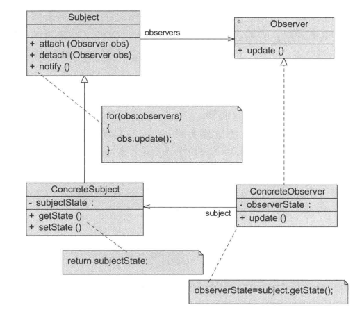
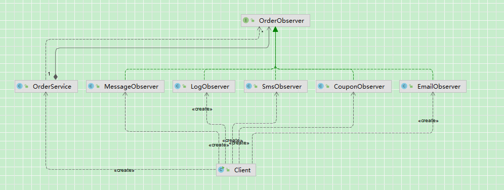

## 引入

系统中有一个订单服务：

当订单状态发生变化（如下单成功）时，需要做两件事：

-  发送短信通知用户 
-  记录日志

**需求变更：**

订单创建成功后，还需要：

-  发送邮件 
-  推送站内消息

**再次需求变更**

后续不断新增功能：

-  发优惠券 
-  更新积分 
-  通知仓储系统 
-  通知风控系统 
-  ……

## 传统方法实现

### 原始需求实现：

​	直接在订单服务中，创建或传入短信服务和日志服务，然后依次调用相关方法。

**订单：**

~~~ java
// 订单实体
public class Order {
    private String name;
}
// 订单服务
public class OrderService {
    public void createOrder() {
        // 1. 创建订单
        Order order = new Order("测试");
        System.out.println("订单创建成功");
        // 2. 发送短信
        SmsService smsService = new SmsService();
        smsService.send(order);
        // 3. 记录日志
        LogService logService = new LogService();
        logService.record(order);
    }
}
~~~

**日志服务和短信服务：**

~~~ java
// 日志服务
public class LogService {
    public  void record(Order order) {
        System.out.println("记录订单日志" + order.getName());
    }
}
// 短信服务
public class SmsService {
    public void send(Order order) {
        System.out.println("订单：" + order.getName() + " 发送短信成功");
    }
}
~~~

### 第一次需求变更：

**新增邮件和栈内消息服务：**

~~~ java
// 邮件服务
public class EmailService {
    public void send(Order order) {
        System.out.println("订单：" + order.getName() + " 发送邮件成功");
    }
}
// 站内消息服务
public class MessageService {
    public void send(Order order) {
        System.out.println("订单：" + order.getName() + " 发送站内消息成功");
    }
}
~~~

**订单服务改造：**

~~~ java
public class OrderService {
    public void createOrder() {
        // 1. 创建订单
        Order order = new Order("测试");
        System.out.println("订单创建成功");
        // 2. 发送短信
        SmsService smsService = new SmsService();
        smsService.send(order);
        // 3. 记录日志
        LogService logService = new LogService();
        logService.record(order);
        // --- 第一次需求变更代码修改起始点 ---
        // 4. 发送邮件
        EmailService emailService = new EmailService();
        emailService.send(order);
        // 5. 站内消息
        MessageService messageService = new MessageService();
        messageService.send(order);
    }
}
~~~

### 再次需求变更：

​	发优惠券 、更新积分、通知仓储系统 、通知风控系统

​	每增加一个功能，都需要修改订单服务，并且订单服务需要知道每个服务的具体签名。


## 观察者模式实现

### 传统方法分析

#### 问题

随着需求的不断增加，订单服务中的代码逐渐膨胀，暴露出一系列设计问题：

**1、强耦合，违反开闭原则**

订单服务中直接依赖多个具体服务类，例如：

-  `SmsService` 
-  `LogService` 
-  `EmailService` 
-  `MessageService` 
-  … 

当新增一个功能时，都需要：

-  修改 `OrderService` 
-  新增依赖 
-  调整代码逻辑 

这意味着：**对扩展不开放，对修改不关闭（违反开闭原则）**

**2、职责不单一，业务边界模糊**

订单服务本应只负责：订单创建

但现在却承担了：

-  通知用户（短信、邮件） 
-  日志记录 
-  积分处理 
-  优惠券发放 
-  外部系统调用（仓储、风控） 

导致：**一个类承担了过多职责，违反单一职责原则**

**3、代码臃肿，可读性差**

随着功能增加：

-  `createOrder()` 方法越来越长 
-  核心业务逻辑被大量“附加逻辑”淹没 

结果：

-  难以阅读 
-  难以维护 
-  容易引入 Bug 

**4、扩展困难，灵活性差**

当前设计下：

-  无法动态新增功能（必须改代码） 
-  无法灵活关闭某个功能 
-  无法按需组合功能 

例如：某些场景不需要发短信，但代码仍然会执行

**5、复用性差**

如果系统中存在其他类似场景，例如：

-  订单支付成功 
-  订单取消 
-  订单发货 

这些场景也需要类似的通知逻辑，那么只能：

-  复制代码
   或 
-  再写一套类似逻辑 

导致大量重复代码

#### 本质问题总结

```
当前系统中存在“一对多”的依赖关系：

订单状态变化 → 多个后续处理逻辑

但这种关系被硬编码在 OrderService 中，导致系统高度耦合、难以扩展。
```

### 优化：

**1、解耦核心业务与附加逻辑**

将职责拆分为：

-  订单服务：只负责“订单创建” 
-  其他逻辑：独立处理 

**2、将“一对多”关系抽象化**

当前问题本质是：

​	一个事件（订单创建成功）对应多个处理逻辑

我们希望将其转化为：

​	事件发布 → 多个处理者自动响应

**3、引入统一的通知机制**

理想的设计应满足：

-  订单服务只负责“发出通知” 
-  不关心： 
  -  有多少个处理者 
  -  是谁在处理 
  -  如何处理 

即：订单创建成功 → 通知所有订阅者

**4、支持动态扩展**

优化后系统应具备：

-  新增功能：只需新增处理类 
-  删除功能：移除对应处理类 
-  不需要修改订单服务 

#### 优化目标总结

1、降低耦合（核心目标）

2、支持扩展（新增功能无需修改原代码）

3、提升代码可读性和可维护性

4、将“一对多关系”从硬编码变为动态机制

为实现上述目标，可以引入如下设计：

```
定义一种机制：
	当订单状态发生变化时，
	自动通知所有依赖对象进行处理，
	且订单服务不直接依赖这些对象。
```

这正是：**观察者模式（Observer Pattern）**所要解决的问题。

### 定义

#### 类图：



#### 角色说明：

**1.`Subject`（目标）**

​	目标又称为主题，它是指被观察的对象。

​	在目标中定义了一个观察者集合，它可以存储任意数量的观察者对象，它提供一个接口来增加和删除观察者对象，同时它定义了的通知方法notify（）。

​	目标类可以是接口，也可以是抽象类或实现类。

**2.`ConcreteSubject`（具体目标）**

​	具体目标是目标类的子类，通常它包含经常发生改变的数据，当它的状态发生改变时，向它的各个观察者发出通知。

​	同时它还实现了在目标类中定义的抽象业务逻辑方法（如果有的话）。

**3.`Observer`（观察者）**

​	观察者将对观察目标的改变做出反应，观察者一般定义为接口，该接口声明了更新数据的方法`update()`，因此又称为抽象观察者。

**4.`ConcreteObserver`（具体观察者）**

​	在具体观察者中维护一个指向具体目标对象的引用，它存储具体观察者的有关状态，这些状态需要和具体目标的状态保持一致；

​	它实现了在抽象观察者`Observer`中定义的`update()`方法。

​	通常在实现时，可以调用具体目标类的`attach()`方法将自己添加到目标类的观察者集合中或通过`detach()`方法将自己从目标类的观察者集合中删除。

### 源码

类图：

​	因为只有一个被观察者(创建订单)，因此不需要单独建一个`Subject`（目标）接口，直接使用`ConcreteSubject`，即`OrderObServer`。



代码：

客户端：

​	可见，对于被观察者订单而言，新增观察者并不需要修改其代码，只需要扩展出一个观察者的具体实现即可。

~~~ java
public class Client {
    public static void main(String[] args) {
        OrderService orderService = new OrderService();
        // 注册观察者（可动态扩展）
        orderService.registerObserver(new SmsObserver());
        orderService.registerObserver(new LogObserver());
        orderService.registerObserver(new EmailObserver());
        orderService.registerObserver(new MessageObserver());
        orderService.registerObserver(new CouponObserver());
        // 创建订单
        orderService.createOrder();
    }
}
~~~

`ConcreteSubject`（具体目标）:订单服务

~~~ java
// 被观察者(只有一个被观察者,不需要再写一个Subject接口，然后再实现了)
public class OrderService {
    // 观察者集合
    private List<OrderObserver> observers = new ArrayList<>();
    // 注册观察者
    public void registerObserver(OrderObserver observer) {
        observers.add(observer);
    }
    // 移除观察者
    public void removeObserver(OrderObserver observer) {
        observers.remove(observer);
    }
    // 通知所有观察者
    private void notifyObservers(Order order) {
        for (OrderObserver observer : observers) {
            observer.update(order);
        }
    }
    // 创建订单
    public void createOrder() {
        // 1. 创建订单
        Order order = new Order("测试");
        System.out.println("订单创建成功");
        // 2. 通知所有观察者
        notifyObservers(order);
    }
}
~~~

观察者接口：

~~~ java
// 观察者接口
public interface OrderObserver {
    void update(Order order);
}
~~~

具体观察者

~~~ java
// 优惠券
public class CouponObserver implements OrderObserver {
    @Override
    public void update(Order order) {
        System.out.println("订单：" + order.getName() + " 发放优惠券");
    }
}
// 邮件
public class EmailObserver implements OrderObserver {
    @Override
    public void update(Order order) {
        System.out.println("订单：" + order.getName() + " 发送邮件成功");
    }
}
// 日志记录
public class LogObserver implements OrderObserver {
    @Override
    public void update(Order order) {
        System.out.println("记录订单日志：" + order.getName());
    }
}
// 站内消息
public class MessageObserver implements OrderObserver {
    @Override
    public void update(Order order) {
        System.out.println("订单：" + order.getName() + " 发送站内消息成功");
    }
}
// 短信
public class SmsObserver implements OrderObserver {
    @Override
    public void update(Order order) {
        System.out.println("订单：" + order.getName() + " 发送短信成功");
    }
}
~~~

### 传统实现和观察者模式对比

对比传统实现：

1、OrderService 不再依赖具体业务类（解耦）
2、新增功能只需新增 Observer 实现类（无需修改原代码）
3、支持动态注册/移除观察者（灵活性提升）
4、核心流程更加清晰（只关注“订单创建”）

本质变化：
	将“硬编码的一对多调用关系” → 转换为“基于事件通知的动态关系”

## 思考

### 一、观察者模式的本质

观察者模式表面上是：对象状态变化 → 通知多个对象

但其本质是：将“一对多的依赖关系”从代码中解耦出来，转化为一种动态的关系绑定机制

**1、本质拆解**

在传统实现中：`OrderService` → 直接调用 → 多个业务类

属于：

-  静态绑定（编译期确定） 
-  强耦合关系 

而在观察者模式中：`Subject → 维护观察者集合 → 动态通知`

变成：

-  动态绑定（运行期决定） 
-  松耦合关系 

**2、核心思想总结**

```
1、将调用关系转化为“注册 + 通知”
2、将依赖关系转化为“事件驱动”
3、将多对象协作转化为“广播机制”
```

### 二、观察者模式 vs 发布订阅模式

​	这两个非常容易混淆，但本质上**不是一回事**。

**1、核心区别**

| 对比维度 | 观察者模式                 | 发布订阅模式                    |
| -------- | -------------------------- | ------------------------------- |
| 依赖关系 | 观察者直接持有被观察者引用 | 通过中间件（Broker）            |
| 耦合程度 | 中等耦合                   | 完全解耦                        |
| 通信方式 | 同步调用（常见）           | 异步消息（常见）                |
| 结构     | Subject ↔ Observer         | Publisher → Broker → Subscriber |
| 复杂度   | 简单                       | 较复杂                          |

**2、结构对比**

观察者模式：

```
Subject → Observer1
        → Observer2
```

发布订阅模式：

```
Publisher → Broker → Subscriber1
                      Subscriber2
```

**3、本质差异**

```
观察者模式：
    是一种对象行为模式（设计模式层面）

发布订阅模式：
    是一种架构模式（系统设计层面）
```

**4、理解一句话**

```
观察者模式 = 没有中间层的发布订阅
发布订阅模式 = 带消息中间件的观察者模式（增强版）
```

### 三、推模型 vs 拉模型

观察者模式中有两种数据传递方式：

**1、推模型（Push）**

```
Subject → 直接把数据推给 Observer
```

特点：

-  简单直接 
-  可能传递冗余数据 

示例：

```
update(Order order)
```

**2、拉模型（Pull）**

```
Observer ← 从 Subject 获取数据
```

特点：

-  更灵活 
-  观察者自主决定需要的数据 

示例：

```
update(Subject subject)
```

## 优缺点

### 优点

（1）观察者模式可以实现表示层和数据逻辑层的分离，并定义了稳定的消息更新传递机制，抽象了更新接口，使得可以有各种各样不同的表示层作为具体观察者角色。

（2）观察者模式在观察目标和观察者之间建立一个抽象的耦合。观察目标只需要维持一个抽象观察者的集合，每一个具体观察者都符合抽象观察者的定义。观察目标不需要了解其具体观察者，只需知道它们都有一个共同的接口即可。由于观察目标和观察者没有紧密地耦合在一起，因此它们可以属于不同的抽象化层次。

（3）观察者模式支持广播通信，观察目标会向所有注册的观察者发出通知，简化了一对多系统设计的难度。

（4）观察者模式符合“开闭原则”的要求，增加新的具体观察者无须修改原有系统代码，在具体观察者与观察目标之间不存在关联关系的情况下，增加新的观察目标也很方便。

### 缺点

（1）如果一个观察目标对象有很多直接和间接的观察者的话，将所有的观察者都通知到会花费很多时间。

（2）如果在观察者和观察目标之间有循环依赖的话，观察目标会触发它们之间进行循环调用，可能导致系统崩溃。

（3）观察者模式没有相应的机制让观察者知道所观察的目标对象是怎么发生变化的，而仅仅只是知道观察目标发生了变化。

## 适用场景

（1）一个抽象模型有两个方面，其中一个方面依赖于另一个方面。将这些方面封装在独立的对象中使它们可以各自独立地改变和复用。

（2）一个对象的改变将导致其他一个或多个对象也发生改变，而不知道具体有多少对象将发生改变，可以降低对象之间的耦合度。

（3）一个对象必须通知其他对象，而并不知道这些对象是谁。

（4）需要在系统中创建一个触发链，A对象的行为将影响B对象，B对象的行为将影响C对象..可以使用观察者模式创建一种链式触发机制。

## 应用

### JDK：`java.util.Observable` / `Observer`（历史版）

> ⚠ 注意：JDK 9 后被标记为过时，但依然是经典示例

```
核心思路：
Observable = 被观察者（Subject）
Observer   = 观察者
```

**示例代码结构**

```java
Observable observable = new Observable();
Observer observer = new Observer() {
    @Override
    public void update(Observable o, Object arg) {
        System.out.println("收到通知：" + arg);
    }
};
observable.addObserver(observer);
observable.notifyObservers("事件发生");
```

**案例分析**

-  **被观察者**：`Observable` 

-  **观察者**：实现 `Observer` 接口的对象 

- 特点

  -  `Observable` 内部维护观察者集合 
-  状态变化调用 `notifyObservers`，依次触发所有观察者 
  
- 局限

  -  JDK 的 `Observable` 是类，不是接口，无法灵活扩展 
-  推模型，通知观察者时直接传递对象 

### Spring 框架：`ApplicationEvent` / `ApplicationListener`

**核心思路**

```
ApplicationEvent = 事件（被观察的状态）
ApplicationListener = 观察者（感兴趣的事件处理逻辑）
ApplicationContext.publishEvent(event) → 所有 listener 被触发
```

**示例代码**

```
@Component
public class OrderCreatedListener implements ApplicationListener<OrderCreatedEvent> {
    @Override
    public void onApplicationEvent(OrderCreatedEvent event) {
        System.out.println("收到订单创建事件：" + event.getOrder().getName());
    }
}

// 发布事件
applicationContext.publishEvent(new OrderCreatedEvent(this, order));
```

#### 案例分析

-  **被观察者**：发布事件的 `ApplicationContext` 

-  **观察者**：实现 `ApplicationListener` 的组件 

- 特点

  -  完全解耦（发布者无需知道订阅者） 
-  支持同步和异步通知（可结合线程池 / @Async） 
  -  高度可扩展，常用于 Spring 事件驱动编程 

### UI 事件监听（开发中最常见的观察者模式）

**需求**

-  点击按钮 → 多个组件响应 
  -  显示弹窗 
  -  更新日志 
  -  播放音效 

**实现结构**

```
Button (Subject)
    ↳ PopupObserver
    ↳ LogObserver
    ↳ SoundObserver
```

**特点**

-  UI 事件监听机制典型观察者模式 
-  支持动态注册和移除监听器 
-  观察者可复用到不同按钮或事件 

