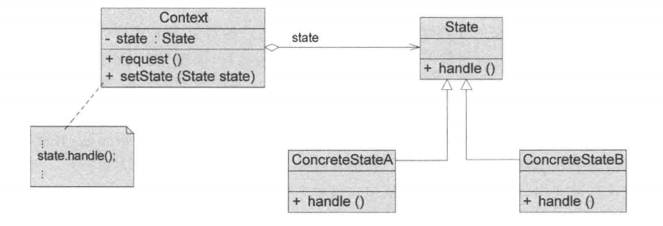

## 引入

在实际业务开发中，很多对象并不是“静态”的，而是会随着流程推进处于不同的状态，并且在不同状态下具有不同的行为。

以**订单系统**为例：

一个电商系统中的订单，初始需求如下：

### 初始版本（需求简单）

订单只有三种状态：

-  待支付 
-  已支付 
-  已取消 

系统支持两个操作：

-  支付订单 
-  取消订单 

此时逻辑非常简单，例如：

-  待支付 → 可以支付、可以取消 
-  已支付 → 不能再支付 
-  已取消 → 不允许任何操作 

在这个阶段，使用简单的 `if-else` 判断状态即可完成需求，实现清晰、直接。

### 需求演进（复杂度提升）

随着业务发展，订单流程逐渐复杂：

**新增状态**

-  已发货 
-  已完成 
-  已退款 

**新增操作**

-  发货 
-  确认收货 
-  申请退款 

**同时引入复杂规则：**

-  **已支付 → 才能发货** 
-  **已发货 → 才能确认收货** 
-  **已完成 → 才允许申请退款（部分场景）** 
- 不同状态下，相同操作行为不同
  -  “取消订单”在“待支付”和“已发货”下逻辑完全不同 

## 传统方法实现

### 原始需求实现：

~~~ java
class Order {
    // 0-待支付，1-已支付，2-已取消
    private int status;
    // 支付
    public void pay() {
        if (status == 0) {
            System.out.println("订单支付成功");
            status = 1;
        } else if (status == 1) {
            System.out.println("订单已支付，无需重复支付");
        } else if (status == 2) {
            System.out.println("订单已取消，无法支付");
        }
    }

    // 取消
    public void cancel() {
        if (status == 0) {
            System.out.println("订单已取消");
            status = 2;
        } else if (status == 1) {
            System.out.println("订单已支付，无法取消");
        } else if (status == 2) {
            System.out.println("订单已取消，无需重复操作");
        }
    }
}
~~~

### 需求变更后：

~~~ java
public class Order2 {
    // 0-待支付，1-已支付，2-已取消，3-已发货，4-已完成，5-已退款
    private int status;

    // 支付
    public void pay() {
        if (status == 0) {
            System.out.println("订单支付成功");
            status = 1;
        } else if (status == 1) {
            System.out.println("订单已支付，无需重复支付");
        } else if (status == 2) {
            System.out.println("订单已取消，无法支付");
        } else if (status == 3) {
            System.out.println("订单已发货，无法支付");
        } else if (status == 4) {
            System.out.println("订单已完成，无法支付");
        } else if (status == 5) {
            System.out.println("订单已退款，无法支付");
        }
    }

    // 取消
    public void cancel() {
        if (status == 0) {
            System.out.println("订单已取消");
            status = 2;
        } else if (status == 1) {
            System.out.println("订单已支付，无法取消");
        } else if (status == 2) {
            System.out.println("订单已取消，无需重复操作");
        } else if (status == 3) {
            System.out.println("订单已发货，无法取消");
        } else if (status == 4) {
            System.out.println("订单已完成，无法取消");
        } else if (status == 5) {
            System.out.println("订单已退款，无法取消");
        }
    }

    // 发货
    public void ship() {
        if (status == 1) {
            System.out.println("订单发货成功");
            status = 3;
        } else {
            System.out.println("当前状态无法发货");
        }
    }

    // 确认收货
    public void confirm() {
        if (status == 3) {
            System.out.println("订单已完成");
            status = 4;
        } else {
            System.out.println("当前状态无法确认收货");
        }
    }

    // 退款
    public void refund() {
        if (status == 1 || status == 4) {
            System.out.println("订单已退款");
            status = 5;
        } else {
            System.out.println("当前状态无法退款");
        }
    }
}
~~~

## 观察者模式实现

### 传统方法分析

​	在需求简单时，使用 `if-else` 控制状态行为是一种直接且高效的实现方式。但随着业务复杂度提升，这种方式会逐渐暴露出一系列结构性问题。

#### 问题

**1、状态判断逻辑分散**

在传统实现中，每个方法内部都包含大量状态判断逻辑，例如：

-  `pay()` 中一套状态判断 
-  `cancel()` 中一套状态判断 
-  `ship()`、`refund()` 中各自一套 

导致：

-  同一个状态的逻辑分散在多个方法中 
-  无法集中查看“某个状态下的完整行为” 

**2、重复代码严重（横向重复）**

同一个状态（例如“已支付”）在多个方法中反复出现：

```
已支付 → 是否允许支付
已支付 → 是否允许取消
已支付 → 是否允许发货
...
```

问题：

-  相同状态判断逻辑重复编写 
-  修改一个状态规则时，需要修改多处代码 

**3、违反开闭原则（扩展困难）**

当新增一个状态（如“已退款”）时：

-  所有相关方法都需要修改 
-  每个 `if-else` 都要增加分支 

导致：

-  改动范围大 
-  极易引入 bug 

**4、状态流转不集中，难以理解整体流程**

在传统实现中：

```
状态A → 状态B
状态B → 状态C
```

这些流转逻辑分散在不同方法中，例如：

-  `pay()` 中修改状态 
-  `ship()` 中修改状态 
-  `confirm()` 中修改状态 

问题：

-  无法直观看出完整的状态流转图 
-  业务流程不清晰 

**5、条件分支膨胀（复杂度失控）**

随着：

-  状态数量增加 
-  行为数量增加 

代码会逐渐演变为：

```
if (状态) {
    if (行为) {
        ...
    }
}
```

最终：

-  可读性下降 
-  逻辑嵌套严重 
-  维护成本极高 

#### 小结

传统方式的核心问题可以归纳为一句话：

> **将“状态 + 行为 + 状态流转”混杂在条件分支中，导致复杂度集中爆炸。**

### 优化：

**1、将“状态相关行为”进行聚合**

问题对应

-  状态逻辑分散 
-  无法查看某个状态的完整行为 

优化思路

将同一状态下的所有行为集中管理，例如：

```
待支付状态：
    - 支付
    - 取消

已支付状态：
    - 发货
    - 拒绝取消
```

目标：

> **让“状态”成为组织行为的核心维度**

**2、消除重复的状态判断**

问题对应

-  多个方法中重复判断同一状态 

优化思路

避免在每个方法中反复判断状态，而是：由当前状态“直接处理行为”，即：

-  外部不再关心 `if (status == xxx)` 
-  而是“交给当前状态处理” 

**3、将状态流转逻辑集中管理**

问题对应

-  状态流转分散 
-  流程不可见 

优化思路

让状态在处理行为时，同时决定下一步状态：

```
当前状态：
    执行行为
    决定是否切换到下一个状态
```

目标：

> **让状态既负责行为，也负责流转**

**4、让扩展变成“新增”，而不是“修改”**

问题对应

-  新增状态需要修改大量代码 

**优化思路**

当新增状态时：

```
新增一个“状态单元”
而不是修改原有逻辑
```

目标：

> **将变化隔离在新增结构中，而不是扩散到全局**

**5、将流程控制从“条件判断”转为“对象驱动”**

问题对应

-  if-else 膨胀 
-  流程难以维护 

优化思路

将：

```
if (状态 == A) → 执行逻辑 → 切换状态
```

转变为：

```
当前状态对象 → 执行行为 → 决定下一状态
```

本质变化：

> **从“条件控制流程”转为“对象驱动流程”**

### 定义

​	状态模式（`StatePattern`）定义：允许一个对象在其内部状态改变时改变它的行为，对象看起来似乎修改了它的类。其别名为状态对象（`ObjectsforStates`），状态模式是种对象行为型模式。

#### 类图：



#### 角色说明：

**1.Context（环境类）**

​	环境类又称为上下文类，它是拥有状态的对象，但是由于其状态存在多样性且在不同状态下对象的行为有所不同，因此将状态独立出去形成单独的状态类。

​	在环境类中维护一个抽象状态类State的实例，**这个实例定义当前状态**，在具体实现时，它是一个State子类的对象，可以定义初始状态。

**2.State（抽象状态类）**

​	抽象状态类用于定义一个接口以封装与环境类的一个特定状态相关的行为，在抽象状态类中声明了各种不同状态对应的方法，而在其子类中实现了这些方法。

​	由于不同状态下对象的行为可能不同，因此在不同子类中方法的实现可能存在不同，相同的方法可以写在抽象状态类中。

**3.ConcreteState（具体状态类）**

​	具体状态类是抽象状态类的子类，每一个子类实现一个与环境类的一个状态相关的行为，**每一个具体状态类对应环境的一个具体状态**，不同的具体状态类其行为有所不同。

### 源码

类图：

~~~
                    ┌──────────────────────┐
                    │     OrderState       │
                    │  （状态接口）        │
                    ├──────────────────────┤
                    │ + pay(ctx)           │
                    │ + cancel(ctx)        │
                    │ + ship(ctx)          │
                    │ + confirm(ctx)       │
                    │ + refund(ctx)        │
                    └─────────▲────────────┘
                              │
        ┌──────────────┬──────┼──────────────┬──────────────┬──────────────┬──────────────┐
        │              │      │              │              │              │              │
┌──────────────┐ ┌──────────────┐ ┌──────────────┐ ┌──────────────┐ ┌──────────────┐ ┌──────────────┐
│ PendingState │ │  PaidState   │ │CancelledState│ │ ShippedState │ │CompletedState│ │ RefundedState│
│ （待支付）    │ │ （已支付）    │ │ （已取消）    │ │ （已发货）    │ │ （已完成）    │ │ （已退款）    │
└──────────────┘ └──────────────┘ └──────────────┘ └──────────────┘ └──────────────┘ └──────────────┘


                    ┌──────────────────────┐
                    │     OrderContext     │
                    │   （环境类）         │
                    ├──────────────────────┤
                    │ - state: OrderState  │
                    ├──────────────────────┤
                    │ + setState(state)    │
                    │ + pay()              │
                    │ + cancel()           │
                    │ + ship()             │
                    │ + confirm()          │
                    │ + refund()           │
                    └─────────┬────────────┘
                              │
                              ▼
                     持有当前状态（组合关系）
                     
---------------------------------------------------------------------------------------
1、OrderContext（环境类）
   - 持有当前状态对象（OrderState）
   - 对外提供统一操作入口
   - 将请求委托给当前状态处理

2、OrderState（状态接口）
   - 定义所有状态下的行为方法
   - 统一行为规范

3、ConcreteState（具体状态类）
   - 实现具体行为
   - 根据业务决定是否切换状态（ctx.setState）

4、核心关系
   - Context ——组合→ State
   - State ——实现→ State接口
~~~

代码：

​	状态接口和订单类

~~~ java
/**
 * 订单状态接口，对应：State（抽象状态类）
 */
interface OrderState {
    void pay(OrderContext ctx);
    void cancel(OrderContext ctx);
    void ship(OrderContext ctx);
    void confirm(OrderContext ctx);
    void refund(OrderContext ctx);
}

/**
 * 订单上下文，对应：Context（环境类）
 */
class OrderContext {
    private OrderState state;
    public OrderContext(OrderState state) {
        this.state = state;
    }
    public void setState(OrderState state) {
        this.state = state;
    }
    public void pay() {
        state.pay(this);
    }
    public void cancel() {
        state.cancel(this);
    }
    public void ship() {
        state.ship(this);
    }
    public void confirm() {
        state.confirm(this);
    }
    public void refund() {
        state.refund(this);
    }
}
~~~

具体状态类

~~~ java
// 待支付状态
class PendingState implements OrderState {
    @Override
    public void pay(OrderContext ctx) {
        System.out.println("订单支付成功");
        ctx.setState(new PaidState());
    }
    @Override
    public void cancel(OrderContext ctx) {
        System.out.println("订单已取消");
        ctx.setState(new CancelledState());
    }
    @Override
    public void ship(OrderContext ctx) {
        System.out.println("待支付状态，无法发货");
    }
    @Override
    public void confirm(OrderContext ctx) {
        System.out.println("待支付状态，无法确认收货");
    }
    @Override
    public void refund(OrderContext ctx) {
        System.out.println("待支付状态，无法退款");
    }
}
// 已支付状态
class PaidState implements OrderState {
    @Override
    public void pay(OrderContext ctx) {
        System.out.println("订单已支付，无需重复支付");
    }
    @Override
    public void cancel(OrderContext ctx) {
        System.out.println("订单已支付，无法取消");
    }
    @Override
    public void ship(OrderContext ctx) {
        System.out.println("订单发货成功");
        ctx.setState(new ShippedState());
    }
    @Override
    public void confirm(OrderContext ctx) {
        System.out.println("未发货，无法确认收货");
    }
    @Override
    public void refund(OrderContext ctx) {
        System.out.println("订单已退款");
        ctx.setState(new RefundedState());
    }
}
// 已发货状态
class ShippedState implements OrderState {
    @Override
    public void pay(OrderContext ctx) {
        System.out.println("订单已发货，无法支付");
    }
    @Override
    public void cancel(OrderContext ctx) {
        System.out.println("订单已发货，无法取消");
    }
    @Override
    public void ship(OrderContext ctx) {
        System.out.println("订单已发货，无需重复发货");
    }
    @Override
    public void confirm(OrderContext ctx) {
        System.out.println("订单已完成");
        ctx.setState(new CompletedState());
    }
    @Override
    public void refund(OrderContext ctx) {
        System.out.println("订单已发货，暂不支持退款");
    }
}
// 已完成状态
class CompletedState implements OrderState {
    @Override
    public void pay(OrderContext ctx) {
        System.out.println("订单已完成，无法支付");
    }
    @Override
    public void cancel(OrderContext ctx) {
        System.out.println("订单已完成，无法取消");
    }
    @Override
    public void ship(OrderContext ctx) {
        System.out.println("订单已完成，无需发货");
    }
    @Override
    public void confirm(OrderContext ctx) {
        System.out.println("订单已完成，无需重复确认");
    }
    @Override
    public void refund(OrderContext ctx) {
        System.out.println("订单已退款");
        ctx.setState(new RefundedState());
    }
}
// 已退款状态
class RefundedState implements OrderState {
    @Override
    public void pay(OrderContext ctx) {
        System.out.println("订单已退款，无法支付");
    }
    @Override
    public void cancel(OrderContext ctx) {
        System.out.println("订单已退款，无法取消");
    }
    @Override
    public void ship(OrderContext ctx) {
        System.out.println("订单已退款，无法发货");
    }
    @Override
    public void confirm(OrderContext ctx) {
        System.out.println("订单已退款，无法确认收货");
    }
    @Override
    public void refund(OrderContext ctx) {
        System.out.println("订单已退款，无需重复操作");
    }
}
// // 已取消状态
class CancelledState implements OrderState {
    @Override
    public void pay(OrderContext ctx) {
        System.out.println("订单已取消，无法支付");
    }
    @Override
    public void cancel(OrderContext ctx) {
        System.out.println("订单已取消，无需重复操作");
    }
    @Override
    public void ship(OrderContext ctx) {
        System.out.println("订单已取消，无法发货");
    }
    @Override
    public void confirm(OrderContext ctx) {
        System.out.println("订单已取消，无法确认收货");
    }
    @Override
    public void refund(OrderContext ctx) {
        System.out.println("订单已取消，无法退款");
    }
}
~~~

客户端简单使用

~~~ java
public class Client {
    public static void main(String[] args) {
        OrderContext order = new OrderContext(new PendingState());

        order.pay();      // 待支付 → 已支付
        order.ship();     // 已支付 → 已发货
        order.confirm();  // 已发货 → 已完成
        order.refund();   // 已完成 → 已退款
    }
}
~~~

## 思考

### 一、状态模式的本质

状态模式虽然很好地解决了“状态驱动行为和流程”的问题，但它并不是银弹，在实际使用中仍然存在一些值得深入思考的点。

#### 1、状态模式真的符合开闭原则吗？

**从“状态扩展”的角度看：**

-  新增状态 → 只需新增一个状态类 
-  不需要修改已有状态类 

这一点是符合开闭原则的

**但从“行为扩展”的角度看：**

假设现在新增一个行为：**补发（resend）**

那么：

-  需要在 `OrderState` 接口中新增方法 `resend()` 
-  所有具体状态类都必须实现该方法 

**带来的问题**

```
新增一个行为 →
修改接口 →
修改所有状态类 →
修改 Context →
可能还要修改客户端调用
```

结论：

> **状态模式对“状态扩展”开放，但对“行为扩展”并不友好**

##### 本质原因：维度耦合问题

可以从一个更抽象的角度看：

```
系统存在两个变化维度：
1、状态（Pending、Paid、Shipped...）
2、行为（pay、cancel、ship、refund...）
```

状态模式的结构本质：

```
以“状态”为维度进行拆分
→ 每个状态类中实现所有行为
```

这意味着：

> **行为被“分布”到了各个状态中**

**直接后果：**

| 变化类型 | 是否容易扩展 |
| -------- | ------------ |
| 新增状态 | ✅ 容易       |
| 新增行为 | ❌ 困难       |

**本质总结**

> **状态模式选择了“以状态为主维度建模”，因此牺牲了“行为维度的扩展性”。**

#### 2、类爆炸问题（工程层面核心问题）

当系统复杂时：

-  状态数量：N 
-  行为数量：M 

那么实现复杂度接近：

```
类数量 ≈ N
方法数量 ≈ N × M
```

**问题体现**

-  类数量迅速增长 
-  每个状态类方法很多（很多是“空实现/拒绝操作”） 
-  代码冗余明显 

**本质**

> **用“空间（类数量）”换“时间（逻辑清晰度）”**

#### 3、状态与行为的“强绑定”问题

在状态模式中：某个状态 = 一组固定行为实现

**问题**

如果出现这种需求：

```
同一个状态下：
不同业务场景 → 行为略有不同
```

会导致：

-  状态类不断膨胀（塞各种 if） 
-  或拆分出更多状态（状态爆炸） 

**本质**

> **状态模式假设“状态唯一决定行为”，但现实中有时并不成立。**

#### 4、状态流转分散的问题

虽然相比 if-else 已经优化很多，但仍然存在：

-  状态流转逻辑分布在各个状态类中 
-  无法一眼看出完整状态机 

**对比**

| 方式       | 状态流转可见性     |
| ---------- | ------------------ |
| if-else    | ❌ 分散             |
| 状态模式   | ⚠️ 分散（但更清晰） |
| 状态机框架 | ✅ 集中             |

**本质**

> **状态模式关注“行为封装”，而不是“状态机建模”。**

#### 5、客户端仍然感知“行为集合”

虽然状态被封装了，但：

```
order.pay();
order.ship();
order.refund();
```

客户端仍然需要知道：

-  系统有哪些行为 
-  在什么时机调用 

**问题**

-  行为增加 → 客户端也要修改 
-  无法做到完全“黑盒” 

**本质**

> **状态模式隐藏的是“状态差异”，不是“行为集合”。**

### 二、状态模式的真正定位

**状态模式不是：**

-  不是为了减少代码量 
-  不是为了完全消除修改 
-  不是万能扩展方案 

**本质是：**

> **在“状态驱动行为与流程”的场景中，用对象替代条件分支，将复杂度从“集中爆炸”转为“分散可控”。**

**设计权衡：**

状态模式本质是在做一个取舍：

```
牺牲：
    - 行为扩展性
    - 类数量
换取：
    - 状态逻辑清晰
    - 流程可控
    - 可维护性提升
```

### 三、延伸

在更复杂系统中，往往会进一步演进为：

-  状态模式 + 策略模式（解耦行为维度） 
-  状态模式 + 表驱动（配置状态流转） 
-  使用状态机框架（如 Spring StateMachine） 

## 优缺点

### 优点

1、封装了转换规则。在状态模式中无须使用冗长的条件语句来进行状态的判断和转移，将不同状态之间的转换封装在状态类中，提高了代码的可维护性。

2、枚举可能的状态，在枚举状态之前需要确定状态种类。

3、将所有与某个状态有关的行为放到一个类中，并且可以方便地增加新的状态，只需
要改变对象状态即可改变对象的行为。

4、允许状态转换逻辑与状态对象合成一体，而不是一个巨大的条件语句块。

5、可以让多个环境对象共享一个状态对象，从而减少系统中对象的个数。

### 缺点

1、状态模式的使用必然会增加系统类和对象的个数。

2、状态模式的结构与实现都较为复杂，如果使用不当将导致程序结构和代码混乱。

3、状态模式对“开闭原则”的支持并不太好，对于可以切换状态的状态模式，增加新的状态类需要修改那些负责状态转换的源代码，否则无法切换到新增状态；而且修改某个状态类的行为也需修改对应类的源代码。


## 适用场景

状态模式的核心是**对象的行为依赖于状态**，状态之间可以发生转移。适用于以下典型场景：

**1、对象存在明确的有限状态集合，且状态会流转**

-  对象有多种状态，每种状态对应不同的行为 
-  状态之间有明确的流转规则 
-  行为随状态变化而变化 

**示例**：

-  订单管理系统：待支付 → 已支付 → 已发货 → 已完成 → 已退款 
-  TCP 连接状态：CLOSED → LISTEN → SYN_SENT → ESTABLISHED → FIN_WAIT 

> 特征：行为和状态高度耦合，直接用 if-else 判断会导致复杂度爆炸

**2、行为随状态不同而有明显差异**

-  同一请求或方法，在不同状态下执行不同逻辑 
-  希望将状态行为集中管理，而非分散在多个条件分支中 

**示例**：

-  ATM 取款机：无卡、已插卡、已输入密码、交易完成状态，每个状态下取款操作表现不同 
-  文档工作流：草稿、审核中、已发布、归档，每个状态下的编辑、提交、撤回行为不同 

**3、需要将状态和行为封装，降低条件分支复杂度**

-  系统中存在大量 `if-else` 或 `switch` 根据状态判断行为的场景 
-  代码膨胀，维护困难，新增状态或行为易出错 

**示例**：

-  游戏角色：不同状态下攻击、防御、移动行为不同 
-  UI 控件：启用、禁用、加载中状态，不同状态下响应事件不同 

**4、状态变化频繁，状态逻辑可能扩展**

-  状态机可能随业务增加而扩展 
-  希望新增状态时最小化对已有代码的修改 

**示例**：

-  物流跟踪系统：快递单状态随流程更新（揽件、派件、签收、退回） 
-  项目管理任务：待办、进行中、完成、延期等 

**5、状态与行为可复用的场景**

-  不同对象可以共享相同状态类 
-  减少重复逻辑，提高复用性 

**示例**：

-  电梯控制系统：同一电梯对象的“运行”、“停止”、“门开/关”状态可复用 
-  视频播放器：播放、暂停、停止状态共享相同逻辑 

**6、与其他模式结合的场景**

-  **策略模式 + 状态模式**：行为维度解耦 
-  **观察者模式 + 状态模式**：状态变化通知其他对象 
-  **状态机框架**：集中管理状态流转，适合状态复杂的大系统 

#### 使用总结

> 状态模式适合**对象状态有限且可枚举、状态间可流转、行为随状态改变的场景**。


它能够：

1.  **封装状态行为**，降低条件分支 
2.  **集中管理状态流转**，提高可维护性 
3.  **增强系统可扩展性**（对状态扩展） 

注意：如果系统状态变化少或行为简单，使用状态模式可能会增加类数量和复杂度，不必过度设计。

## 应用

### JDK：Thread.State（线程状态）

-  **场景**：Java 线程的生命周期管理 
-  **核心思想**：线程在不同状态下行为不同（start、sleep、wait、interrupt、join 等），状态之间有明确流转 
-  **状态分类**（Thread.State 枚举）： 

```
NEW → RUNNABLE → BLOCKED/WAITING/TIMED_WAITING → TERMINATED
```

-  **实现方式**： 

```
Thread 内部维护状态（State 枚举）
线程的各种方法调用（start、join、sleep）根据当前状态执行不同逻辑
状态切换由线程控制器或 JVM 内部机制完成
```

-  **特点**： 

1.  **状态明确**：每个状态行为不同 
2.  **状态流转由对象控制**：状态切换封装在 JVM/Thread 内部 
3.  **避免条件判断混乱**：线程操作直接委托给状态对象或状态逻辑 

### **订单状态管理系统**

-  **背景**：电商订单存在多种状态，每个状态可执行的操作不同 
-  **状态**： 

```
Pending → Paid → Shipped → Completed → Refunded → Cancelled
```

-  **行为差异**： 

| 操作    | Pending | Paid | Shipped | Completed | Refunded | Cancelled |
| ------- | ------- | ---- | ------- | --------- | -------- | --------- |
| pay     | ✅       | ❌    | ❌       | ❌         | ❌        | ❌         |
| cancel  | ✅       | ❌    | ❌       | ❌         | ❌        | ❌         |
| ship    | ❌       | ✅    | ❌       | ❌         | ❌        | ❌         |
| confirm | ❌       | ❌    | ✅       | ❌         | ❌        | ❌         |
| refund  | ❌       | ✅    | ❌       | ✅         | ❌        | ❌         |

-  **状态模式应用**： 

1.  **OrderContext**：持有当前订单状态 
2.  **OrderState 接口**：定义订单行为方法 
3.  **ConcreteState**：每个状态实现不同的行为逻辑 
4.  **状态流转**：由状态内部控制，无需 if-else 判断 

-  **效果**： 

1.  **降低条件判断复杂度** 
2.  **新增状态或变更流转规则易于扩展** 
3.  **行为逻辑清晰，职责单一** 

