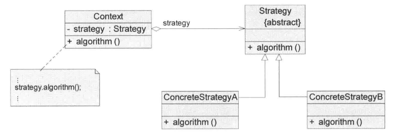
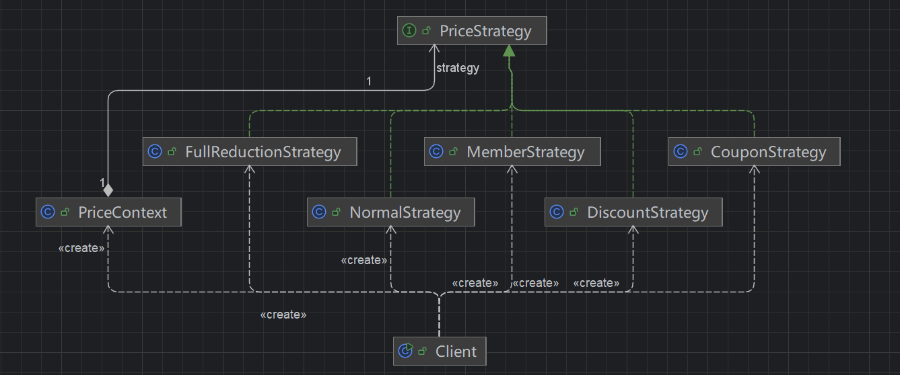

## 引入

**电商平台订单价格计算**

在一个电商系统中，最初的需求很简单：
系统只需要支持**普通商品结算**，价格计算规则就是：

> 商品总价 = 单价 × 数量

这时候，可以在订单结算逻辑中直接写死计算方式，结构清晰、实现简单，没有任何问题。

需求变化（真实且常见）

随着业务发展，产品经理逐步提出新的营销需求：

1.  新增 **满减活动**（满100减20） 
2.  新增 **打折活动**（8折、9折） 
3.  新增 **会员价**（不同等级不同折扣） 
4.  新增 **优惠券抵扣** 
5.  后续可能还有： 
   -  限时秒杀价 
   -  拼团价 
   -  渠道专属价格 

## 传统方法实现

~~~ java
// 最开始只有普通价格计算
public double calculatePrice(double price, int count) {
  return price * count;
}

// 新增：满减活动
public double calculatePrice(double price, int count, String type) {
  double total = price * count;
  if ("NORMAL".equals(type)) {
    return total;
  } else if ("FULL_REDUCTION".equals(type)) {
    if (total >= 100) {
      return total - 20;
    }
    return total;
  }
  return total;
}

// 继续新增：
//打折（DISCOUNT）
//会员价（MEMBER）
//优惠券（COUPON）
public double calculatePrice(double price, int count, String type, double coupon) {
  double total = price * count;
  if ("NORMAL".equals(type)) {
    return total;
  } else if ("FULL_REDUCTION".equals(type)) {
    if (total >= 100) {
      total -= 20;
    }
  } else if ("DISCOUNT".equals(type)) {
    total = total * 0.8;
  } else if ("MEMBER".equals(type)) {
    total = total * 0.9;
  } else if ("COUPON".equals(type)) {
    total -= coupon;
  }
  return total;
}

/*
    当业务继续扩展：

    满200减50、满300减100（多个档位）
    会员等级（VIP1 / VIP2 / VIP3）
    优惠券叠加规则
    活动组合优先级
*/
public double calculatePrice(double price, int count, String type, int memberLevel, double coupon) {
  double total = price * count;
  if ("FULL_REDUCTION".equals(type)) {
    if (total >= 300) {
      total -= 100;
    } else if (total >= 200) {
      total -= 50;
    } else if (total >= 100) {
      total -= 20;
    }
  } else if ("DISCOUNT".equals(type)) {
    total = total * 0.8;
  } else if ("MEMBER".equals(type)) {
    if (memberLevel == 1) {
      total *= 0.95;
    } else if (memberLevel == 2) {
      total *= 0.9;
    } else if (memberLevel == 3) {
      total *= 0.85;
    }
  } else if ("COUPON".equals(type)) {
    total -= coupon;
  }
  return total;
}
~~~

## 观察者模式实现

### 传统方法分析

#### 问题

**1、条件分支爆炸**

-  if-else / switch 不断增长 
-  可读性急剧下降 

**2、违反开闭原则**

-  每新增一种优惠规则 → **必须修改原方法** 
-  核心逻辑不稳定 

**3、逻辑耦合严重**

-  所有计算方式混在一个方法里 
-  修改一个逻辑可能影响其他逻辑 

**4、难以测试**

-  每个分支都要覆盖 
-  组合情况指数级增长 

**5、无法复用**

-  每种计算逻辑无法单独使用 
-  **也无法独立扩展** 

**本质问题：**

从代码可以清晰看出：

> **“价格计算方式”这一行为在不断变化，但却被强行写在一个方法中**

也就是说：

-  变化点没有被隔离 
-  所有“策略”被硬编码在一起

### 优化：

针对上述问题，可以发现系统中真正变化的部分是：

> **价格计算方式（算法/策略）**

因此，优化的核心思想是：

-  将“变化的部分”从原有代码中拆分出来 
-  将不同的计算逻辑进行独立封装 
-  通过统一的抽象进行约束 
-  在运行时根据不同场景选择对应的计算方式 

也就是说：

> **将“价格计算”从一个方法，拆分为一组可替换的策略**

------

#### 优化核心

优化可以抽象为一句话：

> **用“组合”替代“条件判断”，用“对象行为”替代“分支逻辑”**

具体体现为：

-  不再使用 if-else 控制行为 
-  而是通过“不同对象”来体现不同逻辑 

------

#### 优化结构演进

优化后，系统结构从：

```
一个方法 + 多个 if-else
```

转变为：

```
统一接口 + 多个策略实现类 + 上下文调用
```

具体拆分为三部分：

1、抽象策略（Strategy）

-  定义统一的价格计算接口 
-  约束所有计算方式的行为 

2、具体策略（ConcreteStrategy）

-  每种优惠规则对应一个实现类 
-  如：普通计算、满减、打折、会员价等 

3、上下文（Context）

-  持有策略对象 
-  负责调用具体策略完成计算 
-  对外屏蔽具体实现细节


也就是采用策略模式实现。

### 定义

​	策略模式（`StrategyPattern`）定义：定义一系列算法，将每一个算法封装起来，并让它们可以相互替换。策略模式让算法独立于使用它的客户而变化，也称为政策模式（Policy）。策略模式是一种对象行为型模式。

#### 类图：



#### 角色说明：

**1.Context（环境类）**

​	环境类是使用算法的角色，它在解决某个问题（即实现某个方法）时可以采用多种策略。

​	在环境类中维护一个对抽象策略类的引用实例，用于定义所采用的策略。

**2.Strategy（抽象策略类）**

​	抽象策略类为所支持的算法声明了抽象方法，是所有策略类的父类，它可以是抽象类，也可以是接口。

​	环境类使用在其中声明的方法调用在具体策略类中实现的算法。

**3.Concrete Strategy（具体策略类）**

​	具体策略类实现了在抽象策略类中定义的算法，在运行时，具体策略类将覆盖在环境类中定义的抽象策略类对象，使用一种具体的算法实现某个业务处理。

### 源码

类图：



代码：

价格抽象策略接口：抽象策略（Strategy）:

~~~ java
// 价格抽象策略接口：抽象策略（Strategy）
public interface PriceStrategy {

    /**
     * 计算订单价格
     *
     * @param price 单价
     * @param count 数量
     * @return 计算后的价格
     */
    double calculate(double price, int count);
}
~~~

具体策略：

~~~ java
// 普通价格策略
public class NormalStrategy implements PriceStrategy {

    @Override
    public double calculate(double price, int count) {
        return price * count;
    }
}
// 优惠券策略
public class CouponStrategy implements PriceStrategy {
    private double coupon;
    public CouponStrategy(double coupon) {
        this.coupon = coupon;
    }
    @Override
    public double calculate(double price, int count) {
        return price * count - coupon;
    }
}
// 打折策略
public class DiscountStrategy implements PriceStrategy {
    @Override
    public double calculate(double price, int count) {
        return price * count * 0.8;
    }
}
// 满减策略
public class FullReductionStrategy implements PriceStrategy {
    @Override
    public double calculate(double price, int count) {
        double total = price * count;
        if (total >= 300) {
            return total - 100;
        } else if (total >= 200) {
            return total - 50;
        } else if (total >= 100) {
            return total - 20;
        }
        return total;
    }
}
// // 会员价策略
public class MemberStrategy implements PriceStrategy {
    private int memberLevel;
    public MemberStrategy(int memberLevel) {
        this.memberLevel = memberLevel;
    }
    @Override
    public double calculate(double price, int count) {
        double total = price * count;
        if (memberLevel == 1) {
            return total * 0.95;
        } else if (memberLevel == 2) {
            return total * 0.9;
        } else if (memberLevel == 3) {
            return total * 0.85;
        }
        return total;
    }
}
~~~

上下文

~~~ java
// 上下文
public class PriceContext {

    private PriceStrategy strategy;

    public PriceContext(PriceStrategy strategy) {
        this.strategy = strategy;
    }

    public double calculatePrice(double price, int count) {
        return strategy.calculate(price, count);
    }
}
~~~

客户端

~~~ java
// 客户端
public class Client {

    public static void main(String[] args) {

        // 普通价格
        PriceContext context1 = new PriceContext(new NormalStrategy());
        System.out.println(context1.calculatePrice(100, 2));

        // 满减
        PriceContext context2 = new PriceContext(new FullReductionStrategy());
        System.out.println(context2.calculatePrice(100, 3));

        // 打折
        PriceContext context3 = new PriceContext(new DiscountStrategy());
        System.out.println(context3.calculatePrice(100, 2));

        // 会员价（等级2）
        PriceContext context4 = new PriceContext(new MemberStrategy(2));
        System.out.println(context4.calculatePrice(100, 2));

        // 优惠券
        PriceContext context5 = new PriceContext(new CouponStrategy(30));
        System.out.println(context5.calculatePrice(100, 2));
    }
}
~~~


## 思考

### 一、策略模式的本质

策略模式的核心，并不在于“消灭 if-else”，而在于：

> **将一类可替换的行为（算法）进行抽象，并在运行时灵活选择使用**

从设计角度来看，可以抽象为：

```
稳定部分（Context） + 可变部分（Strategy）
```

其中：

-  **稳定部分**：调用流程、业务主干逻辑（Context） 
-  **可变部分**：具体的算法或行为（Strategy） 

**本质拆解**

| 标题                                 | 介绍                                                         |
| ------------------------------------ | ------------------------------------------------------------ |
| 关注的是“同一问题的多种解法”         | 策略模式并不是处理“不同类型做不同事情”，而是：<br />同一个目标（例如：价格计算）<br />存在多种实现方式（满减、打折、会员价等） |
| 本质是对“行为”的抽象，而不是结构优化 | 很多初学者会把策略模式理解为：“把 if-else 拆成多个类”<br />这是表象，而不是本质，真正的核心是：**将行为（算法）对象化，使其可以独立变化和扩展** |
| 策略是“可替换”的                     | 策略模式强调：<br />不同策略之间可以互相替换<br />调用方无需感知具体实现差异<br />即：策略之间具备等价性（同一接口，不同实现） |
| 策略的选择是“外部驱动”的             | 在策略模式中，这是与状态模式的核心区别之一：<br />选择哪种策略，是由客户端或外部条件决定的<br />策略本身不负责切换 |

**注意点**

| 标题                                | 介绍                                                         |
| ----------------------------------- | ------------------------------------------------------------ |
| 不要为了消灭 if-else 而使用策略模式 | 如果逻辑简单、变化不多，使用策略模式反而会增加复杂度         |
| 策略之间必须是“同一维度的变化”      | 这是不同职责，不是策略，错误示例：<br />A策略处理订单<br />B策略处理用户 |
| 策略模式不等于多态                  | 多态是实现手段，策略模式是设计思想                           |
| 不要忽略“Context”的作用             | Context 负责封装调用逻辑，不只是简单转发                     |

一句话总结

> **策略模式的本质，是将“变化的行为”抽离出来，并通过统一抽象实现可替换与可扩展。**

------

### 二、策略模式的工程实现

在实际开发中，策略模式很少以“教科书形式”直接使用，而是通常会进行工程化增强，常见做法是：

> **策略模式 + 工厂模式 + 注册机制**

**核心优化点**

| 标题                           | 介绍                                                         |
| ------------------------------ | ------------------------------------------------------------ |
| 策略自动注册与缓存             | 系统初始化时，将所有策略统一注册<br />常见结构：`Map<标识, Strategy>`<br />避免重复创建对象<br />提高性能与管理性 |
| 通过“标识”选择策略             | 客户端不再直接依赖具体策略类，而是：通过标识（type/code）选择策略<br />例如：context.calculate("DISCOUNT", ...); |
| Context 同时承担“策略调度中心” | Context 不再只是简单持有策略，而是：<br />根据标识选择策略<br />统一调用入口<br />对外屏蔽策略细节 |

**带来的提升**

| 标题              | 介绍                                                |
| ----------------- | --------------------------------------------------- |
| 进一步降低耦合    | 客户端不再依赖具体策略类,只依赖“标识 + 接口”        |
| 支持扩展          | 新增策略只需注册,不影响已有代码                     |
| 支持配置化/动态化 | 可以通过配置文件决定使用哪种策略,更适合复杂业务系统 |

**注意事项**

| 标题                      | 介绍                                                        |
| ------------------------- | ----------------------------------------------------------- |
| 避免 Context 变成“上帝类” | 不要在 Context 中写 if-else 选择策略，应使用 Map 或注册机制 |
| 策略标识设计要合理        | 唯一性，可读性，可扩展性                                    |

**一句话总结**

> **工程实践中的策略模式，通常通过“注册 + 标识选择”的方式，实现策略的自动管理与解耦。**

------

### 三、策略模式 vs 状态模式

策略模式与状态模式在结构上非常相似，但本质完全不同，是设计模式中最容易混淆的一组。

**1、核心区别**

| 维度         | 策略模式     | 状态模式     |
| ------------ | ------------ | ------------ |
| 目的         | 选择不同算法 | 表示状态变化 |
| 行为来源     | 外部决定     | 内部驱动     |
| 是否自动流转 | 否           | 是           |
| 本质         | 行为替换     | 状态机       |

**2、行为控制权**

**策略模式：外部控制**

-  客户端决定使用哪种策略 
-  系统只是执行 

```
你选择做法 → 系统执行
```

------

**状态模式：内部控制**

-  状态之间自动流转 
-  客户端只触发行为 

```
系统根据状态自动变化
```

**3、典型场景对比**

**策略模式示例：**

-  选择支付方式（支付宝 / 微信） 
-  选择价格计算方式（打折 / 满减） 

特点：你主动选择

------

**状态模式示例：**

-  订单状态（待支付 → 已支付 → 已发货） 
-  工作流状态流转 

特点：系统自动变化

**关键理解**

可以用一句话区分：

> **策略模式是“你决定怎么做”，状态模式是“系统决定接下来会怎样”。**

**4、易混淆点**

-  两者结构类似（接口 + 实现类 + Context） 
-  都通过组合持有对象 

但本质差异在于：

> **是否存在“状态流转”**

**一句话总结**

> **策略模式关注“选择哪种行为”，状态模式关注“当前处于什么状态以及如何流转”。**

## 优缺点

### 优点

1、策略模式提供了对“开闭原则”的完美支持，用户可以在不修改原有系统的基础上选择算法或行为，也可以灵活地增加新的算法或行为。

2、策略模式提供了管理相关的算法族的办法。策略类的等级结构定义了一个算法或行为族，恰当使用继承可以把公共的代码移到父类里面，从而避免重复的代码。

3、策略模式提供了可以替换继承关系的办法。

​	继承可以处理多种算法或行为，如果不使用策略模式，那么使用算法或行为的环境类就可能会有一些子类，每一个子类提供一个不同的算法或行为。

​	但是，这样一来算法或行为的使用就和算法或行为本身混在一起，不符合“单一职责原则”，决定使用哪一种算法或采取哪一种行为的逻辑就和算法或行为本身的逻辑混合在一起，从而不可能再独立演化，而且使用继承无法实现算法或行为的动态改变。
4、使用策略模式可以避免使用多重条件转移语句。

​	多重转移语句不易维护，它把采取哪一种算法或采取哪一种行为的逻辑与算法或行为的逻辑混合在一起，统统列在一个多重条件转移语句里面，比使用继承的办法还要原始和落后。

### 缺点

1、客户端必须知道所有的策略类，并自行决定使用哪一个策略类。这就意味着客户端必须理解这些算法的区别，以便适时选择恰当的算法类。换言之，策略模式只适用于客户端知道所有的算法或行为的情况。

2、策略模式将造成产生很多策略类和对象，可以通过使用享元模式在一定程度上减少对象的数量。

## 适用场景

1、如果在一个系统里面有许多类，它们之间的区别仅在于它们的行为，那么使用策略模式可以动态地让一个对象在许多行为中选择一种行为。

2、一个系统需要动态地在几种算法中选择一种，那么可以将这些算法封装到一个个的具体算法类里面，而这些具体算法类都是一个抽象算法类的子类。换言之，这些具体算法类均有统一的接口，由于多态性原则，客户端可以选择使用任何一个具体算法类，并只需要维持一个数据类型是抽象算法类的对象。

3、如果一个对象有很多的行为，如果不用恰当的模式，这些行为就只好使用多重的条件选择语句来实现。此时，使用策略模式，把这些行为转移到相应的具体策略类里面，就可以避免使用难以维护的多重条件选择语句，并且体现面向对象设计思想。

4、不希望客户端知道复杂的、与算法相关的数据结构，在具体策略类中封装算法和相关的数据结构，提高算法的保密性与安全性。

## 应用

### 一、Spring 中的应用 — Resource 加载策略（策略模式典型体现）

在 Spring 框架中，资源加载是一个非常经典的策略模式应用场景。

核心接口是：Spring Framework 中的 `Resource` 与 `ResourceLoader` 体系。

**场景说明**

在 Spring 中，我们经常需要加载不同来源的资源，例如：

-  文件系统资源（file） 
-  类路径资源（classpath） 
-  URL 资源（http / https） 

例如：

```
Resource resource = resourceLoader.getResource("classpath:application.yml");
```

**背后的策略模式**

Spring 并没有写大量 if-else 来判断资源类型，而是：

-  定义统一接口：`Resource` 
-  针对不同资源类型提供不同实现类： 
  -  `ClassPathResource` 
  -  `FileSystemResource` 
  -  `UrlResource` 

**策略体现**

在这个场景中：

-  **策略接口**：Resource 
-  **具体策略**：不同类型的 Resource 实现类 
-  **Context**：ResourceLoader 

系统根据不同的资源路径前缀（classpath: / file: / http:），选择不同的资源实现类进行加载。

**设计意义**

-  新增一种资源类型 → 只需新增一个 Resource 实现类 
-  不需要修改原有加载逻辑 
-  完全符合开闭原则 

**本质总结**

> **Spring 将“资源加载方式”抽象为策略，从而支持多种资源类型的灵活扩展**

------

### 二、实际开发场景 — 支付方式选择

**场景描述**

在实际业务开发中，支付模块是策略模式最常见的应用之一。

系统需要支持多种支付方式：

-  支付宝支付 
-  微信支付 
-  银行卡支付 
-  积分支付 

**传统实现问题**

通常会写成：

```
if (type == "ALIPAY") {
    // 支付宝逻辑
} else if (type == "WECHAT") {
    // 微信逻辑
}
```

问题：

-  分支不断增加 
-  代码难以维护 
-  扩展困难 

**使用策略模式优化**

将“支付行为”抽象为策略：

-  定义统一接口：支付行为 
-  每种支付方式一个实现类 
-  通过“支付类型”选择具体策略 

**工程化实现**

结合前面总结的工程模式：

-  使用 `Map<支付类型, 支付策略>` 注册所有策略 
-  由 Context 或服务层统一调度 

例如：

```
支付类型 → 支付策略（Strategy）
```

**优势**

1、扩展方便

-  新增支付方式 → 只需新增策略类 + 注册 

------

2、解耦客户端

-  调用方只关心“用哪种支付方式” 
-  不关心具体实现 

------

3、逻辑清晰

-  每种支付逻辑独立 
-  不互相影响 

延伸场景

类似模式还广泛应用于：

-  订单价格计算（你本例） 
-  优惠规则引擎 
-  消息发送方式（短信 / 邮件 / 推送） 
-  文件导出方式（PDF / Excel / CSV） 

**总结**

策略模式在实际应用中非常广泛，其核心价值体现在：

> **将一类可变行为抽象为策略，实现灵活扩展与解耦**

-  在框架中（如 Spring）：用于底层能力扩展（如资源加载） 
-  在业务中：用于处理多种规则、多种行为选择的场景 

------

> **当你遇到“同一行为，多种实现，并且需要灵活选择”时，基本可以优先考虑策略模式**